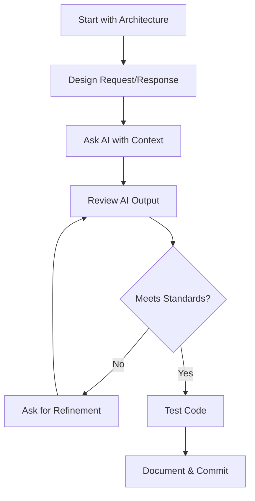

# 🤖 AI Development for .NET — Complete Index

## 📖 Start Here

Welcome! This is the definitive guide for developing .NET applications with AI assistance while maintaining clean architecture and professional standards.

### Choose Your Path

#### 🚀 I'm in a hurry
**Time: 5 minutes**
→ [AI Quick Reference](./AI_QUICK_REFERENCE.md) — One-page cheat sheet with all essentials

#### 📚 I want to learn properly
**Time: 45 minutes**
→ [Develop with AI](./DEVELOP_WITH_AI.md) — Complete guide with detailed explanations

#### 💻 I need to code now
**Time: Variable**
→ [AI Prompting Examples](./AI_PROMPTING_EXAMPLES.md) — Real scenarios with ready-to-use prompts

#### 🤖 I want to use multiple AI tools
**Time: 15 minutes**
→ [AI Agents Guide](./AGENTS.md) — How to use Copilot, ChatGPT, Claude effectively

#### 🔧 I'm setting up Copilot
**Time: 10 minutes**
→ [Copilot Instructions](./COPILOT-INSTRUCTIONS.md) — System-level configuration for Copilot

#### 📊 I want an overview
**Time: 10 minutes**
→ [AI Guide Summary](./AI_GUIDE_SUMMARY.md) — Executive summary of all documentation

---

## 📚 What's Included

### Comprehensive Guides

| Guide                     | Purpose                                      | Read Time | Best For                              |
| ------------------------- | -------------------------------------------- | --------- | ------------------------------------- |
| **Develop with AI**       | Complete architecture and patterns reference | 30-45 min | Learning, onboarding, deep dives      |
| **AI Quick Reference**    | One-page cheat sheet                         | 5-10 min  | Daily coding, quick lookups           |
| **AI Prompting Examples** | 10 real-world scenarios with prompts         | Variable  | Hands-on development, problem solving |
| **AI Agents Guide**       | Using Copilot, ChatGPT, Claude effectively   | 15 min    | Multi-tool workflows, choosing tools  |
| **Copilot Instructions**  | System-level config for GitHub Copilot       | 10 min    | Copilot setup, code standards         |
| **AI Guide Summary**      | Overview of all documentation                | 10 min    | Understanding the system              |

### Key Topics by Guide

**DEVELOP_WITH_AI.md covers:**
- Architecture & design before coding
- Clean architecture principles
- CQRS and MediatR patterns
- Naming conventions (no underscores!)
- Primary constructors
- Async/await patterns
- DRY principles
- Result pattern
- API controller patterns
- Extension methods
- AI prompting strategies
- Anti-patterns to avoid
- End-to-end example workflow
- Code review checklist

**AI_QUICK_REFERENCE.md covers:**
- Naming rules (table format)
- Constructor patterns
- Property annotations
- Async patterns
- Result pattern
- CQRS separation
- Extension usage
- AI prompt template
- Code review checklist
- Anti-patterns table
- Common code snippets
- Workflow steps

**AI_PROMPTING_EXAMPLES.md covers:**
1. Query Handler creation
2. Command Handler with validation
3. Extension methods
4. Mapping extensions
5. API controller endpoints
6. Unit testing
7. Code review requests
8. Refactoring for DRY
9. Adding logging
10. Migration instructions

Plus pro tips for AI interaction.

**AGENTS.md covers:**
- GitHub Copilot (strengths, weaknesses, use cases)
- ChatGPT / GPT-4 (strengths, weaknesses, use cases)
- Claude (strengths, weaknesses, use cases)
- Task matrix (which tool for which task)
- Tool-specific workflows
- Common scenarios and recommended tools
- Multi-tool development loops
- Best practices for context and prompting
- Team agreements for AI usage
- Effectiveness metrics

**COPILOT-INSTRUCTIONS.md covers:**
- Core architecture principles for Copilot
- Code standards (naming, constructors, properties)
- Required vs nullable annotations
- Async/await conventions
- CancellationToken usage
- Null checks at entry
- Result pattern
- Entity mapping
- DRY principles
- Caching patterns
- Handler/controller structure templates
- API response conventions
- Test structure templates
- Common commands to follow
- Things to NEVER do
- Project context and configuration

---

## ⚡ Quick Navigation

### By Task

**I need to...**
- Create a query handler → [Example 1](./AI_PROMPTING_EXAMPLES.md#scenario-1-create-a-new-query-handler)
- Create a command handler → [Example 2](./AI_PROMPTING_EXAMPLES.md#scenario-2-create-command-handler-with-validation)
- Understand naming rules → [Quick Reference](./AI_QUICK_REFERENCE.md#-naming-rules)
- Write tests → [Example 6](./AI_PROMPTING_EXAMPLES.md#scenario-6-create-unit-test-for-handler)
- Review code → [Quick Reference Checklist](./AI_QUICK_REFERENCE.md#-code-review-checklist)
- Learn async patterns → [DEVELOP_WITH_AI.md Section 2.4](./DEVELOP_WITH_AI.md#24-asyncawait-conventions)
- Refactor code → [Example 8](./AI_PROMPTING_EXAMPLES.md#scenario-8-refactor-for-dry)
- Use extension methods → [DEVELOP_WITH_AI.md Section 3.1](./DEVELOP_WITH_AI.md#31-extension-methods-for-common-logic)
- Choose an AI tool → [AGENTS.md](./AGENTS.md)
- Setup GitHub Copilot → [COPILOT-INSTRUCTIONS.md](./COPILOT-INSTRUCTIONS.md)
- Use multiple AI tools effectively → [AGENTS.md](./AGENTS.md)

### By Skill Level

**Beginner**
1. Read: [Quick Reference](./AI_QUICK_REFERENCE.md)
2. Study: [DEVELOP_WITH_AI.md](./DEVELOP_WITH_AI.md) Sections 1-3
3. Try: [Example 1](./AI_PROMPTING_EXAMPLES.md#scenario-1-create-a-new-query-handler)

**Intermediate**
1. Review: [Anti-patterns](./DEVELOP_WITH_AI.md#8-anti-patterns-to-avoid)
2. Practice: [Examples 3-5](./AI_PROMPTING_EXAMPLES.md)
3. Master: [Examples 7-10](./AI_PROMPTING_EXAMPLES.md)

**Advanced**
1. Reference: [Code Review Checklist](./AI_QUICK_REFERENCE.md#-code-review-checklist)
2. Mentor: Use guides to help junior developers
3. Extend: Add new examples for team patterns

---

## 🎯 Core Standards at a Glance

### No Underscores
```csharp
// ❌ WRONG
public string _name;
private readonly string _email;

// ✅ CORRECT
public string Name { get; set; }
public string Email { get; set; }
```

### Primary Constructors
```csharp
// ❌ OLD WAY
public class Handler : IHandler
{
    private readonly IDatabase db;
    public Handler(IDatabase db) => db = db;
}

// ✅ NEW WAY
public class Handler(IDatabase db) : IHandler
```

### Required vs Nullable
```csharp
// ✅ CORRECT
public sealed class Customer
{
    public required int Id { get; set; }
    public required string Name { get; set; }
    public string? Phone { get; set; }  // Optional
}
```

### Async All the Way
```csharp
// ✅ DO THIS
var result = await db.SaveChangesAsync(cancellationToken);

// ❌ NOT THIS
var result = db.SaveChangesAsync().Result;  // Deadlock!
```

### Result Pattern
```csharp
// ✅ CORRECT
return Result<Customer>.Success(customer.Map());
return Result<Customer>.Failure("Not found");
return ListResult<Customer>.Success(customers, total);
```

---

## 🔄 Typical Workflow



---

## ✅ Pre-Commit Checklist

Before submitting code generated with AI:

```
Naming & Structure
  ☐ No underscore prefixes on properties
  ☐ PascalCase for classes/methods
  ☐ camelCase for variables
  ☐ Follows domain namespaces

Architecture
  ☐ Primary constructor used
  ☐ Follows CQRS (if applicable)
  ☐ Returns Result<T> or ListResult<T>
  ☐ Implements correct interface

Code Quality
  ☐ Async/await used correctly
  ☐ CancellationToken passed throughout
  ☐ Null checks present
  ☐ No duplicate code
  ☐ Documented with /// comments

Performance
  ☐ Caching used for reads
  ☐ Batch operations efficient
  ☐ No N+1 queries

Testing
  ☐ Unit tests included
  ☐ Happy path tested
  ☐ Error cases tested
  ☐ Mocks for dependencies
```

---

## 🤝 Team Integration

### For Code Reviews
- Reference: ["Your property uses underscore, see naming rules"](./AI_QUICK_REFERENCE.md#-naming-rules)
- Link: ["Use primary constructor, see section 2.2"](./DEVELOP_WITH_AI.md#22-primary-constructors-c-12)
- Example: ["Follow pattern from example 1"](./AI_PROMPTING_EXAMPLES.md#scenario-1-create-a-new-query-handler)

### For Pull Requests
- Link to relevant example: "Implementation follows [Example 2](./AI_PROMPTING_EXAMPLES.md#scenario-2-create-command-handler-with-validation)"
- Note: "Verified against [code review checklist](./AI_QUICK_REFERENCE.md#-code-review-checklist)"

### For Onboarding
1. "Read the [Quick Reference](./AI_QUICK_REFERENCE.md) (5 min)"
2. "Watch me create a handler using [Example 1](./AI_PROMPTING_EXAMPLES.md#scenario-1-create-a-new-query-handler)"
3. "Try creating your own with AI assistance"
4. "We'll review against the [standards](./DEVELOP_WITH_AI.md)"

### For Discussions
- "Does this follow [Result pattern](./DEVELOP_WITH_AI.md#51-result-pattern)?"
- "Should we use [extension methods](./DEVELOP_WITH_AI.md#31-extension-methods-for-common-logic)?"
- "Is this a [DRY violation](./DEVELOP_WITH_AI.md#3-dry-dont-repeat-yourself)?"

---

## 🎓 Learning Resources

### Official Docs
- [CQRS Pattern](https://martinfowler.com/bliki/CQRS.html)
- [MediatR GitHub](https://github.com/jbogard/MediatR)
- [Entity Framework Core](https://docs.microsoft.com/ef/core/)
- [C# 12 Primary Constructors](https://learn.microsoft.com/dotnet/csharp/whats-new/csharp-12)
- [Async/Await Best Practices](https://docs.microsoft.com/archive/msdn-magazine/2013/march/async-await-best-practices-in-asynchronous-programming)

### In This Project
- See Phase 9 examples: `Phase 9/src/01. StartSolution/Core/Pizza/Commands/CreatePizzaCommand.cs`
- API Controllers: `Phase 9/src/01. StartSolution/Api/Controllers/PizzaController.cs`
- Models: `Phase 9/src/01. StartSolution/Common/Models/PizzaModel.cs`

---

## 📞 Support

**Question:** What should I read?
**Answer:** 
- Quick lookup → [Quick Reference](./AI_QUICK_REFERENCE.md)
- Learning → [Full Guide](./DEVELOP_WITH_AI.md)
- Coding → [Examples](./AI_PROMPTING_EXAMPLES.md)

**Question:** My AI code doesn't work
**Answer:**
- Check [anti-patterns](./DEVELOP_WITH_AI.md#8-anti-patterns-to-avoid)
- Review similar [example](./AI_PROMPTING_EXAMPLES.md)
- Try [code review checklist](./AI_QUICK_REFERENCE.md#-code-review-checklist)

**Question:** How do I prompt AI better?
**Answer:**
- Read [Section 4](./DEVELOP_WITH_AI.md#4-ai-prompting-best-practices) in full guide
- Study the [prompt templates](./AI_PROMPTING_EXAMPLES.md#pro-tips-for-ai-prompting)

**Question:** Can I add new examples?
**Answer:** Yes! Create a PR adding to [AI_PROMPTING_EXAMPLES.md](./AI_PROMPTING_EXAMPLES.md)

---

## 🚀 Get Started

Choose one:

1. **I have 5 minutes** → [Quick Reference](./AI_QUICK_REFERENCE.md)
2. **I have 30 minutes** → [Full Guide](./DEVELOP_WITH_AI.md)
3. **I need to solve a problem** → [Examples](./AI_PROMPTING_EXAMPLES.md)
4. **I want context** → [Summary](./AI_GUIDE_SUMMARY.md)

---

## 📌 Remember

> **AI is a tool, not a replacement for architecture and design.**
> 
> These guides help you:
> - Communicate better with AI
> - Maintain consistent standards
> - Build clean, scalable code
> - Work faster without sacrificing quality
> 
> **Always review, understand, and own the code you commit.**

---

Last Updated: 2025-10-30 | .NET 10 | CQRS + MediatR Architecture
