# &nbsp;**Pezza - Phase 1** [](https://github.com/entelect-incubator/.NET/actions/workflows/dotnet-phase1-finalsolution.yml)

<br/><br/>

We will be looking at creating a solution for Pezza's customers only. We will start with what a typical solution might look like and refactor it into a clean architecture that can be used throughout the rest of the incubator. We will only be focussing on the Pezza Stock for this Phase. This is to show the scaffold of a new solution and projects according to [.NET Clean Architecture](https://github.com/entelect-incubator/.NET-CleanArchitecture).

## **What you will be building in Phase 1**

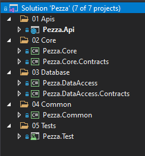

## **Setup**

Run [SQL file](pezza-db.sql) on your local SQL Server

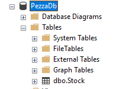

Create a new Pezza Solution - CMD Run dotnet new sln


Create Clean Architecture Folder Structure in your new Solution as below.

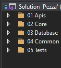

## **Create the Common Layer**

This will contain all entities, enums, exceptions, interfaces and types.

**Nuget Packages Required**
- [ ] AutoMapper

Create a new Class Library Pezza.Common <br/>  <br/> 

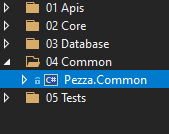

Create a folder *Entities* where all database models will go into <br/> 

Create a Entity Stock.cs in a folder **Entities** <br/>

Stock.cs 

```cs
namespace Pezza.Common.Entities
{
    using System;

    public class Stock
    {
        public int Id { get; set; }

        public string Name { get; set; }

        public string UnitOfMeasure { get; set; }

        public double? ValueOfMeasure { get; set; }

        public int Quantity { get; set; }

        public DateTime? ExpiryDate { get; set; }

        public DateTime DateCreated { get; set; }

        public string Comment { get; set; }
    }
}
```

Create a folder *DTO* where all data transfer objects will go into <br/>  

Create a Entity StockDTO.cs in a folder **DTO** <br/>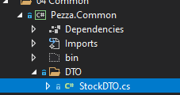

StockDTO.cs 

```cs
namespace Pezza.Common.DTO
{
    using System;

    public class StockDTO
    {
        public int Id { get; set; }

        public string Name { get; set; }

        public string UnitOfMeasure { get; set; }

        public double? ValueOfMeasure { get; set; }

        public int? Quantity { get; set; }

        public DateTime? ExpiryDate { get; set; }

        public string Comment { get; set; }
    }
}
```

Create a folder **Profiles** where all AutoMapper Profiles will go into. [What is AutoMapper?](https://docs.automapper.org/en/stable/Getting-started.html) <br/>  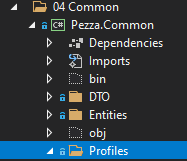

Create a Entity MappingProfile.cs in a folder **Profiles** <br/>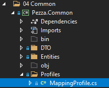

MappingProfile.cs

```cs
namespace Pezza.Common.Profiles
{
    using AutoMapper;
    using Pezza.Common.DTO;
    using Pezza.Common.Entities;

    public class MappingProfile : Profile
    {
        public MappingProfile()
        {
            this.CreateMap<Stock, StockDTO>();
            this.CreateMap<StockDTO, Stock>();
        }
    }
}
```

## **Create the Database Layer**

Create a new Class Library Pezza.DataAccess <br/> .png)

For accessing the Database we will be using [Entity Framework Core](https://github.com/dotnet/efcore).

**Nuget Packages Required**
- [ ]  Microsoft.EntityFrameworkCore.Relational

DbSet will act as a Repository to the Database. You will see we have added SaveChangesAsync into the interface, this is to expose DbContext Entity Framework Core methods in your interface.

We need to create a DbContext.cs inside of Pezza.DataAccess. A [DbContext](https://docs.microsoft.com/en-us/dotnet/api/microsoft.entityframeworkcore.dbcontext?view=efcore-5.0) instance represents a session with the database and can be used to query and save instances of your entities. DbContext is a combination of the Unit Of Work and Repository patterns.

 

 DatabaseContext.cs

```cs
namespace Pezza.DataAccess
{
    using Microsoft.EntityFrameworkCore;
    using Pezza.Common.Entities;
    using Pezza.DataAccess.Mapping;

    public class DatabaseContext : DbContext
    {
        public DatabaseContext()
        {
        }

        public DatabaseContext(DbContextOptions options) : base(options)
        {
        }

        public virtual DbSet<Stock> Stocks { get; set; }

        protected override void OnModelCreating(ModelBuilder modelBuilder)
        {
            modelBuilder.ApplyConfiguration(new StockMap());
        }
    }
}
```

To be able to map the Database Table to the Entity we use Mappings from EF Core. We also prefer using Mappings for Single Responsibility instead of using Attributes inside of an Entity. This allows the code to stay clean. Create a new folder inside Pezza.DataAccess *Mapping* with a class StockMap.cs


StockMap.cs

```cs
namespace Pezza.DataAccess.Mapping
{
    using Microsoft.EntityFrameworkCore;
    using Pezza.Common.Entities;

    public partial class StockMap : IEntityTypeConfiguration<Stock>
    {
        public void Configure(Microsoft.EntityFrameworkCore.Metadata.Builders.EntityTypeBuilder<Stock> builder)
        {
            builder.ToTable("Stock", "dbo");

            builder.HasKey(t => t.Id);

            builder.Property(t => t.Id)
                .IsRequired()
                .HasColumnName("Id")
                .HasColumnType("int")
                .ValueGeneratedOnAdd();

            builder.Property(t => t.Name)
                .IsRequired()
                .HasColumnName("Name")
                .HasColumnType("varchar(100)")
                .HasMaxLength(100);

            builder.Property(t => t.UnitOfMeasure)
                .HasColumnName("UnitOfMeasure")
                .HasColumnType("varchar(20)")
                .HasMaxLength(20);

            builder.Property(t => t.ValueOfMeasure)
                .HasColumnName("ValueOfMeasure")
                .HasColumnType("decimal(18, 2)");

            builder.Property(t => t.Quantity)
                .IsRequired()
                .HasColumnName("Quantity")
                .HasColumnType("int");

            builder.Property(t => t.ExpiryDate)
                .HasColumnName("ExpiryDate")
                .HasColumnType("datetime");

            builder.Property(t => t.DateCreated)
                .IsRequired()
                .HasColumnName("DateCreated")
                .HasColumnType("datetime")
                .HasDefaultValueSql("(getdate())");

            builder.Property(t => t.Comment)
                .HasColumnName("Comment")
                .HasColumnType("varchar(1000)")
                .HasMaxLength(1000);
        }
    }
}
```

This will map the table name and all the fields as well as indicate what the primary key will be.

## **Create a Unit Test Project**

As we add value with the different layers, we need to make sure it is testable and create unit tests. This helps later on if code changes that Unit Tests will pick up any bugs.

There are a variety of ways we can setup Unit Tests, this is one way to do it.

### **Overview**

[Unit test basics](https://docs.microsoft.com/en-us/visualstudio/test/unit-test-basics?view=vs-2019)
### **Setup**

Create a new NUnit Test Project <br/> 

**Nuget Packages Required**
  - [ ]  Microsoft.EntityFrameworkCore.InMemory
  - [ ]  AutoMapper
  - [ ]  Bogus

On the root folder create the following 2 classes.

DatabaseContextTest.cs

```cs
namespace Pezza.Test
{
    using Microsoft.EntityFrameworkCore;
    using Pezza.DataAccess;

    public class DatabaseContextTest
    {
        protected DatabaseContextTest(DbContextOptions<DbContext> contextOptions)
        {
            this.ContextOptions = contextOptions;
            this.Seed();
        }

        protected DbContextOptions<DbContext> ContextOptions { get; }

        private void Seed()
        {
            using var context = new DatabaseContext(this.ContextOptions);

            context.Database.EnsureDeleted();
            context.Database.EnsureCreated();

            context.SaveChanges();
        }
    }
}
```

TestBase.cs - Create a In Memory DBContext.

```cs
namespace Pezza.Test
{
    using Microsoft.EntityFrameworkCore;

    public class TestBase : DatabaseContextTest
    {
        public TestBase()
        : base(
            new DbContextOptionsBuilder<DbContext>()
                .UseInMemoryDatabase("PezzaDb")
                .Options)
        {
        }
    }
}
```

Create the following folders

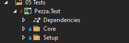

The **Setup folder**, create QueryTestBase.cs class this will be inherited by different Entity Data Access Test classes to expose Create() function.

What you will be creating in the Setup Folder

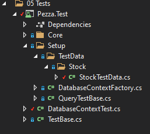

QueryTestBase.cs

```cs
namespace Pezza.Test.Setup
{
    using System;
    using Pezza.DataAccess;
    using static DatabaseContextFactory;

    public class QueryTestBase : IDisposable
    {
        public DatabaseContext Context => Create();

        public void Dispose() => Destroy(this.Context);
    }
}
```

Create DatabaseContextFactory.cs class in **Setup folder** that will be used to create a new DbContext object, but it will create a database session in memory.

DatabaseContextFactory.cs

```cs
namespace Pezza.Test.Setup
{
    using System;
    using Microsoft.EntityFrameworkCore;
    using Pezza.DataAccess;

    public class DatabaseContextFactory
    {
        protected DatabaseContextFactory()
        {
        }

        public static DatabaseContext DBContext()
        {
            var options = new DbContextOptionsBuilder<DbContext>().UseInMemoryDatabase(Guid.NewGuid().ToString()).Options;
            return new DatabaseContext(options);
        }

        public static DatabaseContext Create()
        {
            var context = DBContext();

            context.Database.EnsureCreated();

            return context;
        }

        public static void Destroy(DatabaseContext context)
        {
            context.Database.EnsureDeleted();

            context.Dispose();
        }
    }
}
```

next we will create Test Data for each Entity. Inside the folder **TestData**, then create a folder **Stock**. Create a **StockTestData.cs** class. This will create a fake Stock Entity for testing. <br/> 

StockTestData.cs

```cs
namespace Pezza.Test
{
    using System;
    using Bogus;
    using Pezza.Common.Entities;

    public static class StockTestData
    {
        public static Faker faker = new Faker();

        public static Stock Stock = new Stock()
        {
            Comment = faker.Lorem.Sentence(),
            DateCreated = DateTime.Now,
            ExpiryDate = DateTime.Now.AddMonths(1),
            Name = faker.Commerce.Product(),
            Quantity = 1,
            UnitOfMeasure = "kg",
            ValueOfMeasure = 10.5
        };
    }
}
```

## **Create the Core Layer**

### **Intro**

The Core Layer is where all of your business logic will live. Imagine this as the "core" of the business.

### **Setup**

Create 2 new Class Libraries inside of *02 Core* - Pezza.Core and Pezza.Core.Contracts. We will start by using very basic Stock Core.

**Nuget Packages Required**
  - [ ] Automapper

### **Building the Core Contracts Project**

Create a new IStockCore Interface in *Pezza.Core.Contracts* <br/> 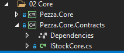

IStockCore.cs

```cs
namespace Pezza.Core.Contracts
{
    using System.Collections.Generic;
    using System.Threading.Tasks;
    using Pezza.Common.DTO;

    public interface IStockCore
    {
        Task<StockDTO> GetAsync(int id);

        Task<IEnumerable<StockDTO>> GetAllAsync();

        Task<StockDTO> UpdateAsync(StockDTO stock);

        Task<StockDTO> SaveAsync(StockDTO stock);

        Task<bool> DeleteAsync(int id);
    }
}
```

### **Building the Core Project**

Create a new StockCore.cs inside of *Pezza.Core* <br/> 

StockCore.cs

```cs
namespace Pezza.Core
{
    using System.Collections.Generic;
    using System.Linq;
    using System.Threading.Tasks;
    using AutoMapper;
    using Microsoft.EntityFrameworkCore;
    using Pezza.Common.DTO;
    using Pezza.Common.Entities;
    using Pezza.Core.Contracts;
    using Pezza.DataAccess;

    public class StockCore : IStockCore
    {
        private readonly DatabaseContext databaseContext;

        private readonly IMapper mapper;

        public StockCore(DatabaseContext databaseContext, IMapper mapper)
            => (this.databaseContext, this.mapper) = (databaseContext, mapper);

        public async Task<StockDTO> GetAsync(int id)
            => this.mapper.Map<StockDTO>(await this.databaseContext.Stocks.FirstOrDefaultAsync(x => x.Id == id));

        public async Task<IEnumerable<StockDTO>> GetAllAsync()
        {
            var entities = await this.databaseContext.Stocks.Select(x => x).AsNoTracking().ToListAsync();
            return this.mapper.Map<List<StockDTO>>(entities);
        }

        public async Task<StockDTO> SaveAsync(StockDTO stock)
        {
            var entity = this.mapper.Map<Stock>(stock);
            this.databaseContext.Stocks.Add(entity);
            await this.databaseContext.SaveChangesAsync();
            return this.mapper.Map<StockDTO>(entity);
        }

        public async Task<StockDTO> UpdateAsync(StockDTO stock)
        {
            var findEntity = await this.databaseContext.Stocks.FirstOrDefaultAsync(x => x.Id == stock.Id);

            findEntity.Name = !string.IsNullOrEmpty(stock.Name) ? stock.Name : findEntity.Name;
            findEntity.UnitOfMeasure = !string.IsNullOrEmpty(stock.UnitOfMeasure) ? stock.UnitOfMeasure : findEntity.UnitOfMeasure;
            findEntity.ValueOfMeasure = stock.ValueOfMeasure ?? findEntity.ValueOfMeasure;
            findEntity.Quantity = stock.Quantity ?? findEntity.Quantity;
            findEntity.ExpiryDate = stock.ExpiryDate ?? findEntity.ExpiryDate;
            findEntity.Comment = stock.Comment;
            this.databaseContext.Stocks.Update(findEntity);
            await this.databaseContext.SaveChangesAsync();

            return this.mapper.Map<StockDTO>(findEntity);
        }

        public async Task<bool> DeleteAsync(int id)
        {
            var entity = await this.databaseContext.Stocks.FirstOrDefaultAsync(x => x.Id == id);
            this.databaseContext.Stocks.Remove(entity);
            var result = await this.databaseContext.SaveChangesAsync();

            return result == 1;
        }
    }
}
```

**Hint**

The interesting part here is, when you call SaveChangesAsync it will return the number of changed records in the database. If you save a new record it will return the result of 1.


To keep the Dependency Injection clean and relevant to **Pezza.Core**, create a DependencyInjection.cs class that can be called from any Startup.cs class. <br/> 

```cs
namespace Pezza.Core
{
    using Microsoft.Extensions.DependencyInjection;
    using Pezza.Common.Profiles;
    using Pezza.Core.Contracts;

    public static class DependencyInjection
    {
        public static IServiceCollection AddApplication(this IServiceCollection services)
        {
            services.AddTransient(typeof(IStockCore), typeof(StockCore));
            services.AddAutoMapper(typeof(MappingProfile));

            return services;
        }
    }
}
```

### **Create the Core Layer Unit Tests**

Next, we will create unit tests for our Core Layer.

For accessing the Database we will be using [Entity Framework Core](https://github.com/dotnet/efcore).

**Nuget Packages Required**
- [ ]  Microsoft.EntityFrameworkCore.Relational
- [ ]  Sytem.Linq.Dynamic.Core 

Inside the folder **Core** create a class **TestStockCore.cs**. Also, add new StockDTO to StockTestData.cs <br/> 


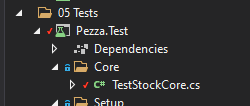

Inside StockTestData.cs add the follwoing <br/> 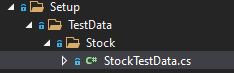

```cs
public static StockDTO StockDTO = new StockDTO()
{
    Comment = faker.Lorem.Sentence(),
    ExpiryDate = DateTime.Now.AddMonths(1),
    Name = faker.Commerce.Product(),
    Quantity = 1,
    UnitOfMeasure = "kg",
    ValueOfMeasure = 10.5
};
```

Core\TestStockCore.cs

```cs
namespace Pezza.Test.Core
{
    using System.Linq;
    using System.Threading.Tasks;
    using Bogus;
    using NUnit.Framework;
    using Pezza.Common.DTO;
    using Pezza.Core;
    using Pezza.Test.Setup;
    using Pezza.Test.Setup.TestData.Stock;

    [TestFixture]
    public class TestStockCore : QueryTestBase
    {
        private StockCore handler;

        private StockDTO stock;

        [SetUp]
        public async Task Init()
        {
            this.handler = new StockCore(this.Context, Mapper());
            this.stock = StockTestData.StockDTO;
            this.stock = await this.handler.SaveAsync(this.stock);
        }

        [Test]
        public async Task GetAsync()
        {
            var response = await this.handler.GetAsync(this.stock.Id);
            Assert.IsTrue(response != null);
        }

        [Test]
        public async Task GetAllAsync()
        {
            var response = await this.handler.GetAllAsync();
            Assert.IsTrue(response.Count() == 1);
        }

        [Test]
        public void SaveAsync()
        {
            var outcome = this.stock.Id != 0;
            Assert.IsTrue(outcome);
        }

        [Test]
        public async Task UpdateAsync()
        {
            var originalStock = this.stock;
            this.stock.Name = new Faker().Commerce.Product();
            var response = await this.handler.UpdateAsync(this.stock);
            var outcome = response.Name.Equals(originalStock.Name);

            Assert.IsTrue(outcome);
        }

        [Test]
        public async Task DeleteAsync()
        {
            var response = await this.handler.DeleteAsync(this.stock.Id);
            Assert.IsTrue(response);
        }
    }
}
```

### **Break down**

For every test we will create a new stock Core that will create a test session in memory to the database. We will then mock new stock using the stock test data. THen we will persist the new stock to the in-memory database.

- GetAsync (Tests the get stock by id) - We retrieve the newly created stock from the in-memory database using the stock id. If the data that gets return is found, your unit test is successful.
- GetAllAsync (Tests list of stock) - We retrieve a list of all the stock from the in-memory database. If the count of data returned is equalled to 1, your unit test is successful.
- SaveAsync (Tests creating new stock) - We verify the result of records changed from the save changes should equal to 1, meaning your unit test is successful.
- UpdateAsync (Tests updating existing stock) - We generate a new name for the stock item to be updated. We verify the updated stock's name with the updated stock if they are the same; your unit test is successful.
- DeleteAsync (Tests removing stock) - We verify the result of deleting the stock from the in-memory database. Depending on the result being returned will determine the outcome of the unit test.

## **Create the Apis Layer**
### **Setup**

Create a new ASP.NET Core Web Application inside **01 Apis*** <br/>

**Nuget Packages Required**
- [ ] Swashbuckle.AspNetCore [Read More](https://code-maze.com/swagger-ui-asp-net-core-web-api/)

### **Configuration**

Configuring the Swagger Middleware. Let's make the following changes in the ConfigureServices() method of the Startup.cs class. This adds the Swagger generator to the services collection.

```cs
public void ConfigureServices(IServiceCollection services)
{
    // Register the Swagger generator, defining 1 or more Swagger documents
    services.AddSwaggerGen(c =>
    {
        c.SwaggerDoc("v1", new OpenApiInfo { Title = "Stock API", Version = "v1" });
    });
    services.AddControllers();
}
```

In the Configure() method, let’s enable the middleware for serving the generated JSON document and the Swagger UI

```cs
public void Configure(IApplicationBuilder app, IWebHostEnvironment env)
{
    // Enable middleware to serve generated Swagger as a JSON endpoint.
    app.UseSwagger();
    // Enable middleware to serve swagger-ui (HTML, JS, CSS, etc.),
    // specifying the Swagger JSON endpoint.
    app.UseSwaggerUI(c =>
    {
        c.SwaggerEndpoint("/swagger/v1/swagger.json", "Stock API V1");
    });
}
``` 

Inside of Startup.cs add DependencyInjection.cs inside of ConfigureService.

```cs
DependencyInjection.AddApplication(services);
```


- [ ] Add Connection String in appsettings.json

```json
"ConnectionStrings": {
    "PezzaDatabase": "Server=.;Database=PezzaDb;Trusted_Connection=True;"
  },
```

Add Dependency injection for Database Context in Startup.cs ConfigureServices

```cs
// Add DbContext using SQL Server Provider
services.AddDbContext<DatabaseContext>(options =>
    options.UseSqlServer(this.Configuration.GetConnectionString("PezzaDatabase"))
);
```

Let us enable XML Documentation on the *Pezza.Api* project. Right-click on the API goes to Properties. <br/> 

In the ConfigureServices() method, configure Swagger to use the XML file that’s generated in the above step.

```cs
services.AddSwaggerGen(c =>
    {
        c.SwaggerDoc("v1", new OpenApiInfo
        {
            Title = "Stock API",
            Version = "v1",
            Description = "An API to perform Stock operations"
        });
// Set the comments path for the Swagger JSON and UI.
        var xmlFile = $"{Assembly.GetExecutingAssembly().GetName().Name}.xml";
        var xmlPath = Path.Combine(AppContext.BaseDirectory, xmlFile);
        c.IncludeXmlComments(xmlPath);
    });
```

Change Debug setting to open Swagger by default <br/> 

### **Create a API Controller**

Create a new **StockController.cs**. We will create a restfull endpoint for **Stock Core** layer. <br/> 

StockController.cs

```cs
namespace Pezza.Api.Controllers
{
    using System;
    using System.Threading.Tasks;
    using Microsoft.AspNetCore.Mvc;
    using Pezza.Common.DTO;
    using Pezza.Common.Entities;
    using Pezza.Core;
    using Pezza.Core.Contracts;

    [ApiController]
    [Route("api/[controller]")]
    public class StockController : ControllerBase
    {
        private readonly IStockCore StockCore;

        public StockController(IStockCore StockCore) => this.StockCore = StockCore;

        [HttpGet("{id}")]
        [ProducesResponseType(200)]
        [ProducesResponseType(404)]
        public async Task<ActionResult> Get(int id)
        {
            var search = await this.StockCore.GetAsync(id);
            if (search == null)
            {
                return this.NotFound();
            }

            return this.Ok(search);
        }

        [HttpGet()]
        [ProducesResponseType(200)]
        public async Task<ActionResult> Search()
        {
            var result = await this.StockCore.GetAllAsync();

            return this.Ok(result);
        }

        [HttpPost]
        [ProducesResponseType(200)]
        [ProducesResponseType(400)]
        public async Task<ActionResult<Stock>> Create([FromBody] Stock model)
        {
            var result = await this.StockCore.SaveAsync(model);
            if (result == null)
            {
                return this.BadRequest();
            }

            return this.Ok(result);
        }

        [HttpPut("{id}")]
        [ProducesResponseType(200)]
        [ProducesResponseType(400)]
        public async Task<ActionResult> Update(int id, [FromBody] StockDTO model)
        {
            var result = await this.StockCore.UpdateAsync(model);
            if (result == null)
            {
                return this.BadRequest();
            }

            return this.Ok(result);
        }

        [HttpDelete("{id}")]
        [ProducesResponseType(200)]
        [ProducesResponseType(400)]
        public async Task<ActionResult> Delete(int id)
        {
            var result = await this.StockCore.DeleteAsync(id);
            if (!result)
            {
                return this.BadRequest();
            }

            return this.Ok(result);
        }
    }
}
```

### **Add XML Comments to the Stock API Controller**.

StockController.cs

```cs
namespace Pezza.Api.Controllers
{
    using System.Threading.Tasks;
    using Microsoft.AspNetCore.Mvc;
    using Pezza.Common.DTO;
    using Pezza.Common.Entities;
    using Pezza.Core.Contracts;

    [ApiController]
    [Route("api/[controller]")]
    public class StockController : ControllerBase
    {
        private readonly IStockCore stockCore;

        public StockController(IStockCore stockCore) => this.stockCore = stockCore;

        /// <summary>
        /// Get Stock by Id.
        /// </summary>
        /// <param name="id">Stock Id</param>
        /// <returns>ActionResult</returns>
        [HttpGet("{id}")]
        [ProducesResponseType(200)]
        [ProducesResponseType(404)]
        public async Task<ActionResult> Get(int id)
        {
            var search = await this.stockCore.GetAsync(id);

            return (search == null) ? this.NotFound() : this.Ok(search);
        }

        /// <summary>
        /// Get all Stock.
        /// </summary>
        /// <returns>ActionResult</returns>
        [HttpGet]
        [ProducesResponseType(200)]
        public async Task<ActionResult> Search()
        {
            var result = await this.stockCore.GetAllAsync();

            return this.Ok(result);
        }

        /// <summary>
        /// Create Stock.
        /// </summary>
        /// <remarks>
        /// Sample request:
        ///
        ///     POST api/Stock
        ///     {
        ///       "name": "Tomatoes",
        ///       "UnitOfMeasure": "Kg",
        ///       "ValueOfMeasure": "1",
        ///       "Quantity": "50"
        ///     }
        /// </remarks>
        /// <param name="dto">Stock Model</param>
        /// <returns>ActionResult</returns>
        [HttpPost]
        [ProducesResponseType(200)]
        [ProducesResponseType(400)]
        public async Task<ActionResult<Stock>> Create([FromBody] StockDTO dto)
        {
            var result = await this.stockCore.SaveAsync(dto);

            return (result == null) ? this.BadRequest() : this.Ok(result);
        }

        /// <summary>
        /// Update Stock.
        /// </summary>
        /// <remarks>
        /// Sample request:
        ///
        ///     PUT api/Stock/1
        ///     {
        ///       "Quantity": "30"
        ///     }
        /// </remarks>
        /// <param name="dto">Stock Model</param>
        /// <returns>ActionResult</returns>
        [HttpPut]
        [ProducesResponseType(200)]
        [ProducesResponseType(400)]
        public async Task<ActionResult> Update([FromBody] StockDTO dto)
        {
            var result = await this.stockCore.UpdateAsync(dto);

            return (result == null) ? this.BadRequest() : this.Ok(result);
        }

        /// <summary>
        /// Remove Stock by Id.
        /// </summary>
        /// <param name="id">Stock Id</param>
        /// <returns>ActionResult</returns>
        [HttpDelete("{id}")]
        [ProducesResponseType(200)]
        [ProducesResponseType(400)]
        public async Task<ActionResult> Delete(int id)
        {
            var result = await this.stockCore.DeleteAsync(id);

            return (!result) ? this.BadRequest() : this.Ok(result);
        }
    }
}
```

## **Run your Pezza API**

Press F5 and Test all the Stock Methods.


## **Phase 2 - CQRS**

Move to Phase 2
[Click Here](https://github.com/entelect-incubator/.NET/tree/master/Phase%202) 