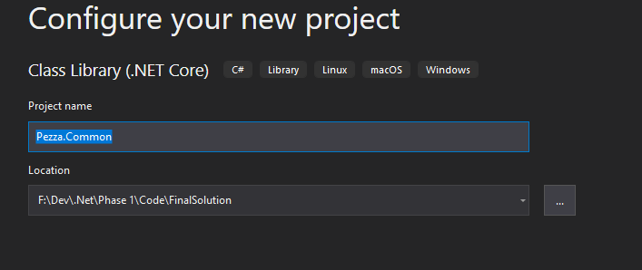
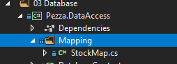
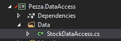
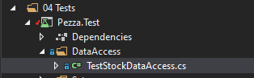

# &nbsp;**Pezza - Phase 1**

<br/><br/>

We will be looking at creating a solution for Pezza's customers only. We will start off with how a typical solution might look like and refactoring it into a clean architecture that can be used through out the rest of the incubator. We will only be focussing on the Pezza Stock for the Phase. This is to show the importance of Single Responsibility and how basic CQRS works.

## **Setup**

- [ ] Setup a new Pezza Solution
  - [ ] Open Visual Studio - Create a new project

  - [ ] ASP.NET Core Web Application

- [ ] Run SQL file on your local SQL Server

### **Single Responsibility Principle**

- [ ] We don't want everything in one folder and we want to follow the Single Responsibility Principle.
  - [ ] Right Click on the Solution - Add New Solution Folder. Call it *01 Apis*. This is where we want to group all Apis together. Move the Api you create into the *01 Apis* <br/>
  - [ ] Next we want to create a Common project that can be used between all Projects
    - [ ] Create a new Solution Folder *02 Common*
    - [ ] Create a new Class Library Pezza.Common <br/>  <br/> 
    - [ ] Createa folder *Entities* where all database models will go into <br/> 
    - [ ] Create a Entity Stock.cs in a folder Entities <br/>
``` 
namespace Pezza.Api.Entities
{
    using System;

    public class Stock
    {
        public int Id { get; set; }

        public string Name { get; set; }

        public string UnitOfMeasure { get; set; }

        public double? ValueOfMeasure { get; set; }

        public int Quantity { get; set; }

        public DateTime? ExpiryDate { get; set; }

        public DateTime DateCreated { get; set; }

        public string Comment { get; set; }
    }
}
```

### **Connecting to the Database**

- [ ] Next create a new Solution Folder *03 Database*
- [ ] Create a new Class Library Pezza.DataAccess and Pezza.DataAccess.Contracts (This will used for Dependency Injection and Unit Tests) <br/> 
- [ ] For interacting with the Database we will be using Entity Framework Core. Right click on the Pezza.DataAccess and Pezza.DataAccessContracts project *Manage NuGet Packages...*. Search for EFCore Nuget Package, Install the following Packages
  - [ ] Microsoft.EntityFrameworkCore
- [ ] Create a intreface in DataAccess.Contracts called IDatabaseContext.cs <br/> 

```
namespace Pezza.DataAccess.Contracts
{
    using System.Threading;
    using System.Threading.Tasks;
    using Microsoft.EntityFrameworkCore;
    using Pezza.Common.Entities;

    public interface IDatabaseContext
    {
        DbSet<Stock> Stocks { get; set; }

        Task<int> SaveChangesAsync(CancellationToken cancellationToken = default);
    }
}
```
DbSet will act as a Repository to the Database. You will see we have added SaveChangesAsync into the interface, this is to expose DbContext Entity Framework Core methods in your interface.

- [ ] To be able to map the Database Table to the Entity we use Mappings from EntityFrameworkCore. We also prefer using Mappings for Single Responsibility instead of using Attributes inside of an Entity. This allows the code to stay clean. Create a new folder inside Pezza.DataAccess *Mapping* with a class StockMap.cs <br/> 

```
namespace Pezza.DataAccess.Mapping
{
    using Microsoft.EntityFrameworkCore;
    using Pezza.Common.Entities;

    public partial class StockMap
        : IEntityTypeConfiguration<Stock>
    {
        public void Configure(Microsoft.EntityFrameworkCore.Metadata.Builders.EntityTypeBuilder<Stock> builder)
        {
            // table
            builder.ToTable("Stock", "dbo");

            // key
            builder.HasKey(t => t.Id);

            // properties
            builder.Property(t => t.Id)
                .IsRequired()
                .HasColumnName("Id")
                .HasColumnType("int")
                .ValueGeneratedOnAdd();

            builder.Property(t => t.Name)
                .IsRequired()
                .HasColumnName("Name")
                .HasColumnType("varchar(100)")
                .HasMaxLength(100);

            builder.Property(t => t.UnitOfMeasure)
                .HasColumnName("UnitOfMeasure")
                .HasColumnType("varchar(20)")
                .HasMaxLength(20);

            builder.Property(t => t.ValueOfMeasure)
                .HasColumnName("ValueOfMeasure")
                .HasColumnType("decimal(18, 2)");

            builder.Property(t => t.Quantity)
                .IsRequired()
                .HasColumnName("Quantity")
                .HasColumnType("int");

            builder.Property(t => t.ExpiryDate)
                .HasColumnName("ExpiryDate")
                .HasColumnType("datetime");

            builder.Property(t => t.DateCreated)
                .IsRequired()
                .HasColumnName("DateCreated")
                .HasColumnType("datetime")
                .HasDefaultValueSql("(getdate())");

            builder.Property(t => t.Comment)
                .HasColumnName("Comment")
                .HasColumnType("varchar(1000)")
                .HasMaxLength(1000);
        }

    }
}
```
This will map the table name and all the fields as well as indicate what the primary key will be.
- [ ] Now we need to create a DbContext.cs inside of Pezza.DataAccess that handles the ession with the database or can be seen as a unit of work. <br/> 
## **Create database entities and update database context**

```
namespace Pezza.DataAccess
{
    using Pezza.DataAccess.Contracts;
    using Microsoft.EntityFrameworkCore;
    using Pezza.Common.Entities;
    using Pezza.DataAccess.Mapping;

    public class DatabaseContext : DbContext, IDatabaseContext
    {
        public DatabaseContext()
        {
        }

        public DatabaseContext(DbContextOptions<DbContext> options)
            : base(options)
        {
        }

        public virtual DbSet<Stock> Stocks { get; set; }

        protected override void OnModelCreating(ModelBuilder modelBuilder)
        {
            modelBuilder.ApplyConfiguration(new StockMap());
        }
    }
}

```

## **Create the Data Access layer that will interact with the database**

To keep the calls to the database as clean as possible and single responsibility we will be creating Data Access interfaces and classes for each entity.

- [ ] Create a intreface in DataAccess.Contracts called IStockDataAccess.cs <br/> 

```
namespace Pezza.DataAccess.Contracts
{
    using System.Collections.Generic;
    using System.Threading.Tasks;
    using Pezza.Common.Entities;

    public interface IStockDataAccess
    {
        Task<Stock> GetAsync(int id);

        Task<List<Stock>> GetAllAsync();

        Task<Stock> UpdateAsync(Stock entity);

        Task<Stock> SaveAsync(Stock entity);

        Task<bool> DeleteAsync(Stock entity);
    }
}
```

Create a new folder in *Pezza.DataAccess* called Data, add a new Data Access called StockDataAccess.cs. <br/> 

```
namespace Pezza.DataAccess.Data
{
    using System.Collections.Generic;
    using System.Linq;
    using System.Linq.Dynamic.Core;
    using System.Threading.Tasks;
    using Microsoft.EntityFrameworkCore;
    using Pezza.DataAccess.Contracts;

    public class StockDataAccess : IStockDataAccess
    {
        private readonly IDatabaseContext databaseContext;

        public StockDataAccess(IDatabaseContext databaseContext) 
            => this.databaseContext = databaseContext;

        public async Task<Common.Entities.Stock> GetAsync(int id)
        {
            return await this.databaseContext.Stocks.FirstOrDefaultAsync(x => x.Id == id);
        }

        public async Task<List<Common.Entities.Stock>> GetAllAsync()
        {
            var entities = await this.databaseContext.Stocks.Select(x => x).AsNoTracking().ToListAsync();

            return entities;
        }

        public async Task<Common.Entities.Stock> SaveAsync(Common.Entities.Stock entity)
        {
            this.databaseContext.Stocks.Add(entity);
            await this.databaseContext.SaveChangesAsync();

            return entity;
        }

        public async Task<Common.Entities.Stock> UpdateAsync(Common.Entities.Stock entity)
        {
            this.databaseContext.Stocks.Update(entity);
            await this.databaseContext.SaveChangesAsync();

            return entity;
        }

        public async Task<bool> DeleteAsync(Common.Entities.Stock entity)
        {
            this.databaseContext.Stocks.Remove(entity);
            var result = await this.databaseContext.SaveChangesAsync();

            return (result == 1);
        }
    }
}
```
The intrestingg part here is, when you call SaveChangesAsync it will return the number of changed records in the database. If you save a new record it will return the result of 1.

## **Create Unit Test for testing the Data Access layer**

As we add value with the different layers, we need to make sure it is testable and create unit tests. This helps later on if code changes that Unit Tests will pick up any bugs.

There are a variety of ways we can setup Unit Tests, this is one way to do it.

- [ ] Next create a new Solution Folder *04 Tests*
- [ ] Create a new NUnit Test Project <br/> 
- [ ] Create a Setup folder, create QueryTestBase.cs class this will be inherited by by different Entity Data Acess Test classes to expose Create() function.

```
namespace Pezza.Test
{
    using System;
    using Pezza.DataAccess;
    using static DatabaseContextFactory;

    public class QueryTestBase : IDisposable
    {
        public DatabaseContext Context => Create();

        public void Dispose() => Destroy(this.Context);
    }
}
```

- [ ] Create DatabaseContextFactory.cs class that will be used to create a new DbContext class, but it will create a database session in memory.

```
namespace Pezza.Test
{
    using System;
    using Microsoft.EntityFrameworkCore;
    using Pezza.DataAccess;

    public class DatabaseContextFactory
    {
        protected DatabaseContextFactory()
        {
        }

        public static DatabaseContext DBContext()
        {
            var options = new DbContextOptionsBuilder<DbContext>().UseInMemoryDatabase(Guid.NewGuid().ToString()).Options;
            return new DatabaseContext(options);
        }

        public static DatabaseContext Create()
        {
            var context = DBContext();

            context.Database.EnsureCreated();

            return context;
        }

        public static void Destroy(DatabaseContext context)
        {
            context.Database.EnsureDeleted();

            context.Dispose();
        }
    }
}
```

- [ ] Install Bogus NuGet Package to your *Pezza.Test* Project.
- [ ] For clean code we will create Test Data for each Entity. Create a folder TestData, then create a folder Stock. Create a StockTestData.cs class. This will create a fake Stock Entity for testing. <br/> 

```
namespace Pezza.Test
{
    using System;
    using Bogus;
    using Pezza.Common.Entities;

    public static class StockTestData
    {
        public static Faker faker = new Faker();

        public static Stock Stock = new Stock()
        {
            Comment = faker.Lorem.Sentence(),
            DateCreated = DateTime.Now,
            ExpiryDate = DateTime.Now.AddMonths(1),
            Name = faker.Commerce.Product(),
            Quantity = 1,
            UnitOfMeasure = "kg",
            ValueOfMeasure = 10.5
        };
    }

}
```
- [ ] Create a new folder DataAcess, that will be used to test Stock Data Access. Create TestStockDataAccess.cs class. <br/> 

```
namespace Pezza.Test
{
    using System.Linq;
    using System.Threading.Tasks;
    using Bogus;
    using NUnit.Framework;
    using Pezza.DataAccess.Data;

    public class TestStockDataAccess : QueryTestBase
    {
        [Test]
        public async Task GetAsync()
        {
            var handler = new StockDataAccess(this.Context);
            var stock = StockTestData.Stock;
            await handler.SaveAsync(stock);

            var response = await handler.GetAsync(stock.Id);

            Assert.IsTrue(response != null);
        }

        [Test]
        public async Task GetAllAsync()
        {
            var handler = new StockDataAccess(this.Context);
            var stock = StockTestData.Stock;
            await handler.SaveAsync(stock);

            var response = await handler.GetAllAsync();
            var outcome = response.Any();

            Assert.IsTrue(outcome);
        }

        [Test]
        public async Task SaveAsync()
        {
            var handler = new StockDataAccess(this.Context);
            var stock = StockTestData.Stock;
            var result = await handler.SaveAsync(stock);
            var outcome = result.Id != 0;

            Assert.IsTrue(outcome);
        }

        [Test]
        public async Task UpdateAsync()
        {
            var handler = new StockDataAccess(this.Context);
            var stock = StockTestData.Stock;
            var originalStock = stock;
            await handler.SaveAsync(stock);

            stock.Name = new Faker().Commerce.Product();
            var response = await handler.UpdateAsync(stock);
            var outcome = response.Name.Equals(originalStock.Name);

            Assert.IsTrue(outcome);
        }

        [Test]
        public async Task DeleteAsync()
        {
            var handler = new StockDataAccess(this.Context);
            var stock = StockTestData.Stock;
            await handler.SaveAsync(stock);
            
            var response = await handler.DeleteAsync(stock);

            Assert.IsTrue(response);
        }
    }
}
```

Lets break this down. 
- GetAsync 