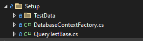

# &nbsp;**E List - Phase 1** [](https://github.com/entelect-incubator/.NET/actions/workflows/dotnet-phase1-finalsolution.yml)

<br/><br/>

In this phase, we will develop a solution for E List's tasks. We will begin by examining a typical solution structure and then refactor it into a layered architecture that can be applied throughout the rest of the incubator. This phase will focus exclusively on E List tasks to demonstrate the foundational setup of a new solution and projects in line with the [.NET Layered Architecture](https://github.com/entelect-incubator/.NET-Template/tree/master/1.%20LayeredArchitecture).

## **What you will be building in Phase 1**


## **Setup**

For the database we will be using InMemory Database that can be modified at a later stage to MSSQL, MySQL or Postgres.

Create a new EList Solution - CMD Run dotnet new sln or use Visual Studio

Create Folder Structure in your new Solution as below.


## **Create the Common Layer**

This will contain all entities, enums, exceptions, interfaces and types.

**Nuget Packages Required**

-   [ ] [Mapperly](https://github.com/riok/mapperly)

Create a new Class Library **Common** <br/> 


Create a folder _Entities_ where all database models will go into <br/> 

Install Mapperly


Add Implicit Usings to the csproj file by double clicking on the project.

Make sure ImplicitUsings is enabled in the ProperyGroup

```xml
<ImplicitUsings>enable</ImplicitUsings>
```

Add GlobalUsings.cs

```cs
global using Common.Entities;
global using Common.Models;
global using Riok.Mapperly.Abstractions;
```

Create a Entity Todo.cs in a folder **Entities**

Todo.cs

```cs
public sealed class Todo
{
	public int Id { get; set; }

	public required string Task { get; set; }

	public bool IsCompleted { get; set; }

	public DateTime? DateCreated { get; set; }

	public Guid SessionId { get; set; }
}
```

Create a folder _Models_ where all models will go into <br/>  


Create a model TodoModel.cs in a folder **Models** <br/> 

TodoModel.cs

```cs
namespace Common.Models;

public sealed class PizzaModel
{
	public int Id { get; set; }

	public required string Task { get; set; }

	public bool IsCompleted { get; set; }

	public DateTime? DateCreated { get; set; }

	public Guid SessionId { get; set; }
}
```

Create a folder **Mappers**. Create a **Mapper.cs** to Map from Model to Entity and other way around <br/>


Mapper.cs

```cs
[Mapper]
public static partial class TodoMapper
{
	public static partial Todo Map(this TodoModel model);

	public static partial TodoModel Map(this Todo entity);

	public static IEnumerable<TodoModel> Map(this List<Todo> pizzas)
		=> pizzas.Select(x => x.Map());

	public static IEnumerable<Todo> Map(this List<TodoModel> pizzas)
		=> pizzas.Select(x => x.Map());
}
```

## **Create the Database Layer**

Create a new Class Library Dataccess <br/> 

For accessing the Database we will be using [Entity Framework Core](https://github.com/dotnet/efcore).

**Nuget Packages Required**

-   [ ] Microsoft.EntityFrameworkCore.Relational
-   [ ] Microsoft.EntityFrameworkCore.InMemory

Add Implicit Usings to the csproj file by double clicking on the project.

Make sure ImplicitUsings is enabled in the ProperyGroup

```xml
<ImplicitUsings>enable</ImplicitUsings>
```

Add Project Refrence to include other defined Projects


Add GlobalUsings.cs

```cs
global using Common.Entities;
global using DataAccess.Mapping;
global using Microsoft.EntityFrameworkCore;
global using Microsoft.EntityFrameworkCore.Metadata.Builders;
```

DbSet will act as a Repository to the Database. You will see we have added SaveChangesAsync into the interface, this is to expose DbContext Entity Framework Core mffethods in your interface.

We need to create a DatabaseContext.cs inside of DataAccess. A [DbContext](https://docs.microsoft.com/en-us/dotnet/api/microsoft.entityframeworkcore.dbcontext?view=efcore-5.0) instance represents a session with the database and can be used to query and save instances of your entities. DbContext is a combination of the Unit Of Work and Repository patterns.


TodoMap.cs under Mapping folder

```cs
namespace DataAccess.Mapping;

public sealed class TodoMap : IEntityTypeConfiguration<Todo>
{
	public void Configure(EntityTypeBuilder<Todo> builder)
	{
		builder.ToTable("Todos", "dbo");

		builder.HasKey(t => t.Id);

		builder.Property(t => t.Id)
			.IsRequired()
			.HasColumnType("int")
			.ValueGeneratedOnAdd();

		builder.Property(t => t.Task)
			.IsRequired()
			.HasColumnType("varchar(250)")
			.HasMaxLength(250);

		builder.Property(t => t.IsCompleted)
			.IsRequired()
			.HasDefaultValue(false);

		builder.Property(t => t.DateCreated)
			.IsRequired()
			.HasColumnType("datetime")
			.HasDefaultValueSql("(getdate())");

		builder.Property(t => t.SessionId)
			.IsRequired()
			.HasColumnType("uniqueidentifier");
	}
}
```


DatabaseContext.cs

```cs
namespace DataAccess;

public class DatabaseContext : DbContext
{
	public DatabaseContext()
	{
	}

	public DatabaseContext(DbContextOptions options) : base(options)
	{
	}

	public virtual DbSet<Todo> Todos { get; set; }

	protected override void OnModelCreating(ModelBuilder modelBuilder)
		=> modelBuilder.ApplyConfiguration(new TodoMap());

	protected override void OnConfiguring(DbContextOptionsBuilder optionsBuilder)
		=> optionsBuilder.UseInMemoryDatabase(databaseName: "EListDb");
}
```

This will map the table name and all the fields as well as indicate what the primary key will be.

## **Create a Unit Test Project**

As we add value with the different layers, we need to make sure it is testable and create unit tests. This helps later on if code changes that Unit Tests will pick up any bugs.

There are a variety of ways we can setup Unit Tests, this is one way to do it.

### **Overview**

[Unit test basics](https://docs.microsoft.com/en-us/visualstudio/test/unit-test-basics?view=vs-2019)

### **Setup**

Create a new NUnit Test Project <br/> 

**Nuget Packages Required**

-   [ ] Microsoft.EntityFrameworkCore.InMemory
-   [ ] Bogus

Dependencies


Add Implicit Usings to the csproj file by double clicking on the project.

Make sure ImplicitUsings is enabled in the ProperyGroup

```xml
<ImplicitUsings>enable</ImplicitUsings>
```

Add GlobalUsings.cs

```cs
global using Bogus;
global using Common.Entities;
global using Common.Models;
global using Core;
global using DataAccess;
global using Microsoft.EntityFrameworkCore;
global using NUnit.Framework;
global using Test.Setup;
```

On the root folder create the following 2 classes.

DatabaseContextTest.cs

```cs
namespace Test;

public class DatabaseContextTest
{
    protected DatabaseContextTest(DbContextOptions<DbContext> contextOptions)
    {
        this.ContextOptions = contextOptions;
        this.Seed();
    }

    protected DbContextOptions<DbContext> ContextOptions { get; }

    private void Seed()
    {
        using var context = new DatabaseContext(this.ContextOptions);

        context.Database.EnsureDeleted();
        context.Database.EnsureCreated();

        context.SaveChanges();
    }
}
```

TestBase.cs - Create a In Memory DBContext.

```cs
namespace Test;

public class TestBase : DatabaseContextTest
{
    public TestBase()
    : base(
        new DbContextOptionsBuilder<DbContext>()
            .UseInMemoryDatabase("EListDb")
            .Options)
    {
    }
}
```

Create the following folders



The **Setup folder**, create QueryTestBase.cs class this will be inherited by different Entity Data Access Test classes to expose Create() function.

What you will be creating in the Setup Folder


QueryTestBase.cs

```cs
namespace Test.Setup;

using static DatabaseContextFactory;

public class QueryTestBase : IDisposable
{
    public DatabaseContext Context => Create();

    public void Dispose() => Destroy(this.Context);
}
```

Create DatabaseContextFactory.cs class in **Setup folder** that will be used to create a new DbContext object, but it will create a database session in memory.

DatabaseContextFactory.cs

```cs
namespace Test.Setup;

public class DatabaseContextFactory
{
    protected DatabaseContextFactory()
    {
    }

    public static DatabaseContext DBContext()
    {
        var options = new DbContextOptionsBuilder<DbContext>().UseInMemoryDatabase("EListDb").Options;
        return new DatabaseContext(options);
    }

    public static DatabaseContext Create()
    {
        var context = DBContext();

        context.Database.EnsureCreated();

        return context;
    }

    public static void Destroy(DatabaseContext context)
    {
        context.Database.EnsureDeleted();

        context.Dispose();
    }
}
```

Next we will create Test Data for each Entity. Inside the folder **TestData**, then create a folder **Todos**. Create a **TodoTestData.cs** class. This will create a fake Todo items for testing. <br/>  PizzaTestData.cs

```cs
namespace Test.Setup.TestData.Pizza;

public static class TodoTestData
{
	public static Faker faker = new();

	public static Todo Todo = new()
	{
		Id = 1,
		Task = faker.Random.Word(),
		IsCompleted = faker.Random.Bool(),
		DateCreated = DateTime.UtcNow,
		SessionId = Guid.NewGuid(),
	};

	public static TodoModel TodoModel = new()
	{
		Id = 1,
		Task = faker.Random.Word(),
		IsCompleted = faker.Random.Bool(),
		DateCreated = DateTime.UtcNow,
		SessionId = Guid.NewGuid(),
	};
}
```

## **Create the Core Layer**

### **Intro**

The Core Layer is where all of your business logic will live. Imagine this as the "core" of the business.

### **Setup**

Create 2 new Class Libraries inside of _02 Core_ - Core and Core.Contracts. We will start by using very basic Pizza Core.

**Nuget Packages Required**

-   [ ] MediatR

### **Building the Core Contracts Project**

Create a new ITodoCore Interface in Core.Contracts


Add Implicit Usings to the csproj file by double clicking on the project.

Make sure ImplicitUsings is enabled in the ProperyGroup

```xml
<ImplicitUsings>enable</ImplicitUsings>
```

ITodoCore.cs

```cs
namespace Core.Contracts;

public interface ITodoCore
{
	Task<IEnumerable<TodoModel>?> GetAllAsync(Guid sessionId, CancellationToken cancellationToken = default);

Task<TodoModel?> AddAsync(TodoModel model, CancellationToken cancellationToken = default);

Task<bool> CompleteAsync(int id, CancellationToken cancellationToken = default);

Task<TodoModel?> UpdateAsync(TodoModel mode, CancellationToken cancellationToken = default);

Task<bool> DeleteAsync(int id, CancellationToken cancellationToken = default);
}
```

### **Building the Core Project**

Create a new TodoCore.cs inside of Core


Add Implicit Usings to the csproj file by double clicking on the project.

Make sure ImplicitUsings is enabled in the ProperyGroup

```xml
<ImplicitUsings>enable</ImplicitUsings>
```

Add GlobalUsings.cs

```cs
global using Common.Mappers;
global using Common.Models;
global using Core.Contracts;
global using DataAccess;
global using Microsoft.EntityFrameworkCore;
```

TodoCore.cs

```cs
namespace Core;

using System.ComponentModel.DataAnnotations;
using Microsoft.EntityFrameworkCore;

public class TodoCore(DatabaseContext databaseContext) : ITodoCore
{
	public async Task<IEnumerable<TodoModel>?> GetAllAsync(Guid sessionId, CancellationToken cancellationToken = default)
		=> (await databaseContext.Todos.Where(x => x.SessionId == sessionId).Select(x => x).AsNoTracking().ToListAsync(cancellationToken)).Map();

	public async Task<TodoModel?> AddAsync(TodoModel pizza, CancellationToken cancellationToken = default)
	{
		if (pizza is null)
		{
			return null;
		}

		var entity = pizza.Map();
		entity.DateCreated = DateTime.UtcNow;
		databaseContext.Todos.Add(entity);
		var changeCount = await databaseContext.SaveChangesAsync(cancellationToken);
		if (changeCount is 0)
		{
			return null;
		}

		pizza.Id = entity.Id;
		return entity.Map();
	}

	public async Task<bool> CompleteAsync(int id, CancellationToken cancellationToken = default)
	{
		var findEntity = await databaseContext.Todos.FirstOrDefaultAsync(x => x.Id == id, cancellationToken);
		if (findEntity is null)
		{
			return false;
		}

		findEntity.IsCompleted = true;
		databaseContext.Todos.Update(findEntity);
		var changeCount = await databaseContext.SaveChangesAsync(cancellationToken);
		return changeCount is 0 ? false : true;
	}

	public async Task<TodoModel?> UpdateAsync(TodoModel model, CancellationToken cancellationToken = default)
	{
		var findEntity = await databaseContext.Todos.FirstOrDefaultAsync(x => x.Id == model.Id, cancellationToken);
		if (findEntity is null)
		{
			return null;
		}

		findEntity.Task = !string.IsNullOrEmpty(model.Task) ? model.Task : findEntity.Task;
		findEntity.IsCompleted = model.IsCompleted != findEntity.IsCompleted ? model.IsCompleted : findEntity.IsCompleted;
		await databaseContext.SaveChangesAsync(cancellationToken);

		return findEntity.Map();
	}

	public async Task<bool> DeleteAsync(int id, CancellationToken cancellationToken = default)
	{
		var todo = await databaseContext.Todos.FindAsync(id, cancellationToken);
		var result = 0;
		if (todo is not null)
		{
			databaseContext.Todos.Remove(todo);
			result = await databaseContext.SaveChangesAsync(cancellationToken);
		}

		return result == 1;
	}
}
```

**Hint**

The interesting part here is, when you call SaveChangesAsync it will return the number of changed records in the database. If you save a new record it will return the result of 1.

To keep the Dependency Injection clean and relevant to **Core**, create a DependencyInjection.cs class that can be called from any Startup.cs class.

```cs
namespace Core;

using Microsoft.Extensions.DependencyInjection;

public static class DependencyInjection
{
	public static IServiceCollection AddApplication(this IServiceCollection services)
	{
		services.AddTransient(typeof(ITodoCore), typeof(TodoCore));

		return services;
	}
}
```

### **Create the Core Layer Unit Tests**

Next, we will create unit tests for our Core Layer.

For accessing the Database we will be using [Entity Framework Core](https://github.com/dotnet/efcore).

**Nuget Packages Required**

-   [ ] Microsoft.EntityFrameworkCore.Relational
-   [ ] Sytem.Linq.Dynamic.Core

Inside the folder **Core** create a class **TestTodoCore.cs**. <br/>


Core\TestTodoCore.cs

```cs
namespace Test.Core;

using Test.Setup.TestData.Pizza;

[TestFixture]
public class TestTodoCore : QueryTestBase
{
	private TodoCore handler;

	private TodoModel model;

	[OneTimeSetUp]
	public async Task Init()
	{
		this.handler = new TodoCore(this.Context);
		this.model = await this.handler.AddAsync(TodoTestData.TodoModel);
	}

	[Test]
	public async Task GetAllAsync()
	{
		var response = await this.handler.GetAllAsync(this.model.SessionId);
		Assert.That(response.Count(), Is.EqualTo(1));
	}

	[Test]
	public void SaveAsync()
	{
		var outcome = this.model.Id != 0;
		Assert.That(outcome, Is.True);
	}

	[Test]
	public async Task CompleteAsync()
	{
		var response = await this.handler.CompleteAsync(this.model.Id);

		Assert.That(response, Is.True);
	}

	[Test]
	public async Task UpdateAsync()
	{
		var originalPizza = this.model;
		this.model.Task = new Faker().Random.Word();
		var response = await this.handler.UpdateAsync(this.model);
		var outcome = response.Task.Equals(originalPizza.Task);

		Assert.That(outcome, Is.True);
	}

	[Test]
	public async Task DeleteAsync()
	{
		var response = await this.handler.DeleteAsync(this.model.Id);
		Assert.That(response, Is.True);

		this.model = await this.handler.AddAsync(TodoTestData.TodoModel);
	}
}
```

### **Break down**

For every test we will create a new pizza Core that will create a test session in memory to the database. We will then mock new pizza using the pizza test data. THen we will persist the new pizza to the in-memory database.

## **Create the Apis Layer**

### **Setup**

Create a new ASP.NET Web Application inside **01 Apis\*** <br/>

Make sure not to use minimal APIs


Add the corerct project refrences


Make sure ImplicitUsings is enabled in the ProperyGroup

```xml
<ImplicitUsings>enable</ImplicitUsings>
```

Add GlobalUsings.cs

```cs
global using Common.Entities;
global using Common.Models;
global using Core;
global using Core.Contracts;
global using DataAccess;
global using Microsoft.AspNetCore.Mvc;
```

**Nuget Packages Required**

-   [ ] Swashbuckle.AspNetCore [Read More](https://code-maze.com/swagger-ui-asp-net-core-web-api/)
-   [ ] Microsoft.AspNetCore.Mvc.NewtonsoftJson
-   [ ] Swashbuckle.AspNetCore

You will see there will only be a Program.cs

Create a new class named Startup.cs on the root folder

### **Configuration**

Configuring the Swagger Middleware. Let's make the following changes in the ConfigureServices() method of the Startup.cs class. This adds the Swagger generator to the services collection.

In the Configure() method, let’s enable the middleware for serving the generated JSON document and the Swagger UI

```cs
public class Startup {
    public IConfiguration configRoot {
        get;
    }
    public Startup(IConfiguration configuration) {
        configRoot = configuration;
    }
    public void ConfigureServices(IServiceCollection services) {
        // Register the Swagger generator, defining 1 or more Swagger documents
        services.AddSwaggerGen(c =>
        {
            c.SwaggerDoc("v1", new OpenApiInfo { Title = "EList API", Version = "v1" });
        });
        services.AddControllers(options => options.SuppressImplicitRequiredAttributeForNonNullableReferenceTypes = true)
                .AddJsonOptions(options => options.JsonSerializerOptions.Converters.Add(new JsonStringEnumConverter()))
                .AddNewtonsoftJson(x => x.SerializerSettings.ContractResolver = new DefaultContractResolver())
                .AddNewtonsoftJson(x => x.SerializerSettings.ReferenceLoopHandling = Newtonsoft.Json.ReferenceLoopHandling.Ignore);
    }
    public void Configure(WebApplication app, IWebHostEnvironment env) {
        app.UseSwagger();
        // Enable middleware to serve swagger-ui (HTML, JS, CSS, etc.),
        // specifying the Swagger JSON endpoint.
        app.UseSwaggerUI(c =>
        {
            c.SwaggerEndpoint("/swagger/v1/swagger.json", "EList API V1");
        });
        app.Run();
    }
}
```

Inside of Startup.cs add DependencyInjection.cs inside of ConfigureService.

```cs
DependencyInjection.AddApplication(services);
```

In Program.cs add

```cs
var builder = WebApplication.CreateBuilder(args);
var startup = new Startup(builder.Configuration);
startup.ConfigureServices(builder.Services); // calling ConfigureServices method
var app = builder.Build();
startup.Configure(app, builder.Environment); // calling Configure method
```

Add Core Project to API Project


Add Dependency injection for Database Context in Startup.cs ConfigureServices

```cs
// Add DbContext using InMemory
services.AddDbContext<DatabaseContext>(options =>
    options.UseInMemoryDatabase(Guid.NewGuid().ToString())
);
```

Let us enable XML Documentation on the _Api_ project. Right-click on the API goes to Properties. <br/> 

In the ConfigureServices() method, configure Swagger to use the XML file that’s generated in the above step.

```cs
services.AddSwaggerGen(c =>
    {
        c.SwaggerDoc("v1", new OpenApiInfo
        {
            Title = "EList API",
            Version = "v1",
            Description = "An API to perform EList operations"
        });
// Set the comments path for the Swagger JSON and UI.
        var xmlFile = $"{Assembly.GetExecutingAssembly().GetName().Name}.xml";
        var xmlPath = Path.Combine(AppContext.BaseDirectory, xmlFile);
        c.IncludeXmlComments(xmlPath);
    });
```

Startup.cs

```cs
namespace Api;

using System.Reflection;
using System.Text.Json.Serialization;
using Microsoft.AspNetCore.Builder;
using Microsoft.AspNetCore.Hosting;
using Microsoft.EntityFrameworkCore;
using Microsoft.Extensions.Configuration;
using Microsoft.Extensions.DependencyInjection;
using Microsoft.OpenApi.Models;
using Newtonsoft.Json.Serialization;

public class Startup(IConfiguration configuration)
{
	public IConfiguration ConfigRoot
	{
		get;
	} = configuration;

	public void ConfigureServices(IServiceCollection services)
	{
		services.AddControllers(options => options.SuppressImplicitRequiredAttributeForNonNullableReferenceTypes = true)
			.AddJsonOptions(options => options.JsonSerializerOptions.Converters.Add(new JsonStringEnumConverter()))
			.AddNewtonsoftJson(x => x.SerializerSettings.ContractResolver = new DefaultContractResolver())
			.AddNewtonsoftJson(x => x.SerializerSettings.ReferenceLoopHandling = Newtonsoft.Json.ReferenceLoopHandling.Ignore);

		DependencyInjection.AddApplication(services);

		services.AddSwaggerGen(c =>
		{
			c.SwaggerDoc("v1", new OpenApiInfo
			{
				Title = "EList API",
				Version = "v1"
			});

			var xmlFile = $"{Assembly.GetExecutingAssembly().GetName().Name}.xml";
			var xmlPath = Path.Combine(AppContext.BaseDirectory, xmlFile);
			c.IncludeXmlComments(xmlPath);
		});

		services.AddDbContext<DatabaseContext>(options =>
			options.UseInMemoryDatabase(Guid.NewGuid().ToString())
		);
	}

	public void Configure(WebApplication app, IWebHostEnvironment env)
	{
		app.UseSwagger();
		app.UseSwaggerUI(c => c.SwaggerEndpoint("/swagger/v1/swagger.json", "EList API V1"));
		app.UseHttpsRedirection();
		app.UseRouting();
		app.UseEndpoints(endpoints => endpoints.MapControllers());
		app.UseAuthorization();
		app.Run();
	}
}
```

Change Debug setting to open Swagger by default <br/> 

### **Create a API Controller**

Create a new **TodosController.cs**. We will create a restfull endpoint for **Todo Core** layer.


TodosController.cs

```cs
namespace Api.Controllers;

using Microsoft.AspNetCore.Mvc;

[ApiController]
[Route("[controller]")]
public class TodosController(ITodoCore core) : ControllerBase
{
	/// <summary>
	/// Get all Todos.
	/// </summary>
	/// <returns>ActionResult</returns>
	[HttpPost("Search")]
	[ProducesResponseType(200)]
	public async Task<ActionResult> Search(Guid sessionId, CancellationToken cancellationToken = default)
		=> this.Ok(await core.GetAllAsync(sessionId, cancellationToken));

	/// <summary>
	/// Create a task.
	/// </summary>
	/// <remarks>
	/// Sample request:
	///
	///     POST api/Todo
	///     {
	///       "task": "New task",
	///     }
	/// </remarks>
	/// <param name="model">Todo Model</param>
	/// <param name="cancellationToken">Cancellation Token</param>
	/// <returns>ActionResult</returns>
	[HttpPost]
	[ProducesResponseType(200)]
	[ProducesResponseType(400)]
	public async Task<ActionResult<Todo>> Add([FromBody] TodoModel model, CancellationToken cancellationToken = default)
	{
		var result = await core.AddAsync(model, cancellationToken);

		return (result is null) ? this.BadRequest() : this.Ok(result);
	}

	/// <summary>
	/// Complete a task.
	/// </summary>
	/// <remarks>
	/// Sample request:
	///
	///     PUT api/Todo/Complete
	///     {
	///       "id": "1"
	///     }
	/// </remarks>
	/// <param name="id">Task id</param>
	/// <param name="cancellationToken">Cancellation Token</param>
	/// <returns>ActionResult</returns>
	[HttpPost("Complete")]
	[ProducesResponseType(200)]
	[ProducesResponseType(400)]
	public async Task<ActionResult> Complete([FromBody] int id, CancellationToken cancellationToken = default)
	{
		var result = await core.CompleteAsync(id, cancellationToken);

		return (result is false) ? this.BadRequest() : this.Ok(result);
	}


	/// <summary>
	/// Update Todo.
	/// </summary>
	/// <remarks>
	/// Sample request:
	///
	///     PUT api/Todo/1
	///     {
	///       "Task": "New task"
	///     }
	/// </remarks>
	/// <param name="model">Todo Model</param>
	/// <param name="cancellationToken">Cancellation Token</param>
	/// <returns>ActionResult</returns>
	[HttpPut]
	[ProducesResponseType(200)]
	[ProducesResponseType(400)]
	public async Task<ActionResult> Update([FromBody] TodoModel model, CancellationToken cancellationToken = default)
	{
		var result = await core.UpdateAsync(model, cancellationToken);

		return (result is null) ? this.BadRequest() : this.Ok(result);
	}

	/// <summary>
	/// Delete a task by Id.
	/// </summary>
	/// <param name="id">Task Id</param>
	/// <param name="cancellationToken">Cancellation Token</param>
	/// <returns>ActionResult</returns>
	[HttpDelete("{id}")]
	[ProducesResponseType(200)]
	[ProducesResponseType(400)]
	public async Task<ActionResult> Delete(int id, CancellationToken cancellationToken = default)
	{
		var result = await core.DeleteAsync(id, cancellationToken);

		return (!result) ? this.BadRequest() : this.Ok(result);
	}
}
```

## **Run your EList API**

Press F5 and Test all the Todo Methods.

Make sure the Api is set as Startup Project. If you get a HTTPS Cert popup, just say Yes.


Swagger running


Test cases passing


## **Phase 2 - CQRS**

Move to Phase 2 [Click Here](https://github.com/entelect-incubator/.NET/tree/master/Phase%202)
