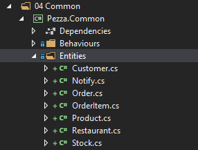
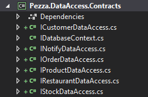
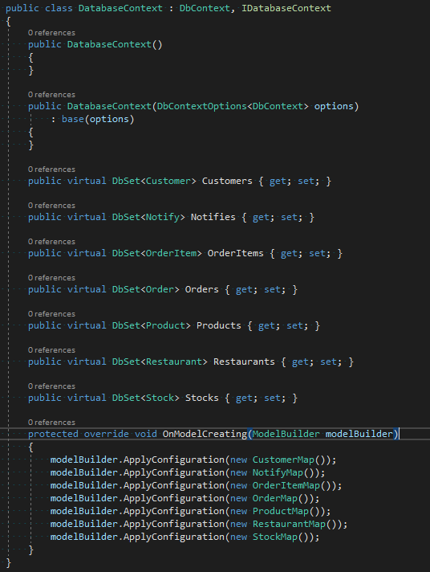
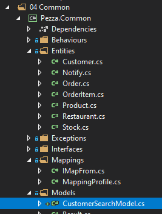

# &nbsp;**Pezza - Phase 1 - Step 1**

<br/><br/>

### **Entitites**


### **Mapping**


### **05 Database > Pezza.DataAccess.Contracts > IDatabaseContext.cs**


### Create a DataAccess class and interface for every Entity

Sample Interface

```
namespace Pezza.DataAccess.Contracts
{
    using System.Collections.Generic;
    using System.Threading.Tasks;
    using Pezza.Common.Entities;

    public interface ICustomerDataAccess
    {
        Task<Customer> GetAsync(int id);

        Task<List<Customer>> GetAllAsync();

        Task<Customer> UpdateAsync(Customer entity);

        Task<Customer> SaveAsync(Customer entity);

        Task<bool> DeleteAsync(Customer entity);
    }
}
```

Sample Data Acess Class

```
namespace Pezza.DataAccess
{
    using System.Collections.Generic;
    using System.Threading.Tasks;
    using Microsoft.EntityFrameworkCore;
    using Pezza.DataAccess.Contracts;

    public class CustomerDataAccess : ICustomerDataAccess
    {
        private readonly IDatabaseContext databaseContext;

        public CustomerDataAccess(IDatabaseContext databaseContext) => this.databaseContext = databaseContext;

        public async Task<Common.Entities.Customer> GetAsync(int id)
        {
            return await this.databaseContext.Customers.FirstOrDefaultAsync(x => x.Id == id);
        }

        public async Task<List<Common.Entities.Customer>> GetAllAsync()
        {
            return await this.databaseContext.Customers.ToListAsync();
        }

        public async Task<Common.Entities.Customer> SaveAsync(Common.Entities.Customer entity)
        {
            this.databaseContext.Customers.Add(entity);
            await this.databaseContext.SaveChangesAsync();
            return entity;
        }

        public async Task<Common.Entities.Customer> UpdateAsync(Common.Entities.Customer entity)
        {
            this.databaseContext.Customers.Update(entity);
            await this.databaseContext.SaveChangesAsync();
            return entity;
        }

        public async Task<bool> DeleteAsync(Common.Entities.Customer entity)
        {
            this.databaseContext.Customers.Remove(entity);
            var result = await this.databaseContext.SaveChangesAsync();
            return (result == 1);
        }
    }
}
```

### When you are done it should look like this




### **05 Database > Pezza.DataAccess > DatabaseContext.cs**


### 03 Core > Pezza.Core > Create Command and Queries

Update DependencyInjection.cs to include data access layer
```
public static IServiceCollection AddApplication(this IServiceCollection services)
{
    services.AddMediatR(Assembly.GetExecutingAssembly());
    services.AddAutoMapper(Assembly.GetExecutingAssembly());
    services.AddValidatorsFromAssembly(Assembly.GetExecutingAssembly());
    services.AddTransient(typeof(IPipelineBehavior<,>), typeof(ValidationBehavior<,>));
    services.AddTransient(typeof(IPipelineBehavior<,>), typeof(PerformanceBehaviour<,>));
    services.AddTransient(typeof(IPipelineBehavior<,>), typeof(UnhandledExceptionBehaviour<,>));

    services.AddTransient(typeof(IOrderDataAccess), typeof(OrderDataAccess));
    services.AddTransient(typeof(IStockDataAccess), typeof(StockDataAccess));
    services.AddTransient(typeof(INotifyDataAccess), typeof(NotifyDataAccess));
    services.AddTransient(typeof(IProductDataAccess), typeof(ProductDataAccess));
    services.AddTransient(typeof(ICustomerDataAccess), typeof(CustomerDataAccess));
    services.AddTransient(typeof(IRestaurantDataAccess), typeof(RestaurantDataAccess));

    return services;
}
```

### Create commands for every Entity

Sample Create Command - CreateCustomerCommand

```
namespace Pezza.Core.Customer
{
    using System.Threading;
    using System.Threading.Tasks;
    using Common.Entities;
    using MediatR;
    using Pezza.DataAccess.Contracts;

    public partial class CreateCustomerCommand : IRequest<Customer>
    {
        public Customer Customer { get; set; }
    }

    public class CreateCustomerCommandHandler : IRequestHandler<CreateCustomerCommand, Customer>
    {
        private readonly ICustomerDataAccess dataAcess;

        public CreateCustomerCommandHandler(ICustomerDataAccess dataAcess) 
            => this.dataAcess = dataAcess;

        public async Task<Customer> Handle(CreateCustomerCommand request, CancellationToken cancellationToken)
            => await this.dataAcess.SaveAsync(request.Customer);
    }
}
```

Sample Delete Command - DeleteCustomerCommand

```
namespace Pezza.Core.Customer.Commands
{
    using System.Threading;
    using System.Threading.Tasks;
    using MediatR;
    using Pezza.Common.Models;
    using Pezza.DataAccess.Contracts;

    public partial class DeleteCustomerCommand : IRequest<Result>
    {
        public int Id { get; set; }
    }

    public class DeleteCustomerCommandHandler : IRequestHandler<DeleteCustomerCommand, Result>
    {
        private readonly ICustomerDataAccess dataAcess;

        public DeleteCustomerCommandHandler(ICustomerDataAccess dataAcess)
            => this.dataAcess = dataAcess;

        public async Task<Result> Handle(DeleteCustomerCommand request, CancellationToken cancellationToken)
        {
            var findEntity = await this.dataAcess.GetAsync(request.Id);
            var outcome = await this.dataAcess.DeleteAsync(findEntity);

            return (outcome) ? Result.Success() : Result.Failure("Error deleting a Customer");
        }
    }
}
```

Sample Update Command - UpdateCustomerCommand

When updating a customer we might not know what the customer id is. To solver this we are going to create a search model class in the common project. Make sure anyfield that is not a string must be nullable.

For the Filter Class you will need Nuget

```
Package System.Linq.Dynamic.Core
```

```
namespace Pezza.Common.Models
{
    using System;

    public class CustomerSearchModel
    {
        public string Name { get; set; }

        public string Address { get; set; }

        public string City { get; set; }

        public string Province { get; set; }

        public string ZipCode { get; set; }

        public string Phone { get; set; }

        public string Email { get; set; }

        public string ContactPerson { get; set; }

        public DateTime? DateCreated { get; set; }

        public string OrderBy { get; set; }

        public PagingArgs PagingArgs { get; set; }
    }
}
```



Update Customer Data Access Interface and Customer Data Access 

```
Task<List<Customer>> GetAllAsync(CustomerSearchModel searchModel);
```

```
public async Task<List<Common.Entities.Customer>> GetAllAsync(CustomerSearchModel searchModel)
        {
            if (string.IsNullOrEmpty(searchModel.OrderBy))
            {
                searchModel.OrderBy = "DateCreated desc";
            }

            var entities = this.databaseContext.Customers.Select(x => x)
                .FilterByName(searchModel.Name)
                .FilterByEmail(searchModel.Email)
                .AsNoTracking()
                .OrderBy(searchModel.OrderBy);

            var paged = await entities.ApplyPaging(searchModel.PagingArgs).ToListAsync();
            return paged;
        }
```

Update Command Sample

```
namespace Pezza.Core.Customer.Commands
{
    using System.Linq;
    using System.Threading;
    using System.Threading.Tasks;
    using MediatR;
    using Pezza.Common.Models;
    using Pezza.DataAccess.Contracts;

    public partial class UpdateCustomerCommand : IRequest<Result<Common.Entities.Customer>>
    {
        public string Name { get; set; }

        public string Address { get; set; }

        public string City { get; set; }

        public string Province { get; set; }

        public string ZipCode { get; set; }

        public string Phone { get; set; }

        public string Email { get; set; }

        public string ContactPerson { get; set; }
    }

    public class UpdateCustomerCommandHandler : IRequestHandler<UpdateCustomerCommand, Result<Common.Entities.Customer>>
    {
        private readonly ICustomerDataAccess dataAcess;

        public UpdateCustomerCommandHandler(ICustomerDataAccess dataAcess)
            => this.dataAcess = dataAcess;

        public async Task<Result<Common.Entities.Customer>> Handle(UpdateCustomerCommand request, CancellationToken cancellationToken)
        {
            var search = await this.dataAcess.GetAllAsync(new CustomerSearchModel
            {
                Email = request.Email
            });
            var findEntity = search.FirstOrDefault();

            if (!string.IsNullOrEmpty(request.Name))
            {
                findEntity.Name = request.Name;
            }

            if (!string.IsNullOrEmpty(request.Address))
            {
                findEntity.Address = request.Address;
            }

            if (!string.IsNullOrEmpty(request.City))
            {
                findEntity.City = request.City;
            }

            if (!string.IsNullOrEmpty(request.Province))
            {
                findEntity.Province = request.Province;
            }

            if (!string.IsNullOrEmpty(request.ZipCode))
            {
                findEntity.ZipCode = request.ZipCode;
            }

            if (!string.IsNullOrEmpty(request.Phone))
            {
                findEntity.Phone = request.Phone;
            }

            if (!string.IsNullOrEmpty(request.ContactPerson))
            {
                findEntity.ContactPerson = request.ContactPerson;
            }

            var outcome = await this.dataAcess.UpdateAsync(findEntity);

            return (outcome != null) ? Result<Common.Entities.Customer>.Success(outcome) : Result<Common.Entities.Customer>.Failure("Error updating a Customer");
        }
    }
}
```