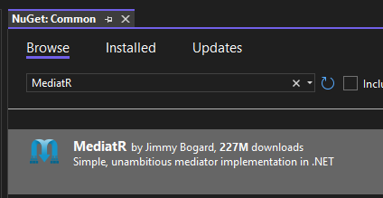
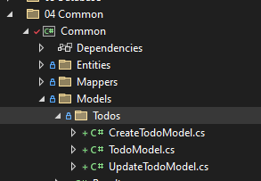

# &nbsp;**E List - Phase 2 - Step 1**

<br/><br/>

This Phase might feel a bit tedious, but it puts down a strong foundation to build off from for the entire incubator.

If at any point you are struggling you can reference Phase 2\src\02. EndSolution

## **Install Mediatr**

To help us with CQRS we will be using the Mediatr Nuget package.

What is Mediatr? In-process messaging with no dependencies.

Supports request/response, commands, queries, notifications and events, synchronous and async with intelligent dispatching via C# generic variance.

Install Mediatr on the Core Project and your Common Project



### **Business Logic - Core**

We will be moving to CQRS pattern for the Core Layer. This helps Single Responsibility.

[CQRS Overview](https://docs.microsoft.com/en-us/azure/architecture/patterns/cqrs)

To help us out achieving this we will be using a Nuget Package - Mediatr

[Mediatr](https://github.com/jbogard/MediatR)

[Functional Error Handling in .NET With the Result Pattern](https://www.milanjovanovic.tech/blog/functional-error-handling-in-dotnet-with-the-result-pattern)

We also will be introducing the Result Pattern.

To create consistency with the result we send back from the Core layer we will utilize a Result.cs class. This helps to create unity between all Commands and Queries.

We will be using [Compiled Queries](https://learn.microsoft.com/en-us/dotnet/framework/data/adonet/ef/language-reference/compiled-queries-linq-to-entities) for performance benefit.

## **Common Models**

Instead of throwing or using exceptions, we will return a Result object indicating success or failure of an operation.

```cs
namespace Common.Models;

public class Result
{
	public bool Succeeded { get; set; }

	public List<string>? Errors { get; set; }

	public static Result Success() => new()
	{
		Succeeded = true
	};

	public static Result Failure(List<string> errors) => new()
	{
		Succeeded = false,
		Errors = errors
	};

	public static Result Failure(string error) => new()
	{
		Succeeded = false,
		Errors = [error]
	};
}

public class Result<T>
{
	public bool Succeeded { get; set; }

	public T? Data { get; set; }

	public int? Count { get; set; }

	public List<string>? Errors { get; set; }

	public static Result<T> Success(T data, int? count = 0) => new()
	{
		Data = data,
		Count = count,
		Succeeded = true
	};

	public static Result<T> Failure(string error) => new()
	{
		Errors = [error],
		Succeeded = false
	};

	public static Result<T> Failure(List<string> errors) => new()
	{
		Errors = errors,
		Succeeded = false
	};
}

public class ErrorResult : Result
{
	public ErrorResult() => this.Succeeded = false;

	[DefaultValue(false)]
	public new bool Succeeded { get; set; }
}
```

Update GlobalUsings.cs

```cs
global using System.ComponentModel;
global using Common.Entities;
global using Common.Models;
```

Remove the old TodoCore and Core.Contracts Project

Create the following Commands for Todo in Core Project inside the Entity Name Folder/Commands <br/> 

We will transition from the TodoCore concept to a more structured approach by implementing separate commands and queries for each operation. Recognizing these patterns will be crucial as we move forward.

To achieve this, we will also create distinct models for different operations. Specifically, we will split the existing TodoModel into three separate models: TodoModel, CreateTodoModel, and UpdateTodoModel. These models will be organized into a new folder named Todos within the Common project.



Update the mappers to handle the different models and their mappings to entities.


```cs
	public static partial Todo Map(this CreateTodoModel model);

	public static partial Todo Map(this UpdateTodoModel model);
```

Back to the Core Project

-   Add Command

```cs
namespace Core.Todos.Commands;

using Common.Models.Todos;

public class AddTodoCommand : IRequest<Result<TodoModel>>
{
	public required CreateTodoModel Data { get; set; }
}

public class CreateTodoCommandHandler(DatabaseContext databaseContext) : IRequestHandler<AddTodoCommand, Result<TodoModel>>
{
	private const string ERROR = "Error adding a task";

	public async Task<Result<TodoModel>> Handle(AddTodoCommand request, CancellationToken cancellationToken)
	{
		if (request.Data is null)
		{
			return Result<TodoModel>.Failure(ERROR);
		}

		var entity = request.Data.Map();
		entity.DateCreated = DateTime.UtcNow;
		databaseContext.Todos.Add(entity);
		var result = await databaseContext.SaveChangesAsync(cancellationToken);

		return result > 0 ? Result<TodoModel>.Success(entity.Map()) : Result<TodoModel>.Failure(ERROR);
	}
}
```

-   Delete Command

```cs
namespace Core.Todos.Commands;

public class DeleteTodoCommand : IRequest<Result>
{
	public required int Id { get; set; }
}

public class DeleteTodoCommandHandler(DatabaseContext databaseContext) : IRequestHandler<DeleteTodoCommand, Result>
{
	private const string ERROR = "Error deleting a task";

	public async Task<Result> Handle(DeleteTodoCommand request, CancellationToken cancellationToken = default)
	{
		var todo = await databaseContext.Todos.FindAsync(request.Id, cancellationToken);
		if (todo is not null)
		{
			databaseContext.Todos.Remove(todo);
			var result = await databaseContext.SaveChangesAsync(cancellationToken);

			return result > 0 ? Result.Success() : Result.Failure(ERROR);
		}

		return Result.Failure(ERROR);
	}
}
```

-   Update Command

```cs
namespace Core.Todos.Commands;

using Common.Models.Todos;

public class UpdateTodoCommand : IRequest<Result<TodoModel>>
{
	public required int? Id { get; set; }

	public required UpdateTodoModel Data { get; set; }
}

public class UpdateTodoCommandHandler(DatabaseContext databaseContext) : IRequestHandler<UpdateTodoCommand, Result<TodoModel>>
{
	private const string ERROR = "Error updating a task";

	public async Task<Result<TodoModel>> Handle(UpdateTodoCommand request, CancellationToken cancellationToken)
	{
		var id = request.Id!;
		var model = request.Data!;
		var query = EF.CompileAsyncQuery((DatabaseContext db, int id) => db.Todos.FirstOrDefault(c => c.Id == id));
		var findEntity = await query(databaseContext, id.Value);
		if (findEntity is null)
		{
			return Result<TodoModel>.Failure("Not found");
		}

		findEntity.Task = !string.IsNullOrEmpty(model.Task) ? model.Task : findEntity.Task;
		findEntity.IsCompleted = model.IsCompleted ?? findEntity.IsCompleted;
		var result = await databaseContext.SaveChangesAsync(cancellationToken);

		return result > 0 ? Result<TodoModel>.Success(findEntity.Map()) : Result<TodoModel>.Failure(ERROR);
	}
}
```

-   Complete Command

```cs
namespace Core.Todos.Commands;

using Common.Models.Todos;

public class CompleteTodoCommand : IRequest<Result<TodoModel>>
{
	public required int? Id { get; set; }
}

public class CompleteTodoCommandHandler(DatabaseContext databaseContext) : IRequestHandler<CompleteTodoCommand, Result<TodoModel>>
{
	private const string ERROR = "Error completing a task";

	public async Task<Result<TodoModel>> Handle(CompleteTodoCommand request, CancellationToken cancellationToken)
	{
		var id = request.Id!;
		var query = EF.CompileAsyncQuery((DatabaseContext db, int id) => db.Todos.FirstOrDefault(c => c.Id == id));
		var findEntity = await query(databaseContext, id.Value);
		if (findEntity is null)
		{
			return Result<TodoModel>.Failure("Not found");
		}

		findEntity.IsCompleted = true;
		var result = await databaseContext.SaveChangesAsync(cancellationToken);

		return result > 0 ? Result<TodoModel>.Success(findEntity.Map()) : Result<TodoModel>.Failure(ERROR);
	}
}
```

If a property is not required and can be empty, don't enclose it in a shorthand if or coalescing.

```cs
findEntity.Task = request.Data?.Task;
```

Create the following Queries

-   Get All

```cs
namespace Core.Todos.Queries;

using Common.Models.Todos;

public class GetTodosQuery : IRequest<Result<IEnumerable<TodoModel>>>
{
	public Guid SessionId { get; set; }
}
public class GetTodosQueryHandler(DatabaseContext databaseContext) : IRequestHandler<GetTodosQuery, Result<IEnumerable<TodoModel>>>
{
	public async Task<Result<IEnumerable<TodoModel>>> Handle(GetTodosQuery request, CancellationToken cancellationToken)
	{
		var data = databaseContext.Todos.Where(x => x.SessionId == request.SessionId).AsNoTracking();

		var count = data.Count();
		var result = await data.ToListAsync(cancellationToken);

		return Result<IEnumerable<TodoModel>>.Success(result.Map(), count);
	}
}
```

For MediatR Dependency Injection we need to create 3 Behaviour Classes inside Common. We will add logging later.

-   PerformanceBehaviour.cs this will pick up any slow running queries

```cs
namespace Core.Behaviours;

using System.Diagnostics;

public class PerformanceBehaviour<TRequest, TResponse> : IPipelineBehavior<TRequest, TResponse>
{
	private readonly Stopwatch timer = new();

	public async Task<TResponse> Handle(TRequest request, RequestHandlerDelegate<TResponse> next, CancellationToken cancellationToken)
	{
		this.timer.Restart();

		var response = await next();

		this.timer.Stop();

		var elapsedMilliseconds = this.timer.ElapsedMilliseconds;

		if (elapsedMilliseconds > 500)
		{
			var requestName = typeof(TRequest).Name;
			////TODO: this.logger.LogInformation($"Long Running Request: {requestName} ({elapsedMilliseconds} milliseconds)", request);
		}

		return response;
	}
}
```

-   UnhandledExceptionBehaviour.cs this will pick up any exceptions during the executio pipeline.

```cs
namespace Common.Behaviour;

namespace Core.Behaviours;

public class UnhandledExceptionBehaviour<TRequest, TResponse> : IPipelineBehavior<TRequest, TResponse>
{
	public async Task<TResponse> Handle(TRequest request, RequestHandlerDelegate<TResponse> next, CancellationToken cancellationToken)
	{
		try
		{
			return await next();
		}
		catch (Exception ex)
		{
			var requestName = typeof(TRequest).Name;

			//TODO: this.logger.LogError(ex, "Unhandled Exception for Request {Name} {@Request}", requestName, request);

			throw;
		}
	}
}
```

DependencyInjection.cs in Core

```cs
namespace Core;

using Core.Behaviours;
using Core.Todos.Commands;
using Microsoft.Extensions.DependencyInjection;

public static class DependencyInjection
{
	public static IServiceCollection AddApplication(this IServiceCollection services)
	{
		services.AddMediatR(cfg => cfg.RegisterServicesFromAssemblyContaining<AddTodoCommand>());
		services.AddTransient(typeof(IPipelineBehavior<,>), typeof(UnhandledExceptionBehaviour<,>));
		services.AddTransient(typeof(IPipelineBehavior<,>), typeof(PerformanceBehaviour<,>));
		return services;
	}
}
```

## **STEP 2 - Unit Tests**

Move to Step 2 [Click Here](https://github.com/entelect-incubator/.NET/tree/master/Phase%202/Step%202)
