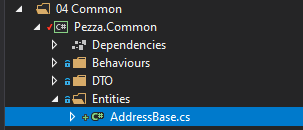
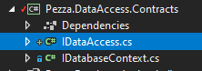
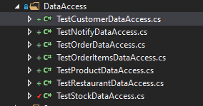

# &nbsp;**Pezza - Phase 2 - Step 1**

<br/><br/>

This Phase might feel a bit tedious, but it puts down a strong foundation to build off from for the entire incubator.

## **Create the other database entities and update database context**

- [ ] To speed up entity generation you can use a CLI tool or create it manually
  - [ ] Open Command Line
  - [ ] Create a new folder where entities and mapping be generated in
  - [ ] ```dotnet tool install --global EntityFrameworkCore.Generator```
  - [ ] ```efg generate -c "DB Connection String"```
  - [ ] Fix the generated namespaces and code cleanup
  - [ ] or can copy it from Phase2\Data

### **Create Base Address**

This is for any DTO or Entity that has an address.


```
namespace Pezza.Common.Entities
{
    public class AddressBase
    {
        public string Address { get; set; }

        public string City { get; set; }

        public string Province { get; set; }

        public string ZipCode { get; set; }
    }
}
```

### **Create Image Data Base**

This is for any DTO or Entity that has an Image that needs to be created.


```
namespace Pezza.Common.Entities
{
    public class ImageDataBase
    {
        public string ImageData { get; set; }
    }
}
```

### **Entitites**

Representing Database Tables Entities


### **DTO**

Create a Data Transfer Object with only the information the consumer of the data will need. This allows you to hide any sensitive data.


### **DTO Data**

Create a Data Transfer Object with only the information the consumer of the data will need when creating a new object of that entity. This allows you to hide any sensitive data.


### **Mapping**

Create a mapping class to map between Entities to a DTO or vice versa.


### **Unit Tests Test Data**


### **Base Entity**

All of our Database Tables has a Primary Key of Id and type of Int.

.png)

```
namespace Pezza.Common.Entities
{
    public interface IEntity
    {
        int Id { get; set; }
    }
}

namespace Pezza.Common.Entities
{
    public abstract class Entity : IEntity
    {
        public int Id { get; set; }
    }
}
```

Add Entity Inheritance to all entities and DTO's


Remove 

```
public int Id { get; set; }
```

### **Base DataAccess**

```
namespace Pezza.DataAccess.Contracts
{
    using System.Collections.Generic;
    using System.Threading.Tasks;

    public interface IDataAccess<T>
    {
        Task<T> GetAsync(int id);

        Task<List<T>> GetAllAsync();

        Task<T> UpdateAsync(T entity);

        Task<T> SaveAsync(T entity);

        Task<bool> DeleteAsync(int id);
    }
}
```

Remove IStockDataAcess.cs



Convert StockDataAccess to inherit from IDataAccess.cs

public class StockDataAccess : IDataAccess<Stock>

Create DataAccess for the all the Entities


### **Unit Test DataAccess**

Make sure all the DataAccess classes methods have a test.




### **Business Logic - Core**

We will be moving to CQRS pattern for the Core Layer. This helps Single Responsibility.

[CQRS Overview](https://docs.microsoft.com/en-us/azure/architecture/patterns/cqrs)

To help us out achieving this we will be using a Nuget Package - Mediatr

[Mediatr](https://github.com/jbogard/MediatR)

To create consistency with the result we send back from the Core layer we will utilize a Result.cs class. This helps to create unity between all Commands and Queries.


```
namespace Pezza.Common.Models
{
    using System.Collections.Generic;
    using System.Linq;

    public class Result
    {
        internal Result(bool succeeded, string error)
        {
            this.Succeeded = succeeded;

            this.Errors = new List<string>
            {
                error
            };
        }

        internal Result(bool succeeded, List<string> errors)
        {
            this.Succeeded = succeeded;
            this.Errors = errors;
        }

        public bool Succeeded { get; set; }

        public List<string> Errors { get; set; }

        public static Result Success() => new Result(true, new List<string> { });

        public static Result Failure(List<string> errors) => new Result(false, errors);

        public static Result Failure(string error) => new Result(false, error);
    }

    public class Result<T>
    {
        internal Result(bool succeeded, string error)
        {
            this.Succeeded = succeeded;
            this.Errors = new List<string>
            {
                error
            };
        }

        internal Result(bool succeeded, List<string> errors)
        {
            this.Succeeded = succeeded;
            this.Errors = errors;
        }

        internal Result(bool succeeded, T data, List<string> errors)
        {
            this.Succeeded = succeeded;
            this.Errors = errors;
            this.Data = data;
        }

        public bool Succeeded { get; set; }

        public T Data { get; set; }

        public List<string> Errors { get; set; }

        public static Result<T> Success(T data) => new Result<T>(true, data, new List<string> { });

        public static Result<T> Failure(string error) => new Result<T>(false, error);

        public static Result<T> Failure(List<string> errors) => new Result<T>(false, errors);
    }

    public class ListResult<T>
    {
        internal ListResult(bool succeeded, string error)
        {
            this.Succeeded = succeeded;
            this.Errors = new List<string>
            {
                error
            };
        }

        internal ListResult(bool succeeded, List<string> errors)
        {
            this.Succeeded = succeeded;
            this.Errors = errors;
        }

        internal ListResult(bool succeeded, List<T> data, List<string> errors)
        {
            this.Succeeded = succeeded;
            this.Errors = errors;
            this.Data = data;
        }

        internal ListResult(bool succeeded, IEnumerable<T> data, List<string> errors)
        {
            this.Succeeded = succeeded;
            this.Errors = errors;
            this.Data = data.ToList();
        }

        public bool Succeeded { get; set; }

        public List<T> Data { get; set; }

        public List<string> Errors { get; set; }

        public static ListResult<T> Success(List<T> data) => new ListResult<T>(true, data, new List<string> { });
        
        public static ListResult<T> Success(IEnumerable<T> data) => new ListResult<T>(true, data, new List<string> { });

        public static ListResult<T> Failure(string error) => new ListResult<T>(false, error);

        public static ListResult<T> Failure(List<string> errors) => new ListResult<T>(false, errors);
    }

}

```

Remove Project - Pezza.Core.Contracts

Make sure you have Mapping for each Entity to and from its DTO


Create the following Commands for each Entity
- Create

```
namespace Pezza.Core.Customer.Commands
{
    using System.Threading;
    using System.Threading.Tasks;
    using Common.Entities;
    using MediatR;
    using Pezza.Common.DTO;
    using Pezza.Common.Mapping;
    using Pezza.Common.Models;
    using Pezza.DataAccess.Contracts;

    public partial class CreateCustomerCommand : IRequest<Result<CustomerDTO>>
    {
        public CustomerDataDTO Data { get; set; }
    }

    public class CreateCustomerCommandHandler : IRequestHandler<CreateCustomerCommand, Result<CustomerDTO>>
    {
        private readonly IDataAccess<Customer> dataAcess;

        public CreateCustomerCommandHandler(IDataAccess<Customer> dataAcess)
            => this.dataAcess = dataAcess;

        public async Task<Result<CustomerDTO>> Handle(CreateCustomerCommand request, CancellationToken cancellationToken)
        {
            var outcome = await this.dataAcess.SaveAsync(request.Data.Map());

            return (outcome != null) ? Result<CustomerDTO>.Success(outcome.Map()) : Result<CustomerDTO>.Failure("Error creating a Customer");
        }
    }
}
```

- Delete

```
namespace Pezza.Core.Customer.Commands
{
    using System.Threading;
    using System.Threading.Tasks;
    using MediatR;
    using Pezza.Common.Models;
    using Pezza.DataAccess.Contracts;

    public partial class DeleteCustomerCommand : IRequest<Result>
    {
        public int Id { get; set; }
    }

    public class DeleteCustomerCommandHandler : IRequestHandler<DeleteCustomerCommand, Result>
    {
        private readonly IDataAccess<Common.Entities.Customer> dataAcess;

        public DeleteCustomerCommandHandler(IDataAccess<Common.Entities.Customer> dataAcess)
            => this.dataAcess = dataAcess;

        public async Task<Result> Handle(DeleteCustomerCommand request, CancellationToken cancellationToken)
        {
            var outcome = await this.dataAcess.DeleteAsync(request.Id);

            return (outcome) ? Result.Success() : Result.Failure("Error deleting a Customer");
        }
    }
}
```

- Update

```
namespace Pezza.Core.Customer.Commands
{
    using System.Threading;
    using System.Threading.Tasks;
    using MediatR;
    using Pezza.Common.DTO;
    using Pezza.Common.Mapping;
    using Pezza.Common.Models;
    using Pezza.DataAccess.Contracts;

    public partial class UpdateCustomerCommand : IRequest<Result<CustomerDTO>>
    {
        public int Id { get; set; }

        public CustomerDataDTO Data { get; set; }
    }

    public class UpdateCustomerCommandHandler : IRequestHandler<UpdateCustomerCommand, Result<CustomerDTO>>
    {
        private readonly IDataAccess<Common.Entities.Customer> dataAcess;

        public UpdateCustomerCommandHandler(IDataAccess<Common.Entities.Customer> dataAcess)
            => this.dataAcess = dataAcess;

        public async Task<Result<CustomerDTO>> Handle(UpdateCustomerCommand request, CancellationToken cancellationToken)
        {
            var findEntity = await this.dataAcess.GetAsync(request.Id);

            if (!string.IsNullOrEmpty(request.Data?.Name))
            {
                findEntity.Name = request.Data?.Name;
            }

            if (!string.IsNullOrEmpty(request.Data?.AddressBase?.Address))
            {
                findEntity.Address = request.Data?.AddressBase?.Address;
            }

            if (!string.IsNullOrEmpty(request.Data?.AddressBase?.City))
            {
                findEntity.City = request.Data?.AddressBase?.City;
            }

            if (!string.IsNullOrEmpty(request.Data?.AddressBase?.Province))
            {
                findEntity.Province = request.Data?.AddressBase?.Province;
            }

            if (!string.IsNullOrEmpty(request.Data?.AddressBase?.ZipCode))
            {
                findEntity.ZipCode = request.Data?.AddressBase?.ZipCode;
            }

            if (!string.IsNullOrEmpty(request.Data?.Phone))
            {
                findEntity.Phone = request.Data?.Phone;
            }

            if (!string.IsNullOrEmpty(request.Data?.ContactPerson))
            {
                findEntity.ContactPerson = request.Data?.ContactPerson;
            }

            var outcome = await this.dataAcess.UpdateAsync(findEntity);

            return (outcome != null) ? Result<CustomerDTO>.Success(outcome.Map()) : Result<CustomerDTO>.Failure("Error updating a Customer");
        }
    }
}
```

Create the following Queries

-Get Single

```
namespace Pezza.Core.Customer.Queries
{
    using System.Threading;
    using System.Threading.Tasks;
    using MediatR;
    using Pezza.Common.DTO;
    using Pezza.Common.Mapping;
    using Pezza.Common.Models;
    using Pezza.DataAccess.Contracts;

    public class GetCustomerQuery : IRequest<Result<CustomerDTO>>
    {
        public int Id { get; set; }
    }

    public class GetCustomerQueryHandler : IRequestHandler<GetCustomerQuery, Result<CustomerDTO>>
    {
        private readonly IDataAccess<Common.Entities.Customer> dataAcess;

        public GetCustomerQueryHandler(IDataAccess<Common.Entities.Customer> dataAcess) => this.dataAcess = dataAcess;

        public async Task<Result<CustomerDTO>> Handle(GetCustomerQuery request, CancellationToken cancellationToken)
        {
            var search = await this.dataAcess.GetAsync(request.Id);

            return Result<CustomerDTO>.Success(search.Map());
        }
    }
}
```

- Get All

```
namespace Pezza.Core.Customer.Queries
{
    using System.Threading;
    using System.Threading.Tasks;
    using MediatR;
    using Pezza.Common.DTO;
    using Pezza.Common.Mapping;
    using Pezza.Common.Models;
    using Pezza.DataAccess.Contracts;

    public class GetCustomersQuery : IRequest<ListResult<CustomerDTO>>
    {
    }

    public class GetCustomersQueryHandler : IRequestHandler<GetCustomersQuery, ListResult<CustomerDTO>>
    {
        private readonly IDataAccess<Common.Entities.Customer> dataAcess;

        public GetCustomersQueryHandler(IDataAccess<Common.Entities.Customer> dataAcess) => this.dataAcess = dataAcess;

        public async Task<ListResult<CustomerDTO>> Handle(GetCustomersQuery request, CancellationToken cancellationToken)
        {
            var search = await this.dataAcess.GetAllAsync();

            return ListResult<CustomerDTO>.Success(search.Map());
        }
    }
}
```

Core Project should look this when you are done.


Update DependencyInjection.cs - to include the new DataAccess and CQRS Classes

For MediatR Dependency Injection we need to create 3 Behaviour Classes inside Common

- PerformanceBehaviour.cs

```
namespace Pezza.Common.Behaviours
{
    using System.Diagnostics;
    using System.Threading;
    using System.Threading.Tasks;
    using Pezza.Common.Interfaces;
    using MediatR;
    using Microsoft.Extensions.Logging;

    public class PerformanceBehaviour<TRequest, TResponse> : IPipelineBehavior<TRequest, TResponse>
    {
        private readonly Stopwatch timer;
        private readonly ILogger<TRequest> logger;
        private readonly ICurrentUserService currentUserService;
        private readonly IIdentityService identityService;

        public PerformanceBehaviour(
            ILogger<TRequest> logger,
            ICurrentUserService currentUserService,
            IIdentityService identityService)
        {
            this.timer = new Stopwatch();

            this.logger = logger;
            this.currentUserService = currentUserService;
            this.identityService = identityService;
        }

        public async Task<TResponse> Handle(TRequest request, CancellationToken cancellationToken, RequestHandlerDelegate<TResponse> next)
        {
            this.timer.Start();

            var response = await next();

            this.timer.Stop();

            var elapsedMilliseconds = this.timer.ElapsedMilliseconds;

            if (elapsedMilliseconds > 500)
            {
                var requestName = typeof(TRequest).Name;
                var userId = this.currentUserService.UserId ?? string.Empty;
                var userName = string.Empty;

                if (!string.IsNullOrEmpty(userId))
                {
                    userName = await this.identityService.GetUserNameAsync(userId);
                }

                this.logger.LogWarning("Pezza Long Running Request: {Name} ({ElapsedMilliseconds} milliseconds) {@UserId} {@UserName} {@Request}",
                    requestName, elapsedMilliseconds, userId, userName, request);
            }

            return response;
        }
    }
}
```

- UnhandledExceptionBehaviour.cs

```
namespace Pezza.Common.Behaviours
{
    using System;
    using System.Threading;
    using System.Threading.Tasks;
    using MediatR;
    using Microsoft.Extensions.Logging;

    public class UnhandledExceptionBehaviour<TRequest, TResponse> : IPipelineBehavior<TRequest, TResponse>
    {
        private readonly ILogger<TRequest> logger;

        public UnhandledExceptionBehaviour(ILogger<TRequest> logger) => this.logger = logger;

        public async Task<TResponse> Handle(TRequest request, CancellationToken cancellationToken, RequestHandlerDelegate<TResponse> next)
        {
            try
            {
                return await next();
            }
            catch (Exception ex)
            {
                var requestName = typeof(TRequest).Name;

                this.logger.LogError(ex, "Pezza Request: Unhandled Exception for Request {Name} {@Request}", requestName, request);

                throw;
            }
        }
    }
}
```

- ValidationBehavior.cs

```
namespace Pezza.Common.Behaviours
{
    using System.Collections.Generic;
    using System.Linq;
    using System.Threading;
    using System.Threading.Tasks;
    using FluentValidation;
    using MediatR;

    public class ValidationBehavior<TRequest, TResponse> : IPipelineBehavior<TRequest, TResponse>
        where TRequest : IRequest<TResponse>
    {
        private readonly IEnumerable<IValidator<TRequest>> validators;

        public ValidationBehavior(IEnumerable<IValidator<TRequest>> validators) => this.validators = validators;

        public async Task<TResponse> Handle(TRequest request, CancellationToken cancellationToken, RequestHandlerDelegate<TResponse> next)
        {
            if (this.validators.Any())
            {
                var context = new ValidationContext<TRequest>(request);

                var validationResults = await Task.WhenAll(this.validators.Select(v => v.ValidateAsync(context, cancellationToken)));
                var failures = validationResults.SelectMany(r => r.Errors).Where(f => f != null);

                if (!failures.Any())
                {
                    throw new ValidationException(failures);
                }
            }
            return await next();
        }
    }
}
```

DependencyInjection.cs in Pezza.Core

```
namespace Pezza.Core
{
    using System.Reflection;
    using AutoMapper;
    using FluentValidation;
    using MediatR;
    using Microsoft.Extensions.DependencyInjection;
    using Pezza.Common.Behaviours;
    using Pezza.DataAccess.Contracts;
    using Pezza.DataAccess.Data;

    public static class DependencyInjection
    {
        public static IServiceCollection AddApplication(this IServiceCollection services)
        {
            services.AddMediatR(Assembly.GetExecutingAssembly());
            services.AddAutoMapper(Assembly.GetExecutingAssembly());
            services.AddValidatorsFromAssembly(Assembly.GetExecutingAssembly());
            services.AddTransient(typeof(IPipelineBehavior<,>), typeof(ValidationBehavior<,>));
            services.AddTransient(typeof(IPipelineBehavior<,>), typeof(PerformanceBehaviour<,>));
            services.AddTransient(typeof(IPipelineBehavior<,>), typeof(UnhandledExceptionBehaviour<,>));

            services.AddTransient(typeof(IDataAccess<Common.Entities.Order>), typeof(OrderDataAccess));
            services.AddTransient(typeof(IDataAccess<Common.Entities.Stock>), typeof(StockDataAccess));
            services.AddTransient(typeof(IDataAccess<Common.Entities.Notify>), typeof(NotifyDataAccess));
            services.AddTransient(typeof(IDataAccess<Common.Entities.Product>), typeof(ProductDataAccess));
            services.AddTransient(typeof(IDataAccess<Common.Entities.Customer>), typeof(CustomerDataAccess));
            services.AddTransient(typeof(IDataAccess<Common.Entities.Restaurant>), typeof(RestaurantDataAccess));

            return services;
        }
    }
}
```

## **STEP 2 - Unit Tests**

Move to Step 2
[Click Here](https://github.com/entelect-incubator/.NET/tree/master/Phase%202/Step%202) 