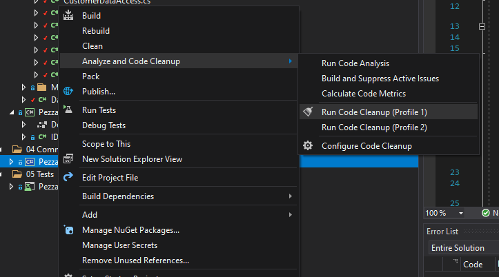
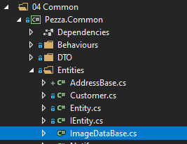
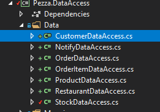
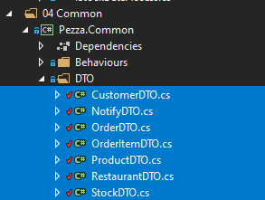
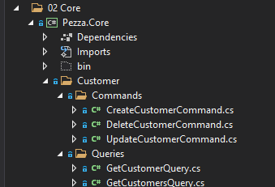
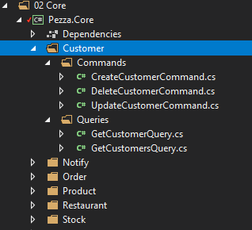

# &nbsp;**Pezza - Phase 2 - Step 1**

<br/><br/>

This Phase might feel a bit tedious, but it puts down a strong foundation to build off from for the entire incubator.

If at any point you are struggling you can reference Phase 2\src\02. EndSolution

## **Install Mediatr**

To help us with CQRS we will be using the Mediatr Nuget package. 

What is Mediatr?
In-process messaging with no dependencies.

Supports request/response, commands, queries, notifications and events, synchronous and async with intelligent dispatching via C# generic variance.

Install Mediatr on the Core Project and your Common Project


Install MediatR.Extensions.Microsoft.DependencyInjection on the Core Project.

## **Create the other database entities and update database context**

- [ ] To speed up entity generation you can use a CLI tool or create it manually
  - [ ] Create a new folder where entities and mapping be generated in
  - [ ] Open Command Line and change directory to the folder you created  - [ ] 
  - [ ] In CMD Run ```dotnet tool install --global EntityFrameworkCore.Generator```
  - [ ] In CMD Run ```efg generate -c "DB Connection String"```
  - [ ] Fix the generated namespaces and code cleanup. Right click on Pezza.Common <br/> 
  - [ ] or can copy it from Phase2\Data

### **Create Base Address**

This is for any DTO or Entity that has an address.


```cs
namespace Pezza.Common.Entities
{
    public class AddressBase
    {
        public string Address { get; set; }

        public string City { get; set; }

        public string Province { get; set; }

        public string PostalCode { get; set; }
    }
}
```


### **Create Image Data Base**

This is for any DTO or Entity that has an Image that needs to be created.



```cs
namespace Pezza.Common.Entities
{
    public class ImageDataBase
    {
        public string ImageData { get; set; }
    }
}
```

### **Entities**

Representing Database Tables Entities


### **DTO**

Create a Data Transfer Object with only the information the consumer of the data will need. This allows you to hide any sensitive data.

Remeber some of the DTO's needs to inherit from AddressBase and ImageDataBase.
- [ ] CustomerDTO
- [ ] RestaurantDTO
- [ ] ProductDTO


### **Unit Tests Test Data**


### **Database EFCore Maps**


### **Base DataAccess**

```cs
namespace Pezza.DataAccess.Contracts
{
    using System.Collections.Generic;
    using System.Threading.Tasks;

    public interface IDataAccess<T>
    {
        Task<T> GetAsync(int id);

        Task<List<T>> GetAllAsync();

        Task<T> UpdateAsync(T dto);

        Task<T> SaveAsync(T dto);

        Task<bool> DeleteAsync(int id);
    }
}
```

Remove IStockDataAccess.cs

!DataAccess Contracts Structure[](Assets/2020-10-04-20-36-09.png)

Convert StockDataAccess to inherit from IDataAccess.cs

```cs
namespace Pezza.DataAccess.Data
{
    using System.Collections.Generic;
    using System.Linq;
    using System.Linq.Dynamic.Core;
    using System.Threading.Tasks;
    using AutoMapper;
    using Microsoft.EntityFrameworkCore;
    using Pezza.Common.DTO;
    using Pezza.Common.Entities;
    using Pezza.DataAccess.Contracts;

    public class StockDataAccess : IDataAccess<StockDTO>
    {
        private readonly DatabaseContext databaseContext;

        private readonly IMapper mapper;

        public StockDataAccess(DatabaseContext databaseContext, IMapper mapper)
            => (this.databaseContext, this.mapper) = (databaseContext, mapper);

        public async Task<StockDTO> GetAsync(int id)
            => this.mapper.Map<StockDTO>(await this.databaseContext.Stocks.FirstOrDefaultAsync(x => x.Id == id));

        public async Task<List<StockDTO>> GetAllAsync()
        {
            var entities = await this.databaseContext.Stocks.Select(x => x).AsNoTracking().ToListAsync();
            return this.mapper.Map<List<StockDTO>>(entities);
        }

        public async Task<StockDTO> SaveAsync(StockDTO dto)
        {
            var entity = this.mapper.Map<Stock>(dto);
            this.databaseContext.Stocks.Add(entity);
            await this.databaseContext.SaveChangesAsync();
            dto.Id = entity.Id;

            return dto;

            return this.mapper.Map<StockDTO>(entity);
        }

        public async Task<StockDTO> UpdateAsync(StockDTO dto)
        {
            var findEntity = await this.databaseContext.Stocks.FirstOrDefaultAsync(x => x.Id == dto.Id);
            if (findEntity == null)
            {
                return null;
            }

            findEntity.Name = !string.IsNullOrEmpty(dto.Name) ? dto.Name : findEntity.Name;
            findEntity.UnitOfMeasure = !string.IsNullOrEmpty(dto.UnitOfMeasure) ? dto.UnitOfMeasure : findEntity.UnitOfMeasure;
            findEntity.ValueOfMeasure = dto.ValueOfMeasure ?? findEntity.ValueOfMeasure;
            findEntity.Quantity = dto.Quantity ?? findEntity.Quantity;
            findEntity.ExpiryDate = dto.ExpiryDate ?? findEntity.ExpiryDate;
            findEntity.Comment = dto.Comment;
            this.databaseContext.Stocks.Update(findEntity);
            await this.databaseContext.SaveChangesAsync();

            return this.mapper.Map<StockDTO>(findEntity);
        }

        public async Task<bool> DeleteAsync(int id)
        {
            var entity = await this.databaseContext.Stocks.FirstOrDefaultAsync(x => x.Id == id);
            if (entity == null)
            {
                return false;
            }

            this.databaseContext.Stocks.Remove(entity);
            var result = await this.databaseContext.SaveChangesAsync();

            return (result == 1);
        }
    }
}
```

Create DataAccess for all the Entities



### **Business Logic - Core**

We will be moving to CQRS pattern for the Core Layer. This helps Single Responsibility.

[CQRS Overview](https://docs.microsoft.com/en-us/azure/architecture/patterns/cqrs)

To help us out achieving this we will be using a Nuget Package - Mediatr

[Mediatr](https://github.com/jbogard/MediatR)

To create consistency with the result we send back from the Core layer we will utilize a Result.cs class. This helps to create unity between all Commands and Queries.


## **Common Models**

Copy MimeTypes.cs from Phase 2\Data\Common\Models


```cs
namespace Pezza.Common.Models
{
    using System.Collections.Generic;
    using System.Linq;

    public class Result
    {
        public Result()
        {
        }

        internal Result(bool succeeded, string error)
        {
            this.Succeeded = succeeded;

            this.Errors = new List<object>
            {
                error
            };
        }

        internal Result(bool succeeded, List<object> errors)
        {
            this.Succeeded = succeeded;
            this.Errors = errors;
        }

        internal Result(bool succeeded, List<string> errors)
        {
            this.Succeeded = succeeded;
            this.Errors = errors.ToList<object>();
        }

        public bool Succeeded { get; set; }

        public List<object> Errors { get; set; }

        public static Result Success() => new Result(true, new List<object> { });

        public static Result Failure(List<object> errors) => new Result(false, errors);

        public static Result Failure(List<string> errors) => new Result(false, errors);

        public static Result Failure(string error) => new Result(false, error);
    }

    public class Result<T>
    {
        internal Result(bool succeeded, string error)
        {
            this.Succeeded = succeeded;
            this.Errors = new List<object>
            {
                error
            };
        }

        internal Result(bool succeeded, List<object> errors)
        {
            this.Succeeded = succeeded;
            this.Errors = errors;
        }

        internal Result(bool succeeded, T data, List<object> errors)
        {
            this.Succeeded = succeeded;
            this.Errors = errors;
            this.Data = data;
        }

        public bool Succeeded { get; set; }

        public T Data { get; set; }

        public List<object> Errors { get; set; }

        public static Result<T> Success(T data) => new Result<T>(true, data, new List<object> { });

        public static Result<T> Failure(string error) => new Result<T>(false, error);

        public static Result<T> Failure(List<object> errors) => new Result<T>(false, errors);
    }

    public class ListResult<T>
    {
        internal ListResult(bool succeeded, string error)
        {
            this.Succeeded = succeeded;
            this.Errors = new List<object>
            {
                error
            };
        }

        internal ListResult(bool succeeded, List<object> errors)
        {
            this.Succeeded = succeeded;
            this.Errors = errors;
        }

        internal ListResult(bool succeeded, List<T> data, int count, List<object> errors)
        {
            this.Succeeded = succeeded;
            this.Errors = errors;
            this.Data = data;
            this.Count = count;
        }

        internal ListResult(bool succeeded, IEnumerable<T> data, int count, List<object> errors)
        {
            this.Succeeded = succeeded;
            this.Errors = errors;
            this.Data = data.ToList();
            this.Count = count;
        }

        public bool Succeeded { get; set; }

        public List<T> Data { get; set; }

        public List<object> Errors { get; set; }

        public int Count { get; set; }

        public static ListResult<T> Success(List<T> data, int count) => new ListResult<T>(true, data, count, new List<object> { });

        public static ListResult<T> Success(IEnumerable<T> data, int count) => new ListResult<T>(true, data, count, new List<object> { });

        public static ListResult<T> Failure(string error) => new ListResult<T>(false, error);

        public static ListResult<T> Failure(List<object> errors) => new ListResult<T>(false, errors);
    }

    public class ListOutcome<T>
    {
        public List<T> Data { get; set; }

        public int Count { get; set; }

        public List<string> Errors { get; set; }
    }
}
```


To something like this. Can also look at Phase 2\Data on how it suppose to look like.

```cs
namespace Pezza.Common.DTO
{
    using System;
    using Pezza.Common.Entities;

    public class ProductDTO : ImageDataBase
    {
        public int Id { get; set; }

        public string Name { get; set; }

        public string Description { get; set; }

        public string PictureUrl { get; set; }

        public decimal? Price { get; set; }

        public bool? Special { get; set; }

        public DateTime? OfferEndDate { get; set; }

        public decimal? OfferPrice { get; set; }

        public bool? IsActive { get; set; }

        public DateTime DateCreated { get; set; }
    }
}
```

## **DTO's**

Create DTO's that we will use in the calling projects for SOLID principal. Only send in data that is needed. Copy from Phase 2\Data\Common\DTO



## **Mapping**

In Pezza.Common ammend changes to the MappingProfile.cs. 

```cs
namespace Pezza.Common.Profiles
{
    using AutoMapper;
    using Pezza.Common.DTO;
    using Pezza.Common.Entities;

    public class MappingProfile : Profile
    {
        public MappingProfile()
        {
            this.CreateMap<Customer, CustomerDTO>()
                .ForMember(x => x.Address, x => x.MapFrom((src) => new AddressBase() { 
                    Address = src.Address,
                    City = src.City,
                    Province = src.Province,
                    PostalCode = src.PostalCode
                }))
                .ReverseMap();
            this.CreateMap<CustomerDTO, Customer>()
                .ForMember(vm => vm.Address, m => m.MapFrom(u => u.Address.Address))
                .ForMember(vm => vm.City, m => m.MapFrom(u => u.Address.City))
                .ForMember(vm => vm.Province, m => m.MapFrom(u => u.Address.Province))
                .ForMember(vm => vm.PostalCode, m => m.MapFrom(u => u.Address.PostalCode));

            this.CreateMap<Notify, NotifyDTO>();
            this.CreateMap<NotifyDTO, Notify>();

            this.CreateMap<Order, OrderDTO>()
                .ForMember(vm => vm.OrderItems, m => m.MapFrom(u => u.OrderItems));            
            this.CreateMap<OrderDTO, Order>()
                .ForMember(vm => vm.OrderItems, m => m.MapFrom(u => u.OrderItems));

            this.CreateMap<OrderItem, OrderItemDTO>();
            this.CreateMap<OrderItemDTO, OrderItem>();

            this.CreateMap<Product, ProductDTO>();
            this.CreateMap<ProductDTO, Product>();

            this.CreateMap<Restaurant, RestaurantDTO>()
                .ForMember(x => x.Address, x => x.MapFrom((src) => new AddressBase()
                {
                    Address = src.Address,
                    City = src.City,
                    Province = src.Province,
                    PostalCode = src.PostalCode
                }))
                .ReverseMap();
            this.CreateMap<RestaurantDTO, Restaurant>()
                .ForMember(vm => vm.Address, m => m.MapFrom(u => u.Address.Address))
                .ForMember(vm => vm.City, m => m.MapFrom(u => u.Address.City))
                .ForMember(vm => vm.Province, m => m.MapFrom(u => u.Address.Province))
                .ForMember(vm => vm.PostalCode, m => m.MapFrom(u => u.Address.PostalCode));

            this.CreateMap<Stock, StockDTO>();
            this.CreateMap<StockDTO, Stock>();
        }
    }
}
```

Modify Pezza.Api Startup.cs Configure Method. To be able to view images you will need to enable StaticFiles.

```cs
app.UseStaticFiles(new StaticFileOptions
{
    FileProvider = new PhysicalFileProvider(Path.Combine(Directory.GetCurrentDirectory(), @"Media")),
    RequestPath = new PathString("/Media"),
});
```

Create the following Commands for each Entity in Pezza.Core inside the Entity Name Folder/Commands <br/> 

- Create Command

```cs
namespace Pezza.Core.Customer.Commands
{
    using System.Threading;
    using System.Threading.Tasks;
    using MediatR;
    using Pezza.Common.DTO;
    using Pezza.Common.Models;
    using Pezza.DataAccess.Contracts;

    public partial class CreateCustomerCommand : IRequest<Result<CustomerDTO>>
    {
        public CustomerDTO Data { get; set; }
    }

    public class CreateCustomerCommandHandler : IRequestHandler<CreateCustomerCommand, Result<CustomerDTO>>
    {
        private readonly IDataAccess<CustomerDTO> DataAccess;

        public CreateCustomerCommandHandler(IDataAccess<CustomerDTO> DataAccess)
            => this.DataAccess = DataAccess;

        public async Task<Result<CustomerDTO>> Handle(CreateCustomerCommand request, CancellationToken cancellationToken)
        {
            var outcome = await this.DataAccess.SaveAsync(request.Data);
            return (outcome != null) ? Result<CustomerDTO>.Success(outcome) : Result<CustomerDTO>.Failure("Error creating a Customer");
        }
    }
}
```

- Delete Command

```cs
namespace Pezza.Core.Customer.Commands
{
    using System.Threading;
    using System.Threading.Tasks;
    using MediatR;
    using Pezza.Common.DTO;
    using Pezza.Common.Models;
    using Pezza.DataAccess.Contracts;

    public partial class DeleteCustomerCommand : IRequest<Result>
    {
        public int Id { get; set; }
    }

    public class DeleteCustomerCommandHandler : IRequestHandler<DeleteCustomerCommand, Result>
    {
        private readonly IDataAccess<CustomerDTO> DataAccess;

        public DeleteCustomerCommandHandler(IDataAccess<CustomerDTO> DataAccess)
            => this.DataAccess = DataAccess;

        public async Task<Result> Handle(DeleteCustomerCommand request, CancellationToken cancellationToken)
        {
            var outcome = await this.DataAccess.DeleteAsync(request.Id);

            return (outcome) ? Result.Success() : Result.Failure("Error deleting a Customer");
        }
    }
}
```

- Update Command

```cs
namespace Pezza.Core.Customer.Commands
{
    using System.Threading;
    using System.Threading.Tasks;
    using MediatR;
    using Pezza.Common.DTO;
    using Pezza.Common.Models;
    using Pezza.DataAccess.Contracts;

    public partial class UpdateCustomerCommand : IRequest<Result<CustomerDTO>>
    {
        public CustomerDTO Data { get; set; }
    }

    public class UpdateCustomerCommandHandler : IRequestHandler<UpdateCustomerCommand, Result<CustomerDTO>>
    {
        private readonly IDataAccess<CustomerDTO> DataAccess;

        public UpdateCustomerCommandHandler(IDataAccess<CustomerDTO> DataAccess) => this.DataAccess = DataAccess ?? throw new System.ArgumentNullException(nameof(DataAccess));

        public async Task<Result<CustomerDTO>> Handle(UpdateCustomerCommand request, CancellationToken cancellationToken)
        {            
            var outcome = await this.DataAccess.UpdateAsync(request.Data);
            return (outcome != null) ? Result<CustomerDTO>.Success(outcome) : Result<CustomerDTO>.Failure("Error updating a Customer");
        }
    }
}
```

If a property is not required and can be empty, don't enclose it in a shorthand if or coalescing.

```cs
findEntity.Description = request.Data?.Description;
```

Create the following Queries

-Get Single

```cs
namespace Pezza.Core.Customer.Queries
{
    using System.Threading;
    using System.Threading.Tasks;
    using MediatR;
    using Pezza.Common.DTO;
    using Pezza.Common.Models;
    using Pezza.DataAccess.Contracts;

    public class GetCustomerQuery : IRequest<Result<CustomerDTO>>
    {
        public int Id { get; set; }
    }

    public class GetCustomerQueryHandler : IRequestHandler<GetCustomerQuery, Result<CustomerDTO>>
    {
        private readonly IDataAccess<CustomerDTO> DataAccess;

        public GetCustomerQueryHandler(IDataAccess<CustomerDTO> DataAccess) => this.DataAccess = DataAccess;

        public async Task<Result<CustomerDTO>> Handle(GetCustomerQuery request, CancellationToken cancellationToken)
        {
            var search = await this.DataAccess.GetAsync(request.Id);
            return Result<CustomerDTO>.Success(search);
        }
    }
}
```

- Get All

```cs
namespace Pezza.Core.Customer.Queries
{
    using System.Threading;
    using System.Threading.Tasks;
    using MediatR;
    using Pezza.Common.DTO;
    using Pezza.Common.Models;
    using Pezza.DataAccess.Contracts;

    public class GetCustomersQuery : IRequest<ListResult<CustomerDTO>>
    {
    }

    public class GetCustomersQueryHandler : IRequestHandler<GetCustomersQuery, ListResult<CustomerDTO>>
    {
        private readonly IDataAccess<CustomerDTO> DataAccess;

        public GetCustomersQueryHandler(IDataAccess<CustomerDTO> DataAccess) => this.DataAccess = DataAccess;

        public async Task<ListResult<CustomerDTO>> Handle(GetCustomersQuery request, CancellationToken cancellationToken)
        {
            var search = await this.DataAccess.GetAllAsync();

            return ListResult<CustomerDTO>.Success(search, search.Count);
        }
    }
}
```

Core Project should look this when you are done.



Update DependencyInjection.cs - to include the new DataAccess and CQRS Classes

For MediatR Dependency Injection we need to create 3 Behaviour Classes inside Common

- PerformanceBehaviour.cs this will pick up any slow running queries

```cs
namespace Pezza.Common.Behaviours
{
    using System.Diagnostics;
    using System.Threading;
    using System.Threading.Tasks;
    using Pezza.Common.Interfaces;
    using MediatR;
    using Microsoft.Extensions.Logging;

    public class PerformanceBehaviour<TRequest, TResponse> : IPipelineBehavior<TRequest, TResponse>
    {
        private readonly Stopwatch timer;
        private readonly ILogger<TRequest> logger;
        private readonly ICurrentUserService currentUserService;
        private readonly IIdentityService identityService;

        public PerformanceBehaviour(
            ILogger<TRequest> logger,
            ICurrentUserService currentUserService,
            IIdentityService identityService)
        {
            this.timer = new Stopwatch();

            this.logger = logger;
            this.currentUserService = currentUserService;
            this.identityService = identityService;
        }

        public async Task<TResponse> Handle(TRequest request, CancellationToken cancellationToken, RequestHandlerDelegate<TResponse> next)
        {
            this.timer.Start();

            var response = await next();

            this.timer.Stop();

            var elapsedMilliseconds = this.timer.ElapsedMilliseconds;

            if (elapsedMilliseconds > 500)
            {
                var requestName = typeof(TRequest).Name;
                var userId = this.currentUserService.UserId ?? string.Empty;
                var userName = string.Empty;

                if (!string.IsNullOrEmpty(userId))
                {
                    userName = await this.identityService.GetUserNameAsync(userId);
                }

                this.logger.LogWarning("Pezza Long Running Request: {Name} ({ElapsedMilliseconds} milliseconds) {@UserId} {@UserName} {@Request}",
                    requestName, elapsedMilliseconds, userId, userName, request);
            }

            return response;
        }
    }
}
```

- UnhandledExceptionBehaviour.cs this will pick up any exceptions during the executio pipeline. 

```cs
namespace Pezza.Common.Behaviours
{
    using System;
    using System.Threading;
    using System.Threading.Tasks;
    using MediatR;
    using Microsoft.Extensions.Logging;

    public class UnhandledExceptionBehaviour<TRequest, TResponse> : IPipelineBehavior<TRequest, TResponse>
    {
        private readonly ILogger<TRequest> logger;

        public UnhandledExceptionBehaviour(ILogger<TRequest> logger) => this.logger = logger;

        public async Task<TResponse> Handle(TRequest request, CancellationToken cancellationToken, RequestHandlerDelegate<TResponse> next)
        {
            try
            {
                return await next();
            }
            catch (Exception ex)
            {
                var requestName = typeof(TRequest).Name;

                this.logger.LogError(ex, "Pezza Request: Unhandled Exception for Request {Name} {@Request}", requestName, request);

                throw;
            }
        }
    }
}
```

- ValidationBehavior.cs -Will be used in Phase 3 to pick up any validation that was added for Commands or Queries.

```cs
namespace Pezza.Common.Behaviours
{
    using System.Collections.Generic;
    using System.Linq;
    using System.Threading;
    using System.Threading.Tasks;
    using FluentValidation;
    using MediatR;

    public class ValidationBehavior<TRequest, TResponse> : IPipelineBehavior<TRequest, TResponse>
        where TRequest : IRequest<TResponse>
    {
        private readonly IEnumerable<IValidator<TRequest>> validators;

        public ValidationBehavior(IEnumerable<IValidator<TRequest>> validators) => this.validators = validators;

        public async Task<TResponse> Handle(TRequest request, CancellationToken cancellationToken, RequestHandlerDelegate<TResponse> next)
        {
            if (this.validators.Any())
            {
                var context = new ValidationContext<TRequest>(request);

                var validationResults = await Task.WhenAll(this.validators.Select(v => v.ValidateAsync(context, cancellationToken)));
                var failures = validationResults.SelectMany(r => r.Errors).Where(f => f != null);

                if (!failures.Any())
                {
                    throw new ValidationException(failures);
                }
            }
            return await next();
        }
    }
}
```

DependencyInjection.cs in Pezza.Core

```cs
namespace Pezza.Core
{
    using System.Reflection;
    using AutoMapper;
    using FluentValidation;
    using MediatR;
    using Microsoft.Extensions.DependencyInjection;
    using Pezza.Common.Behaviours;
    using Pezza.Common.DTO;
    using Pezza.Common.Profiles;
    using Pezza.DataAccess.Contracts;
    using Pezza.DataAccess.Data;

    public static class DependencyInjection
    {
        public static IServiceCollection AddApplication(this IServiceCollection services)
        {
            services.AddMediatR(Assembly.GetExecutingAssembly());
            services.AddAutoMapper(Assembly.GetExecutingAssembly());
            services.AddValidatorsFromAssembly(Assembly.GetExecutingAssembly());
            services.AddTransient(typeof(IPipelineBehavior<,>), typeof(ValidationBehavior<,>));
            services.AddTransient(typeof(IPipelineBehavior<,>), typeof(UnhandledExceptionBehaviour<,>));

            services.AddTransient(typeof(IDataAccess<OrderDTO>), typeof(OrderDataAccess));
            services.AddTransient(typeof(IDataAccess<StockDTO>), typeof(StockDataAccess));
            services.AddTransient(typeof(IDataAccess<NotifyDTO>), typeof(NotifyDataAccess));
            services.AddTransient(typeof(IDataAccess<ProductDTO>), typeof(ProductDataAccess));
            services.AddTransient(typeof(IDataAccess<CustomerDTO>), typeof(CustomerDataAccess));
            services.AddTransient(typeof(IDataAccess<RestaurantDTO>), typeof(RestaurantDataAccess));

            services.AddAutoMapper(typeof(MappingProfile));

            return services;
        }
    }
}
```

### **Remove Core.Contracts Project**


## **STEP 2 - Unit Tests**

Move to Step 2
[Click Here](https://github.com/entelect-incubator/.NET/tree/master/Phase%202/Step%202)