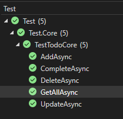

# &nbsp;**E List - Phase 2 - Step 2**

<br/><br/>

Unit testing

## **Unit Tests**

Update the test data to align with the new models. Ensure that the test cases reflect the structure of the TodoModel, CreateTodoModel, and UpdateTodoModel to accurately test the functionality of the commands and queries with the new models.

```cs
using Common.Models.Todos;

namespace Test.Setup.TestData.Pizza;

public static class TodoTestData
{
	public static Faker faker = new();

	public static Todo Todo = new()
	{
		Id = 1,
		Task = faker.Random.Word(),
		IsCompleted = false,
		DateCreated = DateTime.UtcNow,
		SessionId = Guid.NewGuid(),
	};

	public static TodoModel TodoModel = new()
	{
		Id = 1,
		Task = faker.Random.Word(),
		IsCompleted = false,
		DateCreated = DateTime.UtcNow,
		SessionId = Guid.NewGuid(),
	};

	public static CreateTodoModel CreateTodoModel = new()
	{
		Task = faker.Random.Word(),
		IsCompleted = false,
		SessionId = Guid.NewGuid(),
	};

	public static UpdateTodoModel UpdateTodoModel = new()
	{
		Task = faker.Random.Word(),
	};
}
```

We will now enhance our Core unit tests to cover the new CQRS commands and queries.

For this, each test will utilize a handler with an in-memory DbContext. We will declare a new handler for each test and inject the DbContext into it. For example:

```cs
var sutCreate = new CreateTodoCommandHandler(this.Context);
```

We will then test the command or query handler using the test data created earlier. This approach ensures that each command and query is tested independently and consistently.

TestTodoCore.cs in Core folder

```cs
namespace Test.Core;

using Common.Models.Todos;
using global::Core.Todos.Commands;
using global::Core.Todos.Queries;
using Test.Setup.TestData.Pizza;

[TestFixture]
public class TestTodoCore : QueryTestBase
{
	private TodoModel model;

	[OneTimeSetUp]
	public async Task Init()
	{
		var sutCreate = new AddTodoCommandHandler(this.Context);
		var resultCreate = await sutCreate.Handle(
			new AddTodoCommand
			{
				Data = TodoTestData.CreateTodoModel
			}, CancellationToken.None);

		if (!resultCreate.Succeeded)
		{
			Assert.Fail();
		}

		this.model = resultCreate.Data;
	}

	[Test, Order(1)]
	public void AddAsync()
	{
		var outcome = this.model.Id != 0;
		Assert.That(outcome, Is.True);
	}

	[Test, Order(2)]
	public async Task GetAllAsync()
	{
		var sutGetAll = new GetTodosQueryHandler(this.Context);
		var resultGetAll = await sutGetAll.Handle(new GetTodosQuery()
		{
			SessionId = this.model.SessionId,
		}, CancellationToken.None);

		Assert.That(resultGetAll.Succeeded, Is.True);
		Assert.That(resultGetAll.Data.Count, Is.EqualTo(1));
	}

	[Test, Order(3)]
	public async Task CompleteAsync()
	{
		var sutUpdate = new CompleteTodoCommandHandler(this.Context);
		var resultUpdate = await sutUpdate.Handle(
			new CompleteTodoCommand
			{
				Id = this.model.Id,
			}, CancellationToken.None);

		Assert.That(resultUpdate.Succeeded, Is.True);
		Assert.That(resultUpdate.Data?.IsCompleted, Is.True);
	}

	[Test, Order(4)]
	public async Task UpdateAsync()
	{
		var sutUpdate = new UpdateTodoCommandHandler(this.Context);
		var resultUpdate = await sutUpdate.Handle(
			new UpdateTodoCommand
			{
				Id = this.model.Id,
				Data = TodoTestData.UpdateTodoModel
			}, CancellationToken.None);

		Assert.That(resultUpdate.Succeeded, Is.True);
	}

	[Test, Order(5)]
	public async Task DeleteAsync()
	{
		var sutDelete = new DeleteTodoCommandHandler(this.Context);
		var resultDelete = await sutDelete.Handle(
			new DeleteTodoCommand
			{
				Id = this.model.Id,
			}, CancellationToken.None);

		Assert.That(resultDelete.Succeeded, Is.True);
	}
}
```

To run the test go to the top Menu bar -> Test -> Run All Tests. This will open the Test Explorer.



You should now have all Unit Tests pass.

## **STEP 3 - Finishing up the API to use CQRS**

Move to Step 3 [Click Here](https://github.com/entelect-incubator/.NET/tree/master/Phase%202/Step%203)
