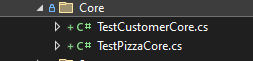

# &nbsp;**Pezza - Phase 2 - Step 2**

<br/><br/>

Unit testing

## **Unit Tests**

Add CustomerTestData.cs to test Project Test Data.


```cs
namespace Test.Setup.TestData.Customer;

using Bogus;
using Common.Entities;
using Common.Models;

public static class CustomerTestData
{
	public static Faker faker = new("en_ZA");

	public static Customer Customer = new()
	{
		Id = 1,
		Name = faker.Person.FullName,
		Address = faker.Address.FullAddress(),
		Cellphone = faker.Phone.PhoneNumber(),
		Email = faker.Person.Email,
		DateCreated = DateTime.Now,
	};

	public static CustomerModel CustomerModel = new()
	{
		Id = 1,
		Name = faker.Person.FullName,
		Address = faker.Address.FullAddress(),
		Cellphone = faker.Phone.PhoneNumber(),
		Email = faker.Person.Email,
		DateCreated = DateTime.Now,
	};
}
```

### **Testing Core Layer**

Create a Folder in the Test Project called **Core**. Create a Test Core Class for every Entity.


We will test every method inside of the Core class - GetAsync, GetAllAsync, SaveAsync, UpdateAsync and DeleteAsync. The class will inherit from QueryTestBase created earlier.We will test every method inside of the Core class - GetAsync, GetAllAsync, SaveAsync, UpdateAsync and DeleteAsync. The class will inherit from QueryTestBase created earlier.

Every test method will start with [Test], this indicates it as a Unit Test. Every Test class will have an attribute [TestFixture] at the top. We will use [SetUp] to intialize our handlers or data access layer and resue it in every test.

It will contain a new Handler with the In Memory DBContext.

 We will declare a new Handler for every test and inject the DbContext into it. i.e. var sutCreate = new CreateCustomerCommandHandler(this.Context);

 Then we will test the Command or Query Handler with the Test Data created earlier i.e. var resultCreate = await sutCreate.Handle(new CreateCustomerCommand
            {
                Data = CustomerTestData.CustomerDataDTO
            }, CancellationToken.None);

 Next we will test the the result.


TestCustomerCore.cs in Core folder

```cs
namespace Test.Core;

using System.Threading;
using System.Threading.Tasks;
using Common.Models;
using global::Core.Customer.Commands;
using global::Core.Customer.Queries;
using NUnit.Framework;
using Test.Setup;
using Test.Setup.TestData.Customer;
using static global::Core.Customer.Commands.CreateCustomerCommand;
using static global::Core.Customer.Commands.DeleteCustomerCommand;
using static global::Core.Customer.Commands.UpdateCustomerCommand;
using static global::Core.Customer.Queries.GetCustomerQuery;
using static global::Core.Customer.Queries.GetCustomersQuery;

[TestFixture]
public class TestCustomerCore : QueryTestBase
{
	private CustomerModel model;

	[SetUp]
	public async Task Init()
	{
		this.model = CustomerTestData.CustomerModel;
		var sutCreate = new CreateCustomerCommandHandler(this.Context);
		var resultCreate = await sutCreate.Handle(
			new CreateCustomerCommand
			{
				Data = new CreateCustomerModel
				{
					Name = this.model.Name,
					Email= this.model.Email,
					Address = this.model.Address,
					Cellphone= this.model.Cellphone
				}
			}, CancellationToken.None);

		if (!resultCreate.Succeeded)
		{
			Assert.IsTrue(false);
		}

		this.model = resultCreate.Data;
	}

	[Test]
	public async Task GetAsync()
	{
		var sutGet = new GetCustomerQueryHandler(this.Context);
		var resultGet = await sutGet.Handle(
			new GetCustomerQuery
			{
				Id = this.model.Id
			}, CancellationToken.None);

		Assert.IsTrue(resultGet?.Data != null);
	}

	[Test]
	public async Task GetAllAsync()
	{
		var sutGetAll = new GetCustomersQueryHandler(this.Context);
		var resultGetAll = await sutGetAll.Handle(new GetCustomersQuery(), CancellationToken.None);

		Assert.IsTrue(resultGetAll?.Data.Count == 1);
	}

	[Test]
	public void SaveAsync() => Assert.IsTrue(this.model != null);

	[Test]
	public async Task UpdateAsync()
	{
		var sutUpdate = new UpdateCustomerCommandHandler(this.Context);
		var resultUpdate = await sutUpdate.Handle(
			new UpdateCustomerCommand
			{
				Id = this.model.Id,
				Data = new UpdateCustomerModel
				{					
					Cellphone = "0721230000"
				}
			}, CancellationToken.None);

		Assert.IsTrue(resultUpdate.Succeeded);
	}

	[Test]
	public async Task DeleteAsync()
	{
		var sutDelete = new DeleteCustomerCommandHandler(this.Context);
		var outcomeDelete = await sutDelete.Handle(
			new DeleteCustomerCommand
			{
				Id = this.model.Id
			}, CancellationToken.None);

		Assert.IsTrue(outcomeDelete.Succeeded);
	}
}
```

Create the Core Unit Test classes now, when you are done it should look like this.



To run the test go to the top Menu bar -> Test -> Run All Tests. This will open the Test Explorer.


You should now have 64 Passed Unit Tests


## **STEP 3 - Finishing up the API to use CQRS**

Move to Step 3
[Click Here](https://github.com/entelect-incubator/.NET/tree/master/Phase%202/Step%203)