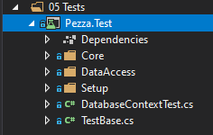
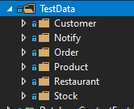
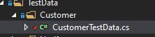
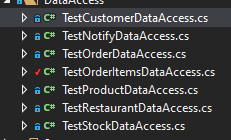
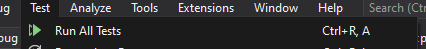

# &nbsp;**Pezza - Phase 2 - Step 2**

<br/><br/>

Unit testing

## **Unit Tests**

Create a New Solution Folder `05 Tests` inside create a new project NUnit Test Project.


The project at the end will look like this



Test Data for our tests. Staying with **Single Responsibility** we want to create a Test Class for every Entity or DTO. Create a folder for every Entity in the Database.



CustomerTestData.cs - We will use Bogus package to help us out in creating Test Data, by creating a Faker Object. You will end up with 3 functions i.e. Entity, DTO and DTOData, the same as you did for StockTestData.



```cs
namespace Pezza.Test
{
    using System;
    using Bogus;
    using Pezza.Common.DTO;
    using Pezza.Common.Entities;

    public static class CustomerTestData
    {
        public static Faker faker = new Faker();

        public static CustomerDTO CustomerDTO = new CustomerDTO()
        {
            ContactPerson = faker.Person.FullName,
            Email = faker.Person.Email,
            Phone = faker.Person.Phone,
            Address = new AddressBase
            {
                Address = faker.Address.FullAddress(),
                City = faker.Address.City(),
                Province = faker.Address.State(),
                PostalCode = faker.Address.PostalCode(),
            },
            DateCreated = DateTime.Now
        };
    }

}
```

OrderTestData is a bit different, because of Orders having Order Items.

```cs
namespace Pezza.Test
{
    using System;
    using System.Collections.Generic;
    using Bogus;
    using Pezza.Common.DTO;

    public static class OrderTestData
    {
        public static Faker faker = new Faker();

        public static List<OrderDTO> OrdersDTO()
        {
            var orders = new List<OrderDTO>
            {
                OrderDTO,
                OrderDTO,
                OrderDTO,
                OrderDTO,
                OrderDTO
            };

            return orders;
        }

        public static OrderDTO OrderDTO = new OrderDTO()
        {
            Amount = faker.Finance.Amount(),
            Customer = CustomerTestData.CustomerDTO,
            CustomerId = 1,
            Restaurant = RestaurantTestData.RestaurantDTO,
            RestaurantId = 1,
            DateCreated = DateTime.Now,
            Completed = false,
            OrderItems = new List<OrderItemDTO>
            {
                new OrderItemDTO()
                {
                    OrderId = 1,
                    Product = ProductTestData.ProductDTO
                }
            }
        };

        public static OrderItemDTO OrderItemDTO = new OrderItemDTO()
        {
            OrderId = 1,
            Product = ProductTestData.ProductDTO
        };
    }

}

```

Create a Test Data Class for every entity or you can copy it from Phase2/Data.

### **Testing Data Access Layer**

Create a Folder in the Test Project called **DataAccess**. Create a Test Data Access Class for every Entity.


We will test every method inside of the DataAccess class - GetAsync, GetAllAsync, SaveAsync, UpdateAsync and DeleteAsync. The class will inherit from QueryTestBase created earlier.

Every test method will start with [Test], this indicates it as a Unit Test.

It will contain a new Handler declaring a new DataAccess object with the In Memory DBContext. i.e. var handler = new CustomerDataAccess(this.Context);

 The entity passed will be from the Test Data created earlier. i.e.  var entity = CustomerTestData.Customer;

 Next we will Unit Test the Database Call and test the result i.e await handler.SaveAsync(entity);

 This is building on for what was done for TestStockDataAccess

TestCustomerDataAccess.cs

```cs
namespace Pezza.Test.DataAccess
{
    using System.Threading.Tasks;
    using Bogus;
    using NUnit.Framework;
    using Pezza.Common.DTO;
    using Pezza.DataAccess.Data;

    [TestFixture]

    public class TestCustomerDataAccess : QueryTestBase
    {
        private CustomerDataAccess handler;

        private CustomerDTO dto;

        [SetUp]
        public async Task SetUp()
        {
            this.handler = new CustomerDataAccess(this.Context, Mapper());
            this.dto = CustomerTestData.CustomerDTO;
            this.dto = await this.handler.SaveAsync(this.dto);
        }

        [Test]
        public async Task GetAsync()
        {
            var response = await this.handler.GetAsync(this.dto.Id);
            Assert.IsTrue(response != null);
        }

        [Test]
        public async Task GetAllAsync()
        {
            var response = await this.handler.GetAllAsync();
            var outcome = response.Count;

            Assert.IsTrue(outcome == 1);
        }

        [Test]
        public void SaveAsync()
        {
            Assert.IsTrue(this.dto.Id != 0);
        }

        [Test]
        public async Task UpdateAsync()
        {
            var originalCustomer = this.dto;
            this.dto.Name = new Faker().Person.FirstName;
            var response = await this.handler.UpdateAsync(this.dto);
            var outcome = response.Name.Equals(originalCustomer.Name);

            Assert.IsTrue(outcome);
        }

        [Test]
        public async Task DeleteAsync()
        {
            var response = await this.handler.DeleteAsync(this.dto.Id);
            Assert.IsTrue(response);
        }
    }
}
```

Create a DataAccess test for every Entity



### **Testing Core Layer**

Create a Folder in the Test Project called **Core**. Create a Test Core Class for every Entity.


We will test every method inside of the Core class - GetAsync, GetAllAsync, SaveAsync, UpdateAsync and DeleteAsync. The class will inherit from QueryTestBase created earlier.We will test every method inside of the Core class - GetAsync, GetAllAsync, SaveAsync, UpdateAsync and DeleteAsync. The class will inherit from QueryTestBase created earlier.

Every test method will start with [Test], this indicates it as a Unit Test. Every Test class will have an attribute [TestFixture] at the top. We will use [SetUp] to intialize our handlers or data access layer and resue it in every test.

It will contain a new Handler declaring a new DataAccess object with the In Memory DBContext and AutoMapper. i.e. var handler = new CustomerDataAccess(this.Context, Mapper());

 We will declare a new Handler for every test and inject the DataAccess into it. i.e. var sutCreate = new CreateCustomerCommandHandler(dataAccess);

 Then we will test the Command or Query Handler with the Test Data created earlier i.e. var resultCreate = await sutCreate.Handle(new CreateCustomerCommand
            {
                Data = CustomerTestData.CustomerDataDTO
            }, CancellationToken.None);

 Next we will test the the result.


TestCustomerCore.cs in Core folder

```cs
namespace Pezza.Test.Core
{
    using System.Threading;
    using System.Threading.Tasks;
    using NUnit.Framework;
    using Pezza.Common.DTO;
    using Pezza.Core.Customer.Commands;
    using Pezza.Core.Customer.Queries;
    using Pezza.DataAccess.Data;

    [TestFixture]
    public class TestCustomerCore : QueryTestBase
    {
        private CustomerDataAccess dataAccess;

        private CustomerDTO dto;

        [SetUp]
        public async Task SetUp()
        {
            this.dataAccess = new CustomerDataAccess(this.Context, Mapper());
            this.dto = CustomerTestData.CustomerDTO;
            var sutCreate = new CreateCustomerCommandHandler(this.dataAccess);
            var resultCreate = await sutCreate.Handle(new CreateCustomerCommand
            {
                Data = this.dto
            }, CancellationToken.None);

            if (!resultCreate.Succeeded)
            {
                Assert.IsTrue(false);
            }

            this.dto = resultCreate.Data;
        }

        [Test]
        public async Task GetAsync()
        {
            var sutGet = new GetCustomerQueryHandler(this.dataAccess);
            var resultGet = await sutGet.Handle(new GetCustomerQuery
            {
                Id = this.dto.Id
            }, CancellationToken.None);

            Assert.IsTrue(resultGet?.Data != null);
        }

        [Test]
        public async Task GetAllAsync()
        {
            var sutGetAll = new GetCustomersQueryHandler(this.dataAccess);
            var resultGetAll = await sutGetAll.Handle(new GetCustomersQuery(), CancellationToken.None);

            Assert.IsTrue(resultGetAll?.Data.Count == 1);
        }

        [Test]
        public void SaveAsync()
        {
            Assert.IsTrue(this.dto != null);
        }

        [Test]
        public async Task UpdateAsync()
        {
            var sutUpdate = new UpdateCustomerCommandHandler(this.dataAccess);
            var resultUpdate = await sutUpdate.Handle(new UpdateCustomerCommand
            {
                Data = new CustomerDTO
                {
                    Id = this.dto.Id,
                    Phone = "0721230000"
                }
            }, CancellationToken.None);

            Assert.IsTrue(resultUpdate.Succeeded);
        }

        [Test]
        public async Task DeleteAsync()
        {
            var sutDelete = new DeleteCustomerCommandHandler(this.dataAccess);
            var outcomeDelete = await sutDelete.Handle(new DeleteCustomerCommand
            {
                Id = this.dto.Id
            }, CancellationToken.None);

            Assert.IsTrue(outcomeDelete.Succeeded);
        }
    }
}
```

Create the Core Unit Test classes now, when you are done it should look like this.


To run the test go to the top Menu bar -> Test -> Run All Tests. This will open the Test Explorer.



You should now have 64 Passed Unit Tests


## **STEP 3 - Finishing up the API to use CQRS**

Move to Step 3
[Click Here](https://github.com/entelect-incubator/.NET/tree/master/Phase%202/Step%203)