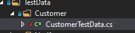
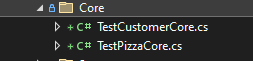
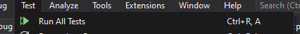



# &nbsp;**Pezza - Phase 2 - Step 2**

<br/><br/>

Unit testing

## **Unit Tests**

Add CustomerTestData.cs to test Project Test Data.



```cs
namespace Test.Setup.TestData.Customer;

public static class CustomerTestData
{
	public static Faker faker = new("en_ZA");

	public static Common.Entities.Customer Customer = new()
	{
		Id = 1,
		Name = faker.Person.FullName,
		Address = faker.Address.FullAddress(),
		Cellphone = faker.Phone.PhoneNumber(),
		Email = faker.Person.Email,
		DateCreated = DateTime.Now,
	};

	public static CustomerModel CustomerModel = new()
	{
		Id = 1,
		Name = faker.Person.FullName,
		Address = faker.Address.FullAddress(),
		Cellphone = faker.Phone.PhoneNumber(),
		Email = faker.Person.Email,
		DateCreated = DateTime.Now,
	};
}
```

### **Testing Core Layer**

## Step 2: Unit Testing

**Difficulty**: ★★★☆☆ (Intermediate)  
**Estimated Time**: 1.5 - 2 hours  
**Prerequisites**: 
- Completed Step 1 scaffolding
- Understanding of NUnit and unit testing basics
- QueryTestBase foundation from Phase 2 starter

### Learning Outcomes
After completing this step, you will understand:
- Creating test data with Faker for realistic scenarios
- Testing handler classes with in-memory DbContext
- Using [TestFixture] and [SetUp] attributes
- Testing CRUD operations (create, read, update, delete)
- Implementing modern Assert.That() syntax for assertions

---

### Testing Core Layer

Create a Folder in the Test Project called **Core**. Create a Test Core Class for every Entity.

We will test every method inside of the Core class - GetAsync, GetAllAsync, SaveAsync, UpdateAsync and DeleteAsync. The class will inherit from QueryTestBase created earlier.

Every test method will start with [Test], this indicates it as a Unit Test. Every Test class will have an attribute [TestFixture] at the top. We will use [SetUp] to initialise our handlers or data access layer and reuse it in every test.

We will declare a new Handler for every test and inject the DbContext into it:

```cs
var sutCreate = new CreateCustomerCommandHandler(this.Context);
```

Then we will test the Command or Query Handler with the Test Data created earlier:

```cs
var resultCreate = await sutCreate.Handle(
    new CreateCustomerCommand
    {
        Data = CustomerTestData.CustomerModel
    }, 
    CancellationToken.None);
```

Next we will test the result with modern assertions.

TestCustomerCore.cs in Core folder

```cs
namespace Test.Core;

using global::Core.Customer.Commands;
using global::Core.Customer.Queries;
using Test.Setup.TestData.Customer;
using static global::Core.Customer.Commands.CreateCustomerCommand;
using static global::Core.Customer.Commands.DeleteCustomerCommand;
using static global::Core.Customer.Commands.UpdateCustomerCommand;
using static global::Core.Customer.Queries.GetCustomerQuery;
using static global::Core.Customer.Queries.GetCustomersQuery;

[TestFixture]
public class TestCustomerCore : QueryTestBase
{
	private CustomerModel model;

	[SetUp]
	public async Task Init()
	{
		this.model = CustomerTestData.CustomerModel;
		var sutCreate = new CreateCustomerCommandHandler(this.Context);
		var resultCreate = await sutCreate.Handle(
			new CreateCustomerCommand
			{
				Data = new CreateCustomerModel
				{
					Name = this.model.Name,
					Email= this.model.Email,
					Address = this.model.Address,
					Cellphone= this.model.Cellphone
				}
			}, CancellationToken.None);

		if (!resultCreate.Succeeded)
		{
			Assert.That(false, Is.True);
		}

		this.model = resultCreate.Data;
	}

	[Test]
	public async Task GetAsync()
	{
		var sutGet = new GetCustomerQueryHandler(this.Context);
		var resultGet = await sutGet.Handle(
			new GetCustomerQuery
			{
				Id = this.model.Id
			}, CancellationToken.None);

		Assert.That(resultGet?.Data , Is.Not.Null);
	}

	[Test]
	public async Task GetAllAsync()
	{
		var sutGetAll = new GetCustomersQueryHandler(this.Context);
		var resultGetAll = await sutGetAll.Handle(new GetCustomersQuery(), CancellationToken.None);

		Assert.That(resultGetAll?.Data.Count , Is.EqualTo(1));
	}

	[Test]
	public void SaveAsync() => Assert.That(this.model , Is.Not.Null);

	[Test]
	public async Task UpdateAsync()
	{
		var sutUpdate = new UpdateCustomerCommandHandler(this.Context);
		var resultUpdate = await sutUpdate.Handle(
			new UpdateCustomerCommand
			{
				Id = this.model.Id,
				Data = new UpdateCustomerModel
				{					
					Cellphone = "0721230000"
				}
			}, CancellationToken.None);

		Assert.That(resultUpdate.Succeeded, Is.True);
	}

---

## Summary

You have successfully completed Step 2! Your unit tests now cover all CRUD operations for your handlers using an in-memory database context.

The test structure you've implemented - using [TestFixture], [SetUp], test data, and modern Assert.That() syntax - is industry-standard and will serve as a foundation for testing throughout the remaining phases.

### What You've Accomplished
- ✅ Created test data with Faker for realistic test scenarios
- ✅ Implemented [TestFixture] and [SetUp] attributes for test organization
- ✅ Built handlers with in-memory DbContext for isolated testing
- ✅ Tested create, read, update, and delete operations
- ✅ Used modern Assert.That() constraints for clear assertions

### Best Practices You've Applied
- Test one thing per test method with clear naming
- Use [SetUp] to initialize shared test data and handlers
- Create builders for complex test scenarios
- Assert both success and failure cases
- Keep tests focused and readable

### Next Step
Move to Step 3 to implement your API controllers and connect them to your tested handlers via MediatR!
	[Test]
	public async Task DeleteAsync()
	{
		var sutDelete = new DeleteCustomerCommandHandler(this.Context);
		var outcomeDelete = await sutDelete.Handle(
			new DeleteCustomerCommand
			{
				Id = this.model.Id
			}, CancellationToken.None);

		Assert.That(outcomeDelete.Succeeded, Is.True);
	}
}
```

Create the PizzaCore Unit Test classes now, when you are done it should look like this.



To run the test go to the top Menu bar -> Test -> Run All Tests. This will open the Test Explorer.



You should now have all Unit Tests pass.

## **STEP 3 - Finishing up the API to use CQRS**

Move to Step 3
[Click Here](https://github.com/entelect-incubator/.NET/tree/master/Phase%202/Step%203)