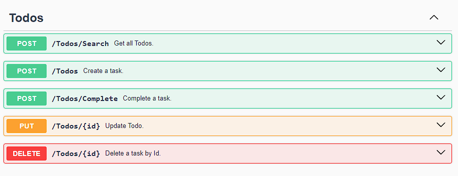

# &nbsp;**E List - Phase 2 - Step 3**

<br/><br/>

Finalizing the API Implementation with CQRS

We are now completing the API by fully integrating the CQRS pattern. This involves refactoring the API endpoints to utilize separate command and query handlers, ensuring a clear separation of responsibilities and improved maintainability.

## **API**

### **Base Api Controller** Will be used to inject Mediatr into all other Controllers


ApiController.cs

```cs
namespace Api.Controllers;

using MediatR;

[ApiController]
[Route("[controller]")]
[Produces("application/json")]
public abstract class ApiController : ControllerBase
{
    private IMediator mediator;

	protected IMediator Mediator => this.mediator ??= this.HttpContext.RequestServices.GetService<IMediator>()!;
}
```

To provide clean, unified responses to the consumers of the API, we will introduce an ActionResult helper class. This helper will manage the HTTP responses based on the data retrieved from the Core layer, reducing code duplication across controllers.

Create a Helpers folder in the Api project, and inside it, add a file named ResponseHelper.cs with the following code:

```cs
namespace Api.Helpers;

using Api.Controllers;

public static class ResponseHelper
{
	public static ActionResult ResponseOutcome(Result result, ApiController controller)
		=> !result.Succeeded ? controller.BadRequest(result) : controller.Ok(result);

	public static ActionResult ResponseOutcome<T>(Result<T> result, ApiController controller)
	{
		if (result.Data is null)
		{
			return controller.NotFound(Result.Failure($"{typeof(T).Name.Replace("Model", string.Empty)} not found"));
		}

		return !result.Succeeded ? controller.BadRequest(result) : controller.Ok(result);
	}
}
```

## **Finishing the Todo API Controller**

Now let's modify the Todo Controller to use Mediatr.

Inherit from the ApiController instead of ControllerBase

```cs
public class TodoController : ApiController
```

Modify all the functions to use Mediatr and the new DataDTO's

```cs
namespace Api.Controllers;

using Api.Helpers;
using Common.Models.Todos;
using Core.Todos.Commands;
using Core.Todos.Queries;
using Microsoft.AspNetCore.Mvc;

[ApiController]
[Route("[controller]")]
public class TodosController : ApiController
{
	/// <summary>
	/// Get all Todos.
	/// </summary>
	/// <returns>ActionResult</returns>
	[HttpPost("Search")]
	[ProducesResponseType(200)]
	public async Task<ActionResult> Search(Guid sessionId, CancellationToken cancellationToken = default)
		=> ResponseHelper.ResponseOutcome(await this.Mediator.Send(new GetTodosQuery() { SessionId = sessionId }, cancellationToken), this);

	/// <summary>
	/// Create a task.
	/// </summary>
	/// <remarks>
	/// Sample request:
	///
	///     POST api/Todo
	///     {
	///       "task": "New task",
	///     }
	/// </remarks>
	/// <param name="model">Create Todo Model</param>
	/// <param name="cancellationToken">Cancellation Token</param>
	/// <returns>ActionResult</returns>
	[HttpPost]
	[ProducesResponseType(200)]
	[ProducesResponseType(400)]
	public async Task<ActionResult<Todo>> Add([FromBody] CreateTodoModel model, CancellationToken cancellationToken = default)
		=> ResponseHelper.ResponseOutcome(await this.Mediator.Send(new AddTodoCommand() { Data = model }, cancellationToken), this);

	/// <summary>
	/// Complete a task.
	/// </summary>
	/// <remarks>
	/// Sample request:
	///
	///     PUT api/Todo/Complete
	///     {
	///       "id": "1"
	///     }
	/// </remarks>
	/// <param name="id">Task id</param>
	/// <param name="cancellationToken">Cancellation Token</param>
	/// <returns>ActionResult</returns>
	[HttpPost("Complete")]
	[ProducesResponseType(200)]
	[ProducesResponseType(400)]
	public async Task<ActionResult> Complete([FromBody] int id, CancellationToken cancellationToken = default)
		=> ResponseHelper.ResponseOutcome(await this.Mediator.Send(new CompleteTodoCommand() { Id = id }, cancellationToken), this);


	/// <summary>
	/// Update Todo.
	/// </summary>
	/// <remarks>
	/// Sample request:
	///
	///     PUT api/Todo/1
	///     {
	///       "Task": "New task"
	///     }
	/// </remarks>
	/// <param name="id">Todo id</param>
	/// <param name="model">Update Todo Model</param>
	/// <param name="cancellationToken">Cancellation Token</param>
	/// <returns>ActionResult</returns>
	[HttpPut("{id}")]
	[ProducesResponseType(200)]
	[ProducesResponseType(400)]
	public async Task<ActionResult> Update(int id, [FromBody] UpdateTodoModel model, CancellationToken cancellationToken = default)
		=> ResponseHelper.ResponseOutcome(await this.Mediator.Send(new UpdateTodoCommand() { Id = id, Data = model }, cancellationToken), this);

	/// <summary>
	/// Delete a task by Id.
	/// </summary>
	/// <param name="id">Task Id</param>
	/// <param name="cancellationToken">Cancellation Token</param>
	/// <returns>ActionResult</returns>
	[HttpDelete("{id}")]
	[ProducesResponseType(200)]
	[ProducesResponseType(400)]
	public async Task<ActionResult> Delete(int id, CancellationToken cancellationToken = default)
		=> ResponseHelper.ResponseOutcome(await this.Mediator.Send(new DeleteTodoCommand() { Id = id }, cancellationToken), this);
}
```

Press F5 to run your API. You should see the following output or a similar result.



## **Move to Phase 3**

[Click Here](https://github.com/entelect-incubator/.NET/tree/master/Phase%203)
