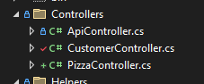
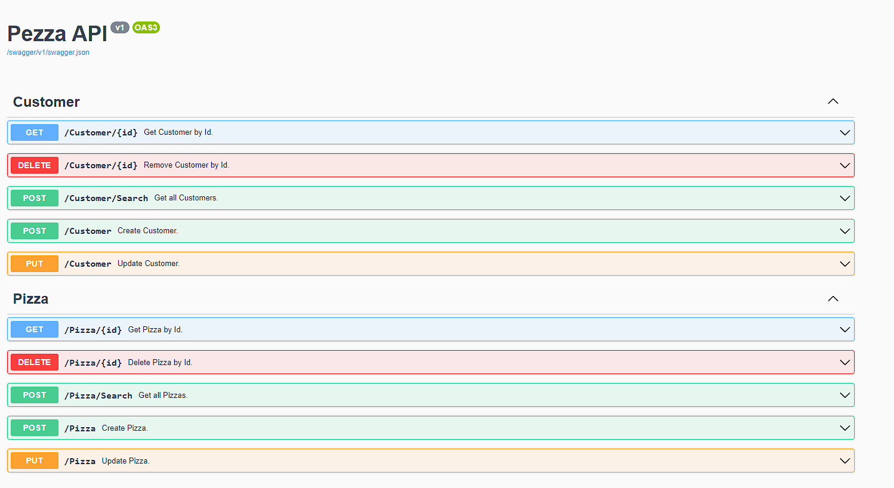

# &nbsp;**Pezza - Phase 2 - Step 3**

<br/><br/>

Finishing up the API to use CQRS

## **API**

In order to return clean unified responses consumers of the API, ActionResult Helper class. Depending on the data retrieved from the Core layer it will cater for the HTTP response and prevent duplicating code in controllers.

Create a Helpers folder in Api and ResponseHelper.cs inside it with the following code.

```cs
namespace Api.Helpers;

public static class ResponseHelper
{
    public static ActionResult ResponseOutcome<T>(Result<T> result, ApiController controller)
    {
        if (result.Data == null)
        {
            return controller.NotFound(Result.Failure($"{typeof(T).Name.Replace("Model", string.Empty)} not found"));
        }

        if (!result.Succeeded)
        {
            return controller.BadRequest(result);
        }

        return controller.Ok(result);
    }

    public static ActionResult ResponseOutcome<T>(ListResult<T> result, ApiController controller)
    {
        if (!result.Succeeded)
        {
            return controller.BadRequest(result);
        }

        return controller.Ok(result);
    }

    public static ActionResult ResponseOutcome(Result result, ApiController controller)
    {
        if (!result.Succeeded)
        {
            return controller.BadRequest(result);
        }

        return controller.Ok(result);
    }
}
```

## **STEP 3 - Finishing the API Controller**

### **Base Api Controller** Will be used to inject Mediatr into all other Controllers


ApiController.cs

```cs
namespace Api.Controllers;

using MediatR;

[ApiController]
[Route("[controller]")]
[Produces("application/json")]
public abstract class ApiController : ControllerBase
{
    private IMediator mediator;

	protected IMediator Mediator => this.mediator ??= this.HttpContext.RequestServices.GetService<IMediator>();
}
```

Now let's modify the Customer Controller to use Mediatr.

Inherit from the ApiController instead of ControllerBase

```cs
public class StockController : ApiController
```

Modify all the functions to use Mediatr and the new DataDTO's

```cs
namespace Api.Controllers;

using Core.Pizza.Commands;
using Core.Pizza.Queries;

[ApiController]
[Route("[controller]")]
public class PizzaController() : ApiController
{
	/// <summary>
	/// Get Pizza by Id.
	/// </summary>
	/// <param name="id">Pizza Id</param>
	/// <returns>ActionResult</returns>
	[HttpGet("{id}")]
	[ProducesResponseType(200)]
	[ProducesResponseType(404)]
	public async Task<ActionResult> Get(int id)
	{
		var result = await this.Mediator.Send(new GetPizzaQuery { Id = id });
		return ResponseHelper.ResponseOutcome(result, this);
	}

	/// <summary>
	/// Get all Pizzas.
	/// </summary>
	/// <returns>ActionResult</returns>
	[HttpPost("Search")]
	[ProducesResponseType(200)]
	public async Task<ActionResult> Search()
	{
		var result = await this.Mediator.Send(new GetPizzasQuery());
		return ResponseHelper.ResponseOutcome(result, this);
	}

	/// <summary>
	/// Create Pizza.
	/// </summary>
	/// <remarks>
	/// Sample request:
	///
	///     POST api/Pizza
	///     {
	///       "name": "Hawaiian",
	///       "description": "Hawaiian pizza is a pizza originating in Canada, and is traditionally topped with pineapple, tomato sauce, cheese, and either ham or bacon.",
	///       "price": "99"
	///     }
	/// </remarks>
	/// <param name="model">Pizza Model</param>
	/// <returns>ActionResult</returns>
	[HttpPost]
	[ProducesResponseType(200)]
	[ProducesResponseType(400)]
	public async Task<ActionResult<Pizza>> Create([FromBody] CreatePizzaModel model)
	{
		var result = await this.Mediator.Send(new CreatePizzaCommand
		{
			Data = model
		});

		return ResponseHelper.ResponseOutcome(result, this);
	}


	/// <summary>
	/// Update Pizza.
	/// </summary>
	/// <remarks>
	/// Sample request:
	///
	///     PUT api/Pizza/1
	///     {
	///       "price": "119"
	///     }
	/// </remarks>
	/// <param name="model">Pizza Model</param>
	/// <returns>ActionResult</returns>
	[HttpPut]
	[ProducesResponseType(200)]
	[ProducesResponseType(400)]
	public async Task<ActionResult> Update([FromBody] UpdatePizzaModel model)
	{
		var result = await this.Mediator.Send(new UpdatePizzaCommand
		{
			Data = model
		});

		return ResponseHelper.ResponseOutcome(result, this);
	}

	/// <summary>
	/// Delete Pizza by Id.
	/// </summary>
	/// <param name="id">Pizza Id</param>
	/// <returns>ActionResult</returns>
	[HttpDelete("{id}")]
	[ProducesResponseType(200)]
	[ProducesResponseType(400)]
	public async Task<ActionResult> Delete(int id)
	{
		var result = await this.Mediator.Send(new DeletePizzaCommand { Id = id });
		return ResponseHelper.ResponseOutcome(result, this);
	}
}
```

Complete the Customer Controller



Right-Click on you Api project -> Properties -> Debug.

Change Launch Browser to Open "swagger"


Press F5 and Run your API. You should see something like this.



### You are done with the Back-End that will be used to build most of the Front-End stack.

## **Move to Phase 3**

[Click Here](https://github.com/entelect-incubator/.NET/tree/master/Phase%203)