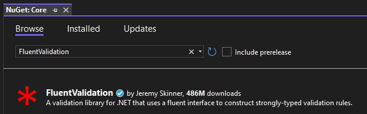
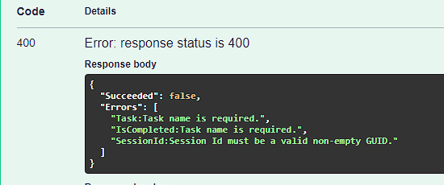

# &nbsp;**E List - Phase 3 - Step 1**

<br/><br/>

## **Install FluentValidation**

This helps us separate validation rules into separate classes for SOLID principal.

Install FluentValidation on the Core Project.



### **Add Validators to your Commands**

For every Command create a Command*InsertName*Validator.cs, because you only want to validate the data that gets send into the Command.

Add to GlobalUsings.cs in Core Project

```cs
global using Common.Mappers;
global using Common.Models;
global using DataAccess;
global using FluentValidation;
global using Microsoft.EntityFrameworkCore;
global using MediatR;
```

Let's start with creating Validators for Todo Commands.

Add a new class in the folder Todos/Commands

AddTodoCommandValidator.cs

```cs
namespace Core.Todos.Commands;

public class AddTodoCommandValidator : AbstractValidator<AddTodoCommand>
{
	public AddTodoCommandValidator()
	{
		this.RuleFor(x => x.Data.Task)
			.NotEmpty().WithMessage("Task name is required.")
			.MinimumLength(3).WithMessage("Task must be at least 3 characters long.")
			.MaximumLength(250).WithMessage("Task must be less then 250 characters long.");

		this.RuleFor(x => x.Data.IsCompleted)
			.NotNull().WithMessage("Task name is required.")
			.NotEmpty().WithMessage("Task name is required.");

		this.RuleFor(x => x.Data.SessionId)
			.NotEmpty().WithMessage("Session Id must be a valid non-empty GUID.");
	}
}
```

CompleteTodoCommandValidator.cs

```cs
namespace Core.Todos.Commands;

public class CompleteTodoCommandValidator : AbstractValidator<CompleteTodoCommand>
{
	public CompleteTodoCommandValidator()
		=> this.RuleFor(x => x.Id).NotEmpty().WithMessage("Task id is required.");
}
```

DeleteTodoCommandValidator.cs

```cs
namespace Core.Todos.Commands;

public class DeleteTodoCommandValidator : AbstractValidator<DeleteTodoCommand>
{
	public DeleteTodoCommandValidator()
		=> this.RuleFor(x => x.Id).NotEmpty().WithMessage("Task id is required.");
}
```

UpdateTodoCommandValidator.cs

```cs
namespace Core.Todos.Commands;

public class UpdateTodoCommandValidator : AbstractValidator<UpdateTodoCommand>
{
	public UpdateTodoCommandValidator()
	{
		this.RuleFor(x => x.Id)
			.NotEmpty().WithMessage("Task id is required.");

		this.RuleFor(x => x.Data.Task)
			.MinimumLength(3).When(x => x.Data.Task is not null).WithMessage("Task must be at least 3 characters long if provided.").MaximumLength(250)
			.When(x => x.Data.Task is not null).WithMessage("Task must be less then 250 characters long.");

		this.RuleFor(x => x.Data.IsCompleted)
			.NotNull().When(x => x.Data.IsCompleted.HasValue).WithMessage("IsCompleted should be either true or false if provided.");

		this.RuleFor(x => x.Data.SessionId)
			.NotEmpty().WithMessage("SessionId must be a valid non-empty GUID.");
	}
}
```

### Validation Pipeline

In Phase 2 you would have noticed ValidationBehavior.cs in Common. This intercepts Mediatr pipeline before it hits the Command Handler for Validation. If any Fluent Validation fails it throws a ValidationException, that we can intercept in Api.

```cs
namespace Core.Behaviours;

public class ValidationBehavior<TRequest, TResponse>(IEnumerable<IValidator<TRequest>> validators)
	: IPipelineBehavior<TRequest, TResponse> where TRequest : IRequest<TResponse>
{
	public async Task<TResponse> Handle(TRequest request, RequestHandlerDelegate<TResponse> next, CancellationToken cancellationToken)
	{
		if (validators.Any())
		{
			var context = new ValidationContext<TRequest>(request);

			var validationResults = await Task.WhenAll(validators.Select(v => v.ValidateAsync(context, cancellationToken)));
			var failures = validationResults.SelectMany(r => r.Errors).Where(f => f != null);

			if (failures.Any())
			{
				throw new ValidationException(failures);
			}
		}
		return await next();
	}
}
```

make sure FluentValidation.DependencyInjection Nuget Package is installed.

DependencyInjection.cs

```cs
namespace Core;

using System.Reflection;
using Core.Behaviours;
using Core.Todos.Commands;
using Microsoft.Extensions.DependencyInjection;

public static class DependencyInjection
{
	public static IServiceCollection AddApplication(this IServiceCollection services)
	{
		services.AddMediatR(cfg => cfg.RegisterServicesFromAssemblyContaining<AddTodoCommand>());
		AssemblyScanner.FindValidatorsInAssembly(typeof(AddTodoCommand).Assembly)
			.ForEach(item => services.AddScoped(item.InterfaceType, item.ValidatorType));

		services.AddValidatorsFromAssembly(Assembly.GetExecutingAssembly());
		services.AddTransient(typeof(IPipelineBehavior<,>), typeof(PerformanceBehaviour<,>));
		services.AddTransient(typeof(IPipelineBehavior<,>), typeof(ValidationBehavior<,>));
		services.AddTransient(typeof(IPipelineBehavior<,>), typeof(UnhandledExceptionBehaviour<,>));
		return services;
	}
}
```

## Exception Handler Middleware

Update Global Error handler UnhandledExceptionBehaviour.cs inside Core Project

In the Core.csproj add the following to access the HttpContext

```
<ItemGroup>
  <FrameworkReference Include="Microsoft.AspNetCore.App" />
</ItemGroup>
```

```cs
namespace Core.Behaviours;

using System.Net;
using System.Text.Json;
using Microsoft.AspNetCore.Http;

public class UnhandledExceptionBehaviour(RequestDelegate next)
{
	public async Task InvokeAsync(HttpContext httpContext)
	{
		try
		{
			if (httpContext.Request.Method == HttpMethods.Post ||
			httpContext.Request.Method == HttpMethods.Put ||
			httpContext.Request.Method == HttpMethods.Patch)
			{
				var requestBody = await new StreamReader(httpContext.Request.Body).ReadToEndAsync();

				// Check if body is empty or contains empty JSON "{}"
				if (string.IsNullOrWhiteSpace(requestBody) || requestBody.Trim() == "{}")
				{
					httpContext.Response.StatusCode = StatusCodes.Status400BadRequest;
					await httpContext.Response.WriteAsync("Request body cannot be empty or an empty JSON object.");
					return;
				}

				var memoryStream = new MemoryStream();
				var writer = new StreamWriter(memoryStream);
				await writer.WriteAsync(requestBody);
				await writer.FlushAsync();
				memoryStream.Position = 0;
				httpContext.Request.Body = memoryStream;
			}

			await next(httpContext);
		}
		catch (ValidationException ex)
		{
			await HandleValidationExceptionAsync(httpContext, ex);
		}
		catch (Exception ex)
		{
			await HandleUnhandledExceptionAsync(httpContext, ex);
		}
	}

	private static Task HandleValidationExceptionAsync(HttpContext context, ValidationException exception)
	{
		var errors = ((ValidationException)exception).Errors;
		if (errors.Any())
		{
			var failures = errors.Select(x => $"{x.PropertyName.Replace("Data.", "")}:{x.ErrorMessage.Replace("Data ", "")}"
);
			var result = Result.Failure(failures.ToList());
			var code = HttpStatusCode.BadRequest;
			var resultJson = JsonSerializer.Serialize(result);

			context.Response.ContentType = "application/json";
			context.Response.StatusCode = (int)code;

			return context.Response.WriteAsync(resultJson);
		}
		else
		{
			var code = HttpStatusCode.BadRequest;
			var result = Result.Failure(exception?.Message);
			var resultJson = JsonSerializer.Serialize(result);

			context.Response.ContentType = "application/json";
			context.Response.StatusCode = (int)code;

			return context.Response.WriteAsync(resultJson);
		}
	}

	private static Task HandleUnhandledExceptionAsync(HttpContext context, Exception exception)
	{
		context.Response.ContentType = "application/json";
		context.Response.StatusCode = StatusCodes.Status500InternalServerError;

		var result = JsonSerializer.Serialize(new { error = "An unexpected error occurred." });
		return context.Response.WriteAsync(result);
	}
}
```

Remove the following line from DependencyInjection.cs on Core Project

```cs
services.AddTransient(typeof(IPipelineBehavior<,>), typeof(UnhandledExceptionBehaviour<,>));
```

In Startup.cs in Configure() call the middleware

```cs
app.UseMiddleware(typeof(ExceptionHandlerMiddleware));
```

When the validation rules get violated a Bad Request will be returned.



## **STEP 2 - Filtering & Searching**

Move to Step 2 [Click Here](https://github.com/entelect-incubator/.NET/tree/master/Phase%203/Step%202)
