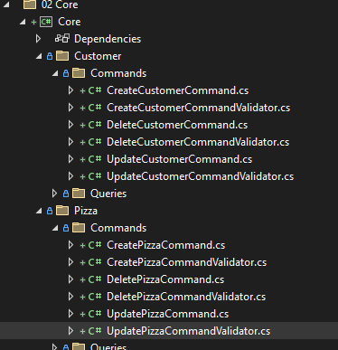

# &nbsp;**Pezza - Phase 3 - Step 1** [](https://github.com/entelect-incubator/.NET/actions/workflows/dotnet-phas3-step1.yml)

<br/><br/>

## **Install FluentValidation**

This helps us separate validation rules into separate classes for SOLID principal.

Install FluentValidation on the Core Project.


### **Add Validators to your Commands**

For every Command create a CommandNamevalidator.cs, because you only want to validate the data that gets send into the Command.

Let's start with creating Validators for Pizza Commands.

Add a new class in the folder Pizza/Commands 

CreatePizzaCommandValidator.cs

```cs
namespace Core.Customer.Commands;

using Core.Pizza.Commands;
using FluentValidation;

public class CreatePizzaCommandValidator : AbstractValidator<CreatePizzaCommand>
{
    public CreatePizzaCommandValidator()
    {
        this.RuleFor(r => r.Data.Name)
            .MaximumLength(100)
            .NotEmpty();

        this.RuleFor(r => r.Data.Description)
            .MaximumLength(500)
            .NotEmpty();

        this.RuleFor(r => r.Data.Price)
			.PrecisionScale(4, 2, false)
			.NotEmpty();
	}
}
```

DeletePizzaCommandValidator.cs

```cs
namespace Core.Customer.Commands;

using Core.Pizza.Commands;
using FluentValidation;

public class DeletePizzaCommandValidator : AbstractValidator<DeletePizzaCommand>
{
    public DeletePizzaCommandValidator()
    {
        this.RuleFor(r => r.Id)
            .NotEmpty();
    }
}
```

UpdatePizzaCommandValidator.cs

```cs
namespace Core.Customer.Commands;

using Core.Pizza.Commands;
using FluentValidation;

public class UpdatePizzaCommandValidator : AbstractValidator<UpdatePizzaCommand>
{
    public UpdatePizzaCommandValidator()
    {
        this.RuleFor(r => r.Data)
            .NotNull();

        this.RuleFor(r => r.Id)
            .NotEmpty();

        this.RuleFor(r => r.Data.Name)
            .MaximumLength(100);

        this.RuleFor(r => r.Data.Description)
            .MaximumLength(500);

		this.RuleFor(r => r.Data.Price)
			.PrecisionScale(4, 2, false);

	}
}
```

Now add validations for Customer Commands.



### Validation Pipeline

In Phase 2 you would have noticed ValidationBehavior.cs in Common. This intercepts Mediatr pipeline before it hits the Command Handler for Validation. If any Fluent Validation fails it throws a ValidationException, that we can intercept in Api.


```cs
namespace Common.Behaviours;

using System.Collections.Generic;
using System.Linq;
using System.Threading;
using System.Threading.Tasks;
using FluentValidation;
using MediatR;

public class ValidationBehavior<TRequest, TResponse> : IPipelineBehavior<TRequest, TResponse>
    where TRequest : IRequest<TResponse>
{
    private readonly IEnumerable<IValidator<TRequest>> validators;

    public ValidationBehavior(IEnumerable<IValidator<TRequest>> validators) => this.validators = validators;

    public async Task<TResponse> Handle(TRequest request, RequestHandlerDelegate<TResponse> next, CancellationToken cancellationToken)
    {
        if (this.validators.Any())
        {
            var context = new ValidationContext<TRequest>(request);

            var validationResults = await Task.WhenAll(this.validators.Select(v => v.ValidateAsync(context, cancellationToken)));
            var failures = validationResults.SelectMany(r => r.Errors).Where(f => f != null);

            if (failures.Any())
            {
                throw new ValidationException(failures);
            }
        }
        return await next();
    }
}
```

DependencyInjection.cs

```cs
namespace Core;

using System.Reflection;
using Common.Behaviour;
using Core.Customer.Commands;
using Core.Pizza.Commands;
using FluentValidation;
using MediatR;
using Microsoft.Extensions.DependencyInjection;

public static class DependencyInjection
{
	public static IServiceCollection AddApplication(this IServiceCollection services)
	{
		services.AddMediatR(cfg => cfg.RegisterServicesFromAssemblyContaining<CreateCustomerCommand>());

		AssemblyScanner.FindValidatorsInAssembly(typeof(CreatePizzaCommand).Assembly)
		   .ForEach(item => services.AddScoped(item.InterfaceType, item.ValidatorType));

		services.AddValidatorsFromAssembly(Assembly.GetExecutingAssembly());

		services.AddTransient(typeof(IPipelineBehavior<,>), typeof(UnhandledExceptionBehaviour<,>));
		services.AddTransient(typeof(IPipelineBehavior<,>), typeof(PerformanceBehaviour<,>));
		return services;
	}
}
```

## Exception Handler Middleware

In Common create a new class inside Behaviours called ExceptionHandlerMiddleware.cs.


```cs
namespace Common.Behaviours;

using System.Linq;
using System.Net;
using System.Threading.Tasks;
using FluentValidation;
using Microsoft.AspNetCore.Http;
using Newtonsoft.Json;
using Common.Models;

public class ExceptionHandlerMiddleware
{
    private readonly RequestDelegate next;

    public ExceptionHandlerMiddleware(RequestDelegate next) => this.next = next;

    public async Task Invoke(HttpContext context /* other dependencies */)
    {
        try
        {
            await this.next(context);
        }
        catch (Exception ex)
        {
            await HandleExceptionAsync(context, ex);
        }
    }

    private static Task HandleExceptionAsync(HttpContext context, Exception exception)
    {
        // Log issues and handle exception response
        if (exception.GetType() == typeof(ValidationException))
        {
            var errors = ((ValidationException)exception).Errors;
            if (errors.Any())
            {
                var failures = errors.Select(x =>
                {
                    return new
                    {
                        Property = x.PropertyName.Replace("Data.", ""),
                        Error = x.ErrorMessage.Replace("Data ", "")
                    };
                });
                var result = Result.Failure(failures.ToList<object>());
                var code = HttpStatusCode.BadRequest;
                var resultJson = JsonConvert.SerializeObject(result);

                context.Response.ContentType = "application/json";
                context.Response.StatusCode = (int)code;

                return context.Response.WriteAsync(resultJson);
            }
            else
            {
                var code = HttpStatusCode.BadRequest;
                var result = Result.Failure(exception?.Message);
                var resultJson = JsonConvert.SerializeObject(result);

                context.Response.ContentType = "application/json";
                context.Response.StatusCode = (int)code;

                return context.Response.WriteAsync(resultJson);
            }
        }
        else
        {
            var code = HttpStatusCode.InternalServerError;
            var result = JsonConvert.SerializeObject(new { isSuccess = false, error = exception.Message });
            context.Response.ContentType = "application/json";
            context.Response.StatusCode = (int)code;

            return context.Response.WriteAsync(result);
        }
    }
}
```

In Startup.cs in Configure() call the middleware

```cs
app.UseMiddleware(typeof(ExceptionHandlerMiddleware));
```

When the validation rules get violated a Bad Request will be returned.


## **STEP 2 - Filtering & Searching**

Move to Step 2
[Click Here](https://github.com/entelect-incubator/.NET/tree/master/Phase%203/Step%202)