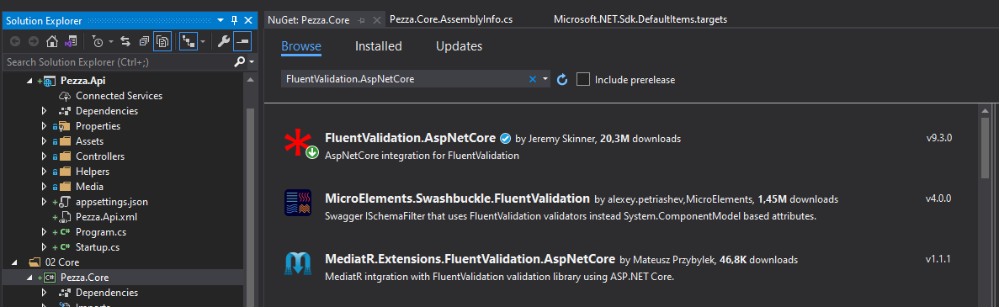
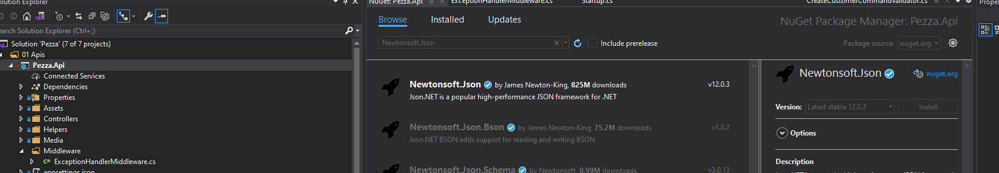
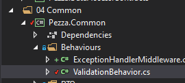
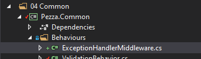

# &nbsp;**Pezza - Phase 3 - Step 1** [](https://github.com/entelect-incubator/.NET/actions/workflows/dotnet-phas3-step1.yml)

<br/><br/>

## **Install FluentValidation**

This helps us separate validation rules into separate classes for SOLID principal.

Install FluentValidation on the Core Project.



## **Install Newtonsoft.Json**

Newtonsoft.Json is a popular high-performance JSON framework typically used to serialize and deserialize .Net objects. Install it on the Api project.



### **Add Validators to your Commands**

For every Command create a CommandNamevalidator.cs, because you only want to validate the data that gets send into the Command.

Create AddressValidator.cs in Pezza.Common/Validators

```cs
namespace Pezza.Common.Validators
{
    using FluentValidation;
    using Pezza.Common.Entities;

    public class AddressValidator : AbstractValidator<AddressBase>
    {
        public AddressValidator()
        {
            this.RuleFor(x => x.Address)
            .NotEmpty()
            .MaximumLength(500);

            this.RuleFor(x => x.City)
            .NotEmpty()
            .MaximumLength(100);

            this.RuleFor(x => x.Province)
            .NotEmpty()
            .MaximumLength(100);

            this.RuleFor(x => x.PostalCode)
            .NotEmpty()
            .Must(x => int.TryParse(x, out var val) && val > 0)
            .MaximumLength(8);
        }
    }

    public class AddressUpdateValidator : AbstractValidator<AddressBase>
    {
        public AddressUpdateValidator()
        {
            this.RuleFor(x => x.Address)
            .MaximumLength(500);

            this.RuleFor(x => x.City)
            .MaximumLength(100);

            this.RuleFor(x => x.Province)
            .MaximumLength(100);

            this.RuleFor(x => x.PostalCode)
            .Must(x => int.TryParse(x, out var val) && val > 0)
            .MaximumLength(8);
        }
    }
}
```

Let's start with creating Validators for Customer Commands.

Add a new class in the folder Customer/Commands CreateCustomerCommandValidator.cs

```cs
namespace Pezza.Core.Customer.Commands
{
    using FluentValidation;
    using Pezza.Common.Validators;

    public class CreateCustomerCommandValidator : AbstractValidator<CreateCustomerCommand>
    {
        public CreateCustomerCommandValidator()
        {
            this.RuleFor(r => r.Data.Name)
                .MaximumLength(100)
                .NotEmpty();

            this.RuleFor(r => r.Data.Phone)
                .MaximumLength(20)
                .Matches(@"^\d$")
                .NotEmpty();

            this.RuleFor(r => r.Data.Email)
                .MaximumLength(200)
                .EmailAddress()
                .NotEmpty();

            this.RuleFor(r => r.Data.ContactPerson)
                .MaximumLength(200)
                .NotEmpty();

            this.RuleFor(r => r.Data.Address)
                .NotNull()
                .SetValidator(new AddressValidator());
        }
    }
}
```

DeleteCustomerCommandValidator.cs

```cs
namespace Pezza.Core.Customer.Commands
{
    using FluentValidation;

    public class DeleteCustomerCommandValidator : AbstractValidator<DeleteCustomerCommand>
    {
        public DeleteCustomerCommandValidator()
        {
            this.RuleFor(r => r.Id)
                .NotEmpty();
        }
    }
}
```

UpdateCustomerCommandValidator.cs

```cs
namespace Pezza.Core.Customer.Commands
{
    using FluentValidation;
    using Pezza.Common.Validators;

    public class UpdateCustomerCommandValidator : AbstractValidator<UpdateCustomerCommand>
    {
        public UpdateCustomerCommandValidator()
        {
            this.RuleFor(r => r.Data)
                .NotNull();

            this.RuleFor(r => r.Data.Id)
                .NotEmpty();

            this.RuleFor(r => r.Data.Name)
                .MaximumLength(100);

            this.RuleFor(r => r.Data.Phone)
                .MaximumLength(20)
                .Matches(@"^\d$");

            this.RuleFor(r => r.Data.Email)
                .MaximumLength(200)
                .EmailAddress();

            this.RuleFor(r => r.Data.ContactPerson)
                .MaximumLength(200);

            this.RuleFor(r => r.Data.Address)
                .SetValidator(new AddressUpdateValidator())
                .When(x => x.Data.Address != null);
        }
    }
}
```

All other Validators can be copied from Phase3\Data\Validators

### Validation Pipeline

In Phase 2 you would have noticed ValidationBehavior.cs in Pezza.Common. This intercepts Mediatr pipeline before it hits the Command Handler for Validation. If any Fluent Validation fails it throws a ValidationException, that we can intercept in Pezza.Api.



```cs
namespace Pezza.Common.Behaviours
{
    using System.Collections.Generic;
    using System.Linq;
    using System.Threading;
    using System.Threading.Tasks;
    using FluentValidation;
    using MediatR;

    public class ValidationBehavior<TRequest, TResponse> : IPipelineBehavior<TRequest, TResponse>
        where TRequest : IRequest<TResponse>
    {
        private readonly IEnumerable<IValidator<TRequest>> validators;

        public ValidationBehavior(IEnumerable<IValidator<TRequest>> validators) => this.validators = validators;

        public async Task<TResponse> Handle(TRequest request, CancellationToken cancellationToken, RequestHandlerDelegate<TResponse> next)
        {
            if (this.validators.Any())
            {
                var context = new ValidationContext<TRequest>(request);

                var validationResults = await Task.WhenAll(this.validators.Select(v => v.ValidateAsync(context, cancellationToken)));
                var failures = validationResults.SelectMany(r => r.Errors).Where(f => f != null);

                if (failures.Any())
                {
                    throw new ValidationException(failures);
                }
            }
            return await next();
        }
    }
}
```

DependencyInjection.cs

```cs
namespace Pezza.Core
{
    using System.Reflection;
    using AutoMapper;
    using FluentValidation;
    using MediatR;
    using Microsoft.Extensions.DependencyInjection;
    using Pezza.Common.Behaviours;
    using Pezza.Common.DTO;
    using Pezza.Common.Profiles;
    using Pezza.Core.Stock.Commands;
    using Pezza.DataAccess.Contracts;
    using Pezza.DataAccess.Data;

    public static class DependencyInjection
    {
        public static IServiceCollection AddApplication(this IServiceCollection services)
        {
            services.AddMediatR((typeof(CreateStockCommand).GetTypeInfo().Assembly));
            services.AddAutoMapper(Assembly.GetExecutingAssembly());

            AssemblyScanner.FindValidatorsInAssembly(typeof(CreateStockCommand).Assembly)
                .ForEach(item => services.AddScoped(item.InterfaceType, item.ValidatorType));

            services.AddValidatorsFromAssembly(Assembly.GetExecutingAssembly()); 
            services.AddTransient(typeof(IPipelineBehavior<,>), typeof(ValidationBehavior<,>));
            services.AddTransient(typeof(IPipelineBehavior<,>), typeof(PerformanceBehaviour<,>));

            services.AddAutoMapper(typeof(MappingProfile));

            return services;
        }
    }
}
```

## Exception Handler Middleware

In Pezza.Common create a new class inside Behaviours called ExceptionHandlerMiddleware.cs.



```cs
namespace Pezza.Common.Behaviours
{
    using System;
    using System.Linq;
    using System.Net;
    using System.Threading.Tasks;
    using FluentValidation;
    using Microsoft.AspNetCore.Http;
    using Newtonsoft.Json;
    using Pezza.Common.Models;

    public class ExceptionHandlerMiddleware
    {
        private readonly RequestDelegate next;

        public ExceptionHandlerMiddleware(RequestDelegate next) => this.next = next;

        public async Task Invoke(HttpContext context /* other dependencies */)
        {
            try
            {
                await this.next(context);
            }
            catch (Exception ex)
            {
                await HandleExceptionAsync(context, ex);
            }
        }

        private static Task HandleExceptionAsync(HttpContext context, Exception exception)
        {
            // Log issues and handle exception response
            if (exception.GetType() == typeof(ValidationException))
            {
                var errors = ((ValidationException)exception).Errors;
                if (errors.Any())
                {
                    var failures = errors.Select(x =>
                    {
                        return new
                        {
                            Property = x.PropertyName.Replace("Data.", ""),
                            Error = x.ErrorMessage.Replace("Data ", "")
                        };
                    });
                    var result = Result.Failure(failures.ToList<object>());
                    var code = HttpStatusCode.BadRequest;
                    var resultJson = JsonConvert.SerializeObject(result);

                    context.Response.ContentType = "application/json";
                    context.Response.StatusCode = (int)code;

                    return context.Response.WriteAsync(resultJson);
                }
                else
                {
                    var code = HttpStatusCode.BadRequest;
                    var result = Result.Failure(exception?.Message);
                    var resultJson = JsonConvert.SerializeObject(result);

                    context.Response.ContentType = "application/json";
                    context.Response.StatusCode = (int)code;

                    return context.Response.WriteAsync(resultJson);
                }
            }
            else
            {
                var code = HttpStatusCode.InternalServerError;
                var result = JsonConvert.SerializeObject(new { isSuccess = false, error = exception.Message });
                context.Response.ContentType = "application/json";
                context.Response.StatusCode = (int)code;

                return context.Response.WriteAsync(result);
            }
        }
    }
}
```

In Startup.cs in Configure() call the middleware

```cs
app.UseMiddleware(typeof(ExceptionHandlerMiddleware));
```

When the validation rules get violated a Bad Request will be returned.


## **STEP 2 - Filtering & Searching**

Move to Step 2
[Click Here](https://github.com/entelect-incubator/.NET/tree/master/Phase%203/Step%202)