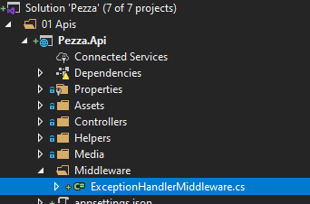

# &nbsp;**Pezza - Phase 3 - Step 1**

<br/><br/>

## **Install FluentValidation**

THis helps us separate validation rules into separate classes for SOLID principal.

Install FluentValidation on the Core Project.


### **Add Validators to your Commands**

For every Command create a CommandNamevalidator.cs, because you only want to validate the data that gets send into the Command.

Let's start with creating Validators for Customer Commands.

Add a new class in Customer/Commands CreateCustomerCommandValidator.cs

```cs
namespace Pezza.Core.Customer.Commands
{
    using FluentValidation;
    using Pezza.Common.Validators;

    public class CreateCustomerCommandValidator : AbstractValidator<CreateCustomerCommand>
    {
        public CreateCustomerCommandValidator()
        {
            this.RuleFor(r => r.Data.Name)
                .MaximumLength(100)
                .NotEmpty();

            this.RuleFor(r => r.Data.Phone)
                .MaximumLength(20)
                .Matches(@"^\d$")
                .NotEmpty();

            this.RuleFor(r => r.Data.Email)
                .MaximumLength(200)
                .EmailAddress()
                .NotEmpty();

            this.RuleFor(r => r.Data.ContactPerson)
                .MaximumLength(200)
                .NotEmpty();

            this.RuleFor(r => r.Data.Address)
                .NotNull()
                .SetValidator(new AddressValidator());
        }
    }
}
```

DeleteCustomerCommandValidator.cs

```cs
namespace Pezza.Core.Customer.Commands
{
    using FluentValidation;

    public class DeleteCustomerCommandValidator : AbstractValidator<DeleteCustomerCommand>
    {
        public DeleteCustomerCommandValidator()
        {
            this.RuleFor(r => r.Id)
                .NotEmpty();
        }
    }
}
```

UpdateCustomerCommandValidator.cs

```cs
namespace Pezza.Core.Customer.Commands
{
    using FluentValidation;
    using Pezza.Common.Validators;

    public class UpdateCustomerCommandValidator : AbstractValidator<UpdateCustomerCommand>
    {
        public UpdateCustomerCommandValidator()
        {
            this.RuleFor(r => r.Id)
                .NotEmpty();

            this.RuleFor(r => r.Data)
                .NotNull();

            this.RuleFor(r => r.Data.Name)
                .MaximumLength(100);

            this.RuleFor(r => r.Data.Phone)
                .MaximumLength(20)
                .Matches(@"^\d$");

            this.RuleFor(r => r.Data.Email)
                .MaximumLength(200)
                .EmailAddress();

            this.RuleFor(r => r.Data.ContactPerson)
                .MaximumLength(200);

            this.RuleFor(r => r.Data.Address)
                .SetValidator(new AddressUpdateValidator())
                .When(x => x.Data.Address != null);
        }
    }
}
```

All other Validators can be copied from Phase3\Data\Validators

### Validation Pipeline

In Phase 2 you would have noticed ValidationBehavior.cs in Pezza.Common. This intercepts Mediatr pipeline before it hits the Command Handler for Validation. If any Fluent Validation fails it throws a ValidationException, that we can intercept in Pezza.Api.

## Exception Handler Middleware

In Pezza.Api create a new folder Middleware and create a new class inside of it ExceptionHandlerMiddleware.cs.



```cs
namespace Pezza.Api.Middleware
{
    using System;
    using System.Linq;
    using System.Net;
    using System.Threading.Tasks;
    using FluentValidation;
    using Microsoft.AspNetCore.Http;
    using Newtonsoft.Json;

    public class ExceptionHandlerMiddleware
    {
        private readonly RequestDelegate next;

        public ExceptionHandlerMiddleware(RequestDelegate next) => this.next = next;

        public async Task Invoke(HttpContext context)
        {
            try
            {
                await this.next(context);
            }
            catch (Exception ex)
            {
                await HandleExceptionAsync(context, ex);
            }
        }


        private static Task HandleExceptionAsync(HttpContext context, Exception exception)
        {
            // Log issues and handle exception response

            if (exception.GetType() == typeof(ValidationException))
            {
                var code = HttpStatusCode.BadRequest;
                var errors = ((ValidationException)exception).Errors;
                var result = JsonConvert.SerializeObject(errors.Select(s =>
                {
                    return new
                    {
                        Field = s.PropertyName.Replace("Data.", ""),
                        Error = s.ErrorMessage.Replace("Data.","")
                    };
                }));
                context.Response.ContentType = "application/json";
                context.Response.StatusCode = (int)code;
                return context.Response.WriteAsync(result);

            }
            else
            {
                var code = HttpStatusCode.InternalServerError;
                var result = JsonConvert.SerializeObject(new { isSuccess = false, error = exception.Message });
                context.Response.ContentType = "application/json";
                context.Response.StatusCode = (int)code;
                return context.Response.WriteAsync(result);
            }
        }
    }
}
```

In Startup.cs in Configure() call the middleware

```cs
app.UseMiddleware(typeof(ExceptionHandlerMiddleware));
```

When the validation rules get violated a Bad Request will be returned.


## **STEP 2 - Filtering & Searching**

Move to Step 2
[Click Here](https://github.com/entelect-incubator/.NET/tree/master/Phase%203/Step%202)