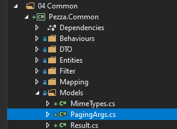
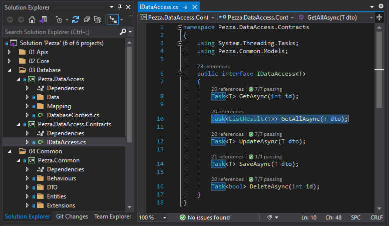

# &nbsp;**Pezza - Phase 3 - Step 2**

<br/><br/>

## **Search Models**

Extend our data DTO's to cater for filtering and pagination. In Pezza.Common Models create PagingArgs.cs



```cs
namespace Pezza.Common.Models
{
    public class PagingArgs
    {
        private int limit = 20;

        public static PagingArgs NoPaging => new PagingArgs { UsePaging = false };

        public static PagingArgs Default => new PagingArgs { UsePaging = true, Limit = 20, Offset = 0 };

        public static PagingArgs FirstItem => new PagingArgs { UsePaging = true, Limit = 1, Offset = 0 };

        public int Offset { get; set; }

        public int Limit
        {
            get => this.limit;

            set
            {
                if (value == 0)
                {
                    value = 20;
                }

                this.limit = value;
            }
        }

        public bool UsePaging { get; set; }
    }
}
```

Add Extensions method in Pezza.Common to do the Pagination. Create a new Folder Extensions in Pezza.Common with Extensions.cs

```cs
using System.Linq;
using Park.Entities.Model;

namespace Park.Common.Extensions
{
    public static class Extensions
    {
        public static IQueryable<T> ApplyPaging<T>(this IQueryable<T> query, PagingArgs pagingArgs)
        {
            var myPagingArgs = pagingArgs;

            if (pagingArgs == null)
            {
                myPagingArgs = PagingArgs.Default;
            }

            return myPagingArgs.UsePaging ? query.Skip(myPagingArgs.Offset).Take(myPagingArgs.Limit) : query;
        }
    }
}
```

Every DataDTO in Pezza.Common extend to include OrdeBy and PagingArgs.


Cerate a new ISearchBase.cs in Pezza.Common\Models

```cs
namespace Pezza.Common.DTO.Data
{
    using Pezza.Common.Models;

    public interface ISearchBase
    {
        public string OrderBy { get; set; }

        public PagingArgs PagingArgs { get; set; }
    }
}
```

Extend IEntity with SearchBase. All other Entities inherit from Entity.

```cs
namespace Pezza.Common.Entities
{
    using Pezza.Common.DTO.Data;

    public interface IEntity : ISearchBase
    {
        int Id { get; set; }
    }
}
```

Entity.cs

```cs
namespace Pezza.Common.Entities
{
    using Pezza.Common.Models;

    public abstract class Entity : IEntity
    {
        public int Id { get; set; }

        public string OrderBy { get; set; }

        public PagingArgs PagingArgs { get; set; }
    }
}
```
### **Add filtering**

Create a Filter class for every entity, these filters uses fluent design for readability. In each filter you create a rule for every property that you want to filter on. If that property has a value it builds up a query before executing it to the database. See it as building up a SQL WHERE clause.

Create a CustomerFilter.cs in Pezza.Common Filter

```cs
namespace Test.DataAccess.Filter
{
    using System;
    using System.Linq;
    using Pezza.Common.Entities;

    public static class CustomerFilter
    {
        public static IQueryable<Customer> FilterByName(this IQueryable<Customer> query, string name)
        {
            if (string.IsNullOrWhiteSpace(name))
            {
                return query;
            }

            return query.Where(x => x.Name.Contains(name));
        }

        public static IQueryable<Customer> FilterByAddress(this IQueryable<Customer> query, string address)
        {
            if (string.IsNullOrWhiteSpace(address))
            {
                return query;
            }

            return query.Where(x => x.Address.Contains(address));
        }

        public static IQueryable<Customer> FilterByCity(this IQueryable<Customer> query, string city)
        {
            if (string.IsNullOrWhiteSpace(city))
            {
                return query;
            }

            return query.Where(x => x.City.Contains(city));
        }

        public static IQueryable<Customer> FilterByProvince(this IQueryable<Customer> query, string province)
        {
            if (string.IsNullOrWhiteSpace(province))
            {
                return query;
            }

            return query.Where(x => x.Province.Contains(province));
        }

        public static IQueryable<Customer> FilterByZipCode(this IQueryable<Customer> query, string zipCode)
        {
            if (string.IsNullOrWhiteSpace(zipCode))
            {
                return query;
            }

            return query.Where(x => x.ZipCode.Contains(zipCode));
        }

        public static IQueryable<Customer> FilterByPhone(this IQueryable<Customer> query, string phone)
        {
            if (string.IsNullOrWhiteSpace(phone))
            {
                return query;
            }

            return query.Where(x => x.Phone.Contains(phone));
        }

        public static IQueryable<Customer> FilterByEmail(this IQueryable<Customer> query, string email)
        {
            if (string.IsNullOrWhiteSpace(email))
            {
                return query;
            }

            return query.Where(x => x.Email.Contains(email));
        }

        public static IQueryable<Customer> FilterByContactPerson(this IQueryable<Customer> query, string contactPerson)
        {
            if (string.IsNullOrWhiteSpace(contactPerson))
            {
                return query;
            }

            return query.Where(x => x.ContactPerson.Contains(contactPerson));
        }

        public static IQueryable<Customer> FilterByDateCreated(this IQueryable<Customer> query, DateTime? dateCreated)
        {
            if (!dateCreated.HasValue)
            {
                return query;
            }

            return query.Where(x => x.DateCreated == dateCreated.Value);
        }


    }
}
```

You can also copy the other Filters from Step3\Data\Filter


### **Extend Lst Result**

In Pezza.Commmon Models Result.cs add a new Count Property to List Result.

```cs
 public int Count { get; set; }
```

And the contructor

```cs
internal ListResult(bool succeeded, IEnumerable<T> data, int count, List<string> errors)
{
    this.Succeeded = succeeded;
    this.Errors = errors;
    this.Data = data.ToList();
    this.Count = count;
}
```

And Success

```cs
public static ListResult<T> Success(IEnumerable<T> data, int count) => new ListResult<T>(true, data, count, new List<string> { });
```

### **Add Filters to the Data Access**

Change the Data Access Interface to include the Search Model in GetAllAsync.



```
Task<ListResult<T>> GetAllAsync(Entity searchBase);
```

## **STEP 2 - Filtering & Searching**

Change all the DataAccess GetAllSync methods to include the new SearchModel and Filtering.

The only exception will be on Restaurant GetAllAsync(). We don't want to add any filtering, because of caching we want to include later on.

```cs
public async Task<ListResult<RestaurantDTO>> GetAllAsync(Entity searchBase)
{
    var entities = this.mapper.Map<List<RestaurantDTO>>(await this.databaseContext.Restaurants.Select(x => x).AsNoTracking().ToListAsync());
    return ListResult<RestaurantDTO>.Success(entities, entities.Count);
}
``

Open CustomerDataAccess

```cs
public async Task<ListResult<CustomerDTO>> GetAllAsync(Entity searchBase)
        {
            var searchModel = (CustomerDTO)searchBase;
            if (string.IsNullOrEmpty(searchModel.OrderBy))
            {
                searchModel.OrderBy = "DateCreated desc";
            }

            var entities = this.databaseContext.Customers.Select(x => x)
                .AsNoTracking()
                .FilterByName(searchModel.Name)
                .FilterByAddress(searchModel.Address?.Address)
                .FilterByCity(searchModel.Address?.City)
                .FilterByProvince(searchModel.Address?.Province)
                .FilterByZipCode(searchModel.Address?.ZipCode)
                .FilterByPhone(searchModel.Phone)
                .FilterByEmail(searchModel.Email)
                .FilterByContactPerson(searchModel.ContactPerson)
                .FilterByDateCreated(searchModel.DateCreated)

                .OrderBy(searchModel.OrderBy);

            var count = entities.Count();
            var paged = this.mapper.Map<List<CustomerDTO>>(await entities.ApplyPaging(searchModel.PagingArgs).ToListAsync());

            return ListResult<CustomerDTO>.Success(paged, count);
        }
```

Add all the Filters to the other DataAccess as well or can copy it from Phase 3/Data/DataAccess

### Modify all Queries

Include each entity DTO as a Search Model in all Queries that calls GetAllAsync DataAccess.

Example GetCustomersQuery.cs

```cs
namespace Pezza.Core.Customer.Queries
{
    using System.Threading;
    using System.Threading.Tasks;
    using MediatR;
    using Pezza.Common.DTO;
    using Pezza.Common.Mapping;
    using Pezza.Common.Models;
    using Pezza.DataAccess.Contracts;

    public class GetCustomersQuery : IRequest<ListResult<CustomerDTO>>
    {
        public CustomerDTO SearchModel { get; set; }
    }

    public class GetCustomersQueryHandler : IRequestHandler<GetCustomersQuery, ListResult<CustomerDTO>>
    {
        private readonly IDataAccess<Common.Entities.Customer> dataAcess;

        public GetCustomersQueryHandler(IDataAccess<Common.Entities.Customer> dataAcess) => this.dataAcess = dataAcess;

        public async Task<ListResult<CustomerDTO>> Handle(GetCustomersQuery request, CancellationToken cancellationToken)
          => await this.dataAcess.GetAllAsync(request.SearchModel);
    }
}
```

### **Modify Controllers**

Modify all the Controllers Search Functions

Example Customer Controller

```cs
/// <summary>
/// Get all Customers.
/// </summary>
/// <param name="searchModel"></param> 
[HttpPost]
[ProducesResponseType(200)]
[ProducesResponseType(400)]
[Route("Search")]
public async Task<ActionResult> Search(CustomerDataDTO searchModel)
{
    var result = await this.Mediator.Send(new GetCustomersQuery
    {
        SearchModel = searchModel
    });

    return ResponseHelper.ResponseOutcome<CustomerDTO>(result, this);
}
```

### **Modify Unit Test**

Add Search Model to all GetAllAsync Unit Tests

```cs
[Test]
public async Task GetAllAsync()
{
    var handler = new CustomerDataAccess(this.Context);
    var entity = CustomerTestData.Customer;
    await handler.SaveAsync(entity);

    var searchModel = new OrderDataDTO();
    var response = await handler.GetAllAsync(searchModel);
    var outcome = response.Count;

    Assert.IsTrue(outcome == 1);
}
```

## **Move to Phase 4**
[Click Here](https://github.com/entelect-incubator/.NET/tree/master/Phase%204)