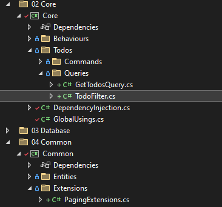

# &nbsp;**E List - Phase 3 - Step 2** [](https://github.com/entelect-incubator/.NET/actions/workflows/dotnet-phase3-step2.yml)

<br/><br/>

## **Search Models**

To extend your models for filtering and pagination, you can introduce a PagingArgs class in your Common\Models folder, which encapsulates the necessary properties for handling pagination logic. This class will store information such as the current page, page size, and potentially additional parameters for filtering.

Let's walk through setting up this functionality:

```cs
namespace Common.Models;

namespace Common.Models;

public class PagingArgs
{
	private const int DefaultLimit = 20;
	private const int DefaultOffset = 0;

	private int limit = DefaultLimit;

	public static readonly PagingArgs NoPaging = new() { UsePaging = false };
	public static readonly PagingArgs Default = new() { UsePaging = true, Limit = DefaultLimit, Offset = DefaultOffset };
	public static readonly PagingArgs FirstItem = new() { UsePaging = true, Limit = 1, Offset = DefaultOffset };

	public int Offset { get; set; } = DefaultOffset;

	public int Limit
	{
		get => this.limit;
		set => this.limit = value > 0 ? value : DefaultLimit;
	}

	public bool UsePaging { get; set; } = true;
}
```

Add an extension method in Common to do the Pagination. Create a new folder called Extensions in Common and add PagingExtensions.cs

```cs
namespace Common.Extensions;

public static class PagingExtensions
{
    public static IQueryable<T> ApplyPaging<T>(this IQueryable<T> query, PagingArgs pagingArgs)
    {
        var myPagingArgs = pagingArgs;

        if (pagingArgs == null)
        {
            myPagingArgs = PagingArgs.Default;
        }

        return myPagingArgs.UsePaging ? query.Skip(myPagingArgs.Offset).Take(myPagingArgs.Limit) : query;
    }
}
```

Create a new TodoSearchModel that will be used for the GetAll query, you should design the model to handle the filtering and searching logic. This could include parameters like SearchTerm, Status, Priority, and, if applicable, PagingArgs for pagination.

Add paging option to the Search Model

```cs
namespace Common.Models.Todos;

public sealed class SearchTodoModel
{
	public string? Task { get; set; }

	public bool? IsCompleted { get; set; }

	public DateTime? DateCreated { get; set; }

	public int? Year { get; set; }

	public int? Month { get; set; }

	public int? Day { get; set; }

	public Guid? SessionId { get; set; }

	public string? OrderBy { get; set; }

	public PagingArgs PagingArgs { get; set; } = PagingArgs.NoPaging;
}
```

## **Add filtering**

To set up filter classes using Fluent Validation for readability and to build SQL-like WHERE clauses, follow these steps. This approach helps you create dynamic queries based on the presence of filter values.

Add TodoFilter into the Todo Queries folder in the Core project.

```cs
namespace Core.Todos.Queries;

using Common.Entities;

public static class TodoFilter
{
	public static IQueryable<Todo> FilterByTask(this IQueryable<Todo> query, string? task)
		=> string.IsNullOrWhiteSpace(task) ? query : query.Where(x => x.Task.Contains(task));

	public static IQueryable<Todo> FilterByCompleted(this IQueryable<Todo> query, bool? isCompleted)
		=> !isCompleted.HasValue ? query : query.Where(x => x.IsCompleted == isCompleted.Value);

	public static IQueryable<Todo> FilterByDate(this IQueryable<Todo> query, DateTime? dateCreated = null, int? year = null, int? month = null, int? day = null)
	{
		if (dateCreated.HasValue)
		{
			return query.Where(x => x.DateCreated.HasValue && x.DateCreated.Value.Date == dateCreated.Value.Date);
		}

		if (year.HasValue)
		{
			query = query.Where(x => x.DateCreated.HasValue && x.DateCreated.Value.Year == year.Value);
		}

		if (month.HasValue)
		{
			query = query.Where(x => x.DateCreated.HasValue && x.DateCreated.Value.Month == month.Value);
		}

		if (day.HasValue)
		{
			query = query.Where(x => x.DateCreated.HasValue && x.DateCreated.Value.Day == day.Value);
		}

		return query;
	}
}
```



### **Modifying Core**

Modify the get all query for Todo in the Core Project.

The implementations of all Queries methods need to be modified to include filtering. Remember to install System.Linq.Dynamic.Core Nuget Package on the Core Project.

Modify GlobalUsings.cs

```cs
global using System.Linq.Dynamic.Core;
global using Common.Extensions;
global using Common.Mappers;
global using Common.Models;
global using DataAccess;
global using FluentValidation;
global using Microsoft.EntityFrameworkCore;
global using MediatR;
```

```cs
namespace Core.Todos.Queries;

using Common.Models.Todos;

public class GetTodosQuery : IRequest<Result<IEnumerable<TodoModel>>>
{
	public required SearchTodoModel Data { get; set; }
}

public class GetTodosQueryHandler(DatabaseContext databaseContext) : IRequestHandler<GetTodosQuery, Result<IEnumerable<TodoModel>>>
{
	public async Task<Result<IEnumerable<TodoModel>>> Handle(GetTodosQuery request, CancellationToken cancellationToken)
	{
		var entity = request.Data!;
		if (string.IsNullOrEmpty(entity.OrderBy))
		{
			entity.OrderBy = "DateCreated desc";
		}

		var entities = databaseContext.Todos.Select(x => x)
			.AsNoTracking()
			.FilterByTask(entity.Task)
			.FilterByCompleted(entity.IsCompleted)
			.FilterByDate(entity.DateCreated, entity.Year, entity.Month, entity.Day)
			.OrderBy(entity.OrderBy);

		var count = entities.Count();
		var paged = await entities.ApplyPaging(entity.PagingArgs).ToListAsync(cancellationToken);

		return Result<IEnumerable<TodoModel>>.Success(paged.Map(), count);
	}
}
```

### **Modifying Todo Controller**

To improve Swagger documentation for your API, you can use the ProducesResponseType attribute to specify the type of response your API endpoints will return. This helps Swagger generate more accurate and helpful documentation for consumers of your API.

Using ProducesResponseType in ASP.NET Core The ProducesResponseType attribute is used to indicate the type of response returned by an action method, along with the HTTP status code. You can use this attribute to provide more detailed information about the expected response types.

Here’s a step-by-step guide on how to apply ProducesResponseType and improve your Swagger documentation:

Add ProducesResponseType Attributes: Use this attribute on your action methods to specify the response types and their corresponding HTTP status codes.

Enhance Documentation: Optionally, provide more detailed descriptions for each response type to improve the clarity of your API documentation.

Modify the Search Action Methods in the controllers to use the new Search Model.

TodoController.cs

```cs
namespace Api.Controllers;

using Api.Helpers;
using Common.Models.Todos;
using Core.Todos.Commands;
using Core.Todos.Queries;
using Microsoft.AspNetCore.Mvc;

[ApiController]
[Route("[controller]")]
public class TodosController : ApiController
{
	/// <summary>
	/// Get all Todos.
	/// </summary>
	/// <param name="model">Todo Search Model</param>
	/// <param name="cancellationToken">Cancellation Token</param>
	/// <returns>ActionResult</returns>
	[HttpPost("Search")]
	[ProducesResponseType(typeof(Result<IEnumerable<TodoModel>>, 200)]
	[ProducesResponseType(typeof(ErrorResult), 400)]
	public async Task<ActionResult<Result<IEnumerable<TodoModel>>>> Search(SearchTodoModel model, CancellationToken cancellationToken = default)
		=> ResponseHelper.ResponseOutcome(await this.Mediator.Send(new GetTodosQuery() { Data = model }, cancellationToken), this);

	/// <summary>
	/// Create a task.
	/// </summary>
	/// <remarks>
	/// Sample request:
	///
	///     POST api/Todo
	///     {
	///       "task": "New task",
	///     }
	/// </remarks>
	/// <param name="model">Create Todo Model</param>
	/// <param name="cancellationToken">Cancellation Token</param>
	/// <returns>ActionResult</returns>
	[HttpPost]
	[ProducesResponseType(typeof(Result<TodoModel>), 200)]
	[ProducesResponseType(typeof(ErrorResult), 400)]
	public async Task<ActionResult<Result<TodoModel>>> Add([FromBody] CreateTodoModel model, CancellationToken cancellationToken = default)
		=> ResponseHelper.ResponseOutcome(await this.Mediator.Send(new AddTodoCommand() { Data = model }, cancellationToken), this);

	/// <summary>
	/// Complete a task.
	/// </summary>
	/// <remarks>
	/// Sample request:
	///
	///     PUT api/Todo/Complete
	///     {
	///       "id": "1"
	///     }
	/// </remarks>
	/// <param name="id">Task id</param>
	/// <param name="cancellationToken">Cancellation Token</param>
	/// <returns>ActionResult</returns>
	[HttpPost("Complete")]
	[ProducesResponseType(typeof(Result<TodoModel>), 200)]
	[ProducesResponseType(typeof(ErrorResult), 400)]
	public async Task<ActionResult<Result<TodoModel>>> Complete([FromBody] int id, CancellationToken cancellationToken = default)
		=> ResponseHelper.ResponseOutcome(await this.Mediator.Send(new CompleteTodoCommand() { Id = id }, cancellationToken), this);


	/// <summary>
	/// Update Todo.
	/// </summary>
	/// <remarks>
	/// Sample request:
	///
	///     PUT api/Todo/1
	///     {
	///       "Task": "New task"
	///     }
	/// </remarks>
	/// <param name="id">Todo id</param>
	/// <param name="model">Update Todo Model</param>
	/// <param name="cancellationToken">Cancellation Token</param>
	/// <returns>ActionResult</returns>
	[HttpPut("{id}")]
	[ProducesResponseType(typeof(Result), 200)]
	[ProducesResponseType(typeof(ErrorResult), 400)]
	public async Task<ActionResult<Result>> Update(int id, [FromBody] UpdateTodoModel model, CancellationToken cancellationToken = default)
		=> ResponseHelper.ResponseOutcome(await this.Mediator.Send(new UpdateTodoCommand() { Id = id, Data = model }, cancellationToken), this);

	/// <summary>
	/// Delete a task by Id.
	/// </summary>
	/// <param name="id">Task Id</param>
	/// <param name="cancellationToken">Cancellation Token</param>
	/// <returns>ActionResult</returns>
	[HttpDelete("{id}")]
	[ProducesResponseType(typeof(Result), 200)]
	[ProducesResponseType(typeof(ErrorResult), 400)]
	public async Task<ActionResult<Result>> Delete(int id, CancellationToken cancellationToken = default)
		=> ResponseHelper.ResponseOutcome(await this.Mediator.Send(new DeleteTodoCommand() { Id = id }, cancellationToken), this);
}
```

### **Modify Unit Tests**

To modify your unit tests to incorporate the recent changes, follow these steps:

Update Test Setup: Ensure your test classes are aligned with the new changes in your models or business logic, including any updated constructors or methods.

Test Response Types: For API testing, add tests to verify that the correct response types are returned, including success (200), not found (404), and bad request (400) scenarios, matching the ProducesResponseType attributes.

Filter Logic: If you've added filtering (e.g., by DateCreated), include unit tests that validate filtering logic for year, month, and day.

Mock Services: If any services or dependencies were updated, mock them accordingly in your tests to reflect new behaviors or methods.

Boundary Tests: Incorporate edge cases in your tests, especially for date filtering or paginated results, to ensure your application handles invalid inputs correctly.

Expand your existing tests by:

Verifying changes to models and filters. Testing error handling and validation based on your updates. This ensures your unit tests remain effective as you implement new features or refactor your code.

## **Move to Phase 4**

[Click Here](https://github.com/entelect-incubator/.NET/tree/master/Phase%204)
