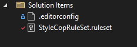
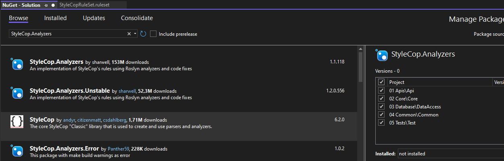

# &nbsp;**E List - Phase 4 - Step 1** [](https://github.com/entelect-incubator/.NET/actions/workflows/dotnet-phase4-step1.yml)

<br/><br/><br/>

## Coding Standards

In this section we introduce StyleCop which enforces configurable rules on developer coding styles. This creates consistency in projects for increased productivity. It is especially valuable when multiple developers are involved.

### **Install StyleCop**

[Overview](https://github.com/StyleCop/StyleCop)

Copy from Phase 4\Assets

Add **Phase 4\src\03. Step 2\StyleCopRuleSet.ruleset** to your Solution



Install StyleCop.Analyzers Nuget Package to all Projects



Add the StyleCop Rule Set in every project file.

```xml
<CodeAnalysisRuleSet>$(ProjectDir)..\StyleCopRuleSet.ruleset</CodeAnalysisRuleSet>
```

Fix any build errors

Move to Step 2 [Click Here](https://github.com/entelect-incubator/.NET/tree/master/Phase%204/Step%202)
