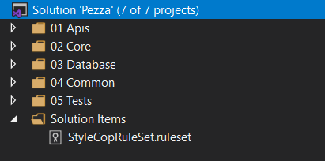

# &nbsp;**Pezza - Phase 4 - Step 1**

<br/><br/>

Standards

## **Install StyleCop**

[Overview](https://github.com/StyleCop/StyleCop)

Add Phase 4/Data/StyleCopRuleSet.ruleset to your Solution



Install StyleCop.Analyzers Nuget Package to all Projects


Add the StyleCop Rule Set in every project file.


```
<CodeAnalysisRuleSet>$(SolutionDir)\StyleCopRuleSet.ruleset</CodeAnalysisRuleSet>
```

Fix build errors

Move to Step 2
[Click Here](https://github.com/entelect-incubator/.NET/tree/master/Phase%204/Step%202) 