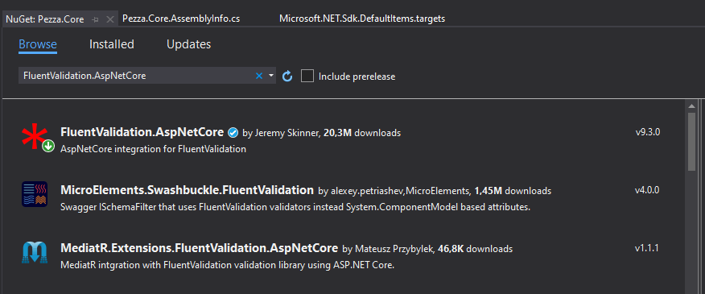
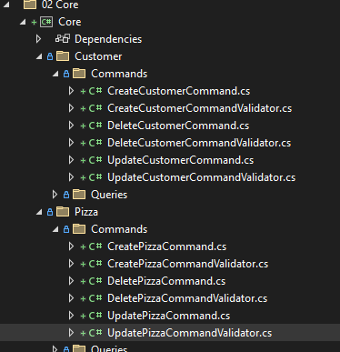
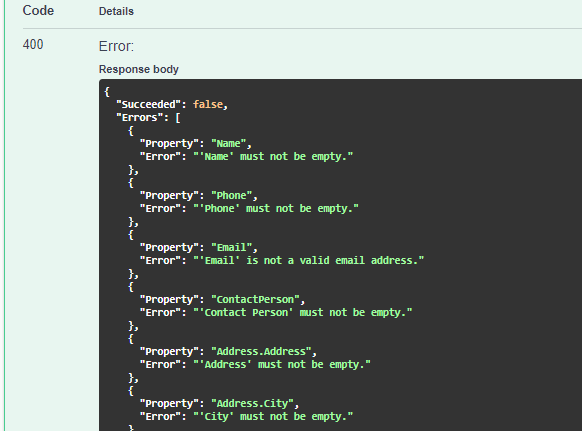

# &nbsp;**Pezza - Phase 4 - Step 1** [](https://github.com/entelect-incubator/.NET/actions/workflows/dotnet-phase4-step1.yml)

<br/><br/>

## **Install FluentValidation**

This helps us separate validation rules into separate classes for SOLID principal.

Install FluentValidation on the Core Project.



### **Add Validators to your Commands**

For every Command create a CommandNamevalidator.cs, because you only want to validate the data that gets send into the Command.

Add to GlobalUsings.cs in Core Project

```cs
global using Common.Mappers;
global using Common.Models;
global using Core.Pizza.Commands;
global using DataAccess;
global using FluentValidation;
global using Microsoft.EntityFrameworkCore;
global using Utilities.CQRS;
global using Utilities.Results;
```

Let's start with creating Validators for Pizza Commands.

Add a new class in the folder Pizza/Commands 

CreatePizzaCommandValidator.cs

```cs
namespace Core.Customer.Commands;

public class CreatePizzaCommandValidator : AbstractValidator<CreatePizzaCommand>
{
	public CreatePizzaCommandValidator()
	{
		this.RuleFor(r => r.Data.Name)
			.MaximumLength(100)
			.NotEmpty();

		this.RuleFor(r => r.Data.Description)
			.MaximumLength(500)
			.NotEmpty();

		this.RuleFor(r => r.Data.Price)
			.PrecisionScale(4, 2, false)
			.NotEmpty();
	}
}
```

DeletePizzaCommandValidator.cs

```cs
namespace Core.Customer.Commands;

public class DeletePizzaCommandValidator : AbstractValidator<DeletePizzaCommand>
{
	public DeletePizzaCommandValidator()
	{
		this.RuleFor(r => r.Id)
			.NotEmpty();
	}
}
```

UpdatePizzaCommandValidator.cs

```cs
namespace Core.Customer.Commands;

public class UpdatePizzaCommandValidator : AbstractValidator<UpdatePizzaCommand>
{
    public UpdatePizzaCommandValidator()
    {
        this.RuleFor(r => r.Data)
            .NotNull();

        this.RuleFor(r => r.Id)
            .NotEmpty();

        this.RuleFor(r => r.Data.Name)
            .MaximumLength(100);

        this.RuleFor(r => r.Data.Description)
            .MaximumLength(500);

		this.RuleFor(r => r.Data.Price)
			.PrecisionScale(4, 2, false);

	}
}
```

Now add validations for Customer Commands.



### Validation & Exception Handling

We use explicit validation in handlers combined with middleware to handle all validation errors and exceptions at the HTTP boundary. This provides a clean separation between business logic and error handling.

Make sure `FluentValidation.DependencyInjection` NuGet package is installed.

Update `DependencyInjection.cs` in Core Project to register validators:

```cs
namespace Core;

using System.Reflection;
using Microsoft.Extensions.DependencyInjection;

public static class DependencyInjection
{
	public static IServiceCollection AddApplication(this IServiceCollection services)
	{
		// Register all validators from the assembly
		services.AddValidatorsFromAssembly(Assembly.GetExecutingAssembly());

		return services;
	}
}
```

### Using ValidationHelper in Handlers

Each command/query handler is responsible for validating its request using `ValidationHelper`. This replaces the old pipeline behavior approach with explicit, testable validation.

Example in a command handler:

```cs
namespace Core.Pizza.Commands;

using Common.Helpers;
using MediatR;

public class CreatePizzaCommandHandler : IRequestHandler<CreatePizzaCommand, Result<PizzaModel>>
{
	private readonly IEnumerable<IValidator<CreatePizzaCommand>> validators;
	private readonly DatabaseContext database;

	public CreatePizzaCommandHandler(
		IEnumerable<IValidator<CreatePizzaCommand>> validators,
		DatabaseContext database)
	{
		this.validators = validators;
		this.database = database;
	}

	public async Task<Result<PizzaModel>> Handle(CreatePizzaCommand request, CancellationToken cancellationToken)
	{
		// Validate the request - throws ValidationException if invalid
		await ValidationHelper.ValidateAsync(request, this.validators, cancellationToken);

		// Business logic continues only if validation passes
		var pizza = new Pizza { ... };
		this.database.Pizzas.Add(pizza);
		await this.database.SaveChangesAsync(cancellationToken);

		return Result.Success(MapToPizzaModel(pizza));
	}
}
```

## Exception Handler Middleware

The middleware catches all exceptions including `ValidationException` and returns appropriate HTTP responses.

Create `ExceptionHandlerMiddleware.cs` in the Common/Behaviour folder:

```cs
namespace Common.Behaviour;

using System.Net;
using System.Text.Json;
using Microsoft.AspNetCore.Http;

public class ExceptionHandlerMiddleware
{
	private readonly RequestDelegate next;

	public ExceptionHandlerMiddleware(RequestDelegate next) => this.next = next;

	public async Task Invoke(HttpContext context)
	{
		try
		{
			await this.next(context);
		}
		catch (Exception ex)
		{
			await HandleExceptionAsync(context, ex);
		}
	}

	private static Task HandleExceptionAsync(HttpContext context, Exception exception)
	{
		if (exception.GetType() == typeof(FluentValidation.ValidationException))
		{
			var errors = ((FluentValidation.ValidationException)exception).Errors;
			if (errors.Any())
			{
				var failures = errors.Select(x =>
				{
					return new
					{
						Property = x.PropertyName.Replace("Data.", ""),
						Error = x.ErrorMessage.Replace("Data ", "")
					};
				});
				var result = Result.Failure(failures.ToList<object>());
				var resultJson = JsonSerializer.Serialize(result);

				context.Response.ContentType = "application/json";
				context.Response.StatusCode = (int)HttpStatusCode.BadRequest;
				return context.Response.WriteAsync(resultJson);
			}
		}

		var code = HttpStatusCode.InternalServerError;
		var result = JsonSerializer.Serialize(new { isSuccess = false, error = exception.Message });
		context.Response.ContentType = "application/json";
		context.Response.StatusCode = (int)code;

		return context.Response.WriteAsync(result);
	}
}
```

Register the middleware in `Startup.cs` in the `Configure()` method:

```cs
app.UseMiddleware(typeof(ExceptionHandlerMiddleware));
```

When validation rules are violated, a Bad Request (400) with validation errors will be returned.



## **STEP 2 - Filtering & Searching**

Move to Step 2

[Go to Phase 4 Step 2](https://github.com/entelect-incubator/.NET/tree/master/Phase%204/Step%202)
