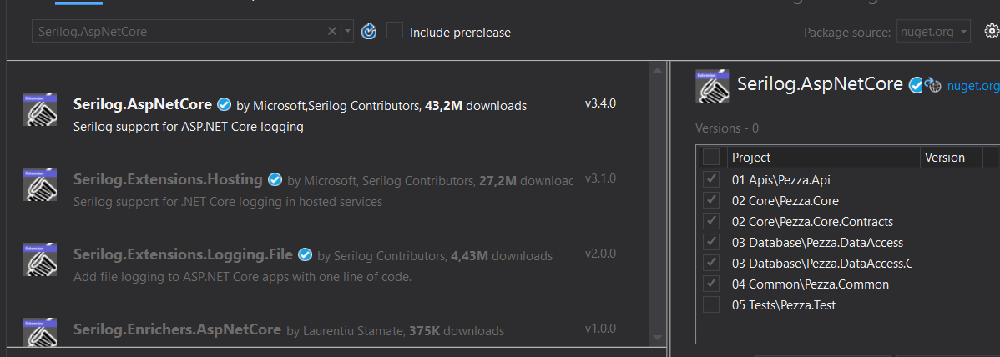

# &nbsp;**Pezza - Phase 4 - Step 2** [](https://github.com/entelect-incubator/.NET/actions/workflows/dotnet-phase4-step2.yml)

<br/><br/><br/>

## Error handling

Install Nuget Package Serilog.AspNetCore and Serilog.Sinks.File on all but the Pezza.Test project.



In the root of Pezza.Common, create Logging.cs as per the following code snippet. Notice that Logging is a static class. This makes it easy to use in any calling code without the need of injecting it.


```cs
namespace Pezza.Common
{
    using System;
    using Serilog;

    public static class Logging
    {
        public static void LogInfo(string name, object data)
        {
            Setup();
            Log.Information(name, data);
        }

        public static void LogException(Exception e)
        {
            Setup();
            Log.Fatal(e, "Exception");
        }

        private static void Setup() => Log.Logger = new LoggerConfiguration()
            .Enrich.FromLogContext()
            .WriteTo.File(@"logs\log.txt", rollingInterval: RollingInterval.Day)
            .CreateLogger();
    }
}
```
Modify ExceptionHandlerMiddleware.cs by logging an exception in the final else of the HandleExceptionAsync Method. All exceptions that we have not defined behaviour for gets handled here.

```cs
else
{
    var code = HttpStatusCode.InternalServerError;
    var result = JsonConvert.SerializeObject(new { isSuccess = false, error = exception.Message });
    context.Response.ContentType = "application/json";
    context.Response.StatusCode = (int)code;
    Common.Logging.Logging.LogException(exception);

    return context.Response.WriteAsync(result);
}
```

Update PerformanceBehaviour.cs by removing the old logging and using the new static Logging class instead.

```cs
namespace Pezza.Common.Behaviours
{
    using System.Diagnostics;
    using System.Threading;
    using System.Threading.Tasks;
    using MediatR;

    public class PerformanceBehaviour<TRequest, TResponse> : IPipelineBehavior<TRequest, TResponse>
    {
        private readonly Stopwatch timer;

        public PerformanceBehaviour()
        {
            this.timer = new Stopwatch();
        }

        public async Task<TResponse> Handle(TRequest request, CancellationToken cancellationToken, RequestHandlerDelegate<TResponse> next)
        {
            this.timer.Start();

            var response = await next();

            this.timer.Stop();

            var elapsedMilliseconds = this.timer.ElapsedMilliseconds;

            if (elapsedMilliseconds > 500)
            {
                var requestName = typeof(TRequest).Name;
                Logging.LogInfo($"CleanArchitecture Long Running Request: {requestName} ({elapsedMilliseconds} milliseconds)", request);
            }

            return response;
        }
    }
}
```

Serilog provides sinks for writing log events to storage in various formats. Read more on [provided sinks](https://github.com/serilog/serilog/wiki/Provided-Sinks) or move on to the next phase.


## **Move to Phase 5**

[Click Here](https://github.com/entelect-incubator/.NET/tree/master/Phase%205) 