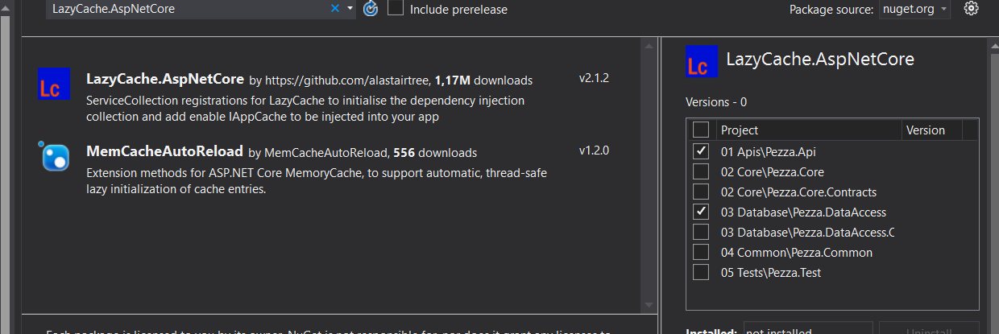

# &nbsp;**Pezza - Phase 5 - Step 1** [](https://github.com/entelect-incubator/.NET/actions/workflows/dotnet-phase5-step1.yml)

<br/><br/>

## **Caching**

### **Install Lazy Cache**

Install Nuget Package LazyCache.AspNetCore on Core and API



### **Dependency Injection in DependencyInjection.cs**

In API Startup.cs ConfigureServices() add

```cs
services.AddLazyCache();
```

This will inject IAppCache throughout your application.

This will cache the request to memory if it doesn't exist. When you change anything on the database it will bust the cache.

Add Data.cs in Common Project to hold the Cache Key.

```cs
namespace Common;

public static class Data
{
	public static string CacheKey = "PezzaPizza";
}
```

Modify filter to allows filtering on cached data

PizzaFilter.cs in Common Project

```cs
namespace Common.Filters;

using Common.Models;

public static class PizzaFilter
{
	public static IQueryable<Pizza> FilterByName(this IQueryable<Pizza> query, string name)
	{
		if (string.IsNullOrWhiteSpace(name))
		{
			return query;
		}

		return query.Where(x => x.Name.Contains(name));
	}

	public static IEnumerable<PizzaModel> FilterByName(this IEnumerable<PizzaModel> query, string name)
	{
		if (string.IsNullOrWhiteSpace(name))
		{
			return query;
		}

		return query.Where(x => x.Name.Contains(name));
	}

	public static IQueryable<Pizza> FilterByDescription(this IQueryable<Pizza> query, string description)
	{
		if (string.IsNullOrWhiteSpace(description))
		{
			return query;
		}

		return query.Where(x => x.Description.Contains(description));
	}

	public static IEnumerable<PizzaModel> FilterByDescription(this IEnumerable<PizzaModel> query, string description)
	{
		if (string.IsNullOrWhiteSpace(description))
		{
			return query;
		}

		return query.Where(x => x.Description.Contains(description));
	}

	public static IQueryable<Pizza> FilterByDateCreated(this IQueryable<Pizza> query, DateTime? dateCreated)
	{
		if (!dateCreated.HasValue)
		{
			return query;
		}

		return query.Where(x => x.DateCreated == dateCreated.Value);
	}

	public static IEnumerable<PizzaModel> FilterByDateCreated(this IEnumerable<PizzaModel> query, DateTime? dateCreated)
	{
		if (!dateCreated.HasValue)
		{
			return query;
		}

		return query.Where(x => x.DateCreated == dateCreated.Value);
	}
}
```

Modify GetRestaurantsQuery.cs to add caching

```cs
namespace Core.Pizza.Queries;

using System.Linq;
using LazyCache;

public class GetPizzasQuery : IRequest<ListResult<PizzaModel>>
{
	public SearchPizzaModel Data { get; set; }

	public class GetPizzasQueryHandler(DatabaseContext databaseContext, IAppCache cache) : IRequestHandler<GetPizzasQuery, ListResult<PizzaModel>>
	{
		private readonly TimeSpan cacheExpiry = new(12, 0, 0);

		public async Task<ListResult<PizzaModel>> Handle(GetPizzasQuery request, CancellationToken cancellationToken)
		{
			var entity = request.Data;

			Task<IEnumerable<PizzaModel>> DataDelegate() => this.GetData();
			var cachedData = await cache.GetOrAddAsync(Common.Data.CacheKey, DataDelegate, this.cacheExpiry);

			if(cachedData != null)
			{
				var data = cachedData?
					.FilterByName(entity.Name)
					.FilterByDescription(entity.Description)
					.OrderBy(x => x.DateCreated)
					.ToList();

				return ListResult<PizzaModel>.Success(data, cachedData.Count());
			}

			if (string.IsNullOrEmpty(entity.OrderBy))
			{
				entity.OrderBy = "DateCreated desc";
			}

			var entities = databaseContext.Pizzas
				.Select(x => x)
				.AsNoTracking()
				.FilterByName(entity.Name)
				.FilterByDescription(entity.Description)
				.OrderBy(entity.OrderBy);

			var count = entities.Count();
			var paged = await entities.ApplyPaging(entity.PagingArgs).ToListAsync(cancellationToken);

			return ListResult<PizzaModel>.Success(paged.Map(), count);
		}

		private async Task<IEnumerable<PizzaModel>> GetData()
		{
			var entities = await databaseContext.Pizzas.Select(x => x)
				.AsNoTracking()
				.ToListAsync();

			return entities.Map();
		}
	}
}
```

Remember to bust the cache when ever a CRUD operation happens. Add the following to the Pizza Commands.

In the Primary Constructor

```cs
public class UpdatePizzaCommandHandler(DatabaseContext databaseContext, IAppCache cache) : IRequestHandler<UpdatePizzaCommand, Result<PizzaModel>>
```

After the Command has finished

```cs
cache.Remove(Common.Data.CacheKey);
```

## **Unit Test**

Add CachingService to QueryTestBase

```cs
namespace Test.Setup;

using LazyCache;
using static DatabaseContextFactory;

public class QueryTestBase : IDisposable
{
	public CachingService CachingService = new();

	public DatabaseContext Context => Create();

	public void Dispose() => Destroy(this.Context);
}
```

Add CachingService to all RestaurantDataAccess constructors

```cs
var sutGetAll = new GetPizzasQueryHandler(this.Context, this.CachingService);
```

Move to Phase 5 Step 2
[Click Here](https://github.com/entelect-incubator/.NET/tree/master/Phase%205/Step%202)