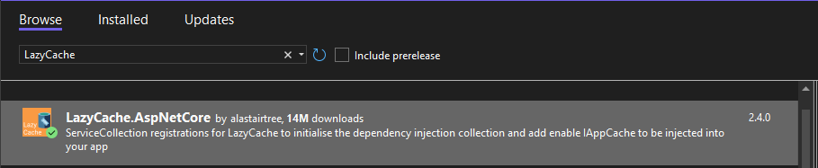

# &nbsp;**E List - Phase 5 - Step 1** [](https://github.com/entelect-incubator/.NET/actions/workflows/dotnet-phase5-step1.yml)

<br/><br/>

## **Caching**

### **Install Lazy Cache**

Install Nuget Package LazyCache.AspNetCore on Core Project



### **Dependency Injection in DependencyInjection.cs**

In Core Project DependencyInjection.cs add

```cs
services.AddLazyCache();
```

This will inject IAppCache throughout your application.

This will cache the request to memory if it doesn't exist. When you change anything on the database it will bust the cache.

Add CacheData.cs in Common Project to hold the Cache Key.

```cs
namespace Common;

public static class CacheData
{
	public static string CacheKey = "EListPizza";
}
```

Modify Filter to Allow Filtering on Cached Data Objective: Enhance your filter logic to work with data that might be retrieved from a cache. This ensures that the filtering logic is applied not only to fresh data from the database but also to cached data.

Steps: Update Filter Logic: Modify the filter methods to ensure they work with both fresh and cached data. Ensure the filtering logic remains consistent regardless of the data source.

Implement Caching: Introduce or update a caching mechanism in your application to store and retrieve filtered data. You might use in-memory caching, distributed caching, or a caching library.

Apply Filters to Cached Data: Ensure that when data is fetched from the cache, your filter logic can be applied as if it were a fresh query.

Example:

csharp Copy code public static IQueryable<Todo> FilterByDateCreated( this IQueryable<Todo> query, DateTime? dateCreated = null, int? year = null, int? month = null, int? day = null) { if (dateCreated.HasValue) { return query.Where(x => x.DateCreated.HasValue && x.DateCreated.Value.Date == dateCreated.Value.Date); }

    if (year.HasValue)
    {
        query = query.Where(x => x.DateCreated.HasValue && x.DateCreated.Value.Year == year.Value);
    }

    if (month.HasValue)
    {
        query = query.Where(x => x.DateCreated.HasValue && x.DateCreated.Value.Month == month.Value);
    }

    if (day.HasValue)
    {
        query = query.Where(x => x.DateCreated.HasValue && x.DateCreated.Value.Day == day.Value);
    }

    return query;

} Test Caching Behavior: Ensure that your filter logic works correctly when applied to both cached and non-cached data. Test cases should cover scenarios where data is retrieved from the cache and when the cache is empty or expired.

2. Modify GetRestaurantsQuery.cs to Add Caching Objective: Update GetRestaurantsQuery.cs to incorporate caching to improve performance and reduce database load.

Steps: Introduce Caching Mechanism: Add a caching service or use an existing one to store and retrieve restaurant data.

Update Query Method: Modify the GetRestaurantsQuery method to first check the cache before querying the database. If data is found in the cache, return it; otherwise, fetch from the database and cache the result.

Example:

csharp Copy code public class GetRestaurantsQuery { private readonly IRestaurantRepository \_restaurantRepository; private readonly ICacheService \_cacheService;

    public GetRestaurantsQuery(IRestaurantRepository restaurantRepository, ICacheService cacheService)
    {
        _restaurantRepository = restaurantRepository;
        _cacheService = cacheService;
    }

    public async Task<IList<Restaurant>> ExecuteAsync(RestaurantFilter filter)
    {
        var cacheKey = $"Restaurants_{filter}";
        var cachedResult = await _cacheService.GetAsync<IList<Restaurant>>(cacheKey);

        if (cachedResult != null)
        {
            return cachedResult;
        }

        var restaurants = await _restaurantRepository.GetAllAsync();
        var filteredRestaurants = filter.ApplyFilters(restaurants.AsQueryable()).ToList();

        await _cacheService.SetAsync(cacheKey, filteredRestaurants, TimeSpan.FromMinutes(10));

        return filteredRestaurants;
    }

} Implement Caching Logic: Ensure that the caching service (ICacheService in this example) supports methods for getting and setting cached data. The cache should be invalidated or refreshed based on your application's requirements.

Update Caching Strategy: Determine how long data should be cached (e.g., time-based expiration) and ensure your strategy aligns with your application's needs.

Test Caching Integration: Verify that the caching mechanism works correctly. Ensure that:

Data is cached and retrieved correctly. Cache invalidation or refreshing is handled appropriately. Performance improvements are observed. Summary Modify Filters: Ensure that your filters work with both cached and fresh data. Update Query: Add caching logic to the GetRestaurantsQuery to improve performance. Test: Verify that caching is working as expected and that your filters apply correctly to cached data. This approach helps improve the efficiency of your application by reducing the load on your database and enhancing response times through effective caching strategies.

```cs
namespace Core.Todos.Queries;

using Common;
using Common.Entities;
using Common.Models.Todos;
using LazyCache;

public class GetTodosQuery : IRequest<Result<IEnumerable<TodoModel>>>
{
	public required SearchTodoModel Data { get; set; }
}

public class GetTodosQueryHandler(DatabaseContext databaseContext, IAppCache cache) : IRequestHandler<GetTodosQuery, Result<IEnumerable<TodoModel>>>
{
	private readonly TimeSpan CacheExpiry = new(12, 0, 0);

	public async Task<Result<IEnumerable<TodoModel>>> Handle(GetTodosQuery request, CancellationToken cancellationToken)
	{
		var entity = request.Data!;

		Task<IEnumerable<Todo>> DataDelegate() => this.GetData();
		var cachedData = await cache.GetOrAddAsync(CacheData.CacheKey, DataDelegate, this.CacheExpiry);

		if (cachedData is not null)
		{
			var data = cachedData?.AsQueryable()
				.FilterByTask(entity.Task)
				.FilterByCompleted(entity.IsCompleted)
				.FilterByDate(entity.DateCreated, entity.Year, entity.Month, entity.Day)
				.OrderBy(x => x.DateCreated)
				.ToList()!;

			return Result<IEnumerable<TodoModel>>.Success(data.Map(), cachedData.Count());
		}

		if (string.IsNullOrEmpty(entity.OrderBy))
		{
			entity.OrderBy = "DateCreated desc";
		}

		var entities = databaseContext.Todos.Select(x => x)
			.AsNoTracking()
			.FilterByTask(entity.Task)
			.FilterByCompleted(entity.IsCompleted)
			.FilterByDate(entity.DateCreated, entity.Year, entity.Month, entity.Day)
			.OrderBy(entity.OrderBy);

		var count = entities.Count();
		var paged = await entities.ApplyPaging(entity.PagingArgs).ToListAsync(cancellationToken);

		return Result<IEnumerable<TodoModel>>.Success(paged.Map(), count);
	}

	private async Task<IEnumerable<Todo>> GetData()
	{
		var entities = await databaseContext.Todos.Select(x => x)
			.AsNoTracking()
			.ToListAsync();

		return entities;
	}
}
```

To ensure that your cache is invalidated or "busted" whenever a CRUD (Create, Read, Update, Delete) operation occurs, you'll need to add cache-busting logic to your Todo commands. This ensures that the cache remains consistent with the data in your database.

In the Primary Constructor

```cs
public class UpdatePizzaCommandHandler(DatabaseContext databaseContext, IAppCache cache) : IRequestHandler<UpdatePizzaCommand, Result<PizzaModel>>
```

After the Command has finished

```cs
cache.Remove(Common.CacheData.CacheKey);
```

## **Unit Test**

Add CachingService to QueryTestBase

```cs
namespace Test.Setup;

using LazyCache;
using static DatabaseContextFactory;

public class QueryTestBase : IDisposable
{
	public CachingService CachingService = new();

	public DatabaseContext Context => Create();

	public void Dispose() => Destroy(this.Context);
}
```

Add CachingService to all AddTodoCommandHandler and GetTodosQueryHandler

```cs
var sutCreate = new AddTodoCommandHandler(this.Context, this.CachingService);
```

Ensure that you include mocking for the caching service in your unit tests. This allows you to verify that cache-related operations, such as invalidation and retrieval, are correctly handled by your commands. Use a mocking framework to simulate the behavior of the caching service and test how your application interacts with it, ensuring that your cache-busting logic is thoroughly tested and behaves as expected.

Move to Phase 5 Step 2 [Click Here](https://github.com/entelect-incubator/.NET/tree/master/Phase%205/Step%202)
