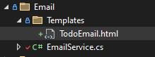
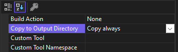

# &nbsp;**E List - Phase 6 - Step 1** [](https://github.com/entelect-incubator/.NET/actions/workflows/dotnet-phase6-step1.yml)

<br/><br/>

We are going to create a basic Email Service using [FluentEmail](https://github.com/lukencode/FluentEmail) and [SendGrid](https://sendgrid.com/).

## **FluentEmail**

Install FluentEmail.Core, HtmlAgilityPack and FluentEmail.Smtp on Core.


Create a new folder called Email in Core. Create a file inside the folder called EmailService.cs and add the following code.

You can just use your own GMail Smtp Credentials to test with.

```cs
namespace Core.Email;

using System.Text.RegularExpressions;
using Common.Models.Todos;
using FluentEmail.Core;
using HtmlAgilityPack;

public class EmailService
{
	public string HtmlContent { get; set; }

	public string ToEmail { get; set; }

	public TodoModel Model { get; set; }

	public async Task<Result> SendEmail()
	{
		var doc = new HtmlDocument();
		doc.LoadHtml(this.HtmlContent);
		var plainText = doc.DocumentNode.SelectSingleNode("//body").InnerText;
		plainText = Regex.Replace(plainText, @"\s+", " ").Trim();

		var email = await Email
			.From("todos@elist.com", "EList")
			.To(this.ToEmail)
			.Subject("Todo item(s) is about to expire")
			.Body(this.HtmlContent)
			.PlaintextAlternativeBody(plainText)
			.SendAsync();

		return email.Successful ? Result.Success() : Result.Failure("Email could not send");
	}
}
```

We will use an HTML template file. This template file can be read in code and the tags inside the template will be replaced with actual content before it gets sent to the customer.

Create TodoEmail.html inside Core\Email\Templates.

Copy the HTML from Assets called email.html.



Right-click on TodoEmail.html Properties and choose Copy always for Copy to Output.



In the next step we will look at how to call the email service with the use of MediatR events.

## **STEP 2 - Event**

Move to Step 2 [Click Here](https://github.com/entelect-incubator/.NET/tree/master/Phase%206/Step%202)
