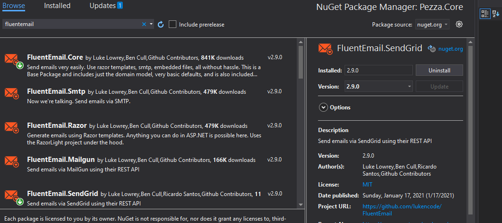
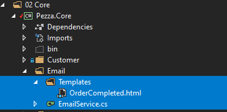
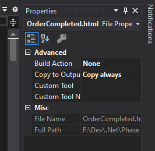

# &nbsp;**Pezza - Phase 6 - Step 1** [](https://github.com/entelect-incubator/.NET/actions/workflows/dotnet-phase6-step1.yml)

<br/><br/>

We are going to create a basic Email Service using [FluentEmail](https://github.com/lukencode/FluentEmail) and [SendGrid](https://sendgrid.com/).

## **FluentEmail**

Install FluentEmail.Core, HtmlAgilityPack and FluentEmail.SendGrid on Pezza.Core.



You will need to set up a SendGrid account to execute the code in this phase.

- [ ] [Create a SendGrid account](https://signup.sendgrid.com/)
- [ ] [Read more about SendGrid API Keys](https://sendgrid.com/docs/ui/account-and-settings/api-keys/)
- [ ] [Create API Key](https://app.sendgrid.com/settings/api_keys)

Create a new folder called Email in Pezza.Core. Create a file inside the folder called EmailService.cs and add the following code.

```cs
namespace Pezza.Core.Email
{
    using System.Text.RegularExpressions;
    using System.Threading.Tasks;
    using HtmlAgilityPack;
    using Pezza.Common.DTO;
    using Pezza.Common.Models;
    using SendGrid;
    using SendGrid.Helpers.Mail;

    public class EmailService
    {
        public string HtmlContent { get; set; }

        public CustomerDTO Customer { get; set; }

        public async Task<Result> SendEmail()
        {
            var doc = new HtmlDocument();
            doc.LoadHtml(this.HtmlContent);
            var plainText = doc.DocumentNode.SelectSingleNode("//body").InnerText;
            plainText = Regex.Replace(plainText, @"\s+", " ").Trim();

            var apiKey = "YOUR-API-KEY";
            var client = new SendGridClient(apiKey);
            var from = new EmailAddress("notify@pezza.com", "Pezza");
            var subject = $"Collect your order it while it's hot";
            var to = new EmailAddress(this.Customer?.Email, this.Customer?.Name);
            var plainTextContent = plainText;
            var htmlContent = this.HtmlContent;
            var msg = MailHelper.CreateSingleEmail(from, to, subject, plainTextContent, htmlContent);
            var response = await client.SendEmailAsync(msg);

            return response.StatusCode != System.Net.HttpStatusCode.OK ? Result.Failure("Email could not send") : Result.Success();
        }
    }
}
```
We will use an HTML template file. This template file can be read in code and the tags inside the template will be replaced with actual content before it gets sent to the customer.

Create OrderCompleted.html inside Pezza.Core\Email\Templates.

Copy the HTML from **Phase 6\src\04. Step 3\Pezza.Core\Email\Templates\OrderCompleted.html** into your newly created OrderCompleted.html.



The HTML might look a bit strange to you. It is because it is made for email client support.

Right-click on OrderCompleted.html and choose Copy always for Copy to Output.



In the next step we will look at how to call the email service with the use of MediatR events.

## **STEP 2 - Event**

Move to Step 2
[Click Here](https://github.com/entelect-incubator/.NET/tree/master/Phase%206/Step%202) 