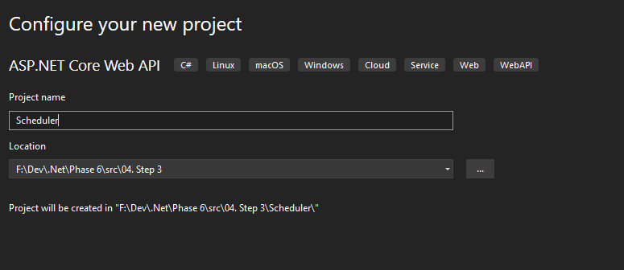
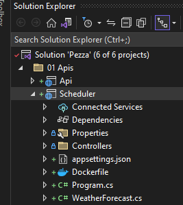
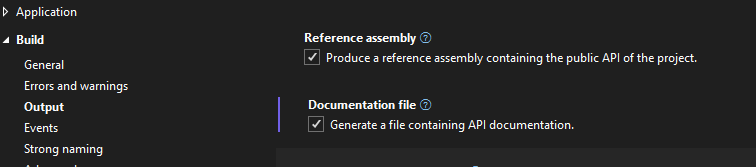
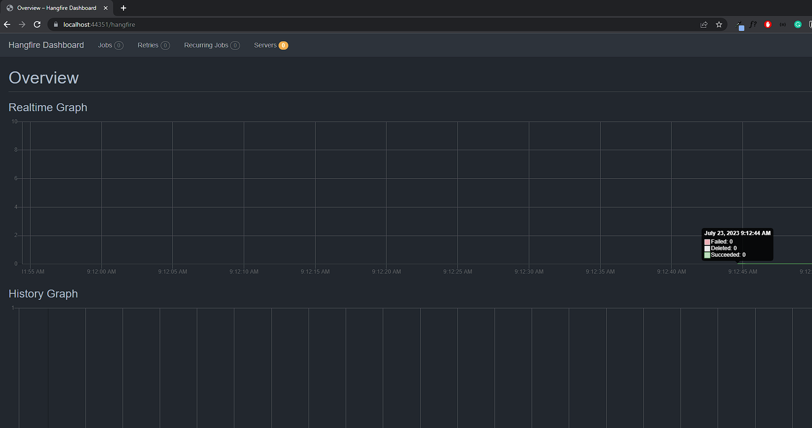
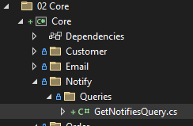
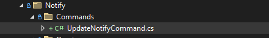
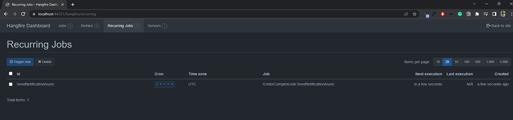
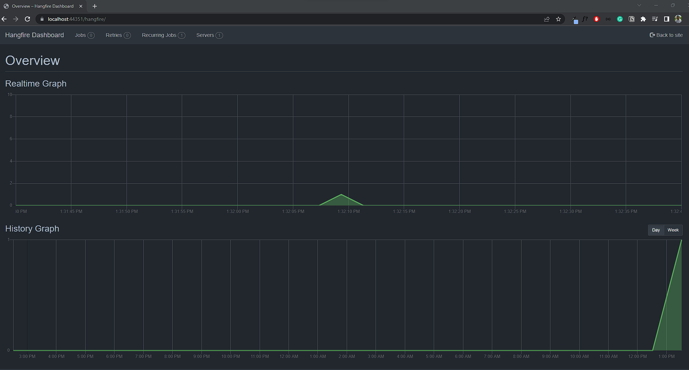

# &nbsp;**Pezza - Phase 6 - Step 3** [](https://github.com/entelect-incubator/.NET/actions/workflows/dotnet-phase6-step3.yml)

<br/><br/>

## **Schedule Background Jobs**

**Disclaimer**: This solution is effective for on-premises or virtual hosting environments. However, transitioning to a Cloud Native environment may introduce certain complexities. If you are utilizing AWS, it is recommended to employ AWS Step Functions, or if you are on Azure, Azure Logic Apps are a suitable choice. If these options are not feasible, consider exploring infrastructure options that support long-running applications such as AWS Fargate or Azure Containers.

<br/>
<hr/>
<br/>

[Hangfire](https://www.hangfire.io/) provides an easy way to perform background processing in .NET and .NET applications. No Windows Service or separate process is required.

The benefit of using Hangfire is that it comes with a Dashboard. [Hangfire Dashboard](https://docs.hangfire.io/en/latest/configuration/using-dashboard.html) is a place where you could find all the information about your background jobs. It is written as an OWIN middleware, so you can plug it into your ASP.NET, ASP.NET MVC, Nancy, ServiceStack application as well as use the OWIN Self-Host feature to host Dashboard inside console applications or in Windows Services.

General problems with relying on the external systems are fire and forget or performance. You send a request out, but what happens if it fails or times out? Do you impact the system by waiting for this request to be sent?

Read more on [Fire and Forget Pattern](https://ducmanhphan.github.io/2020-02-24-fire-and-forget-pattern/).

## Solution...

Adding the request on a type of queue system and forgetting about the result. You can also implement a webhook/event when the request is done. In this Step, we will only look at adding on the Notify table and using the Hangfire job to read any emails that haven't been sent.

## **Scheduler**

Create a new ASP.NET Web Application Scheduler under 01. Apis





## **Nuget Packages**

Once the project is ready, I will open the NuGet package manager UI and add the necessary NuGet packages. The three main Nuget packages needed for hangfire are:

- [ ] Hangfire.Core – The core package that supports the core logic of Hangfire
- [ ] Hangfire.AspNetCore – Support for ASP.NET Middleware and Middleware for the dashboard user interface
- [ ] Hangfire.InMemory - In-memory job storage for Hangfire with transactional implementation.
- [ ] Microsoft.Extensions.DependencyInjection
- [ ] Microsoft.AspNetCore.Mvc.NewtonsoftJson
- [ ] LazyCache.AspNetCore

Remove WeatherForecast.cs and WeatherForecastController.cs

Copy Program.cs, GlobalUsings.cs and Startup.cs from Api project

## **Configuring Hangfire**

Once all the NuGet packages are installed, it is time to configure the server. To do that, I will open the Startup.cs file and update the ConfigureServices method of the Startup class.

GlobalUsings.cs

```cs
global using DataAccess;
```

Program.cs

```cs
var builder = WebApplication.CreateBuilder(args);
var startup = new Api.Startup(builder.Configuration);
startup.ConfigureServices(builder.Services); // calling ConfigureServices method
var app = builder.Build();
startup.Configure(app, builder.Environment); // calling Configure method
```

```cs
services.AddHangfire(config =>
			config
				.UseSimpleAssemblyNameTypeSerializer()
				.UseDefaultTypeSerializer()
				.UseInMemoryStorage());
		services.AddHangfireServer();
```

In the Project properties remember to turn XML Documentation on



In the above code, the AddHangfire method takes an Action delegate, which passes IGlobalConfiguration of the Hangfire ecosystem to configure the Hangfire.

Next, I will call the UseSimpleAssemblyNameTypeSerializer and UseDefaultTypeSerializer one after the other, to set serialization configuration.

Finally, I will call UseInMemoryStorage and will use InMemory for this Incubator.

Next, I will call the extension method AddHangfireServer on the IServiceCollection instance to add the Hangfire server to the dependency injection container. Which we will use later to configure and run jobs.

## **Dashboard**

Once the basic setup for the dependency injection container is done, now I will add the middleware needed to add the Hangfire Dashboard UI. For that, I will call the extension method UseHangfireDashboard on the IApplicationBuilder instance in the Configure method of the Scheduler StartUp class.

```cs
app.UseHangfireDashboard();
```

Add Common Project to Scheduler Project

Final Startup.cs

Startup.cs

```cs
namespace Api;

using System.Reflection;
using System.Text.Json.Serialization;
using Common.Behaviour;
using Core;
using Hangfire;
using Microsoft.AspNetCore.Builder;
using Microsoft.AspNetCore.Hosting;
using Microsoft.AspNetCore.ResponseCompression;
using Microsoft.EntityFrameworkCore;
using Microsoft.Extensions.Configuration;
using Microsoft.Extensions.DependencyInjection;
using Microsoft.OpenApi.Models;
using Newtonsoft.Json;
using Newtonsoft.Json.Serialization;
using Scheduler.Jobs;

public class Startup
{
	public Startup(IConfiguration configuration) => this.ConfigRoot = configuration;

	public IConfiguration ConfigRoot
	{
		get;
	}

	public void ConfigureServices(IServiceCollection services)
	{
		services.AddHangfire(config =>
			config
				.UseSimpleAssemblyNameTypeSerializer()
				.UseDefaultTypeSerializer()
				.UseInMemoryStorage());
		services.AddHangfireServer();

		services.AddControllers(options => options.SuppressImplicitRequiredAttributeForNonNullableReferenceTypes = true)
			.AddJsonOptions(options => options.JsonSerializerOptions.Converters.Add(new JsonStringEnumConverter()))
			.AddNewtonsoftJson(x => x.SerializerSettings.ContractResolver = new DefaultContractResolver())
			.AddNewtonsoftJson(x => x.SerializerSettings.ReferenceLoopHandling = ReferenceLoopHandling.Ignore);

		DependencyInjection.AddApplication(services);
		services.AddSwaggerGen(c =>
		{
			c.SwaggerDoc("v1", new OpenApiInfo
			{
				Title = "Pezza API",
				Version = "v1"
			});

			var xmlFile = $"{Assembly.GetExecutingAssembly().GetName().Name}.xml";
			var xmlPath = Path.Combine(AppContext.BaseDirectory, xmlFile);
			c.IncludeXmlComments(xmlPath);
		});

		services.AddLazyCache();
		services.AddDbContext<DatabaseContext>(options =>
			options.UseInMemoryDatabase(Guid.NewGuid().ToString()));

		services.AddResponseCompression(options =>
		{
			options.Providers.Add<BrotliCompressionProvider>();
			options.Providers.Add<GzipCompressionProvider>();
		});
		services.AddResponseCompression();

		services.AddScoped<IOrderCompleteJob, OrderCompleteJob>();
	}

	public void Configure(WebApplication app, IWebHostEnvironment env)
	{
		app.UseSwagger();
		app.UseSwaggerUI(c => c.SwaggerEndpoint("/swagger/v1/swagger.json", "Pezza Scheduler API V1"));
		app.UseHttpsRedirection();
		app.UseMiddleware(typeof(ExceptionHandlerMiddleware));
		app.UseRouting();
		app.UseEndpoints(endpoints => endpoints.MapControllers());
		app.UseAuthorization();
		app.UseResponseCompression();
		app.UseHangfireDashboard();

		var jobOptions = new RecurringJobOptions()
		{
			TimeZone = TimeZoneInfo.Local
		};
		RecurringJob.AddOrUpdate<IOrderCompleteJob>("SendNotificationAsync", x => x.SendNotificationAsync(), "0 * * ? * *");

		app.Run();
	}	
}
```

## **Running the Scheduler**

Set Scheduler as Startup Project

Now, the above job will just print Run Hangfire job while it's hot! to the console output.

I will run the application to see the output as well as the Hangfire dashboard UI. To access the dashboard UI, we will navigate to the resource /hangfire.



## **Create a very basic notifications Queue**

Add new Notify Entity in Common\Entities

```cs
namespace Common.Entities;

public class Notify
{
	public int Id { get; set; }

	public required int CustomerId { get; set; }

	public required string CustomerEmail { get; set; }

	public required string EmailContent { get; set; }

	public required bool Sent { get; set; }

	public DateTime? DateSent { get; set; }

	public virtual Customer Customer { get; set; }
}
```

Add Notifies to Customer.cs Entity

```cs
namespace Common.Entities;

public sealed class Customer
{
	public Customer() => this.Notifies = new HashSet<Notify>();

	public int Id { get; set; }

	public required string Name { get; set; }

	public string? Address { get; set; }

	public string? Email { get; set; }

	public string? Cellphone { get; set; }

	public DateTime DateCreated { get; set; }

	public ICollection<Notify> Notifies { get; }
}
```


Add new Database Mapping in DataAccess\Mapping

```cs
namespace DataAccess.Mapping;

using System.Reflection.Emit;
using System.Security.Claims;
using Common.Entities;
using Microsoft.EntityFrameworkCore;

public sealed class NotifyMap : IEntityTypeConfiguration<Notify>
{
	public void Configure(Microsoft.EntityFrameworkCore.Metadata.Builders.EntityTypeBuilder<Notify> builder)
	{
		builder.ToTable("Notify", "dbo");

		builder.HasKey(t => t.Id);

		builder.Property(t => t.Id)
			.IsRequired()
			.HasColumnName("Id")
			.HasColumnType("int")
			.ValueGeneratedOnAdd();

		builder.Property(t => t.CustomerId)
			.IsRequired()
			.HasColumnName("CustomerId")
			.HasColumnType("int");

		builder.Property(t => t.CustomerEmail)
			.IsRequired()
			.HasColumnName("CustomerEmail")
			.HasColumnType("varchar(500)")
			.HasMaxLength(500);

		builder.Property(t => t.EmailContent)
			.HasColumnName("EmailContent")
			.HasColumnType("varchar(max)");

		builder.Property(t => t.Sent)
			.HasColumnName("Sent")
			.HasColumnType("bool");

		builder.Property(t => t.DateSent)
			.IsRequired()
			.HasColumnName("DateSent")
			.HasColumnType("datetime");

		builder.HasOne(y => y.Customer)
			.WithMany(x => x.Notifies)
			.HasForeignKey(x => x.CustomerId);
	}
}
```

Modify DatabaseContext to have the new Notify Entity and Mapping

```cs
namespace DataAccess;

public class DatabaseContext : DbContext
{
	public DatabaseContext()
	{
	}

	public DatabaseContext(DbContextOptions options) : base(options)
	{
	}

	public virtual DbSet<Customer> Customers { get; set; }

	public virtual DbSet<Pizza> Pizzas { get; set; }

	public virtual DbSet<Notify> Notifies { get; set; }

	protected override void OnModelCreating(ModelBuilder modelBuilder)
	{
		modelBuilder.ApplyConfiguration(new CustomerMap());
		modelBuilder.ApplyConfiguration(new PizzaMap());
		modelBuilder.ApplyConfiguration(new NotifyMap());
	}

	protected override void OnConfiguring(DbContextOptionsBuilder optionsBuilder) => optionsBuilder.UseInMemoryDatabase(databaseName: "PezzaDb");
}
```

Modify OrderEvent to add Order to Notify table instead of the fire and forget.

```cs
namespace Core.Order.Events;

using System.Text;
using Common.Entities;
using Common.Models.Order;
using DataAccess;

public class OrderEvent : INotification
{
	public OrderModel Data { get; set; }
}

public class OrderEventHandler(DatabaseContext databaseContext) : INotificationHandler<OrderEvent>
{
	async Task INotificationHandler<OrderEvent>.Handle(OrderEvent notification, CancellationToken cancellationToken)
	{
		var path = AppDomain.CurrentDomain.BaseDirectory + "\\Email\\Templates\\OrderCompleted.html";
		var html = File.ReadAllText(path);

		html = html.Replace("%name%", Convert.ToString(notification.Data.Customer.Name));

		var pizzasContent = new StringBuilder();
		foreach (var pizza in notification.Data.Pizzas)
		{
			pizzasContent.AppendLine($"<strong>{pizza.Name}</strong> - {pizza.Description}<br/>");
		}

		html = html.Replace("%pizzas%", pizzasContent.ToString());

		databaseContext.Notifies.Add(new Notify
		{
			CustomerId = notification.Data.Customer.Id,
			CustomerEmail = notification.Data?.Customer?.Email,
			DateSent = null,
			EmailContent = html,
			Sent = false
		});
		await databaseContext.SaveChangesAsync(cancellationToken);
	}
}
```

Add new GetNotifiesQuery in Core Project



```cs
namespace Core.Pizza.Queries;

using Common.Entities;

public class GetNotifiesQuery : IRequest<ListResult<Notify>>
{
}

public class GetNotifiesQueryHandler(DatabaseContext databaseContext) : IRequestHandler<GetNotifiesQuery, ListResult<Notify>>
{
	public async Task<ListResult<Notify>> Handle(GetNotifiesQuery request, CancellationToken cancellationToken)
	{
		var entities = databaseContext.Notifies
			.Select(x => x)
			.Include(x => x.Customer)
			.Where(x => x.Sent == false)
			.AsNoTracking();

		var count = entities.Count();
		var data = await entities.ToListAsync(cancellationToken);

		return ListResult<Notify>.Success(data, count);
	}
}
```

Add UpdateNotifyCommand to Modify Sent if Email was sent



```cs
namespace Core.Notify.Commands;

public class UpdateNotifyCommand : IRequest<Result>
{
	public int Id { get; set; }

	public bool Sent { get; set; }
}

public class UpdateNotifyCommandHandler(DatabaseContext databaseContext) : IRequestHandler<UpdateNotifyCommand, Result>
{
	public async Task<Result> Handle(UpdateNotifyCommand request, CancellationToken cancellationToken)
	{
		var query = EF.CompileAsyncQuery((DatabaseContext db, int id) => db.Notifies.FirstOrDefault(c => c.Id == id));
		var findEntity = await query(databaseContext, request.Id);
		if (findEntity == null)
		{
			return Result.Failure("Not found");
		}

		findEntity.Sent = request.Sent;

		var outcome = databaseContext.Notifies.Update(findEntity);
		var result = await databaseContext.SaveChangesAsync(cancellationToken);

		return result > 0 ? Result.Success() : Result.Failure("Error");
	}
}
```

## **Create a recurring job**

Creating a background job as we did above is easy with Hangfire, but it is as easy using an instance of Task class as well. So why go with something like Hangfire and install all these packages into the project?

Well, the main advantage of Hangfire comes in when we use it to create scheduling jobs. It uses CRON expressions for scheduling.

Let us say we need to create a job that is responsible for finding any emails in Notify table that hasn't been send and send them out.

Create a new folder called Jobs inside Scheduler and inside that IOrderCompleteJob.cs interface and OrderCompleteJob.cs.

```cs
namespace Scheduler.Jobs;

using System.Threading.Tasks;
using Common;
using Common.Mappers;
using Core.Email;
using Core.Notify.Commands;
using Core.Pizza.Queries;
using MediatR;

public interface IOrderCompleteJob
{
	Task SendNotificationAsync();
}

public sealed class OrderCompleteJob(IMediator mediator) : IOrderCompleteJob
{
	public async Task SendNotificationAsync()
	{
		var notifiesResult = await mediator.Send(new GetNotifiesQuery());

		if (notifiesResult.Succeeded)
		{
			foreach (var notification in notifiesResult.Data)
			{
				var emailService = new EmailService
				{
					Customer = notification.Customer.Map(),
					HtmlContent = notification.EmailContent
				};
				var emailResult = await emailService.SendEmail();
				if (emailResult.Succeeded)
				{
					notification.Sent = true;
					var updateNotifyResult = await mediator.Send(new UpdateNotifyCommand
					{
						Id = notification.Id,
						Sent = true
					});
					if (!updateNotifyResult.Succeeded)
					{
						Logging.LogException(new Exception(string.Join("", updateNotifyResult.Errors)));
					}
				}
			}
		}
	}
}
```

## **Configure Startup class**

Once the OrderCompleteJob class is created, it is time to configure the Startup class. In the Startup class, the objective is to configure a recurring job to call the SendNotificationAsync method every minute.

Firstly, I will add the OrderCompleteJob to the dependency injection container in the ConfigureServices method.

At the end of ConfigureServices in Startup.cs

```cs
services.AddScoped<IOrderCompleteJob, OrderCompleteJob>();
```

Secondly, I will update the Configure method to take two new parameters. The first one is the IRecurringJobManager necessary for creating a recurring job. And the second one is the IServiceProvider to get the IOrderCompleteJob instance from the dependency injection container.

Thirdly, I will call the AddOrUpdate on the RecurringJobManager instance to set up a recurring job at the end of Configure method in Startup.cs.

```cs
var jobOptions = new RecurringJobOptions()
{
	TimeZone = TimeZoneInfo.Local
};
RecurringJob.AddOrUpdate<IOrderCompleteJob>("SendNotificationAsync", x => x.SendNotificationAsync(), "0 * * ? * *");
```

In the above code, the CRON expression "* * * * *" is an expression to run the job every minute.





## **Step 4 - Orders**

Move to Step 4
[Click Here](https://github.com/entelect-incubator/.NET/tree/master/Phase%206/Step%204)