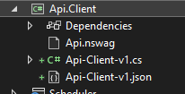

# &nbsp;**E List - Phase 7** [](https://github.com/entelect-incubator/.NET/actions/workflows/dotnet-phase7-startsolution.yml)

<br/><br/>

### **Microservices**

Microservices have become a popular architectural pattern in modern software development, providing a scalable and flexible approach to building applications. In the context of C# development, NSwag.AspNetCore is a powerful tool that facilitates the implementation of microservices. NSwag.AspNetCore is a library that seamlessly integrates with ASP.NET Core applications, enabling developers to generate OpenAPI specifications and client code effortlessly. This combination of microservices and NSwag.AspNetCore empowers teams to build robust, decoupled, and easily maintainable systems, fostering agility and innovation in the development process. In this brief introduction, we will explore the fundamentals of microservices and how NSwag.AspNetCore can enhance the implementation of these services in C# applications.

In this tutorial, we will learn how to create an Api.Client that simplifies the integration process for any API, making it easy to be consumed by various applications. Additionally, we will explore how to leverage the JSON file and OpenAPI Generator CLI to generate a wide range of libraries, such as Angular or React, further enhancing the versatility and usability of our API integration solution. Let's dive in and discover the power of these tools in streamlining the development and consumption of APIs across different platforms.

## **Setup**

Create a new Class Application Api.Client


### **Nuget Packages**

-   [ ] NSwag.MSBuild - Api.Client
-   [ ] Newtonsoft.Json - Api.Client
-   [ ] NSwag.AspNetCore - Api

### **Nswag file**

Add Api.nswag

You will see this still can only use the latest LTS version

```json
{
	"runtime": "Net80",
	"defaultVariables": null,
	"documentGenerator": {
		"aspNetCoreToOpenApi": {
			"project": "../Api/Api.csproj",
			"msBuildProjectExtensionsPath": null,
			"configuration": null,
			"runtime": null,
			"targetFramework": null,
			"noBuild": false,
			"verbose": true,
			"workingDirectory": null,
			"requireParametersWithoutDefault": false,
			"apiGroupNames": null,
			"defaultPropertyNameHandling": "Default",
			"defaultReferenceTypeNullHandling": "Null",
			"defaultDictionaryValueReferenceTypeNullHandling": "NotNull",
			"defaultResponseReferenceTypeNullHandling": "NotNull",
			"defaultEnumHandling": "Integer",
			"flattenInheritanceHierarchy": false,
			"generateKnownTypes": true,
			"generateEnumMappingDescription": true,
			"generateXmlObjects": false,
			"generateAbstractProperties": false,
			"generateAbstractSchemas": true,
			"ignoreObsoleteProperties": false,
			"allowReferencesWithProperties": false,
			"excludedTypeNames": [],
			"serviceHost": null,
			"serviceBasePath": null,
			"serviceSchemes": [],
			"infoTitle": "My Title",
			"infoDescription": null,
			"infoVersion": "1.0.0",
			"documentTemplate": null,
			"documentProcessorTypes": [],
			"operationProcessorTypes": [],
			"typeNameGeneratorType": null,
			"schemaNameGeneratorType": null,
			"contractResolverType": null,
			"serializerSettingsType": null,
			"useDocumentProvider": true,
			"documentName": "v1",
			"aspNetCoreEnvironment": null,
			"createWebHostBuilderMethod": null,
			"startupType": null,
			"allowNullableBodyParameters": true,
			"output": "Api-Client.json",
			"outputType": "Swagger2",
			"assemblyPaths": [],
			"assemblyConfig": null,
			"referencePaths": [],
			"useNuGetCache": true
		}
	},
	"codeGenerators": {
		"openApiToCSharpClient": {
			"clientBaseClass": null,
			"configurationClass": null,
			"generateClientClasses": true,
			"generateClientInterfaces": true,
			"injectHttpClient": true,
			"disposeHttpClient": true,
			"protectedMethods": [],
			"generateExceptionClasses": true,
			"exceptionClass": "ApiException",
			"wrapDtoExceptions": true,
			"useHttpClientCreationMethod": false,
			"httpClientType": "System.Net.Http.HttpClient",
			"useHttpRequestMessageCreationMethod": false,
			"useBaseUrl": true,
			"generateBaseUrlProperty": true,
			"generateSyncMethods": true,
			"exposeJsonSerializerSettings": false,
			"clientClassAccessModifier": "public",
			"typeAccessModifier": "public",
			"generateContractsOutput": false,
			"contractsNamespace": null,
			"contractsOutputFilePath": null,
			"parameterDateTimeFormat": "s",
			"parameterDateFormat": "yyyy-MM-dd",
			"generateUpdateJsonSerializerSettingsMethod": true,
			"serializeTypeInformation": false,
			"queryNullValue": "",
			"className": "{controller}Client",
			"operationGenerationMode": "MultipleClientsFromOperationId",
			"additionalNamespaceUsages": [],
			"additionalContractNamespaceUsages": [],
			"generateOptionalParameters": true,
			"generateJsonMethods": false,
			"enforceFlagEnums": false,
			"parameterArrayType": "System.Collections.Generic.IEnumerable",
			"parameterDictionaryType": "System.Collections.Generic.Dictionary",
			"responseArrayType": "System.Collections.Generic.List",
			"responseDictionaryType": "System.Collections.Generic.Dictionary",
			"wrapResponses": false,
			"wrapResponseMethods": [],
			"generateResponseClasses": true,
			"responseClass": "SwaggerResponse",
			"namespace": "API.Client.Template",
			"requiredPropertiesMustBeDefined": true,
			"dateType": "System.DateTimeOffset",
			"jsonConverters": null,
			"anyType": "object",
			"dateTimeType": "System.DateTimeOffset",
			"timeType": "System.TimeSpan",
			"timeSpanType": "System.TimeSpan",
			"arrayType": "System.Collections.Generic.List",
			"arrayInstanceType": "System.Collections.Generic.List",
			"dictionaryType": "System.Collections.Generic.Dictionary",
			"dictionaryInstanceType": "System.Collections.Generic.Dictionary",
			"arrayBaseType": "System.Collections.Generic.List",
			"dictionaryBaseType": "System.Collections.Generic.Dictionary",
			"classStyle": "Poco",
			"generateDefaultValues": true,
			"generateDataAnnotations": true,
			"excludedTypeNames": [],
			"excludedParameterNames": [],
			"handleReferences": false,
			"generateImmutableArrayProperties": false,
			"generateImmutableDictionaryProperties": false,
			"jsonSerializerSettingsTransformationMethod": null,
			"inlineNamedArrays": false,
			"inlineNamedDictionaries": false,
			"inlineNamedTuples": true,
			"inlineNamedAny": false,
			"generateDtoTypes": true,
			"generateOptionalPropertiesAsNullable": true,
			"templateDirectory": null,
			"typeNameGeneratorType": null,
			"propertyNameGeneratorType": null,
			"enumNameGeneratorType": null,
			"serviceHost": null,
			"serviceSchemes": null,
			"output": "Api-Client.cs"
		}
	}
}
```

### **Build Target**

Add Target to Api.Client csproj

```xml
<Target Name="NSwag" AfterTargets="PostBuildEvent" Condition=" '$(NO_RECURSE)' != 'true' ">
    <Exec ConsoleToMSBuild="true" ContinueOnError="true" WorkingDirectory="$(ProjectDir)" EnvironmentVariables="NO_RECURSE=true" Command="$(NSwagExe_Net80) run Api.nswag /variables:Configuration=Release">
        <Output TaskParameter="ExitCode" PropertyName="NSwagExitCode" />
        <Output TaskParameter="ConsoleOutput" PropertyName="NSwagOutput" />
    </Exec>

    <Message Text="$(NSwagOutput)" Condition="'$(NSwagExitCode)' == '0'" Importance="low" />
    <Error Text="$(NSwagOutput)" Condition="'$(NSwagExitCode)' != '0'" />
</Target>
```

Add to Startup.cs

```cs
services.AddOpenApiDocument();
```

Finished Client will look like this



Using OpenAPI Generator CLI, you can generate client SDKs for various platforms, including Angular, React, Java, and more using the Api-Client.json. - [Open API Generator](https://github.com/OpenAPITools/openapi-generator)

## **Phase 8 - Create UI's**

Move to Phase 7 [Click Here](https://github.com/entelect-incubator/.NET/tree/master/Phase%207)
