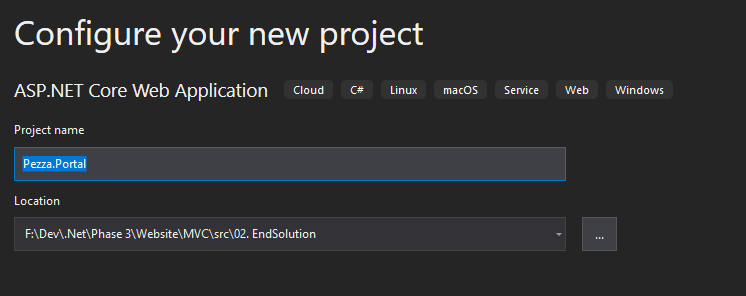
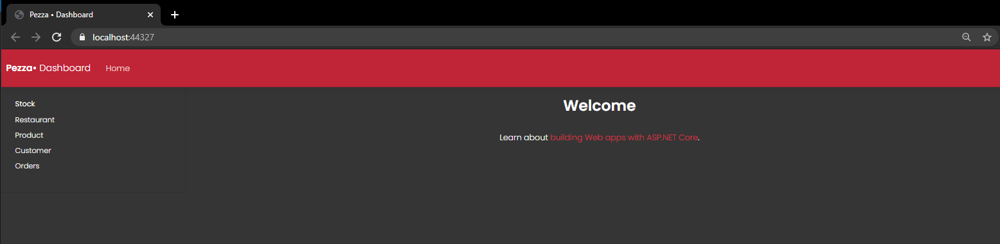
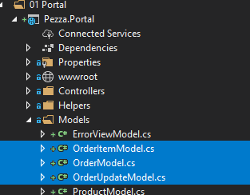

# &nbsp;**Pezza - Phase 7 - Dashboard - MVC - Step 1** [](https://github.com/entelect-incubator/.NET/actions/workflows/dotnet-phase7-dashboard-mvc-step1.yml)

<br/><br/>

## **Starting Point**

Start with your finished solution from Phase 2 or in Phase 3 > 01. StartSolution

### **What are we building?**

A basic Portal for Pezza to manage all their stock, products, orders, customers and restaurant data using MVC.

### **Create a new MVC project**

- [ ] Create a new Solution Folder - 00 UI
- [ ] Create a new Web Application Project



- [ ] Copy the Pezza Branding Guide & Design System files found in [Download]() 


- [ ] Delete wwwroot > lib
- [ ] Delete existing css from wwwroot > css > style.css

### **Configure**

Download [FontAweomse](https://fontawesome.com/) 

Copy the folder into wwwroot\fonts


Add .perfect-scrollbar-on to the html tag

Open Views > Shared > _Layout.cshtml. Add the following in the *`<head>`*

```html
<head>
    <title>Pezza • @((String.IsNullOrEmpty(ViewBag.Title)) ? "Dashboard" : @ViewBag.Title)</title>
    <meta http-equiv="Content-Type" content="text/html; charset=UTF-8" />

    <meta name="viewport" content="width=device-width, initial-scale=1, shrink-to-fit=no" />
    <link rel="apple-touch-icon" sizes="76x76" href="../~/lib/img/pezza-logo-white.png" />
    <link rel="icon" type="image/png" href="../~/lib/img/pezza-logo-white.png" />
    <!--     Fonts and icons     -->
    <link rel="stylesheet" href="https://fonts.googleapis.com/css?family=Poppins:200,300,400,600,700,800&display=swap" />
    <link rel="stylesheet" href="~/fonts/fontawesome/css/all.css" />
    <!-- CSS Files -->
    <link rel="stylesheet" href="~/lib/css/design-system.css?v=1.0.0" />
    <link rel="stylesheet" href="~/css/site.css" />
</head>
```

Add bd-docs class to the body tag

After the *`<body>`*
```html
<header class="navbar navbar-expand bg-primary flex-column flex-md-row bd-navbar">
    <a class="navbar-brand mr-0 mr-md-2 navbar-absolute-logo" href="https://github.com/entelect-incubator" target="_blank"> <span>Pezza•</span> Portal </a>
    <ul class="navbar-nav flex-row d-none d-md-flex">
        <!--li class="nav-item">
            <a class="nav-link p-2" href="index.html#version"> Home </a>
        </li-->
    </ul>
    <div class="navbar-nav-scroll ml-md-auto">
        <ul class="navbar-nav bd-navbar-nav flex-row">
            <li class="@((ViewBag.ActiveMenu == "Home") ? "active bd-sidenav-active" : "")">
                <a href="/"> Home </a>
            </li>
            <li class="@((ViewBag.ActiveMenu == "Stock") ? "active bd-sidenav-active" : "")">
                <a href="/stock"> Stock </a>
            </li>
            <li class="@((ViewBag.ActiveMenu == "Restaurants") ? "active bd-sidenav-active" : "")">
                <a href="/restaurant"> Restaurants </a>
            </li>
            <li class="@((ViewBag.ActiveMenu == "Products") ? "active bd-sidenav-active" : "")">
                <a href="/product"> Products </a>
            </li>
            <li class="@((ViewBag.ActiveMenu == "Customer") ? "active bd-sidenav-active" : "")">
                <a href="/customer"> Customers </a>
            </li>
            <li class="@((ViewBag.ActiveMenu == "Orders") ? "active bd-sidenav-active" : "")">
                <a href="/orders"> Orders </a>
            </li>
        </ul>
    </div>
    <!-- <a class="btn btn-white d-none d-lg-inline-block" href="">Download</a> -->
</header>
<div class="container-fluid">
    <div class="row flex-xl-nowrap">
        <div class="col-12 col-md-3 col-xl-2 bd-sidebar">
            <nav class="collapse bd-links" id="bd-docs-nav">
                <div class="bd-toc-item active">
                    <ul class="nav bd-sidenav">
                        <li class="active bd-sidenav-active">
                            <a href="/stock"> Stock </a>
                        </li>
                        <li class="">
                            <a href="/restaurant"> Restaurant </a>
                        </li>
                        <li class="">
                            <a href="/product"> Product </a>
                        </li>
                        <li class="">
                            <a href="/customer"> Customer </a>
                        </li>
                        <li class="">
                            <a href="/orders"> Orders </a>
                        </li>
                    </ul>
                </div>
            </nav>
        </div>
        <div class="bd-content nopadding">
            <div id="cover"><div id="content"></div></div>
            <main role="main" class="padding">
                @RenderBody()
            </main>
        </div>
    </div>
</div>
```

After the *`<footer>`*

```html
<!--   Core JS Files   -->
<script src="~/fonts/fontawesome/js/all.js" type="text/javascript"></script>
<script src="~/js/core/jquery.min.js" type="text/javascript"></script>
<script src="~/js/core/popper.min.js" type="text/javascript"></script>
<script src="~/js/core/bootstrap.min.js" type="text/javascript"></script>
<script src="~/js/plugins/perfect-scrollbar.jquery.min.js"></script>
<!--  Plugin for Switches, full documentation here: http://www.jque.re/plugins/version3/bootstrap.switch/ -->
<script src="~/js/plugins/bootstrap-switch.js"></script>
<!--  Plugin for the Sliders, full documentation here: http://refreshless.com/nouislider/ -->
<script src="~/js/plugins/nouislider.min.js" type="text/javascript"></script>
<!-- Chart JS -->
<script src="~/js/plugins/chartjs.min.js"></script>
<!--  Plugin for the DatePicker, full documentation here: https://github.com/uxsolutions/bootstrap-datepicker -->
<script src="~/js/plugins/moment.min.js"></script>
<script src="~/js/plugins/bootstrap-datetimepicker.js" type="text/javascript"></script>
<!-- Black Dashboard DEMO methods, don't include it in your project! -->
<script src="~/demo/demo.js"></script>
<!-- Control Center for Black UI Kit: parallax effects, scripts for the example pages etc -->
<script src="~/js/design-system.min.js?v=1.0.0" type="text/javascript"></script>
<script src="~/js/site.js"></script>
@RenderSection("Scripts", required: false)
```

## **Startup Projects**

Right Click on the Solution and choose Set Startup Projects...


Click Apply and Press F5

Should have something looking like this -



Let's fix up the look and feel a bit

Add the following to style.css

```css
html {
    height: 100vh;
}

.navbar {
    box-shadow: 0px 0px 15px rgba(0,0,0,0.2);
    box-shadow: 0 1px 1px rgba(0,0,0,0.12), 0 2px 2px rgba(0,0,0,0.12), 0 4px 4px rgba(0,0,0,0.12), 0 8px 8px rgba(0,0,0,0.12), 0 16px 16px rgba(0,0,0,0.12);
}

.bd-sidebar {
    background: #bf2437;
    background: linear-gradient(0deg, rgba(135,18,32,1) 0%, rgba(191,36,55,1) 100%);
}

.bd-sidenav li:hover {
    cursor: pointer;
    background-color: #969393;
}

.bd-sidenav-active {
    background-color: #353535;
}

.bd-sidebar .nav > li > a {
    padding: 12px 20px;
}

.table thead th {
    border: none !important;
    background: #757575 !important;
}

    .table thead th:first-child {
        border-radius: 5px 0px 0px 0px;
    }

    .table thead th:last-child {
        border-radius: 0px 5px 0px 0px;
    }

.table tbody td {
    border: none !important;
    background: #969393;
    border-left: 1px solid rgba(255, 255, 255, 0.2) !important;
}

    .table tbody td:first-child {
        border-left: none;
    }

.table tbody tr:nth-child(even) td {
    background: #868686;
}

.table tbody tr:last-child td:first-child {
    border-radius: 0px 0px 0px 5px;
}

.table tbody tr:last-child td:last-child {
    border-radius: 0px 0px 5px 0px;
}

.table a.btn-round {
    border-width: 1px !important;
    border-radius: 30px !important;
    vertical-align: middle !important;
    line-height: 100% !important;
    padding-top: 7px !important;
}

select {
    background-color: #3f3f3f !important;
    padding: 6px 18px 10px 12px !important;
}

.inputfile {
    width: 0.1px;
    height: 0.1px;
    opacity: 0;
    overflow: hidden;
    position: absolute;
    z-index: -1;
}

    .inputfile + label {
        font-size: 1.25em;
        font-weight: 700;
        color: white;
        background-color: black;
        display: inline-block;
    }

        .inputfile:focus + label,
        .inputfile + label:hover {
            background-color: red;
        }
.bd-content {
    max-width: 100% !important;
    -webkit-box-flex: 0;
    -ms-flex: 0 0 calc(100% - 160px);
    flex: 0 0 calc(100% - 160px);
    max-width: calc(100% - 160px);
}
#cover{
    display:none;
}

    #cover #content {
        display: grid;
        place-items: center;
    }

        #cover #content #title {
            margin-top: 9%;
            background: rgba(0,0,0,0.2);
            padding: 20px;
            width: 100%;
            text-align: center;
        }

.nopadding {
    padding: 0 !important;
    margin: 0 !important;
}

.padding {
    padding-left: 45px !important;
    padding-right: 45px !important;
    padding-top: 40px !important;
}

input[type=checkbox] {
    margin-right: 20px;
    transform: scale(2);
}

@media (min-width: 768px) {
    .bd-sidebar {
        height: calc(100vh - 4rem);
        border-right: none;
    }
}

@media (min-width: 1200px) {
    .bd-sidebar {
        max-width: 160px;
    }
}

```

Should look like this now when you run it.


In Pezza.Common create a new class AppSettings.cs

```cs
namespace Pezza.Common
{
    public class AppSettings
    {
        public static string ApiUrl { get; set; }
    }
}
```


In Pezza.Portal open appsettings.json and add the AppSettings into it

```json
{
  "Logging": {
    "LogLevel": {
      "Default": "Information",
      "Microsoft": "Warning",
      "Microsoft.Hosting.Lifetime": "Information"
    }
  },
  "AllowedHosts": "*",
  "AppSettings": {
    "ApiUrl": "https://localhost:44315/",
  }
}

```

In Pezza.Portal Startup.cs modify the Startup Constructor to look like this.

```cs
public Startup(IHostEnvironment env, IConfiguration configuration)
{
    this.Configuration = configuration;

    this.Configuration = new ConfigurationBuilder()
        .SetBasePath(env.ContentRootPath)
        .AddJsonFile("appsettings.json", optional: true, reloadOnChange: true)
        .AddEnvironmentVariables()
        .Build();

    this.Configuration.Bind("AppSettings", new AppSettings());
}
```

Add a new property for the HostEnviroment.

```cs
    public IHostEnvironment CurrentEnvironment { get; }
```

This transforms the AppSettings JSON section into a static class to be used anywhere.

## Alerts / Notifications

To be able to show the end-user either an error or just a notification we will need to add a few things into our MVC project.

In your *site.css* add the end and before the media queries add the following:

```css
.toast-container {
    position: absolute;
    right: 5%;
    width: 85%;
    z-index:5000;
    bottom: 0;
    margin: 0 auto;
}

    .toast-container .alert {
        box-shadow: 0px 0px 15px rgba(0,0,0,0.2);
        box-shadow: 0 1px 1px rgba(0,0,0,0.12), 0 2px 2px rgba(0,0,0,0.12), 0 4px 4px rgba(0,0,0,0.12), 0 8px 8px rgba(0,0,0,0.12), 0 16px 16px rgba(0,0,0,0.12);
        display:none;
    }
```

After the media queries add the following

```css
@media (max-width: 768px) {

    .toast-container {
        right: 2%;
        width: 96%;
    }
}
```

Create a new JavaScript file called alert.js in wwwroot\js. This creates a basic alert jquery plugin.


```js
(function ($) {
    $(document).ready(function () {
        $('body').append(`
            <div class="toast-container" data-example-id="">
                <div class="alert alert-primary alert-with-icon">
                    <button type="button" aria-hidden="true" class="close" data-dismiss="alert" aria-label="Close">
                        <i class="fa fa-times"></i>
                    </button>
                    <div class="alert-icon"></div>
                    <span class="alert-message"></span>
                </div>

                <div class="alert alert-info alert-with-icon">
                    <button type="button" aria-hidden="true" class="close" data-dismiss="alert" aria-label="Close">
                        <i class="fa fa-times"></i>
                    </button>
                    <div class="alert-icon"></div>
                    <span class="alert-message"></span>
                </div>

                <div class="alert alert-warning alert-with-icon">
                    <button type="button" aria-hidden="true" class="close" data-dismiss="alert" aria-label="Close">
                        <i class="fa fa-times"></i>
                    </button>
                    <div class="alert-icon"></div>
                    <span class="alert-message"></span>
                </div>

                <div class="alert alert-danger alert-with-icon">
                    <button type="button" aria-hidden="true" class="close" data-dismiss="alert" aria-label="Close">
                        <i class="fa fa-times"></i>
                    </button>
                    <div class="alert-icon"></div>
                    <span class="alert-message"></span>
                </div>
            </div>
        `);
    });

    $.alert = function (message, callback) {
        alert(message, 'primary');

        if (callback) {
            callback();
        }
    };

    $.alertInfo = function (message, callback) {
        alert(message, 'info');

        if (callback) {
            callback();
        }
    };

    $.alertWarning = function (message, callback) {
        alert(message, 'warning');

        if (callback) {
            callback();
        }
    };

    $.alertDanger = function (message, callback) {
        alert(message, 'danger');

        if (callback) {
            callback();
        }
    };

    function alert(message, type) {
        var alert = $('.alert-' + type);
        alert.show();
        alert.find('.alert-message').html(message);
    }

} (jQuery))
```

Now you can just call $.alertWarning('Error removing stock'); for example

In your Views\Shared\_Layout.cshtml bfore you import the site.js file add the following:

```html
       <script src="~/js/site.js"></script>
```

You can now control the alerts\notifications using JQuery.

## Shared Modals

Create a partial view in Views\Shared _Modals.cshtml. This will be used for confirmation popups.

```cshtml
<!-- Remove Confirmation Modal -->
<div class="modal fade" id="confirmationModal" tabindex="-1" role="dialog" aria-labelledby="removeModalLabel" aria-hidden="true">
    <div class="modal-dialog modal-sm" role="document">
        <div class="modal-content">
            <div class="modal-header">
                <div class="row" id="confirmation-error" style="display:none">
                    <div class="col-12">
                        <div class="alert alert-warning alert-with-icon">
                            <button type="button" aria-hidden="true" class="close" data-dismiss="alert" aria-label="Close">
                                <i class="tim-icons icon-simple-remove"></i>
                            </button>
                            <span data-notify="icon" class="tim-icons icon-bulb-63"></span>
                            <span>
                                <b> Error! - </b> Error occured
                            </span>
                        </div>
                    </div>
                </div>

                <div class="row" id="confirmation-success" style="display:none">
                    <div class="col-12">
                        <div class="alert alert-info alert-with-icon">
                            <button type="button" aria-hidden="true" class="close" data-dismiss="alert" aria-label="Close">
                                <i class="tim-icons icon-simple-remove"></i>
                            </button>
                            <span data-notify="icon" class="tim-icons icon-trophy"></span>
                            <span>
                                <b> Success - </b>
                            </span>
                        </div>
                    </div>
                </div>

                <h5 class="modal-title" id="removeModalLabel">Remove <span class="remove-entity"></span></h5>
                <button type="button" class="close" data-dismiss="modal" aria-label="Close">
                    <span aria-hidden="true">&times;</span>
                </button>
            </div>
            <div class="modal-body">
                <span class="remove-name"></span>?
                <input type="hidden" id="removeId" />
            </div>
            <div class="modal-footer">
                <button type="button" class="btn btn-link btn-danger" data-dismiss="modal">No</button>
                <button type="button" onclick="confirmRemove()" class="btn btn-primary">Yes</button>
            </div>
        </div>
    </div>
</div>
```

Add a new BaseController to Controllers Folder


In Startup.cs add

```cs
services.AddHttpClient();

services.AddControllersWithViews()
    .AddFluentValidation(s =>
    {
        s.RegisterValidatorsFromAssemblyContaining<Startup>();
        s.RunDefaultMvcValidationAfterFluentValidationExecutes = false;
    });
```

In the Web.API we are using Fluent Validation for Server Validation. We can automatically map this to ModelState Error in MVC by doing the following. In the BaseController.cs we are adding a Validate function that will check if any errors are retruned from the API Call and automatically mapping the model state errors. The code that you added in Startup automatically registers FluentValidation Assembly for you. 

```cs
namespace Pezza.BackEnd.Controllers
{
    using System;
    using System.Net.Http;
    using System.Net.Http.Headers;
    using Microsoft.AspNetCore.Mvc;
    using Pezza.Common;

    public abstract class BaseController : Controller
    {
        public readonly HttpClient client;

        public readonly IHttpClientFactory clientFactory;

        public BaseController(IHttpClientFactory clientFactory)
        {
            this.clientFactory = clientFactory;
            this.client = clientFactory.CreateClient();
            this.client.BaseAddress = new Uri(AppSettings.ApiUrl);
            this.client.DefaultRequestHeaders.Accept.Clear();
            this.client.DefaultRequestHeaders.Accept.Add(new MediaTypeWithQualityHeaderValue("application/json"));
        }

        public ActionResult Validate<T>(Result<T> result, ApiCallHelper<T> apiCallHelper, object model)
        {
            if (!result.Succeeded)
            {
                if (apiCallHelper.ValidationErrors != null)
                {
                    if (apiCallHelper.ValidationErrors?.Count > 0)
                    {
                        foreach (var validation in apiCallHelper.ValidationErrors)
                        {
                            ModelState.AddModelError(validation.Property, validation.Error);
                        }
                    }
                }

                return this.View(model);
            }

            if (!ModelState.IsValid)
            {
                return this.View(model);
            }

            return this.RedirectToAction("Index");
        }
    }
}
```

## Shared address information

In Phase 3\Data there is a JSON file za.json copy that into your MVC solution under wwwroot\data. We want to create a reusable Address Component that can be reused.


In wwwroot\js create address.js. This loads the JSON data into an object. This will help us create 2 Selects for Cities and Provinces using JQuery. 

```js
(function () {
    var zaData = {};
    var city = [];
    var province = [];
    var base_url = window.location.origin;
    $.getJSON(base_url + '/data/za.json', function (data) {
        zaData = data;
        $.each(zaData, function (i, v) {
            city.push(v.city);
            if ($.inArray(v.admin_name, province) === -1) province.push(v.admin_name);
        });

        city = city.sort();
        province = province.sort();

        for (var i = 0; i < city.length; i++) {
            $("#City").append("<option>" + city[i] + "</option>");
        }

        for (var j = 0; j < province.length; j++) {
            $("#Province").append("<option>" + province[j] + "</option>");
        }
    });
})();
```

Create a new Partial View in Views\Shared _Address.cshtml

```cshtml
@model Pezza.Common.Entities.AddressBase

<fieldset>
    <legend>Address</legend>
    <div class="row">
        <div class="col">
            <label class="label-control">Street Address</label>
            @Html.TextBoxFor(model => model.Address, new { @class = "form-control" })
            @Html.ValidationMessageFor(model => model.Address)
        </div>
    </div>

    <div class="row">
        <div class="col">
            <label class="label-control">City</label>
            <select name="Address.City" id="City" class="form-control"></select>
            @Html.ValidationMessageFor(model => model.City)
        </div>
    </div>

    <div class="row">
        <div class="col">
            <label class="label-control">Province</label>
            <select name="Address.Province" id="Province" class="form-control"></select>
            @Html.ValidationMessageFor(model => model.Province)
        </div>
    </div>

    <div class="row">
        <div class="col-xs-12 col-lg-4">
            <label class="label-control">PostalCode</label>
            @Html.TextBoxFor(model => model.PostalCode, new { @class = "form-control", type = "number" })
            @Html.ValidationMessageFor(model => model.PostalCode)
        </div>
    </div>
    <br />
</fieldset>

<script src="~/js/address.js" defer></script>
```

# CRUD

In the BaseController you would have seen we declared a new HttpCllient. We will use this to make calls to the WebAPI.

- GetAsync - Do an HTTP GET call
- PostAsync - Do an HTTP POST call
- PutAsync - Do an HTTP PUT call

Create a new folder Helpers with a class ApiCallHelper.cs. This will standardize all the API Calls to the Web.API. The reason not calling Core or Mediatr directly is you will at some point have to integrate with an External API that might not be .NET.


```cs
namespace Pezza.Portal.Helpers
{
    using System;
    using System.Collections.Generic;
    using System.Linq;
    using System.Net.Http;
    using System.Net.Http.Headers;
    using System.Text;
    using System.Text.Json;
    using System.Threading.Tasks;
    using Newtonsoft.Json.Linq;
    using Pezza.Common;
    using Pezza.Common.Models;

    public class ApiCallHelper<T>
    {
        private readonly IHttpClientFactory clientFactory;

        private readonly HttpClient client;

        public List<ValidationError> ValidationErrors;

        private readonly JsonSerializerOptions jsonSerializerOptions;

        public string ControllerName { get; set; }

        public ApiCallHelper(IHttpClientFactory clientFactory)
        {
            this.clientFactory = clientFactory;
            this.client = clientFactory.CreateClient();
            this.client.BaseAddress = new Uri(AppSettings.ApiUrl);
            this.client.DefaultRequestHeaders.Accept.Clear();
            this.client.DefaultRequestHeaders.Accept.Add(new MediaTypeWithQualityHeaderValue("application/json"));

            this.jsonSerializerOptions = new JsonSerializerOptions
            {
                PropertyNamingPolicy = JsonNamingPolicy.CamelCase,
                IgnoreNullValues = true,
                MaxDepth = 20
            };
        }

        public async Task<ListOutcome<T>> GetListAsync(string jsonData)
        {
            var data = new StringContent(jsonData, Encoding.UTF8, "application/json");
            var response = await this.client.PostAsync(@$"{AppSettings.ApiUrl}{ControllerName}\Search", data);

            var responseData = await response.Content.ReadAsStringAsync();

            var entities = System.Text.Json.JsonSerializer.Deserialize<ListOutcome<T>>(responseData, this.jsonSerializerOptions);
            return entities;
        }

        public async Task<T> GetAsync(int id)
        {
            var responseMessage = await this.client.GetAsync(@$"{AppSettings.ApiUrl}{ControllerName}\{id}");
            if (responseMessage.IsSuccessStatusCode)
            {
                var responseData = await responseMessage.Content.ReadAsStringAsync();
                return System.Text.Json.JsonSerializer.Deserialize<T>(responseData, this.jsonSerializerOptions);
            }

            return default;
        }

        public async Task<Result<T>> Create(T entity)
        {
            this.ValidationErrors = new List<ValidationError>();
            var json = JsonSerializer.Serialize(entity);
            var data = new StringContent(json, Encoding.UTF8, "application/json");

            var responseMessage = await this.client.PostAsync(@$"{AppSettings.ApiUrl}{ControllerName}", data);
            if (responseMessage.StatusCode == System.Net.HttpStatusCode.BadRequest)
            {
                var responseData = await responseMessage.Content.ReadAsStringAsync();
                var response = JsonSerializer.Deserialize<Result>(responseData, this.jsonSerializerOptions);

                this.ValidationErrors = response.Errors?.Select(x =>
                {
                    return (x as JObject).ToObject<ValidationError>();
                }).ToList();

                return Result<T>.Failure("ValidationError");
            }

            if (responseMessage.IsSuccessStatusCode)
            {
                var responseData = await responseMessage.Content.ReadAsStringAsync();
                var response = JsonSerializer.Deserialize<T>(responseData, this.jsonSerializerOptions);

                return Result<T>.Success(response);
            }

            return Result<T>.Failure("Error");
        }

        public async Task<Result<T>> Edit(T entity)
        {
            this.ValidationErrors = new List<ValidationError>();
            var json = JsonSerializer.Serialize(entity);
            var data = new StringContent(json, Encoding.UTF8, "application/json");

            var responseMessage = await this.client.PutAsync(@$"{AppSettings.ApiUrl}{ControllerName}", data);
            if (responseMessage.StatusCode == System.Net.HttpStatusCode.BadRequest)
            {
                var responseData = await responseMessage.Content.ReadAsStringAsync();
                var response = JsonSerializer.Deserialize<Result>(responseData, this.jsonSerializerOptions);

                this.ValidationErrors = response.Errors?.Select(x =>
                {
                    return (x as JObject).ToObject<ValidationError>();
                }).ToList();

                return Result<T>.Failure("ValidationError");
            }

            if (responseMessage.IsSuccessStatusCode)
            {
                var responseData = await responseMessage.Content.ReadAsStringAsync();
                var response = JsonSerializer.Deserialize<T>(responseData, this.jsonSerializerOptions);

                return Result<T>.Success(response);
            }

            return Result<T>.Failure("Error");
        }

        public async Task<bool> Delete(int id)
        {
            var responseMessage = await this.client.DeleteAsync(@$"{AppSettings.ApiUrl}{ControllerName}\{id}");
            if (responseMessage.IsSuccessStatusCode)
            {
                var responseData = await responseMessage.Content.ReadAsStringAsync();
                return System.Text.Json.JsonSerializer.Deserialize<bool>(responseData, this.jsonSerializerOptions);
            }

            return false;
        }
    }
}

```

Create ValidateModelStateAttribute in Helpers

```cs
namespace Pezza.Portal.Helpers
{
    using Microsoft.AspNetCore.Mvc;
    using Microsoft.AspNetCore.Mvc.Filters;

    public class ValidateModelStateAttribute : ActionFilterAttribute
    {
        public override void OnActionExecuting(ActionExecutingContext context)
        {
            if (!context.ModelState.IsValid)
            {
                context.Result = new BadRequestObjectResult(context.ModelState);
            }
        }
    }
}
```

Create a new StockController


We will only create a CRUD Controller. The Delete will be called using Jquery AJAX.

YOu need to intialise ApiCallHelper for all Controllers

```cs
private readonly ApiCallHelper<StockDTO> apiCallHelper;

public StockController(IHttpClientFactory clientFactory)
    : base(clientFactory)
{
    this.apiCallHelper = new ApiCallHelper<StockDTO>(this.clientFactory);
    this.apiCallHelper.ControllerName = "Stock";
}
```

*TIP type in ctor with tab - will create a constructor for you

Method Signatures

```cs
public async Task<ActionResult> Index()

public async Task<ActionResult> Details(int id)

public ActionResult Create()

public async Task<ActionResult> Create(StockDTO stock)

public async Task<ActionResult> Edit(int id)

public async Task<ActionResult> Edit(int id, StockDTO stock)

public async Task<JsonResult> Delete(int id)
```

Full Controller

```cs
namespace Pezza.BackEnd.Controllers
{
    using System.Collections.Generic;
    using System.Net.Http;
    using System.Text;
    using System.Threading.Tasks;
    using Microsoft.AspNetCore.Mvc;
    using Newtonsoft.Json;
    using Pezza.Common;
    using Pezza.Common.DTO;
    using Pezza.Portal.Helpers;

    public class StockController : BaseController
    {
        private readonly ApiCallHelper<StockDTO> apiCallHelper;

        public StockController(IHttpClientFactory clientFactory)
            : base(clientFactory)
        {
            this.apiCallHelper = new ApiCallHelper<StockDTO>(this.clientFactory);
            this.apiCallHelper.ControllerName = "Stock";
        }

        public async Task<ActionResult> Index()
        {
            var json = JsonConvert.SerializeObject(new StockDTO
            {
                PagingArgs = Common.Models.PagingArgs.NoPaging
            });
            var entities = await this.apiCallHelper.GetListAsync(json);
            return this.View(entities);
        }

        public async Task<ActionResult> Details(int id)
        {
            var entity = await this.apiCallHelper.GetAsync(id);
            return this.View(entity);
        }

        public ActionResult Create()
        {
            return this.View(new StockDTO());
        }

        [HttpPost]
        [ValidateAntiForgeryToken]
        public async Task<ActionResult> Create(StockDTO stock)
        {
            if (!this.ModelState.IsValid)
            {
                return this.View(stock);
            }

            var result = await this.apiCallHelper.Create(stock);
            return Validate<StockDTO>(result, this.apiCallHelper, stock);
        }

        [Route("Stock/Edit/{id?}")]
        public async Task<ActionResult> Edit(int id)
        {
            var entity = await this.apiCallHelper.GetAsync(id);
            return this.View(entity);
        }

        [HttpPost]
        [Route("Stock/Edit/{id?}")]
        [ValidateAntiForgeryToken]
        public async Task<ActionResult> Edit(int id, StockDTO stock)
        {
            if (!this.ModelState.IsValid)
            {
                return this.View(stock);
            }

            stock.Id = id;
            var result = await this.apiCallHelper.Edit(stock);
            return Validate<StockDTO>(result, this.apiCallHelper, stock);
        }

        [HttpPost]
        [Route("Stock/Delete/{id?}")]
        public async Task<JsonResult> Delete(int id)
        {
            if (id == 0)
            {
                return this.Json(false);
            }

            if (!this.ModelState.IsValid)
            {
                return this.Json(false);
            }

            var result = await this.apiCallHelper.Delete(id);
            return this.Json(result);
        }
    }
}
```
Restaurant and Product needs a bit extra information.

Create a RestaurantModel in Models folder.

```cs
namespace Pezza.Portal.Models
{
    using Microsoft.AspNetCore.Http;
    using Pezza.Common.DTO;

    public class RestaurantModel : RestaurantDTO
    {
        public IFormFile Image { set; get; }

        private bool _isActive;

        public bool _IsActive
        {
            get { return this.IsActive ?? false; }
            set
            {
                this._isActive = value;
                this.IsActive = value;
            }
        }
    }
}
```


For pictures you need to reference the Picture Controller in Pezza.Api

Index() Method add the following after var entities

```cs
for (var i = 0; i < entities.Count; i++)
{
    entities[i].PictureUrl = $"{AppSettings.ApiUrl}Picture?file={entities[i].PictureUrl}&folder=restaurant";
}
```

Create() Method you need convert the IFormFile into a Data URI string

```cs
if (restaurant.Image?.Length > 0)
{
    using var ms = new MemoryStream();
    restaurant.Image.CopyTo(ms);
    var fileBytes = ms.ToArray();
    restaurant.ImageData = $"data:{MimeTypeMap.GetMimeType(Path.GetExtension(restaurant.Image.FileName))};base64,{Convert.ToBase64String(fileBytes)}";
}
```

Edit() Method you need to return Picture Url

```cs
return this.View(new RestaurantModel
{
    Id = id,
    Name = entity.Name,
    PictureUrl = $"{AppSettings.ApiUrl}Picture?file={entity.PictureUrl}&folder=restaurant",
    Description = entity.Description,
    Address = new AddressBase
    {
        Address = entity.Address,
        City = entity.City,
        Province = entity.Province,
        PostalCode = entity.PostalCode
    },
    IsActive = entity.IsActive
});
```

Full Controllers

```cs
namespace Pezza.BackEnd.Controllers
{
    using System;
    using System.IO;
    using System.Linq;
    using System.Net.Http;
    using System.Threading.Tasks;
    using Microsoft.AspNetCore.Mvc;
    using Newtonsoft.Json;
    using Pezza.Common;
    using Pezza.Common.DTO;
    using Pezza.Common.Entities;
    using Pezza.Portal.Helpers;
    using Pezza.Portal.Models;

    public class RestaurantController : BaseController
    {
        private readonly ApiCallHelper<RestaurantDTO> apiCallHelper;

        public RestaurantController(IHttpClientFactory clientFactory)
            : base(clientFactory)
        {
            this.apiCallHelper = new ApiCallHelper<RestaurantDTO>(this.clientFactory);
            this.apiCallHelper.ControllerName = "Restaurant";
        }

        public async Task<ActionResult> Index()
        {
            var json = JsonConvert.SerializeObject(new RestaurantDTO
            {
                PagingArgs = Common.Models.PagingArgs.NoPaging
            });
            var entities = await this.apiCallHelper.GetListAsync(json);
            for (var i = 0; i < entities.Count; i++)
            {
                var picture = entities[i].PictureUrl;
                entities[i].PictureUrl = $"{AppSettings.ApiUrl}Picture?file={picture}&folder=restaurant";
            }
            return this.View(entities);
        }

        public async Task<ActionResult> Details(int id)
        {
            var entity = await this.apiCallHelper.GetAsync(id);
            return this.View(entity);
        }

        public ActionResult Create() => this.View(new RestaurantModel());

        [HttpPost]
        [ValidateAntiForgeryToken]
        public async Task<ActionResult> Create(RestaurantModel restaurant)
        {
            {
                if(string.IsNullOrEmpty(restaurant.Description))
                {
                    restaurant.Description = string.Empty;
                }
                restaurant.IsActive = true;
                restaurant.DateCreated = DateTime.Now;

                if (restaurant.Image?.Length > 0)
                {
                    using var ms = new MemoryStream();
                    restaurant.Image.CopyTo(ms);
                    var fileBytes = ms.ToArray();
                    restaurant.ImageData = $"data:{MimeTypeMap.GetMimeType(Path.GetExtension(restaurant.Image.FileName))};base64,{Convert.ToBase64String(fileBytes)}";
                }
                else
                {
                    ModelState.AddModelError("Image", "Please select a photo of the restaurant");
                }

                var result = await this.apiCallHelper.Create(restaurant);
                return Validate<RestaurantDTO>(result, this.apiCallHelper, restaurant);
            }
        }

        [Route("Restaurant/Edit/{id?}")]
        public async Task<ActionResult> Edit(int id)
        {
            var entity = await this.apiCallHelper.GetAsync(id);

            return this.View(new RestaurantModel
            {
                Id = id,
                Name = entity.Name,
                PictureUrl = $"{AppSettings.ApiUrl}Picture?file={entity.PictureUrl}&folder=restaurant",
                Description = entity.Description,
                Address = new AddressBase
                {
                    Address = entity.Address?.Address,
                    City = entity.Address?.City,
                    Province = entity.Address?.Province,
                    PostalCode = entity.Address?.PostalCode
                },
                IsActive = entity.IsActive
            });
        }

        [HttpPost]
        [Route("Restaurant/Edit/{id?}")]
        [ValidateAntiForgeryToken]
        public async Task<ActionResult> Edit(int id, RestaurantModel restaurant)
        {
            if (!this.ModelState.IsValid)
            {
                return this.View(restaurant);
            }

            if (restaurant.Image?.Length > 0)
            {
                using var ms = new MemoryStream();
                restaurant.Image.CopyTo(ms);
                var fileBytes = ms.ToArray();
                restaurant.ImageData = $"data:{MimeTypeMap.GetMimeType(Path.GetExtension(restaurant.Image.FileName))};base64,{Convert.ToBase64String(fileBytes)}";
            }

            restaurant.Id = id;
            var result = await this.apiCallHelper.Edit(restaurant);
            return Validate<RestaurantDTO>(result, this.apiCallHelper, restaurant);
        }

        [HttpPost]
        [Route("Restaurant/Delete/{id?}")]
        public async Task<JsonResult> Delete(int id)
        {
            if (id == 0)
            {
                return this.Json(false);
            }

            if (!this.ModelState.IsValid)
            {
                return this.Json(false);
            }

            var result = await this.apiCallHelper.Delete(id);
            return this.Json(result);
        }
    }
}
```

The Orders Controller is a bit different, because it has quite a bit of complexity. Someone in the restaurant might use this to place manual orders in from a phone call for example.

- It has methods to load Customers, Products and Customers
- It has a Complete Order Method
- Loading Partial View using Ajax
- There is no Edit, because of complexity

How the Order Create works is, it loads a Partial view with all the Products. There's is also a drop down to select a Customer or the capability to create a Customer using a modal.

```cs
namespace Pezza.BackEnd.Controllers
{
    using System.Collections.Generic;
    using System.Linq;
    using System.Net.Http;
    using System.Text;
    using System.Threading.Tasks;
    using Microsoft.AspNetCore.Mvc;
    using Microsoft.AspNetCore.Mvc.Rendering;
    using Newtonsoft.Json;
    using Pezza.Common;
    using Pezza.Common.DTO;
    using Pezza.Portal.Helpers;
    using Pezza.Portal.Models;

    public class OrdersController : BaseController
    {
        private readonly ApiCallHelper<OrderDTO> apiCallHelper;

        public OrdersController(IHttpClientFactory clientFactory)
            : base(clientFactory)
        {
            this.apiCallHelper = new ApiCallHelper<OrderDTO>(this.clientFactory);
            this.apiCallHelper.ControllerName = "Order";
        }

        public async Task<ActionResult> Index()
        {
            var json = JsonConvert.SerializeObject(new OrderDTO
            {
                Completed = false,
                PagingArgs = Common.Models.PagingArgs.NoPaging
            });
            var entities = await this.apiCallHelper.GetListAsync(json);
            var entitiesByRestaurant = entities.OrderBy(o => o.Restaurant.Name).GroupBy(g => g.Restaurant.Name);
            var ordersByRestaurant = new Dictionary<string, List<OrderDTO>>();
            foreach (var restaurant in entitiesByRestaurant)
            {
                var tempEntities = new List<OrderDTO>();
                foreach (var order in restaurant)
                {
                    tempEntities.Add(order);
                }
                ordersByRestaurant.Add(restaurant.Key, tempEntities);
            }

            return this.View(ordersByRestaurant);
        }

        public async Task<IActionResult> OrderItem()
        {
            return this.PartialView("~/views/Orders/_Products.cshtml", new OrderItemModel
            {
                Products = await this.GetProducts()
            });
        }

        public async Task<ActionResult> Details(int id)
        {
            var entity = await this.apiCallHelper.GetAsync(id);
            return this.View(entity);
        }

        public async Task<ActionResult> Create()
        {
            return this.View(new OrderModel
            {
                Customers = await this.GetCustomers(),
                Restaurants = await this.GetRestaurants()
            });
        }

        [HttpPost]
        [ValidateAntiForgeryToken]
        public async Task<ActionResult> Create(OrderDTO order)
        {
            if (!this.ModelState.IsValid)
            {
                return this.View(order);
            }

            var result = await this.apiCallHelper.Create(order);
            return Validate<OrderDTO>(result, this.apiCallHelper, order);
        }

        private async Task<List<SelectListItem>> GetCustomers()
        {
            var json = JsonConvert.SerializeObject(new CustomerDTO
            {
                PagingArgs = Common.Models.PagingArgs.NoPaging
            });
            var apiHelper = new ApiCallHelper<CustomerDTO>(this.clientFactory)
            {
                ControllerName = "Customer"
            };
            var entities = await apiHelper.GetListAsync(json);
            return entities.Select(x =>
            {
                return new SelectListItem
                {
                    Value = $"{x.Id}",
                    Text = $"{x.Name} {x.Phone}"
                };
            }).ToList();
        }

        private async Task<List<SelectListItem>> GetRestaurants()
        {
            var json = JsonConvert.SerializeObject(new RestaurantDTO
            {
                PagingArgs = Common.Models.PagingArgs.NoPaging
            });
            var apiHelper = new ApiCallHelper<RestaurantDTO>(this.clientFactory)
            {
                ControllerName = "Restaurant"
            };
            var entities = await apiHelper.GetListAsync(json);
            for (var i = 0; i < entities.Count; i++)
            {
                entities[i].PictureUrl = $"{AppSettings.ApiUrl}Picture?file={entities[i].PictureUrl}&folder=restaurant";
            }

            return entities.Select(x =>
            {
                return new SelectListItem
                {
                    Value = $"{x.Id}",
                    Text = $"{x.Name}"
                };
            }).ToList();
        }

        private async Task<List<ProductModel>> GetProducts()
        {
            var json = JsonConvert.SerializeObject(new ProductDTO
            {
                PagingArgs = Common.Models.PagingArgs.NoPaging
            });
            var apiHelper = new ApiCallHelper<ProductDTO>(this.clientFactory)
            {
                ControllerName = "Product"
            };
            var entities = await apiHelper.GetListAsync(json);
            if (entities.Any())
            {
                for (var i = 0; i < entities.Count; i++)
                {
                    entities[i].PictureUrl = $"{AppSettings.ApiUrl}Picture?file={entities[i].PictureUrl}&folder=Product";
                }
            }

            return entities.Select(x =>
            {
                return new ProductModel
                {
                    Id = x.Id,
                    DateCreated = x.DateCreated,
                    Description = x.Description,
                    HasOffer = x.OfferEndDate.HasValue ? true : false,
                    IsActive = x.IsActive,
                    OfferEndDate = x.OfferEndDate,
                    OfferPrice = x.OfferPrice,
                    Name = x.Name,
                    Price = x.Price,
                    PictureUrl = x.PictureUrl,
                    Special = x.Special
                };
            }).ToList();
        }

        [Route("Order/Edit/{id?}")]
        public async Task<ActionResult> Edit(int id)
        {
            var entity = await this.apiCallHelper.GetAsync(id);
            return this.View(entity);
        }

        [HttpPost]
        [Route("Order/Edit/{id?}")]
        [ValidateAntiForgeryToken]
        public async Task<ActionResult> Edit(int id, OrderDTO order)
        {
            if (!this.ModelState.IsValid)
            {
                return this.View(order);
            }

            order.Id = id;
            var result = await this.apiCallHelper.Edit(order);
            return Validate<OrderDTO>(result, this.apiCallHelper, order);
        }

        [HttpPost]
        [Route("Order/Delete/{id?}")]
        public async Task<JsonResult> Delete(int id)
        {
            if (id == 0)
            {
                return this.Json(false);
            }

            if (!this.ModelState.IsValid)
            {
                return this.Json(false);
            }

            var result = await this.apiCallHelper.Delete(id);
            return this.Json(result);
        }

        [HttpPost]
        [Route("Order/Complete/{id?}")]
        public async Task<JsonResult> Complete(int id)
        {
            if (id == 0)
            {
                return this.Json(false);
            }

            if (!this.ModelState.IsValid)
            {
                return this.Json(false);
            }

            var result = await this.apiCallHelper.Edit(new OrderDTO
            {
                Id = id,
                DateCreated = null,
                Completed = true
            });
            return this.Json(result != null ? true : false);
        }
    }
}

```

**Order Models**

OrderModel.cs

```cs
namespace Pezza.Portal.Models
{
    using System.Collections.Generic;
    using Microsoft.AspNetCore.Mvc.Rendering;
    using Pezza.Common.DTO;

    public class OrderModel : OrderDTO
    {
        public OrderModel()
        {
            this.Amount = 0;
        }

        public List<SelectListItem> Restaurants { set; get; }

        public List<SelectListItem> Customers { set; get; }
    }
}
```

OrderItemModel.cs

```cs
namespace Pezza.Portal.Models
{
    using System.Collections.Generic;
    using Pezza.Common.DTO;
    using Pezza.Common.Entities;

    public class OrderItemModel : OrderItemDTO
    {
        public OrderItemModel()
        {
            this.Quantity = 0;
        }

        public List<ProductModel> Products { set; get; }
    }
}
```

OrderUpdateModel.cs

```cs
namespace Pezza.Portal.Models
{
    public class OrderUpdateModel
    {
        public bool Completed { set; get; }
    }
}
```



The .cshtml pages are Razor Pages.

- [ ] [Introduction to ASP.NET Web Programming Using the Razor Syntax (C#)](https://docs.microsoft.com/en-us/aspnet/web-pages/overview/getting-started/introducing-razor-syntax-c)

Remember to add i.e. ViewBag.ActiveMenu = "Stock"; to every view. This makes Menu Item Active.

In the Views folder, create a new folder called Stock. Inside the Stock folder create a View for every Action.

We will show 3 different UX methods in this on how to display data and on create/edit. i.e. using cards, cover images etc.

Razor doesn't handle nullable fields well so to fix this is using _ of the nullable property.

ProductModel.cs

```cs
namespace Pezza.Portal.Models
{
    using Microsoft.AspNetCore.Http;
    using Pezza.Common.DTO;

    public class ProductModel : ProductDTO
    {
        public IFormFile Image { set; get; }

        public bool HasOffer { set; get; } = false;

        private decimal _price;

        public decimal _Price
        {
            get { return this.Price ?? 0; }
            set
            {
                this._price = value;
                this.Price = value;
            }
        }

        private bool _special;

        public bool _Special
        {
            get { return this.Special ?? false; }
            set
            {
                this._special = value;
                this.Special = value;
            }
        }

        private bool _isActive;

        public bool _IsActive
        {
            get { return this.IsActive ?? false; }
            set
            {
                this._isActive = value;
                this.IsActive = value;
            }
        }
    }
}
```

### Plain simple table and creation


- Index.cshtml
- Create.cshtml
- Edit.cshtml


## Index.cshtml -

This is the main table that contains all the Stock Items.

```cshtml
@model IEnumerable<Pezza.Common.DTO.StockDTO>

@{
    ViewBag.Title = "Stock";
    ViewBag.ActiveMenu = "Stock";
}

<div>
    <a class="btn btn-primary" href="/Stock/Create">
        <i class="fa fa-plus" aria-hidden="true"></i>
        Add
    </a>
</div>
<br />
@if (Model.Any())
{
    <table class="table">
        <thead>
            <tr>
                <th>Id</th>
                <th width="150px" class="text-right">Quantity</th>
                <th>Name</th>
                <th>Metric</th>
                <th>Expiry Date</th>
                <th>Comment</th>
                <th width="100px" class="text-right">Actions</th>
            </tr>
        </thead>
        <tbody>
            @foreach (var stock in Model)
            {
                <tr>
                    <td>@stock.Id</td>
                    <td align="right">@stock.Quantity</td>
                    <td>@stock.Name</td>
                    <td>@stock.ValueOfMeasure @stock.UnitOfMeasure</td>
                    <td>@stock.ExpiryDate</td>
                    <td>@stock.Comment</td>
                    <td align="right">
                        <a rel="tooltip" class="btn btn-info btn-sm btn-round btn-icon edit" href="/Stock/Edit/@stock.Id">
                            <i class="fa fa-wrench" aria-hidden="true"></i>
                        </a>
                        <button onclick="remove(@stock.Id, '@stock.Name')" type="button" rel="tooltip" class="btn btn-danger btn-sm btn-round btn-icon remove">
                            <i class="fa fa-times" aria-hidden="true"></i>
                        </button>
                    </td>
                </tr>
            }
        </tbody>
    </table>

    @await Html.PartialAsync("_Modals")
}
else
{
    <div class="alert alert-info">No Stock Data</div>
}

@section Scripts
{
    <script>
        "use strict";
        function remove(id, name) {
            $('.remove-entity').html('Stock');
            $('.remove-name').html("Are you sure you want to remove " + name);
            $('#removeId').val(id);
            $('#confirmationModal').modal('show');
        }

        function confirmRemove() {
            $(".alert").hide();

            $('#confirmationModal').modal('hide');
            var data = { Id: parseInt($('#removeId').val()) };
            $.ajax({
                type: "POST",
                url: '@Url.Action("Delete", "Stock")/' + $('#removeId').val(),
                contentType: 'application/json; charset=utf-8',
                success: function (data) {
                    if (data == true) {
                        $.alertInfo('Stock has been removed', function () {
                            setTimeout(function () { window.location.reload() }, 1500);
                        });
                    }
                    else {
                        $.alertWarning('Error removing stock');
                    }
                },
                error: function (error) {
                    console.log(error);
                    $.alertWarning('Error removing stock');
                }
            });
        }
    </script>
}
```

## Create.cshtml

```cshtml
@model Pezza.Common.DTO.StockDTO

@{
    ViewBag.Title = "Add Stock";
    ViewBag.ActiveMenu = "Stock";
}

@using (Html.BeginForm())
{
    @Html.ValidationSummary(true)
    <div class="form-group">
        <fieldset>
            <legend>Add Stock</legend>

            <div class="form-group">
                <div class="row">
                    <div class="col">
                        <label class="label-control">Name</label>
                        @Html.TextBoxFor(model => model.Name, new { @class = "form-control" })
                        @Html.ValidationMessageFor(model => model.Name)
                    </div>
                </div>
                <br />

                <div class="row">
                    <div class="col">
                        <label class="label-control">Quantity</label>
                        @Html.TextBoxFor(model => model.Quantity, new { @class = "form-control" })
                        @Html.ValidationMessageFor(model => model.Quantity)
                    </div>
                </div>
                <br />

                <div class="row">
                    <div class="col">
                        <label class="label-control">Value Of Measure i.e 50</label>
                        @Html.TextBoxFor(model => model.ValueOfMeasure, new { @class = "form-control" })
                        @Html.ValidationMessageFor(model => model.ValueOfMeasure)
                    </div>
                    <div class="col">
                        <label class="label-control">Unit Of Measure i.e Kg</label>
                        @Html.TextBoxFor(model => model.UnitOfMeasure, new { @class = "form-control" })
                        @Html.ValidationMessageFor(model => model.UnitOfMeasure)
                    </div>
                </div>
                <br />

                <div class="row">
                    <div class="col">
                        <label class="label-control">Expiry Date</label>
                        @Html.TextBoxFor(model => model.ExpiryDate, new { @class = "form-control datepicker" })
                        @Html.ValidationMessageFor(model => model.ExpiryDate)
                    </div>
                </div>
                <br />

                <div class="row">
                    <div class="col">
                        <label class="label-control">Comment</label>
                        @Html.TextAreaFor(model => model.Comment, new { @class = "form-control " })
                        @Html.ValidationMessageFor(model => model.Comment)
                    </div>
                </div>

                <br />
                <button class="btn btn-primary pull-right" type="submit">Create</button>
            </div>
        </fieldset>
    </div>
}
@section Scripts
{
    <script>
        "use strict";
        $(document).ready(function () {
            $('.datepicker').datetimepicker({
                icons: {
                    time: "fa fa-clock-o",
                    date: "fa fa-calendar",
                    up: "fa fa-chevron-up",
                    down: "fa fa-chevron-down",
                    previous: 'fa fa-chevron-left',
                    next: 'fa fa-chevron-right',
                    today: 'fa fa-screenshot',
                    clear: 'fa fa-trash',
                    close: 'fa fa-remove'
                }
            });
        });
    </script>
}
```

## Edit.cshtml

```cshtml
@model Pezza.Common.DTO.StockDTO

@{
    ViewBag.Title = "Edit Stock";
    ViewBag.ActiveMenu = "Stock";
}

@using (Html.BeginForm())
{
    @Html.ValidationSummary(true)
    <div class="form-group">
        <fieldset>
            <legend>Edit Stock</legend>

            <div class="form-group">
                <div class="row">
                    <div class="col">
                        <label class="label-control">Name</label>
                        @Html.TextBoxFor(model => model.Name, new { @class = "form-control" })
                        @Html.ValidationMessageFor(model => model.Name)
                    </div>
                </div>
                <br />

                <div class="row">
                    <div class="col">
                        <label class="label-control">Quantity</label>
                        @Html.TextBoxFor(model => model.Quantity, new { @class = "form-control" })
                        @Html.ValidationMessageFor(model => model.Quantity)
                    </div>
                </div>
                <br />

                <div class="row">
                    <div class="col">
                        <label class="label-control">Value Of Measure i.e 50</label>
                        @Html.TextBoxFor(model => model.ValueOfMeasure, new { @class = "form-control" })
                        @Html.ValidationMessageFor(model => model.ValueOfMeasure)
                    </div>
                    <div class="col">
                        <label class="label-control">Unit Of Measure i.e Kg</label>
                        @Html.TextBoxFor(model => model.UnitOfMeasure, new { @class = "form-control" })
                        @Html.ValidationMessageFor(model => model.UnitOfMeasure)
                    </div>
                </div>
                <br />

                <div class="row">
                    <div class="col">
                        <label class="label-control">Expiry Date</label>
                        @Html.TextBoxFor(model => model.ExpiryDate, new { @class = "form-control datepicker" })
                        @Html.ValidationMessageFor(model => model.ExpiryDate)
                    </div>
                </div>
                <br />

                <div class="row">
                    <div class="col">
                        <label class="label-control">Comment</label>
                        @Html.TextAreaFor(model => model.Comment, new { @class = "form-control " })
                        @Html.ValidationMessageFor(model => model.Comment)
                    </div>
                </div>

                <br />
                <button class="btn btn-primary pull-right" type="submit">Edit</button>
            </div>
        </fieldset>
    </div>
}
@section Scripts
{
    <script>
        "use strict";
        $(document).ready(function () {
            $('.datepicker').datetimepicker({
                icons: {
                    time: "fa fa-clock-o",
                    date: "fa fa-calendar",
                    up: "fa fa-chevron-up",
                    down: "fa fa-chevron-down",
                    previous: 'fa fa-chevron-left',
                    next: 'fa fa-chevron-right',
                    today: 'fa fa-screenshot',
                    clear: 'fa fa-trash',
                    close: 'fa fa-remove'
                }
            });
        });
    </script>
}
```

For better UI/UX Restaurant we will be using Cards on the main page and cover image for Edit/Create.


### Index.cshtml - Uses Cards

```cshtml
@model IEnumerable<Pezza.Common.DTO.RestaurantDTO>

@{
    ViewBag.Title = "Restaurant";
    ViewBag.ActiveMenu = "Restaurants";
}

<div>
    <a class="btn btn-primary" href="/Restaurant/Create">
        <i class="fa fa-plus" aria-hidden="true"></i>
        Add
    </a>
</div>
<br />
@if (Model.Any())
{
    @foreach (var restaurant in Model)
    {
        <div class="card" style="width: 18rem;float: left; margin-right: 15px;">
            
            <div class="card-body">
                <h4 class="card-title">@restaurant.Name - <small>@(restaurant.IsActive.HasValue ? "Open" : "Close")</small></h4>
                <p class="card-text">
                    @restaurant.Address.Address,
                    @restaurant.Address.City,
                    @restaurant.Address.Province,
                    @restaurant.Address.PostalCode
                </p>
                <p class="card-text">@restaurant.Description</p>
                <p>Since | @restaurant.DateCreated.ToShortDateString()</p>
                <div class="btn-group" role="group">
                    <a rel="tooltip" class="btn btn-info btn-sm edit" href="/Restaurant/Edit/@restaurant.Id">
                        <i class="fa fa-wrench" aria-hidden="true"></i> Edit
                    </a>
                    <button onclick="remove(@restaurant.Id, '@restaurant.Name')" type="button" rel="tooltip" class="btn btn-danger btn-sm remove">
                        <i class="fa fa-times" aria-hidden="true"></i> Remove
                    </button>
                </div>
            </div>
        </div>
    }

    @await Html.PartialAsync("_Modals")
}
else
{
    <div class="alert alert-info">No Restaurant Data</div>
}

@section Scripts
{
    <script>
        "use strict";
        function remove(id, name) {
            $('.remove-entity').html('Restaurant');
            $('.remove-name').html("Are you sure you want to remove " + name);
            $('#removeId').val(id);
            $('#confirmationModal').modal('show');
        }

        function confirmRemove() {
            $(".alert").hide();

            $('#confirmationModal').modal('hide');
            var data = { Id: parseInt($('#removeId').val()) };
            $.ajax({
                type: "POST",
                url: '@Url.Action("Delete", "Stock")/' + $('#removeId').val(),
                contentType: 'application/json; charset=utf-8',
                success: function (data) {
                    if (data == true) {
                        $.alertInfo('Stock has been removed', function () {
                            setTimeout(function () { window.location.reload() }, 1500);
                        });
                    }
                    else {
                        $.alertWarning('Error removing stock');
                    }
                },
                error: function (error) {
                    console.log(error);
                    $.alertWarning('Error removing stock');
                }
            });
        }
    </script>
}
```

### Create.cshtml - Uses a Cover Image for better UI/UX

```cshtml
@model Pezza.Portal.Models.RestaurantModel

@{
    ViewBag.Title = "Add Restaurant";
    ViewBag.ActiveMenu = "Restaurants";
}

@using (Html.BeginForm("Create", "Restaurant", FormMethod.Post, new { enctype = "multipart/form-data" }))
{
    @Html.AntiForgeryToken()
    @Html.ValidationSummary(true)
    <div class="form-group">
        <fieldset>
            <legend>Add Restaurant</legend>

            <div class="form-group">
                <div class="row">
                    <div class="col">
                        <label class="label-control">Name</label>
                        @Html.TextBoxFor(model => model.Name, new { @class = "form-control", id = "name" })
                        @Html.ValidationMessageFor(model => model.Name)
                    </div>
                </div>
                <br />

                <div class="row">
                    <div class="col">
                        <label class="label-control">Upload Image</label>

                        <div class="custom-file overflow-hidden rounded-pill">
                            <input type="file" name="Image" id="Image" class="form-control custom-file-input rounded-pill" />
                            <label for="customFile" class="custom-file-label rounded-pill">Choose file</label>
                        </div>
                    </div>
                </div>

                <br />
                @{ Html.ViewData.TemplateInfo.HtmlFieldPrefix = "Address"; }
                @await Html.PartialAsync("_Address", Model.Address)
                @{ Html.ViewData.TemplateInfo.HtmlFieldPrefix = ""; }

                <div class="row">
                    <div class="col">
                        <label class="label-control">Description</label>
                        @Html.TextAreaFor(model => model.Description, new { @class = "form-control " })
                        @Html.ValidationMessageFor(model => model.Description)
                    </div>
                </div>

                <br />
                <button class="btn btn-primary pull-right" type="submit">Create</button>
            </div>
        </fieldset>
    </div>
}
@section Scripts
{
    <script>
        "use strict";
        $(document).ready(function () {
            $("#Image").change(function (e) {
                var file = e.originalEvent.srcElement.files[0];
                var reader = new FileReader();
                reader.onloadend = function () {
                    var cover = $('#cover');
                    cover.fadeIn();
                    var style = cover.attr('style');
                    style += ';height:300px;background:url("' + reader.result + '") 100% 100%;background-size:cover;';
                    cover.attr('style', style);
                }
                reader.readAsDataURL(file);
            });

            $("#name").on("keyup", function () {
                titleChange($(this).val());
            });

            $("#name").on("change", function () {
                titleChange($(this).val());
            });

            function titleChange(val){
                $('#cover').find("#content").fadeIn().html("<h3 id='title'>" + val + "</h3>");
            }

            $('.datepicker').datetimepicker({
                icons: {
                    time: "fa fa-clock-o",
                    date: "fa fa-calendar",
                    up: "fa fa-chevron-up",
                    down: "fa fa-chevron-down",
                    previous: 'fa fa-chevron-left',
                    next: 'fa fa-chevron-right',
                    today: 'fa fa-screenshot',
                    clear: 'fa fa-trash',
                    close: 'fa fa-remove'
                }
            });
        });
    </script>
}
```

Edit.cshtml

```cshtml
@model Pezza.Portal.Models.RestaurantModel

@{
    ViewBag.Title = "Edit Restaurant";
    ViewBag.ActiveMenu = "Restaurants";
}

@using (Html.BeginForm("Edit", "Restaurant", FormMethod.Post, new { enctype = "multipart/form-data" }))
{
    @Html.AntiForgeryToken()
    @Html.ValidationSummary(true)
    <div class="form-group">
        <fieldset>
            <legend>Edit Restaurant</legend>

            <div class="form-group">
                <div class="row">
                    <div class="col">
                        <label class="label-control">Name</label>
                        @Html.TextBoxFor(model => model.Name, new { @class = "form-control", id = "name" })
                        @Html.ValidationMessageFor(model => model.Name)
                    </div>
                </div>
                <br />

                <div class="row">
                    <div class="col">
                        <label class="label-control">Upload Image</label>

                        <div class="custom-file overflow-hidden rounded-pill">
                            <input type="file" name="Image" id="Image" class="form-control custom-file-input rounded-pill" />
                            <label for="customFile" class="custom-file-label rounded-pill">Choose file</label>
                        </div>
                    </div>
                </div>

                <br />
                <div class="row">
                    <div class="col">
                        <label class="label-control">Description</label>
                        @Html.TextAreaFor(model => model.Description, new { @class = "form-control " })
                        @Html.ValidationMessageFor(model => model.Description)
                    </div>
                </div>

                <br />
                <div class="row">
                    <div class="col">
                        @Html.CheckBoxFor(x => Model._IsActive, new { id = "active_" })
                        <label class="label-control">Active</label>
                    </div>
                </div>

                @Html.HiddenFor(x => x.PictureUrl, new { id = "picture" })
                @Html.HiddenFor(x => x.Id)

                <br />
                @{ Html.ViewData.TemplateInfo.HtmlFieldPrefix = "Address"; }
                @await Html.PartialAsync("_Address", Model.Address)

                <br />
                <button class="btn btn-primary pull-right" type="submit">Edit</button>
            </div>
        </fieldset>
    </div>
}
@section Scripts
{
    <script>
        "use strict";
        $(document).ready(function () {
            var cover = $('#cover');
            cover.fadeIn();
            var style = cover.attr('style');
            var pictureUrl = $("#picture").val();
            style += ';height:300px;background:url("' + pictureUrl + '") 100% 100%;background-size:cover;';
            cover.attr('style', style);
            titleChange($("#name").val());

            $("#Image").change(function (e) {
                var file = e.originalEvent.srcElement.files[0];
                var reader = new FileReader();
                reader.onloadend = function () {
                    var cover = $('#cover');
                    cover.fadeIn();
                    var style = cover.attr('style');
                    style += ';height:300px;background:url("' + reader.result + '") 100% 100%;background-size:cover;';
                    cover.attr('style', style);
                }
                reader.readAsDataURL(file);
            });

            $("#name").on("keydown", function () {
                titleChange($(this).val());
            });

            $("#name").on("change", function () {
                titleChange($(this).val());
            });

            function titleChange(val) {
                $('#cover').find("#content").fadeIn().html("<h3 id='title'>" + val + "</h3>");
            }

            $('.datepicker').datetimepicker({
                icons: {
                    time: "fa fa-clock-o",
                    date: "fa fa-calendar",
                    up: "fa fa-chevron-up",
                    down: "fa fa-chevron-down",
                    previous: 'fa fa-chevron-left',
                    next: 'fa fa-chevron-right',
                    today: 'fa fa-screenshot',
                    clear: 'fa fa-trash',
                    close: 'fa fa-remove'
                }
            });
        });
    </script>
}
```

With Product we Use Cards in Create/Edit in a different way


Index.cshtml

```cshtml
@model IEnumerable<Pezza.Common.DTO.ProductDTO>

@{
    ViewBag.Title = "Product";
    ViewBag.ActiveMenu = "Products";
}

<div>
    <a class="btn btn-primary" href="/Product/Create">
        <i class="fa fa-plus" aria-hidden="true"></i>
        Add
    </a>
</div>
<br />
@if (Model.Any())
{
    @foreach (var Product in Model)
    {
        <div class="card @(Product.Special.HasValue ? "bg-default" : "")" style="width: 18rem;float: left; margin-right: 15px;">
            
            <div class="card-body">
                <h4 class="card-title">@Product.Name - <small>@(Product.IsActive.HasValue ? "Available" : "Discontinued")</small></h4>
                <p class="card-text">@Product.Description</p>
                @if (Product.OfferEndDate.HasValue) {
                    <p class="card-text">
                        <em>
                            @(Product.OfferEndDate.HasValue ? $", Offer ends on the {Product.OfferEndDate.Value.ToShortDateString()}" : "") @(Product.OfferPrice.HasValue ? $"R{Product.OfferPrice.Value}" : "")
                        </em>
                    </p>
                }

                <p>Added on the | @Product.DateCreated.ToShortDateString()</p>
                <h2>@Product.Price</h2>
                <div class="btn-group" role="group">
                    <a rel="tooltip" class="btn btn-info btn-sm edit" href="/Product/Edit/@Product.Id">
                        <i class="fa fa-wrench" aria-hidden="true"></i> Edit
                    </a>
                    <button onclick="remove(@Product.Id, '@Product.Name')" type="button" rel="tooltip" class="btn btn-danger btn-sm remove">
                        <i class="fa fa-times" aria-hidden="true"></i> Remove
                    </button>
                </div>
            </div>
        </div>
    }

    @await Html.PartialAsync("_Modals")
}
else
{
    <div class="alert alert-info">No Product Data</div>
}

@section Scripts
{
    <script>
        "use strict";
        function remove(id, name) {
            $('.remove-entity').html('Product');
            $('.remove-name').html("Are you sure you want to remove " + name);
            $('#removeId').val(id);
            $('#confirmationModal').modal('show');
        }

        function confirmRemove() {
            $(".alert").hide();

            $('#confirmationModal').modal('hide');
            var data = { Id: parseInt($('#removeId').val()) };
            $.ajax({
                type: "POST",
                url: '@Url.Action("Delete", "Product")/' + $('#removeId').val(),
                contentType: 'application/json; charset=utf-8',
                success: function (data) {
                    if (data == true) {
                        $.alertInfo('Stock has been removed', function () {
                            setTimeout(function () { window.location.reload() }, 1500);
                        });
                    }
                    else {
                        $.alertWarning('Error removing stock');
                    }
                },
                error: function (error) {
                    console.log(error);
                    $.alertWarning('Error removing stock');
                }
            });
        }
    </script>
}
```

Create.cshtml

```cshtml
@model Pezza.Portal.Models.ProductModel

@{
    ViewBag.Title = "Add Product";
    ViewBag.ActiveMenu = "Products";
}

@using (Html.BeginForm("Create", "Product", FormMethod.Post, new { enctype = "multipart/form-data" }))
{
    @Html.AntiForgeryToken()
    @Html.ValidationSummary(true)
    <div class="row">
        <div class="col-12 col-lg-8">
            <div class="form-group">
                <fieldset>
                    <legend>Add Product</legend>

                    <div class="form-group">
                        <div class="row">
                            <div class="col">
                                <label class="label-control">Name</label>
                                @Html.TextBoxFor(model => model.Name, new { @class = "form-control", id = "name" })
                                @Html.ValidationMessageFor(model => model.Name)
                            </div>
                        </div>
                        <br />

                        <div class="row">
                            <div class="col-12 col-lg-6">
                                <label class="label-control">Price</label>
                                @Html.TextBoxFor(model => model._Price, new { @class = "form-control", type = "tel" })
                                @Html.ValidationMessageFor(model => model._Price)
                            </div>
                            <div class="col-12 col-lg-6">
                                @Html.CheckBoxFor(x => Model._Special, new { id = "special", style = "margin-top: 40px;" })
                                <label class="label-control">On Special?</label>
                            </div>
                        </div>
                        <br />

                        <div class="row">
                            <div class="col">
                                <label class="label-control">Upload Image</label>

                                <div class="custom-file overflow-hidden rounded-pill">
                                    <input type="file" name="Image" id="Image" class="form-control custom-file-input rounded-pill" />
                                    <label for="customFile" class="custom-file-label rounded-pill">Choose file</label>
                                </div>
                            </div>
                        </div>

                        <br />
                        <div class="row">

                        </div>

                        <div class="row">
                            <div class="col">
                                <label class="label-control">Description</label>
                                @Html.TextAreaFor(model => model.Description, new { @class = "form-control " })
                                @Html.ValidationMessageFor(model => model.Description)
                            </div>
                        </div>

                        <br />
                        <div class="row">
                            <div class="col">
                                @Html.CheckBoxFor(x => Model.HasOffer, new { id = "offer" })
                                <label class="label-control">Offer?</label>
                            </div>
                        </div>

                        <fieldset id="offer-area" style="display:none">
                            <div class="row">
                                <div class="col-12 col-lg-6">
                                    <label class="label-control">Price</label>
                                    @Html.TextBoxFor(model => model.OfferPrice, new { @class = "form-control ", type = "tel" })
                                    @Html.ValidationMessageFor(model => model.OfferPrice)
                                </div>
                                <div class="col-12 col-lg-6">
                                    <label class="label-control">End Date</label>
                                    @Html.TextBoxFor(model => model.OfferEndDate, new { @class = "form-control datepicker" })
                                    @Html.ValidationMessageFor(model => model.OfferEndDate)
                                </div>
                            </div>
                        </fieldset>

                        <br />
                        <button class="btn btn-primary pull-right" type="submit">Create</button>
                    </div>
                </fieldset>
            </div>
        </div>
        <div class="col-12 col-lg-4">
            <div class="col-12 text-center"><em>Preview</em></div>
            <br/>
            <div class="card">
                
                <div class="card-body">
                    <h3 class="card-title"><span class="card-name">Hawain</span> - <small class="card-price">R69.00</small></h3>
                    <p class="card-special"></p>
                    <p class="card-description">Tomato Base, Ham & Pineapple</p>
                    <p class="card-offer"><span class="card-offer-price"></span> <span class="card-offer-date"></span></p>
                </div>
            </div>
        </div>
    </div>
}
@section Scripts
{
    <script>
        "use strict";
        $(document).ready(function () {
            $("#Image").change(function (e) {
                var file = e.originalEvent.srcElement.files[0];
                var reader = new FileReader();
                reader.onloadend = function () {
                    $(".card-img-top").removeClass('grayscale').attr('src', reader.result);
                }
                reader.readAsDataURL(file);
            });

            $("#offer").on("change", function () {
                $("#offer-area").fadeToggle();
                $("#OfferPrice").val("");
                $("#OfferEndDate").val("");
            });

            $("#special").on("change", function () {
                if ($(this).is(':checked')) {
                    $(".card-special").html("Get it while it's hot!");
                } else {
                    $(".card-special").html("");
                }

                $(".card").toggleClass("bg-default");
            });

            $("#name").on("keyup change", function () {
                $(".card-name").html(this.value);
            });

            $("#OfferPrice").on("keyup change", function () {
                $(".card-offer-price").html("R" + this.value);
            });

            $("#OfferEndDate").on("keyup change", function () {
                $(".card-offer-date").html(this.value);
            });

            $("#Description").on("keyup change", function () {
                $(".card-description").html(this.value);
            });

            $("#zPrice").on("keyup change", function () {
                $(".card-price").html("R" + this.value);
            });

            $('.datepicker').datepicker({
                icons: {
                    time: "fa fa-clock-o",
                    date: "fa fa-calendar",
                    up: "fa fa-chevron-up",
                    down: "fa fa-chevron-down",
                    previous: 'fa fa-chevron-left',
                    next: 'fa fa-chevron-right',
                    today: 'fa fa-screenshot',
                    clear: 'fa fa-trash',
                    close: 'fa fa-remove'
                }
            });
        });
    </script>
}
```

Edit.cshtml

```cshtml
@model Pezza.Portal.Models.ProductModel

@{
    ViewBag.Title = "Edit Product";
    ViewBag.ActiveMenu = "Products";
}

@using (Html.BeginForm("Edit", "Product", FormMethod.Post, new { enctype = "multipart/form-data" }))
{
    @Html.AntiForgeryToken()
    @Html.ValidationSummary(true)
    <div class="row">
        <div class="col-12 col-lg-8">
            <div class="form-group">
                <fieldset>
                    <legend>Edit Product</legend>

                    <div class="form-group">
                        <div class="row">
                            <div class="col">
                                <label class="label-control">Name</label>
                                @Html.TextBoxFor(model => model.Name, new { @class = "form-control", id = "name" })
                                @Html.ValidationMessageFor(model => model.Name)
                            </div>
                        </div>
                        <br />

                        <div class="row">
                            <div class="col-12 col-lg-6">
                                <label class="label-control">Price</label>
                                @Html.TextBoxFor(model => model._Price, new { @class = "form-control", type = "tel" })
                                @Html.ValidationMessageFor(model => model._Price)
                            </div>
                            <div class="col-12 col-lg-6">
                                @Html.CheckBoxFor(x => Model._Special, new { id = "special", style = "margin-top: 40px;" })
                                <label class="label-control">On Special?</label>
                            </div>
                        </div>
                        <br />

                        <div class="row">
                            <div class="col">
                                <label class="label-control">Upload Image</label>

                                <div class="custom-file overflow-hidden rounded-pill">
                                    <input type="file" name="Image" id="Image" class="form-control custom-file-input rounded-pill" />
                                    <label for="customFile" class="custom-file-label rounded-pill">Choose file</label>
                                </div>
                            </div>
                        </div>

                        <br />
                        <div class="row">

                        </div>

                        <div class="row">
                            <div class="col">
                                <label class="label-control">Description</label>
                                @Html.TextAreaFor(model => model.Description, new { @class = "form-control " })
                                @Html.ValidationMessageFor(model => model.Description)
                            </div>
                        </div>

                        <br />
                        <div class="row">
                            <div class="col">
                                @Html.CheckBoxFor(x => Model.HasOffer, new { id = "offer" })
                                <label class="label-control">Offer?</label>
                            </div>
                        </div>

                        <fieldset id="offer-area" style="display:none">
                            <div class="row">
                                <div class="col-12 col-lg-6">
                                    <label class="label-control">Price</label>
                                    @Html.TextBoxFor(model => model.OfferPrice, new { @class = "form-control ", type = "tel" })
                                    @Html.ValidationMessageFor(model => model.OfferPrice)
                                </div>
                                <div class="col-12 col-lg-6">
                                    <label class="label-control">End Date</label>
                                    @Html.TextBoxFor(model => model.OfferEndDate, new { @class = "form-control datepicker" })
                                    @Html.ValidationMessageFor(model => model.OfferEndDate)
                                </div>
                            </div>
                        </fieldset>

                        @Html.HiddenFor(x => x.PictureUrl, new { id = "picture" })
                        @Html.HiddenFor(x => x.Id)

                        <br />
                        <button class="btn btn-primary pull-right" type="submit">Create</button>
                    </div>
                </fieldset>
            </div>
        </div>
        <div class="col-12 col-lg-4">
            <div class="col-12 text-center"><em>Preview</em></div>
            <br />
            <div class="card">
                
                <div class="card-body">
                    <h3 class="card-title"><span class="card-name">Hawain</span> - <small class="card-price">R69.00</small></h3>
                    <p class="card-special"></p>
                    <p class="card-description">Tomato Base, Ham & Pineapple</p>
                    <p class="card-offer"><span class="card-offer-price"></span> <span class="card-offer-date"></span></p>
                </div>
            </div>
        </div>
    </div>
}
@section Scripts
{
    <script>
        "use strict";
        $(document).ready(function () {
            var pictureUrl = $("#picture").val();
            $(".card-img-top").removeClass('grayscale').attr('src', pictureUrl);

            if ($("#OfferPrice").val()) {
                $("#offer").prop("checked", true);
            }

            $(".card-special").html($("#special").val());
            $(".card-name").html($("#name").val());
            $(".card-offer-price").html($("#OfferPrice").val());
            $(".card-offer-date").html($("#OfferEndDate").val());
            $(".card-description").html($("#Description").val());
            $(".card-price").html("R" + $("#zPrice").val());

            $("#Image").change(function(e) {
                var file = e.originalEvent.srcElement.files[0];
                var reader = new FileReader();
                reader.onloadend = function () {
                    $(".card-img-top").removeClass('grayscale').attr('src', reader.result);
                }
                reader.readAsDataURL(file);
            });

            $("#offer").on("change", function () {
                $("#offer-area").fadeToggle();
                $("#OfferPrice").val("");
                $("#OfferEndDate").val("");
            });

            $("#special").on("change", function () {
                if ($(this).is(':checked')) {
                    $(".card-special").html("Get it while it's hot!");
                } else {
                    $(".card-special").html("");
                }

                $(".card").toggleClass("bg-default");
            });

            $("#name").on("keyup change", function () {
                $(".card-name").html(this.value);
            });

            $("#OfferPrice").on("keyup change", function () {
                $(".card-offer-price").html("R" + this.value);
            });

            $("#OfferEndDate").on("keyup change", function () {
                $(".card-offer-date").html(this.value);
            });

            $("#Description").on("keyup change", function () {
                $(".card-description").html(this.value);
            });

            $("#zPrice").on("keyup change", function () {
                $(".card-price").html("R" + this.value);
            });

            $('.datepicker').datepicker({
                icons: {
                    time: "fa fa-clock-o",
                    date: "fa fa-calendar",
                    up: "fa fa-chevron-up",
                    down: "fa fa-chevron-down",
                    previous: 'fa fa-chevron-left',
                    next: 'fa fa-chevron-right',
                    today: 'fa fa-screenshot',
                    clear: 'fa fa-trash',
                    close: 'fa fa-remove'
                }
            });
        });
    </script>
}
```

Order are complex with a lot of functionality on the front-end. Remember there is no Edit. You can remove a Order and recreate it, because of the complexity.

Index.cshtml

```cshtml
@model Dictionary<string, List<Pezza.Common.DTO.OrderDTO>>

@{
    ViewBag.Title = "Order";
    ViewBag.ActiveMenu = "Order";
}

<div>
    <a class="btn btn-primary" href="/Orders/Create">
        <i class="fa fa-plus" aria-hidden="true"></i>
        Create Order
    </a>
</div>
<br />
@if (Model.Any())
{
    @foreach (var restaurant in Model)
    {
        @restaurant.Key
        <hr />

        <table class="table">
            <thead>
                <tr>
                    <th>Id</th>
                    <th>Customer</th>
                    <th>Order</th>
                    <th class="text-right">Amount</th>
                    <th>Date Created</th>
                    <th width="100px" class="text-right">Actions</th>
                </tr>
            </thead>
            <tbody>
                @foreach (var Order in restaurant.Value)
                {
                    <tr>
                        <td>@Order.Id</td>
                        <td>
                            @Order.Customer?.Name<br />
                            <a class="btn btn-sm" target="_blank" href="tel:@Order.Customer?.Phone">@Order.Customer?.Phone</a><br />
                            <a class="btn btn-sm" target="_blank" href="email:@Order.Customer?.Email">@Order.Customer?.Email</a>
                        </td>
                        <td>
                            @foreach (var order in Order.OrderItems)
                            {
                                @order.Product?.Name<br />
                                @order.Quantity<br />
                            }
                        </td>
                        <td class="text-right">@Order.Amount</td>
                        <td>@(Order.DateCreated.HasValue ? Order.DateCreated.Value.ToShortDateString() : string.Empty)</td>
                        <td align="right">
                            <button onclick="complete(@Order.Id, '#@Order.Id')" type="button" rel="tooltip" class="btn btn-danger btn-sm btn-round btn-icon remove">
                                <i class="fa fa-check" aria-hidden="true"></i>
                            </button>
                            <button onclick="remove(@Order.Id, '#@Order.Id')" type="button" rel="tooltip" class="btn btn-danger btn-sm btn-round btn-icon remove">
                                <i class="fa fa-times" aria-hidden="true"></i>
                            </button>
                        </td>
                    </tr>
                }
            </tbody>
        </table>
    }
    @await Html.PartialAsync("_Modals")
}
else
{
    <div class="alert alert-info">No new orders has been placed.</div>
}
<!-- Confirm Confirmation Modal -->
<div class="modal fade" id="confirmConfirmationModal" tabindex="-1" role="dialog" aria-labelledby="confirmModalLabel" aria-hidden="true">
    <div class="modal-dialog modal-sm" role="document">
        <div class="modal-content">
            <div class="modal-header">
                <div class="row" id="confirmation-error" style="display:none">
                    <div class="col-12">
                        <div class="alert alert-warning alert-with-icon">
                            <button type="button" aria-hidden="true" class="close" data-dismiss="alert" aria-label="Close">
                                <i class="tim-icons icon-simple-remove"></i>
                            </button>
                            <span data-notify="icon" class="tim-icons icon-bulb-63"></span>
                            <span>
                                <b> Error! - </b> Error occured
                            </span>
                        </div>
                    </div>
                </div>

                <div class="row" id="confirmation-success" style="display:none">
                    <div class="col-12">
                        <div class="alert alert-info alert-with-icon">
                            <button type="button" aria-hidden="true" class="close" data-dismiss="alert" aria-label="Close">
                                <i class="tim-icons icon-simple-remove"></i>
                            </button>
                            <span data-notify="icon" class="tim-icons icon-trophy"></span>
                            <span>
                                <b> Success - </b>
                            </span>
                        </div>
                    </div>
                </div>

                <h5 class="modal-title" id="confirmModalLabel">Confirm <span class="confirm-entity"></span></h5>
                <button type="button" class="close" data-dismiss="modal" aria-label="Close">
                    <span aria-hidden="true">&times;</span>
                </button>
            </div>
            <div class="modal-body">
                <span class="confirm-name"></span>?
                <input type="hidden" id="confirmId" />
            </div>
            <div class="modal-footer">
                <button type="button" class="btn btn-link btn-danger" data-dismiss="modal">No</button>
                <button type="button" onclick="confirmConfirmation()" class="btn btn-primary">Yes</button>
            </div>
        </div>
    </div>
</div>

@section Scripts
{
    <script>
        "use strict";

        window.setTimeout(function () {
            window.location.reload();
        }, 10000);

        function complete(id, name) {
            $('.confirm-entity').html('Order');
            $('.confirm-name').html("Are you sure you want to complete " + name);
            $('#confirmId').val(id);
            $('#confirmConfirmationModal').modal('show');
        }

        function confirmConfirmation() {
            $(".alert").hide();

            $('#confirmConfirmationModal').modal('hide');
            $.ajax({
                type: "POST",
                url: '@Url.Action("Complete", "Orders")/' + $('#confirmId').val(),
                contentType: 'application/json; charset=utf-8',
                success: function (data) {
                    if (data == true) {
                        $.alertInfo('Order has been completed', function () {
                            setTimeout(function () { window.location.reload() }, 1500);
                        });
                    }
                    else {
                        $.alertWarning('Error completing Order');
                    }
                },
                error: function (error) {
                    console.log(error);
                    $.alertWarning('Error completing Order');
                }
            });
        }

        function remove(id, name) {
            $('.remove-entity').html('Order');
            $('.remove-name').html("Are you sure you want to remove " + name);
            $('#removeId').val(id);
            $('#confirmationModal').modal('show');
        }

        function confirmRemove() {
            $(".alert").hide();

            $('#confirmationModal').modal('hide');
            var data = { Id: parseInt($('#removeId').val()) };
            $.ajax({
                type: "POST",
                url: '@Url.Action("Delete", "Orders")/' + $('#removeId').val(),
                contentType: 'application/json; charset=utf-8',
                success: function (data) {
                    if (data == true) {
                        $.alertInfo('Order has been removed', function () {
                            setTimeout(function () { window.location.reload() }, 1500);
                        });
                    }
                    else {
                        $.alertWarning('Error removing Order');
                    }
                },
                error: function (error) {
                    console.log(error);
                    $.alertWarning('Error removing Order');
                }
            });
        }
    </script>
}
```

Create.cshtml

```cshtml
@model Pezza.Portal.Models.OrderModel

@{
    ViewBag.Title = "Add Order";
    ViewBag.ActiveMenu = "Order";
}

@using (Html.BeginForm())
{
    @Html.ValidationSummary(true)
    <div class="form-group">
        <fieldset>
            <legend>Add Order</legend>

            <div class="form-group">
                <div class="row">
                    <div class="col-12 col-lg-4">
                        <label class="label-control">Restaurant</label>
                        @Html.DropDownListFor(model => model.RestaurantId, Model.Restaurants, "Select a Restaurant", new { @class = "form-control" })
                    </div>
                    <div class="col-12 col-lg-8">
                        <label class="label-control">Customer</label>
                        <div class="input-group">
                            @Html.DropDownListFor(model => model.CustomerId, Model.Customers, "Select a Customer", new { @class = "form-control" })
                            <div class="input-group-append">
                                <button type="button" onclick="openCreateCustomer()" class="btn btn-primary" style="margin: -1px;">Add Customer</button>
                            </div>
                        </div>
                    </div>
                </div>
                <br />
                <div class="row">
                    <div id="orderItemsView"></div>
                </div>
                <br />

                @Html.HiddenFor(model => model.Amount)
                <button class="btn btn-primary pull-right" type="submit">Place Order <span id="DisplayAmount">R0</span></button>
            </div>
        </fieldset>
    </div>
    <!--Customer Create Modal-->
    <div class="modal fade" id="customerModal" tabindex="-1" role="dialog" aria-labelledby="removeModalLabel" aria-hidden="true" style="display:none">
        <div class="modal-dialog modal-lg" role="document">
            <div class="modal-content">
                <div class="modal-header">
                    <h5 class="modal-title" id="removeModalLabel">Add Customer <span class="remove-entity"></span></h5>
                    <button type="button" class="close" data-dismiss="modal" aria-label="Close">
                        <span aria-hidden="true">&times;</span>
                    </button>
                </div>
                <div class="modal-body">
                    <div id="customerCreateView"></div>
                </div>
                <div class="modal-footer">
                    <button type="button" class="btn btn-link btn-danger" data-dismiss="modal">Cancel</button>
                    <button type="button" onclick="createCustomer()" class="btn btn-primary">Create</button>
                </div>
            </div>
        </div>
    </div>

    <div id="orderItems">

    </div>
}
@section Scripts
{
    <script>
        "use strict";
        var orderItems = new Array();

        function createCustomer() {
            var apiUrl = '@Pezza.Common.AppSettings.ApiUrl';

            var cust = new Object();
            cust.Name = $('#CustomerName').val();
            cust.Phone = $('#CustomerPhone').val();
            cust.Email = $('#CustomerEmail').val();
            cust.ContactPerson = $('#CustomerContactPerson').val();
            cust.Address = new Object();
            cust.Address.Address = $('#Address_Address').val();
            cust.Address.City = $('#City').val();
            cust.Address.Province = $('#Province').val();
            cust.Address.PostalCode = $('#Address_PostalCode').val();

            if (cust != null) {
                $.ajax({
                    type: "POST",
                    url: apiUrl + "Customer",
                    data: JSON.stringify(cust),
                    contentType: "application/json; charset=utf-8",
                    dataType: "json",
                    success: function (response) {
                        console.log(response);
                        if (response != null) {
                            $('#customerModal').modal('hide');
                            $("#CustomerId").append("<option value='" + response.id + "'>" + response.name + " " + response.phone + "</option>");
                            $("#CustomerId").val("" + response.id).change();
                        } else {
                            $.alertWarning('Error creating Customer');
                        }
                    },
                    failure: function (response) {
                        alert(response.responseText);
                    },
                    error: function (response) {
                        alert(response.responseText);
                    }
                });
            }
        }

        function addProduct() {
            var total = 0;
            orderItems = new Array();
            $(".product").each(function () {
                var id = $(this).find("#productId").val();
                var qty = parseInt($(this).find("#Quantity").val());
                if (qty > 0) {
                    var amount = qty * parseFloat($(this).find(".price").html());
                    total += amount;

                    var orderItem = {};
                    orderItem.ProductId = parseInt(id);
                    orderItem.Quantity = qty;
                    orderItems.push(orderItem);
                }
            });

            var orderItemsHtml = "";
            for (var i = 0; i < orderItems.length; i++) {
                orderItemsHtml += "<input type='hidden' name='OrderItems[" + i + "].ProductId' value='" + orderItems[i].ProductId + "' />";
                orderItemsHtml += "<input type='hidden' name='OrderItems[" + i + "].Quantity' value='" + orderItems[i].Quantity + "' />";
            }
            $("#orderItems").html(orderItemsHtml);

            $("#DisplayAmount").html("R" + total);
            $("#Amount").val(total);
        }

        function openCreateCustomer() {
            $('#customerModal').modal('show');
            loadAddressData();
        }

        function loadAddressData() {
            var zaData = {};
            var city = [];
            var province = [];
            var base_url = window.location.origin;
            $.getJSON(base_url + '/data/za.json', function (data) {
                zaData = data;
                $.each(zaData, function (i, v) {
                    city.push(v.city);
                    if ($.inArray(v.admin_name, province) === -1) province.push(v.admin_name);
                });

                city = city.sort();
                province = province.sort();

                for (var i = 0; i < city.length; i++) {
                    $("#City").append("<option>" + city[i] + "</option>");
                }

                for (var j = 0; j < province.length; j++) {
                    $("#Province").append("<option>" + province[j] + "</option>");
                }
            });
        }

        $(document).ready(function () {
            $('#orderItemsView').load('@Url.Action("OrderItem", "Orders")');
            $('#customerCreateView').load('@Url.Action("CreatePartial", "Customer")');
        });
    </script>
}
```

_Products_.cshtml

```cshtml
@model Pezza.Portal.Models.OrderItemModel

<div class="orderItem">
    @foreach (var Product in Model.Products)
    {
        <div id="product-@Product.Id" class="product card @(Product._Special ? "bg-default" : "")" style="width: 18rem;float: left; margin-right: 15px;">
            <input type="hidden" id="productId" value="@Product.Id" />
            
            <div class="card-body">
                <h4 class="card-title">@Product.Name - <small>@(Product._IsActive ? "Available" : "Discontinued")</small></h4>
                <p class="card-text">@Product.Description</p>
                @if (Product.OfferEndDate.HasValue)
                {
                    <p class="card-text">
                        <em>
                            @(Product.OfferEndDate.HasValue ? $", Offer ends on the {Product.OfferEndDate.Value.ToShortDateString()}" : "") @(Product.OfferPrice.HasValue ? $"R{Product.OfferPrice.Value}" : "")
                        </em>
                    </p>
                }

                <p>Added on the | @Product.DateCreated.ToShortDateString()</p>
                <h2 class="price">@Product.Price</h2>
                <div class="row" role="group">
                    <div class="col">
                        @Html.TextBoxFor(model => model.Quantity, new { @class = "form-control product-qty", type = "number" })
                    </div>
                    <div class="col">
                        <button onclick="addProduct(@Product.Id)" type="button" rel="tooltip" class="btn btn-danger product-qty" style="margin:0px">
                            Add
                        </button>
                    </div>
                </div>
            </div>
        </div>
    }
</div>
```

Complete Customers on your own. If you having any problems with your solution, take a look at Phase/02 Dashboard/MVC/src/01. Step 1

## **Step 2 - Pagination & Filtering**

Move to Step 2
[Click Here](https://github.com/entelect-incubator/.NET/tree/master/Phase%207/02.%20Dashboard/MVC/Step%202)

