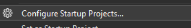
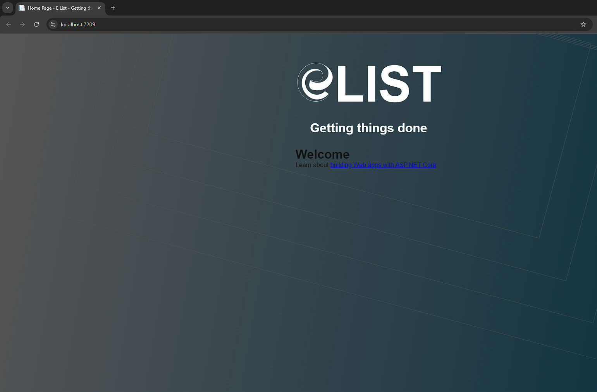

# &nbsp;**E List - Phase 8 MVC** [](https://github.com/entelect-incubator/.NET/actions/workflows/dotnet-phase8-startsolution.yml)

<br/><br/>

# **Frontend**

We will implement the front-end of the TODO application using .NET MVC.

## **Setup**

In the 01 Apis folder create a new MVC Project called UI.


Using the Theme provided on the Incubator [E List Theme Template](https://github.com/entelect-incubator/Theme)

Copy the style.css to wwwroot/css/site.css

Create a new image folder img inside wwwroot and copy the logo.png and site-icon.png

Copy the basic HTML to

```html
<!DOCTYPE html>
<html lang="en">
	<head>
		<title>@ViewData["Title"] - E List - Getting things done | Entelect</title>
		<title></title>
		<meta charset="utf-8" />
		<meta name="viewport" content="width=device-width, initial-scale=1, shrink-to-fit=no" />
		<link rel="stylesheet" href="~/css/site.css" asp-append-version="true" />
	</head>
	<body>
		<div class="default">
			<div id="header">
				<h1 id="main-title">LIST</h1>
				<h2 id="title">Getting things done</h2>
			</div>
			@RenderBody()
		</div>
		<div class="diamond-group">
			<div class="diamond"></div>
			<div class="diamond"></div>
			<div class="diamond"></div>
			<div class="diamond"></div>
		</div>

		<!-- Second group of diamonds -->
		<div class="diamond-group">
			<div class="diamond"></div>
			<div class="diamond"></div>
			<div class="diamond"></div>
			<div class="diamond"></div>
		</div>

		<!-- Third group of diamonds -->
		<div class="diamond-group">
			<div class="diamond"></div>
			<div class="diamond"></div>
			<div class="diamond"></div>
			<div class="diamond"></div>
		</div>

		<!-- Fourth group of diamonds -->
		<div class="diamond-group">
			<div class="diamond"></div>
			<div class="diamond"></div>
			<div class="diamond"></div>
			<div class="diamond"></div>
		</div>

		<script src="~/lib/jquery/dist/jquery.min.js"></script>
		<script src="~/js/site.js" asp-append-version="true"></script>
		@await RenderSectionAsync("Scripts", required: false)
	</body>
</html>
```




Now, let us run the solution and you should see the following



Add a reference to the Api.Client project in the UI project. This setup allows the client to be leveraged across various front-end technologies, enabling easier integration and interaction with the backend.

## _Startup_

To ensure each Todo is unique per session, we need to configure some services to manage session state globally. We also need to add HttpClientFactory to use the API Client correctly.

Program.cs

```cs
builder.Services.AddSession(options =>
{
	options.IdleTimeout = TimeSpan.FromMinutes(20);
	options.Cookie.HttpOnly = true;
	options.Cookie.IsEssential = true;
});
builder.Services.AddHttpClient();

app.UseSession();
```

## Controller

You'll notice many similarities between Web API and MVC, but we will focus on using these methods on the front end to interact with the Web API. Now, let's create a new controller: TodoController.cs.

```cs
namespace UI.Controllers;

using System.Net.Http;
using API.Client.Template;
using Microsoft.AspNetCore.Mvc;

public class HomeController(IHttpClientFactory httpClientFactory) : Controller
{
	private const string SessionKey = "SessionId";

	/// TODO Add proper settings to get the URL
	private readonly TodosClient todoClient = new("https://localhost:44315/", httpClientFactory.CreateClient());

	public async Task<ActionResult<List<TodoModel>>> Index()
	{
		if (string.IsNullOrEmpty(this.HttpContext.Session.GetString(SessionKey)))
		{
			this.HttpContext.Session.SetString(SessionKey, Guid.NewGuid().ToString());
		}

		this.ViewBag.SessionId = this.HttpContext.Session.GetString(SessionKey);
		if (!string.IsNullOrEmpty(this.ViewBag.SessionId))
		{
			var result = await this.todoClient.SearchAsync(new SearchTodoModel()
			{
				SessionId = new Guid(this.ViewBag.SessionId)
			});

			return this.View(result.Data);
		}

		return this.View(new List<TodoModel>());
	}

	[HttpPost]
	public async Task<ActionResult> Add(CreateTodoModel newItem)
	{
		newItem.IsCompleted = false;
		newItem.Task = $"{newItem.Task}";
		if (this.ModelState.IsValid)
		{
			newItem.SessionId = new Guid(this.HttpContext.Session.GetString(SessionKey));
			var result = await this.todoClient.AddAsync(newItem);
			if(result.Succeeded.HasValue)
			{
				if (!result.Succeeded.Value)
				{
					return this.RedirectToAction("Error");
				}
			}
		}

		return this.RedirectToAction("Index");
	}

	public async Task<ActionResult> MarkComplete(int id)
	{
		if (this.ModelState.IsValid)
		{
			var result = await this.todoClient.CompleteAsync(id);
			if (result.Succeeded.HasValue)
			{
				if (!result.Succeeded.Value)
				{
					return this.RedirectToAction("Error");
				}
			}
		}

		return this.RedirectToAction("Index");
	}

	public async Task<ActionResult> Delete(int id)
	{
		if (this.ModelState.IsValid)
		{
			var result = await this.todoClient.DeleteAsync(id);
			if (result.Succeeded.HasValue)
			{
				if (!result.Succeeded.Value)
				{
					return this.RedirectToAction("Error");
				}
			}
		}

		return this.RedirectToAction("Index");
	}
}
```

## **Update Your View**

Delete the Privacy.cshtml

Views/Home/Index.cshtml

```html
@using API.Client.Template

@model List<TodoModel>
@{
    var sessionId = ViewBag.SessionId as string;
}

<div id="todoApp">
    <!-- Section 1: Add TODO Item -->
    <div id="form">
        @using (Html.BeginForm("Add", "Home", FormMethod.Post))
        {
            @Html.TextBox("Task", null, new { @class = "todo-input", required = "required" })
            <input type="hidden" name="SessionId" value="@sessionId" />
            <button class="todo-btn" type="submit">Add</button>
        }
    </div>

    <!-- Section 2: TODO List -->
    <div id="todoListSection">
        <ul class="todo-list">
            @foreach (var item in Model)
            {
                <li class="todo">
                    @if (item.IsCompleted.HasValue)
                    {
                        @if (item.IsCompleted.Value)
                        {
                            <strike>@Html.DisplayFor(modelItem => item.Task)</strike>
                        }
                        else
                        {
                            @Html.DisplayFor(modelItem => item.Task)
                        }
                    }
                    else
                    {
                    @Html.DisplayFor(modelItem => item.Task)
                    }
                    <button class="btn-delete" onclick="location.href='@Url.Action("Delete", "Home", new { id = item.Id })'">Delete</button>
                    @if (item.IsCompleted.HasValue)
                    {
                        @if (!item.IsCompleted.Value)
                        {
                            <button class="btn-complete" onclick="location.href='@Url.Action("MarkComplete", "Home", new { id = item.Id })'">Complete</button>
                        }
                    }
                </li>
            }
        </ul>
    </div>
</div>
```

So should look like this now


Move to Phase 9 [Click Here](https://github.com/entelect-incubator/.NET/tree/master/Phase%209)
