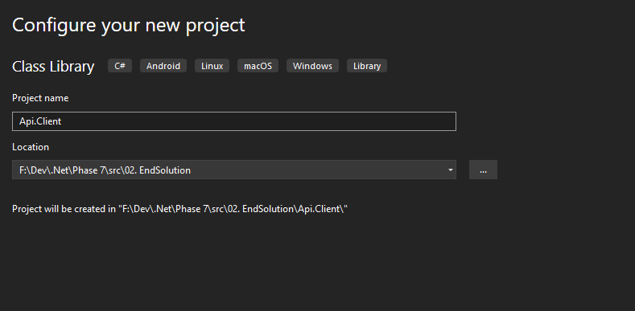
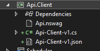

# &nbsp;**Pezza - Phase 8 — OpenAPI & NSwag Client** [](https://github.com/entelect-incubator/.NET/actions/workflows/dotnet-phase8-finalsolution.yml)


## Quick facts

- Estimated time: 3 - 6 hours (assumes familiarity with ASP.NET Core and basic OpenAPI concepts)
- Difficulty: Intermediate ▮▮▮▯▯ (3/5)
- Target SDK: .NET 10 (net10)
- Audience: Developers moving from Java/other platforms to C# who are comfortable with HTTP APIs and want to learn API client generation and OpenAPI tooling

## Goal

This phase shows how to generate an Api.Client from the running Api using NSwag and OpenAPI. You'll add an NSwag configuration, generate a client (C#) and make the client part of a small Console/Api.Client project. The produced client can be used by front-ends or other services and can also be used as input to other code generators (Angular / React) if needed.

## Prerequisites

- Completed Phase 7 (API running locally)
- .NET SDK 10 installed
- Basic understanding of OpenAPI/Swagger and HTTP APIs

## What you'll do (high level)

1. Add an Api.Client console/project to host the generated client.
2. Add an `Api.nswag` file to describe how to generate OpenAPI and the client.
3. Wire NSwag (MSBuild / CLI) into the Api.Client build or run it manually.
4. Inspect the generated client and run a sample call.

## Validate / Quick commands

Run these from the repository root (Windows PowerShell):

```powershell
# check .NET version (should be 10.x)
dotnet --version

# build the Phase 7 start solution (adjust path if you put the solution elsewhere)
dotnet build "./Phase 7/src/01. StartSolution/Pezza.sln"

# (optional) run the Api and generate the client using NSwag (if configured in msbuild target)
dotnet build "./Phase 7/src/01. StartSolution/Pezza.sln" /t:Restore,Build
```

Note: if your local layout differs, search for the Phase 7 solution under `Phase 7/src` and build that solution instead.

## Outcomes / Learning goals

- Understand how NSwag can produce an OpenAPI document from an ASP.NET Core Api and generate C# clients.
- Learn how to include API client generation in your build pipeline (MSBuild target) and the trade-offs (auto-generated code, dependency management).
- Be able to generate clients for other platforms using the OpenAPI JSON output.

---

### Microservices & NSwag

Microservices are a common architectural pattern for decoupling and scaling responsibilities. In the .NET world, NSwag and NSwag.AspNetCore are convenient tools to extract OpenAPI specs from an ASP.NET Core Api and generate strongly-typed clients for C# (and other languages) so consumers can call the Api easily.

This phase walks you through creating an `Api.Client` that consumes the Api's OpenAPI document and produces a reusable client. You can then use the generated client from console apps, worker services, or UI projects.

## Setup

Create a new Console Application `Api.Client` and add the following files and packages where appropriate.



### NuGet packages (suggested)

- NSwag.MSBuild (Api.Client) — to run generation as part of MSBuild
- Newtonsoft.Json (Api.Client) — for JSON handling in generated clients (optional)
- NSwag.AspNetCore (Api) — to expose OpenAPI from the Api project

### Add `Api.nswag`

Create an `Api.nswag` file in the `Api.Client` project (or repo root) with the generator and document settings. Example (trimmed for brevity):

```json
{
  "runtime": "Net70",
  "documentGenerator": {
    "aspNetCoreToOpenApi": {
      "project": "../Api/Api.csproj",
      "output": "Api-Client.json",
      "documentName": "v1"
    }
  },
  "codeGenerators": {
    "openApiToCSharpClient": {
      "className": "{controller}Client",
      "namespace": "API.Client.Template",
      "output": "Api-Client.cs"
    }
  }
}
```

You can copy the full options from the existing file in this README or adapt them to your needs.

## Build target (MSBuild example)

Add a target to `Api.Client.csproj` to run NSwag after build (example):

```xml
<Target Name="NSwag" AfterTargets="PostBuild" Condition=" '$(NO_RECURSE)' != 'true' ">
  <Exec Command="$(NSwagExe_Net70) run Api.nswag /variables:Configuration=$(Configuration)" ContinueOnError="true" />
</Target>
```

Adjust paths and settings to match your environment. If you prefer CLI, run `nswag run Api.nswag` manually.

## API Startup changes (exposing OpenAPI)

Replace or extend existing Swagger setup with NSwag in your `Startup`/`Program` file, for example:

```csharp
app.UseOpenApi();
app.UseSwaggerUi3(c => c.AdditionalSettings.Add("displayRequestDuration", true));

services.AddSwaggerDocument(config =>
{
    config.GenerateEnumMappingDescription = true;
    config.PostProcess = document =>
    {
        document.Info.Version = "V1";
        document.Info.Title = "Pezza Api";
    };
});
```

Finished client (example):



---

## Next

When you're happy with the generated client, move to Phase 8 to create the UI that consumes the Api and/or the generated client.

[Move to Phase 9](https://github.com/entelect-incubator/.NET/tree/master/Phase%209)
