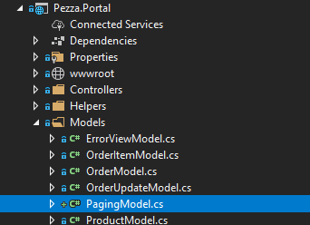

# &nbsp;**Pezza - Phase 7 - Dashboard - MVC - Step 2** [](https://github.com/entelect-incubator/.NET/actions/workflows/dotnet-phase7-dashboard-mvc-step2.yml)

<br/><br/>

## **Pagination & Filtering**

Start with your finished solution from Step 1

### **What are we building?**

For all the GetAll functions we want to include Filtering and Pagination. In Data is customer.sql file to populate a lot of data in Customers table.
### **Pagination**

Create a new PagingModel.cs in Models



```cs
namespace Portal.Models
{
    public class PagingModel
    {
        public int Page { get; set; }

        public int Limit { get; set; }
    }
}
```

In Result.cs at the end add the following class.

```cs
public class ListOutcome<T>
{
    public List<T> Data { get; set; }

    public int Count { get; set; }

    public List<string> Errors { get; set; }
}
```

ApiCallHelper in Pezza>portal change GetListAsync to use ListOutcome<T>

```cs
 public async Task<ListOutcome<T>> GetListAsync(string jsonData)
{
    var data = new StringContent(jsonData, Encoding.UTF8, "application/json");
    var response = await this.client.PostAsync(@$"{AppSettings.ApiUrl}{ControllerName}\Search", data);

    var responseData = await response.Content.ReadAsStringAsync();

    var entities = JsonSerializer.Deserialize<ListOutcome<T>>(responseData, new JsonSerializerOptions
    {
        PropertyNamingPolicy = JsonNamingPolicy.CamelCase,
        IgnoreNullValues = true,
        MaxDepth = 20
    });
    return entities;
}
```

In CustomerController Index change PagingArgs to use Default. One of the biggest changes is we want to load the data table data using AJAX.

In CustomerController.cs add a method $.ajax will call

```cs
public async Task<JsonResult> List(int limit, int page, string orderBy = "Name asc")
{
    var json = JsonConvert.SerializeObject(new CustomerDTO
    {
        OrderBy = orderBy,
        PagingArgs = new Common.Models.PagingArgs
        {
            Limit = limit,
            Offset = (page-1) * limit,
            UsePaging = true
        }
    });
    var result = await this.apiCallHelper.GetListAsync(json);
    return this.Json(result);
}
```

Change Index method to just send through PagingModel

```cs
 public ActionResult Index()
{
    return this.View(new Portal.Models.PagingModel
    {
        Limit = 10,
        Page = 1
    });
}
```

The view will now do most of the magic.

Start with the model it gets send in

```cs
@model Portal.Models.PagingModel
```

Add a row to display information about the table. This will also be used in the next step to add filtering.

```html
<div class="row">
    <div class="col-6">
        <div id="loading">Loading...</div>
    </div>
    <div class="col-6 text-right">
        <span id="CountData">0</span> Customers
    </div>
</div>
<br />
```

New Table Structure.

```html
<table class="table">
    <thead>
        <tr>
            <th class="sortable" data-field="Id" data-orderby="">
                <i class="down fa fa-long-arrow-up" aria-hidden="true"></i>
                <i class="up fa fa-long-arrow-down" aria-hidden="true"></i>
                Id
            </th>
            <th class="sortable" data-field="Name" data-orderby="asc">
                <i class="down fa fa-long-arrow-up" aria-hidden="true"></i>
                <i class="up fa fa-long-arrow-down" aria-hidden="true"></i>
                Name
            </th>
            <th class="sortable" data-field="Phone" data-orderby="">
                <i class="down fa fa-long-arrow-up" aria-hidden="true"></i>
                <i class="up fa fa-long-arrow-down" aria-hidden="true"></i>
                Phone
            </th>
            <th class="sortable" data-field="Email" data-orderby="">
                <i class="down fa fa-long-arrow-up" aria-hidden="true"></i>
                <i class="up fa fa-long-arrow-down" aria-hidden="true"></i>
                Email
            </th>
            <th>Contact Person</th>
            <th>Address</th>
            <th class="sortable" data-field="DateCreated" data-orderby="">
                <i class="down fa fa-long-arrow-up" aria-hidden="true"></i>
                <i class="up fa fa-long-arrow-down" aria-hidden="true"></i>
                Date Created
            </th>
            <th width="100px" class="text-right">Actions</th>
        </tr>
    </thead>
    <tbody id="tbody"></tbody>
    <tfoot id="paginationBar">
        <tr>
            <td colspan="8">
                <div class="btn-group" role="group" aria-label="Basic example">
                    <button id="first" type="button" class="btn btn-secondary">First</button>
                    <button id="prev" type="button" class="btn btn-secondary">Prev</button>
                    <button type="button" class="btn btn-secondary"><span id="pagingData"></span></button>
                    <button id="next" type="button" class="btn btn-secondary">Next</button>
                    <button id="last" type="button" class="btn btn-secondary">Last</button>
                </div>
            </td>
        </tr>
    </tfoot>
</table>
```

New Card Structure.

```html
<div class="row">
    <div class="col-12">
        <div id="cardData"></div>
    </div>
</div>

<div id="paginationBar" class="row">
    <div class="col-12">
        <div class="btn-group" role="group" aria-label="Basic example">
            <button id="first" type="button" class="btn btn-secondary">First</button>
            <button id="prev" type="button" class="btn btn-secondary">Prev</button>
            <button type="button" class="btn btn-secondary"><span id="pagingData"></span></button>
            <button id="next" type="button" class="btn btn-secondary">Next</button>
            <button id="last" type="button" class="btn btn-secondary">Last</button>
        </div>
    </div>
</div>
```

Add Hidden Input to keep track of PaginationModel. 

```html
<input type="hidden" id="Count" />
<input type="hidden" id="OrderBy" value="Name asc" />
@Html.HiddenFor(model => model.Limit)
@Html.HiddenFor(model => model.Page)
```

## **Javascript**

Onload

```js
loadData();
$('*[data-field="Name"]').find('.up').show(); //only for tables.
```

This show an arrow to indicate the sorting direction - ascending or descending.

Row Header Click Event - only applicable for views with tables.

```js
$(".sortable").on("click", function () {
    var field = $(this).data("field");

    $('.up').hide();
    $('.down').hide();
    var direction = $(this).data("orderby");

    if (direction == '') {
        direction = 'asc'
    }

    if (direction == 'asc') {
        direction = 'desc';
        $('*[data-field="' + field + '"]').find('.down').show();
    }
    else {
        direction = 'asc';
        $('*[data-field="' + field + '"]').find('.up').show();
    }
    $(this).data("orderby", direction);
    var orderby = field + " " + direction;
    $("#OrderBy").val(orderby);
    loadData();
});
```

Paging Click Events

```js
 $("#first").on("click", function () {
    var page = 1;
    $('#Page').val(page);
    loadData();
});

$("#prev").on("click", function () {
    var page = parseInt($('#Page').val());
    if (page > 1) {
        page -= 1;
        $('#Page').val(page);
        loadData();
    }
});

$("#next").on("click", function () {
    console.log('next');
    var page = parseInt($('#Page').val());
    if (page < parseInt($("#Count").val())) {
        page += 1;
        $('#Page').val(page);
        loadData();
    }
});

$("#last").on("click", function () {
    var count = parseInt($("#Count").val());
    var limit = parseInt($("#Limit").val());
    var page = Math.round(count / limit);
    $('#Page').val(page);
    loadData();
});
```

Update Paging Data 

```js
function updatePagingData() {
    var count = parseInt($("#Count").val());
    var limit = parseInt($("#Limit").val());
    var page = parseInt($('#Page').val());
    var lastPage = Math.round(count / limit);
    if (lastPage == 0 || count <= limit) {
        $("#paginationBar").hide();
    }
    $("#pagingData").html((lastPage > 0) ? page + "/" + lastPage : page);
    $("#CountData").html(count);
}
```

Load Data function for Tables

```js
function loadData() {
    $("#loading").show();
    var orderBy = $("#OrderBy").val();
    $.ajax({
        type: "POST",
        url: '@Url.Action("List", "Customer")?limit=' + parseInt($('#Limit').val()) + '&page=' + parseInt($('#Page').val()) + "&orderBy=" + orderBy,
        contentType: 'application/json; charset=utf-8',
        success: function (result) {
            if (result) {
                $("#Count").val(result.count);

                var tableBody = '';
                if (!result.data) {
                    $("#loading").hide();
                    $("#tbody").html('<tr><td colspan="7"> No Customer Data</td></tr>');
                    $("#paginationBar").hide();
                }
                else if (result.data.length == 0) {
                    $("#loading").hide();
                    $("#tbody").html('<tr><td colspan="7"> No Customer Data</td></tr>');
                    $("#paginationBar").hide();
                }
                else {
                    for (var i = 0; i < result.data.length; i++) {
                        var customer = result.data[i];
                        tableBody += '<tr>';
                        tableBody += '<td>' + customer.id + '</td>';
                        tableBody += '<td>' + customer.name + '</td>';
                        tableBody += '<td><a class="btn btn-sm" target="_blank" href="tel:' + customer.phone + '">' + customer.phone + '</a></td>';
                        tableBody += '<td><a class="btn btn-sm" target="_blank" href="email:' + customer.email + '">' + customer.email + '</a></td>';
                        tableBody += '<td>' + customer.contactPerson + '</td>';
                        tableBody += '<td>';
                        tableBody += customer.address.address + '<br/>';
                        tableBody += customer.address.city + '<br/>';
                        tableBody += customer.address.province + '<br/>';
                        tableBody += customer.address.PostalCode;
                        tableBody += '</td>';
                        tableBody += '<td>' + new Date(customer.dateCreated).toLocaleDateString() + '</td>';
                        tableBody += `<td align="right">
                        <a rel="tooltip" class="btn btn-info btn-sm btn-round btn-icon edit" href="/Customer/Edit/` + customer.id + `">
                            <i class="fa fa-wrench" aria-hidden="true"></i>
                            </a>
                        <button onclick="remove(` + customer.id + `, '` + customer.name + `')" type="button" rel="tooltip" class="btn btn-danger btn-sm btn-round btn-icon remove">
                            <i class="fa fa-times" aria-hidden="true"></i>
                        </button>
                    </td>`
                        tableBody += '</tr>';
                    }

                    $("#loading").hide();
                    $("#tbody").html(tableBody);
                    updatePagingData();
                }
            }
            else {
                $.alertWarning('Error loading Customers');
                $("#loading").hide();
            }
        },
        error: function (error) {
            console.log(error);
            $.alertWarning('Error loading Customers');
            $("#loading").hide();
        }
    });
}
```

Load Data function for Cards

```js
function loadData() {
    $("#loading").show();
    $.ajax({
        type: "POST",
        url: '@Url.Action("List", "Restaurant")?limit=' + parseInt($('#Limit').val()) + '&page=' + parseInt($('#Page').val()),
        contentType: 'application/json; charset=utf-8',
        success: function (result) {
            if (result) {
                console.log(result);
                $("#Count").val(result.count);

                var cardBody = '';
                if (result.data.length == 0) {
                    $("#loading").hide();
                    $("#cardData").html('No Restaurant Data');
                }
                else {
                    for (var i = 0; i < result.data.length; i++) {
                        var entity = result.data[i];
                        cardBody += ' <div class="card" style="width: 18rem;float: left; margin-right: 15px;">';
                        cardBody += '';
                        cardBody += '<div class="card-body">';
                        cardBody += '<h4 class="card-title">' + entity.name + ' - <small>' + (entity.isActive ? "Open" : "Close") + '</small></h4>';
                        cardBody += '<p class="card-text">';
                        cardBody += entity.address.address + '<br/>';
                        cardBody += entity.address.city + '<br/>';
                        cardBody += entity.address.province + '<br/>';
                        cardBody += entity.address.PostalCode;
                        cardBody += '</p>';
                        cardBody += '<p class="card-text">' + entity.description + ' </p>';
                        cardBody += '<p>Since | ' + new Date(entity.dateCreated).toLocaleDateString() + '</p>';
                        cardBody += `<div class="btn-group" role="group">
                            <a rel="tooltip" class="btn btn-info btn-sm edit" href="/Restaurant/Edit/` + entity.id + `">
                                <i class="fa fa-wrench" aria-hidden="true"></i>
                                </a>
                            <button onclick="remove(` + entity.id + `, '` + entity.name + `')" type="button" rel="tooltip" class="btn btn-danger btn-sm remove">
                                <i class="fa fa-times" aria-hidden="true"></i>
                            </button>
                        </div>`
                        cardBody += '</div>';
                        cardBody += '</div>';
                    }

                    $("#loading").hide();
                    $("#cardData").html(cardBody);
                    updatePagingData();
                }
            }
            else {
                $("#loading").hide();
                $.alertWarning('Error loading Restaurants');
            }
        },
        error: function (error) {
            console.log(error);
            $("#loading").hide();
            $.alertWarning('Error loading Restaurants');
        }
    });
}
```

Add Paging & Sorting to the other Index pages. With restaurant you can remove the order orders by restaurant. It doesn't make sense now to have different sections.

Orders we need to send in Completed flag of false through. For this we need to set somethings up. This will also lay the foundation for the last step filtering.

In Models create a new model SearchModel.cs. T is your DTO

```cs
namespace Portal.Models
{
    public class SearchModel<T>
    {
        public T SearchData { get; set; }

        public int Limit { get; set; }

        public int Page { get; set; }

        public string OrderBy { get; set; }
    }
}
```

Add new JsonSerializerOptions to ApiCallHelper

```cs
namespace Portal.Helpers
{
    using System;
    using System.Collections.Generic;
    using System.Net.Http;
    using System.Net.Http.Headers;
    using System.Text;
    using System.Threading.Tasks;
    using Common;
    using System.Text.Json;
    using Common.Models;

    public class ApiCallHelper<T>
    {
        private readonly IHttpClientFactory clientFactory;

        private readonly HttpClient client;

        private readonly JsonSerializerOptions jsonSerializerOptions;

        public string ControllerName { get; set; }

        public ApiCallHelper(IHttpClientFactory clientFactory)
        {
            this.clientFactory = clientFactory;
            this.client = clientFactory.CreateClient();
            this.client.BaseAddress = new Uri(AppSettings.ApiUrl);
            this.client.DefaultRequestHeaders.Accept.Clear();
            this.client.DefaultRequestHeaders.Accept.Add(new MediaTypeWithQualityHeaderValue("application/json"));

            this.jsonSerializerOptions = new JsonSerializerOptions
            {
                PropertyNamingPolicy = JsonNamingPolicy.CamelCase,
                IgnoreNullValues = true,
                MaxDepth = 20
            };
        }

        public async Task<ListOutcome<T>> GetListAsync(string jsonData)
        {
            var data = new StringContent(jsonData, Encoding.UTF8, "application/json");
            var response = await this.client.PostAsync(@$"{AppSettings.ApiUrl}{ControllerName}\Search", data);

            var responseData = await response.Content.ReadAsStringAsync();

            var entities = JsonSerializer.Deserialize<ListOutcome<T>>(responseData, this.jsonSerializerOptions);
            return entities;
        }

        public async Task<T> GetAsync(int id)
        {
            var responseMessage = await this.client.GetAsync(@$"{AppSettings.ApiUrl}{ControllerName}\{id}");
            if (responseMessage.IsSuccessStatusCode)
            {
                var responseData = await responseMessage.Content.ReadAsStringAsync();
                return JsonSerializer.Deserialize<T>(responseData, this.jsonSerializerOptions);
            }

            return default;
        }

        public async Task<T> Create(T entity)
        {
            var json = JsonSerializer.Serialize(entity);
            var data = new StringContent(json, Encoding.UTF8, "application/json");

            var responseMessage = await this.client.PostAsync(@$"{AppSettings.ApiUrl}{ControllerName}", data);
            if (responseMessage.StatusCode == System.Net.HttpStatusCode.BadRequest)
            {
                var responseData = await responseMessage.Content.ReadAsStringAsync();
                var response = JsonSerializer.Deserialize<T>(responseData, this.jsonSerializerOptions);

                return response;
            }

            if (responseMessage.IsSuccessStatusCode)
            {
                var responseData = await responseMessage.Content.ReadAsStringAsync();
                var response = JsonSerializer.Deserialize<T>(responseData, this.jsonSerializerOptions);

                return response;
            }

            return default;
        }

        public async Task<T> Edit(T entity)
        {
            var json = JsonSerializer.Serialize(entity);
            var data = new StringContent(json, Encoding.UTF8, "application/json");

            var responseMessage = await this.client.PutAsync(@$"{AppSettings.ApiUrl}{ControllerName}", data);
            if (responseMessage.IsSuccessStatusCode)
            {
                var responseData = await responseMessage.Content.ReadAsStringAsync();
                var response = JsonSerializer.Deserialize<T>(responseData, this.jsonSerializerOptions);
                return response;
            }

            return default;
        }

        public async Task<bool> Delete(int id)
        {
            var responseMessage = await this.client.DeleteAsync(@$"{AppSettings.ApiUrl}{ControllerName}\{id}");
            if (responseMessage.IsSuccessStatusCode)
            {
                var responseData = await responseMessage.Content.ReadAsStringAsync();
                return JsonSerializer.Deserialize<bool>(responseData, this.jsonSerializerOptions);
            }

            return false;
        }
    }
}
```

OrdersController to make use of the new SearchModel.

```cs
[HttpPost]
public async Task<JsonResult> List([FromBody] SearchModel<OrderDTO> searchmodel)
{
    var entity = searchmodel.SearchData;
    entity.OrderBy = searchmodel.OrderBy;
    entity.PagingArgs = new Common.Models.PagingArgs
    {
        Limit = searchmodel.Limit,
        Offset = (searchmodel.Page - 1) * searchmodel.Limit,
        UsePaging = true
    };
    var json = JsonConvert.SerializeObject(entity);
    var result = await this.apiCallHelper.GetListAsync(json);
    return this.Json(result);
}
```

Orders Index.chtml

```cshtml
@model Portal.Models.PagingModel

@{
    ViewBag.Title = "Order";
    ViewBag.ActiveMenu = "Order";
}

<div>
    <a class="btn btn-primary" href="/Orders/Create">
        <i class="fa fa-plus" aria-hidden="true"></i>
        Create Order
    </a>
</div>
<br />
<div class="row">
    <div class="col-6">
        <div id="loading">Loading...</div>
    </div>
    <div class="col-6 text-right">
        <span id="CountData">0</span> Orders
    </div>
</div>
<br />


<table class="table">
    <thead>
        <tr>
            <th class="sortable" data-field="Id" data-orderby="">
                <i class="down fa fa-long-arrow-up" aria-hidden="true"></i>
                <i class="up fa fa-long-arrow-down" aria-hidden="true"></i>
                Id
            </th>
            <th>Customer</th>
            <th>Order</th>
            <th class="sortable text-right" data-field="Amount" data-orderby="">
                <i class="down fa fa-long-arrow-up" aria-hidden="true"></i>
                <i class="up fa fa-long-arrow-down" aria-hidden="true"></i>
                Amount
            </th>
            <th class="sortable" data-field="DateCreated" data-orderby="">
                <i class="down fa fa-long-arrow-up" aria-hidden="true"></i>
                <i class="up fa fa-long-arrow-down" aria-hidden="true"></i>
                Date Created
            </th>
            <th width="100px" class="text-right">Actions</th>
        </tr>
    </thead>
    <tbody id="tbody"></tbody>
    <tfoot id="paginationBar">
        <tr>
            <td colspan="5">
                <div class="btn-group" role="group" aria-label="Basic example">
                    <button id="first" type="button" class="btn btn-secondary">First</button>
                    <button id="prev" type="button" class="btn btn-secondary">Prev</button>
                    <button type="button" class="btn btn-secondary"><span id="pagingData"></span></button>
                    <button id="next" type="button" class="btn btn-secondary">Next</button>
                    <button id="last" type="button" class="btn btn-secondary">Last</button>
                </div>
            </td>
        </tr>
    </tfoot>
</table>

@await Html.PartialAsync("_Modals")

<input type="hidden" id="Count" />
<input type="hidden" id="OrderBy" value="DateCreated asc" />
@Html.HiddenFor(model => model.Limit)
@Html.HiddenFor(model => model.Page)

<!-- Confirm Confirmation Modal -->
<div class="modal fade" id="confirmConfirmationModal" tabindex="-1" role="dialog" aria-labelledby="confirmModalLabel" aria-hidden="true">
    <div class="modal-dialog modal-sm" role="document">
        <div class="modal-content">
            <div class="modal-header">
                <div class="row" id="confirmation-error" style="display:none">
                    <div class="col-12">
                        <div class="alert alert-warning alert-with-icon">
                            <button type="button" aria-hidden="true" class="close" data-dismiss="alert" aria-label="Close">
                                <i class="tim-icons icon-simple-remove"></i>
                            </button>
                            <span data-notify="icon" class="tim-icons icon-bulb-63"></span>
                            <span>
                                <b> Error! - </b> Error occured
                            </span>
                        </div>
                    </div>
                </div>

                <div class="row" id="confirmation-success" style="display:none">
                    <div class="col-12">
                        <div class="alert alert-info alert-with-icon">
                            <button type="button" aria-hidden="true" class="close" data-dismiss="alert" aria-label="Close">
                                <i class="tim-icons icon-simple-remove"></i>
                            </button>
                            <span data-notify="icon" class="tim-icons icon-trophy"></span>
                            <span>
                                <b> Success - </b>
                            </span>
                        </div>
                    </div>
                </div>

                <h5 class="modal-title" id="confirmModalLabel">Confirm <span class="confirm-entity"></span></h5>
                <button type="button" class="close" data-dismiss="modal" aria-label="Close">
                    <span aria-hidden="true">&times;</span>
                </button>
            </div>
            <div class="modal-body">
                <span class="confirm-name"></span>?
                <input type="hidden" id="confirmId" />
            </div>
            <div class="modal-footer">
                <button type="button" class="btn btn-link btn-danger" data-dismiss="modal">No</button>
                <button type="button" onclick="confirmConfirmation()" class="btn btn-primary">Yes</button>
            </div>
        </div>
    </div>
</div>

@section Scripts
{
    <script>
        "use strict";

     /*   window.setTimeout(function () {
            window.location.reload();
        }, 10000);*/

        function complete(id, name) {
            $('.confirm-entity').html('Order');
            $('.confirm-name').html("Are you sure you want to complete " + name);
            $('#confirmId').val(id);
            $('#confirmConfirmationModal').modal('show');
        }

        function confirmConfirmation() {
            $(".alert").hide();

            $('#confirmConfirmationModal').modal('hide');
            $.ajax({
                type: "POST",
                url: '@Url.Action("Complete", "Orders")/' + $('#confirmId').val(),
                contentType: 'application/json; charset=utf-8',
                success: function (data) {
                    console.log(data);
                    if (data) {
                        $.alertInfo('Order has been completed', function () {
                            setTimeout(function () { window.location.reload() }, 1500);
                        });
                    }
                    else {
                        $.alertWarning('Error completing Order');
                    }
                },
                error: function (error) {
                    console.log(error);
                    $.alertWarning('Error completing Order');
                }
            });
        }

        function remove(id, name) {
            $('.remove-entity').html('Order');
            $('.remove-name').html("Are you sure you want to remove " + name);
            $('#removeId').val(id);
            $('#confirmationModal').modal('show');
        }

        function confirmRemove() {
            $(".alert").hide();

            $('#confirmationModal').modal('hide');
            var data = { Id: parseInt($('#removeId').val()) };
            $.ajax({
                type: "POST",
                url: '@Url.Action("Delete", "Orders")/' + $('#removeId').val(),
                contentType: 'application/json; charset=utf-8',
                success: function (data) {
                    if (data == true) {
                        $.alertInfo('Order has been removed', function () {
                            setTimeout(function () { window.location.reload() }, 1500);
                        });
                    }
                    else {
                        $.alertWarning('Error removing Order');
                    }
                },
                error: function (error) {
                    console.log(error);
                    $.alertWarning('Error removing Order');
                }
            });
        }

        $(document).ready(function () {
            loadData();
            $('*[data-field="DateCreated"]').find('.up').show();

            $(".sortable").on("click", function () {
                var field = $(this).data("field");

                $('.up').hide();
                $('.down').hide();
                var direction = $(this).data("orderby");

                if (direction == '') {
                    direction = 'asc'
                }

                if (direction == 'asc') {
                    direction = 'desc';
                    $('*[data-field="' + field + '"]').find('.down').show();
                }
                else {
                    direction = 'asc';
                    $('*[data-field="' + field + '"]').find('.up').show();
                }
                $(this).data("orderby", direction);
                var orderby = field + " " + direction;
                $("#OrderBy").val(orderby);
                loadData();
            });

            $("#first").on("click", function () {
                var page = 1;
                $('#Page').val(page);
                loadData();
            });

            $("#prev").on("click", function () {
                var page = parseInt($('#Page').val());
                if (page > 1) {
                    page -= 1;
                    $('#Page').val(page);
                    loadData();
                }
            });

            $("#next").on("click", function () {
                console.log('next');
                var page = parseInt($('#Page').val());
                if (page < parseInt($("#Count").val())) {
                    page += 1;
                    $('#Page').val(page);
                    loadData();
                }
            });

            $("#last").on("click", function () {
                var count = parseInt($("#Count").val());
                var limit = parseInt($("#Limit").val());
                var page = Math.round(count / limit);
                $('#Page').val(page);
                loadData();
            });

            function updatePagingData() {
                var count = parseInt($("#Count").val());
                var limit = parseInt($("#Limit").val());
                var page = parseInt($('#Page').val());
                var lastPage = Math.round(count / limit);
                if (lastPage == 0 || count <= limit) {
                    $("#paginationBar").hide();
                }
                $("#pagingData").html((lastPage > 0) ? page + "/" + lastPage : page);
                $("#CountData").html(count);
            }

            function loadData() {
                $("#loading").show();
                $("#paginationBar").show();
                var orderBy = $("#OrderBy").val();

                var dto = new Object;
                dto.Completed = false;

                var searchModel = new Object();
                searchModel.SearchData = dto;
                searchModel.Limit = parseInt($("#Limit").val());
                searchModel.Page = parseInt($('#Page').val());
                searchModel.OrderBy = orderBy;

                $.ajax({
                    type: "POST",
                    url: '@Url.Action("List", "Orders")',
                    data: JSON.stringify(searchModel),
                    contentType: 'application/json; charset=utf-8',
                    success: function (result) {
                        if (result) {
                            $("#Count").val(result.count);

                            var tableBody = '';
                            if (!result.data) {
                                $("#loading").hide();
                                $("#tbody").html('<tr><td colspan="6"> No Order Data</td></tr>');
                                $("#paginationBar").hide();
                            }
                            else if (result.data.length == 0) {
                                $("#loading").hide();
                                $("#tbody").html('<tr><td colspan="6"> No Order Data</td></tr>');
                                $("#paginationBar").hide();
                            }
                            else {
                                for (var i = 0; i < result.data.length; i++) {
                                    var entity = result.data[i];
                                    console.log(entity);
                                    tableBody += '<tr>';
                                    tableBody += '<td>' + entity.id + '</td>';
                                    tableBody += `<td>
                                        ` + entity.customer.name + `<br />
                                        <a class="btn btn-sm" target="_blank" href="tel:` + entity.customer.phone + `">` + entity.customer.phone + `</a><br />
                                        <a class="btn btn-sm" target="_blank" href="email:` + entity.customer.email + `">` + entity.customer.email + `</a>
                                    </td>`;
                                    tableBody += '<td>';
                                    if (entity.orderItems.length > 0) {
                                        for (var j = 0; j < entity.orderItems.length; j++) {
                                            tableBody += entity.orderItems[j].quantity + ' ' + entity.orderItems[j].product.name + '<br/>';
                                        }
                                    }
                                    else {
                                        tableBody += 'No Products';
                                    }
                                    tableBody += '</td>';
                                    tableBody += '<td class="text-right">R' + entity.amount + '</td>';
                                    tableBody += '<td>' + new Date(entity.dateCreated).toLocaleDateString() + '</td>';
                                    tableBody += `<td align="right">
                                    <button onclick="complete(` + entity.id + `, '#` + entity.id + `')" type="button" rel="tooltip" class="btn btn-danger btn-sm btn-round btn-icon remove">
                                        <i class="fa fa-check" aria-hidden="true"></i>
                                    </button>
                                    <button onclick="remove(` + entity.id + `, '` + entity.name + `')" type="button" rel="tooltip" class="btn btn-danger btn-sm btn-round btn-icon remove">
                                        <i class="fa fa-times" aria-hidden="true"></i>
                                    </button>
                                </td>`
                                    tableBody += '</tr>';
                                }

                                $("#loading").hide();
                                $("#tbody").html(tableBody);
                                updatePagingData();
                            }
                        }
                        else {
                            $("#loading").hide();
                            $.alertWarning('No new orders has been placed.');
                        }
                    },
                    error: function (error) {
                        $("#loading").hide();
                        console.log(error);
                        $.alertWarning('Error loading Orders');
                    }
                });
            }
        });
    </script>
}
```

Move to Step 3 - Filtering

[Click Here](https://github.com/entelect-incubator/.NET/tree/master/Phase%207/02.%20Dashboard/MVC/Step%203)