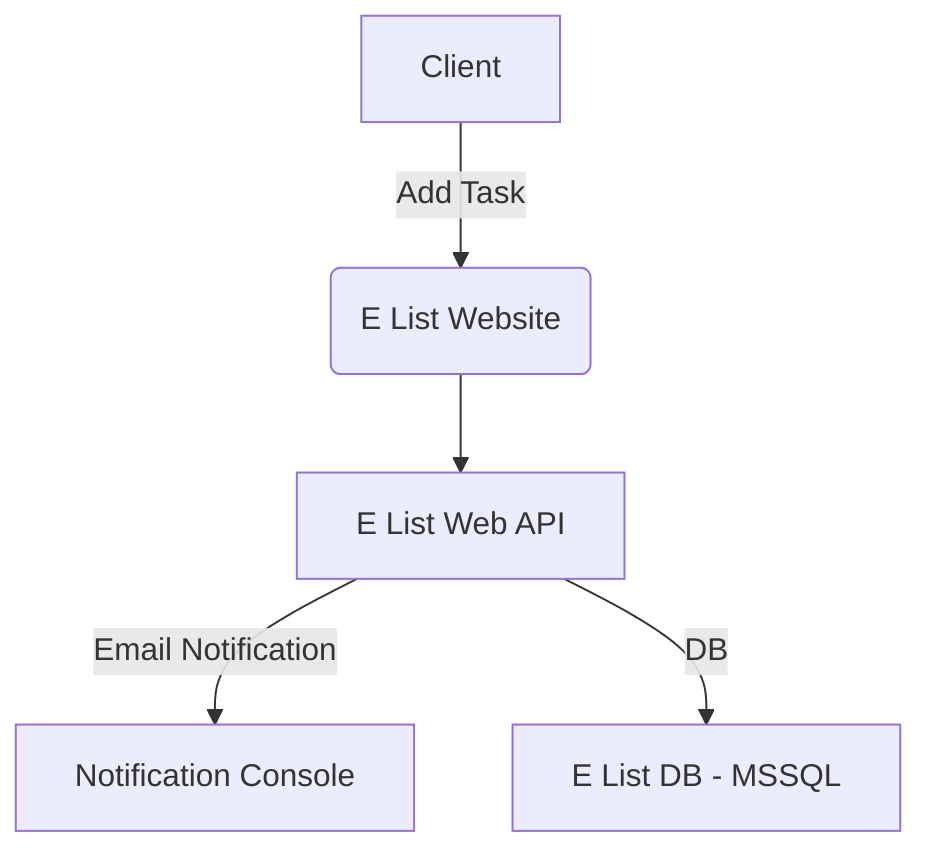

# &nbsp;**Welcome to the .NET Incubator**  

  

## What you will be learning?

-   [ ] What is it?
-   [ ] Why should I learn about it?
-   [ ] Official documentation
-   [ ] Prerequirements?
-   [ ] Building the E List Solution
    -   [ ] Basic TODO app
    -   [ ] Handling Background Jobs
    -   [ ] Creating an API
        -   [ ] RESTful - Web API
    -   [ ] Schedule Background Jobs
        -   [ ] Hangfire
    -   [ ] Building a Front-End to consume your API
        -   [ ] MVC
-   [ ] Security
-   [ ] Microservices
-   [ ] Recommended libraries

## What is it?

.NET is a powerful, versatile developer platform that enables the creation of a wide range of applications. It is a free, cross-platform, open-source framework that can be used to build web, mobile, desktop, gaming, and IoT applications. One of the best ways to get started with .NET is through the .NET Incubator, which is designed to provide hands-on experience and real-world application development skills to aspiring developers. This training course covers the essential concepts of .NET programming, including C# language syntax, debugging techniques, and the use of .NET Core libraries. With the .NET Incubator training course, you can become proficient in creating high-quality, scalable applications using the .NET platform.

-   [ ] What is .NET? - [Read more...](https://github.com/entelect-incubator/.Net/tree/master/Fundamentals)

## Why should I learn about it?

### Cross-platform support

.NET is a cross-platform framework, which means that developers can build applications for Windows, Linux, and macOS using the same codebase. This allows developers to target a wider range of platforms and reach a larger audience with their applications.

### Large community and ecosystem

.NET has a large and active community of developers, which means that there are plenty of resources, tools, and libraries available for developers to use. This also means that developers can get help and support from the community when they run into problems or have questions.

### Performance and scalability

.NET is designed to be fast and efficient, which makes it ideal for building high-performance applications. It also provides scalability features such as load balancing, which can help applications handle large amounts of traffic.

### Easy to learn and use

.NET is a relatively easy framework to learn and use, especially for developers who are already familiar with object-oriented programming languages such as Java or C++. The syntax is straightforward, and there are plenty of tutorials and resources available to help developers get started.

### Versatility

.NET can be used to build a wide range of applications, including web applications, desktop applications, mobile applications, games, and IoT applications. This makes it a versatile framework that can be used for almost any type of project.

Overall, developers love .NET because it is a powerful, flexible, and easy-to-use framework that allows them to build high-quality applications for a wide range of platforms and use cases.

## Official documentation

Links to the official documentation:

-   [Fundamentals overview](https://learn.microsoft.com/en-us/aspnet/core/fundamentals)
-   [Learn C#](https://dotnet.microsoft.com/en-us/learn/csharp)
-   [.NET documentation](https://docs.microsoft.com/en-us/dotnet/) - Learn to use .NET to create applications on any platform using C#, F#, and Visual Basic. Browse API reference, sample code, tutorials, and more..
-   [Microsoft learn for .NET](https://docs.microsoft.com/en-us/learn/dotnet/) - Learn how to build apps across multiple platforms with programming languages like C#, F#, and Visual Basic. Supported on Windows, Linux, and macOS, get started developing your next project with .NET today.
-   [.NET foundation](https://dotnetfoundation.org/) - The .NET Foundation is an independent, non-profit organization established to support an innovative, commercially friendly, open-source ecosystem around the .NET platform.
-   [.NET Youtube](https://www.youtube.com/dotnet)

## Prerequirements?

-   [ ] .NET Prerequirements - [Read more...](https://github.com/entelect-incubator/.NET/blob/master/Prerequirements.md)
-   [ ] Setup [Read more...](https://github.com/entelect-incubator/.NET/blob/master/Setup.md)

# E List Solution

In this section, we will begin developing projects to manage the new E List Solution.

## Intro

The Entelectuals family, known for their focus on organization and efficiency, has launched a comprehensive training initiative alongside their venture into the digital world. This program is open to all family members who wish to contribute to the success of the family’s new project.

In the field of software engineering, a solid grasp of fundamental principles is crucial. To that end, the training program covers a wide range of topics, from core concepts to advanced techniques. It is designed to address real-world challenges faced by developers and to provide strategies for overcoming recurring issues, while promoting best practices across all teams.

To address the business requirements, we will begin by implementing the following:

-   [ ] Expose your TODO items through a .NET Web API, which will be consumed by the front-end application. This API will manage a "tasks" entity.
-   [ ] Create a simple front-end system using .NET MVC to allow users to manage their TODO list.
-   [ ] Enable email notifications when a task is overdue.

## Learning Outcomes

### Phase 1 - Getting started

We will be starting with how to make a basic project and refactoring it into a solution following the single responsibility principle and how to set up a basic clean code architecture / layered architecture. This setup format will be used throughout the incubator.

Overview

-   [ ] [Data Transfer Objects (DTOs)](https://docs.microsoft.com/en-us/aspnet/web-api/overview/data/using-web-api-with-entity-framework/part-5)

[Click here to get started](https://github.com/entelect-incubator/.NET/tree/master/Phase%201)

### Phase 2 - Scaffolding

In Phase 2, we will expand the foundational system to support operations for all entities. To improve scalability and maintainability, we will adopt the CQRS (Command Query Responsibility Segregation) pattern. Additionally, we will integrate the MediatR NuGet Package to simplify and decouple command and query responsibilities, allowing for better separation of concerns and more efficient processing across the system.

Overview

[Click here to get started](https://github.com/entelect-incubator/.NET/tree/master/Phase%202)

### Phase 3 - Data Validation and Data Pagination

With Phase 2 successfully deployed, we are now ready to introduce several enhancements. In this phase, we will focus on improving the overall usability of the system by implementing advanced search and filtering capabilities.

Overview

-   [ ] [Getting Started with Entity Framework Core](https://www.youtube.com/watch?v=SryQxUeChMc&ab_channel=dotnet)

Improve how data is displayed and validated

-   [ ] Fluent Validation
-   [ ] Filtering
-   [ ] Searching
-   [ ] Pagination
-   [ ] Entity Framework Core
    -   [ ] Migrations
    -   [ ] Change Tracker API
    -   [ ] Lazy Loading, Eager Loading, Explicit Loading
    -   [ ] TPH, TPC, TPT

[Click here to get started](https://github.com/entelect-incubator/.NET/tree/master/Phase%203)

### Phase 4 - Coding Standards and Error Handling

In Phase 4, we will focus on ensuring code quality by enforcing basic coding standards across the team. Adhering to these standards helps maintain consistency, readability, and long-term maintainability. Additionally, we will implement robust error handling throughout the system to improve reliability and make debugging easier.

Overview

-   [ ] [Error Handling](https://web.microsoftstream.com/video/5fcd4c8a-4e7b-41ac-9836-d1366da97c82?channelId=fe5bc582-9acb-4952-9b71-b29aab0bc9e9)

-   [ ] Coding Standards

[Click here to get started](https://github.com/entelect-incubator/.NET/tree/master/Phase%204)

### Phase 5 - Performance Improvement

In Phase 5, we will enhance system performance by introducing caching and response compression. Caching will be implemented for scenarios where data retrieval involves content that does not change frequently, reducing redundant operations and improving load times. Additionally, response compression will be added to increase app responsiveness by reducing the size of data transferred between the server and clients that support it.

-   [ ] [Performance and Memory Management](https://web.microsoftstream.com/video/64098be8-6979-4c10-85f4-efa91d0cb1f1?channelId=fe5bc582-9acb-4952-9b71-b29aab0bc9e9)

Increasing Performance

-   [ ] Caching
-   [ ] Compression

[Click here to get started](https://github.com/entelect-incubator/.NET/tree/master/Phase%205)

### Phase 6 - Events

In Phase 6, we will implement an email notification system to alert users when they are late in completing a task on their TODO list. This feature ensures that users are promptly informed about overdue tasks, helping them stay on top of their responsibilities.

Increasing Performance

-   [ ] Domain Events
-   [ ] Simple Email Notification
-   [ ] Schedule Background Jobs
    -   [ ] Hangfire

[Click here to get started](https://github.com/entelect-incubator/.NET/tree/master/Phase%206)

### Phase 7 - Microservices

-   [ ] [Overview](https://learn.microsoft.com/en-us/aspnet/core/tutorials/getting-started-with-nswag?view=aspnetcore-7.0&tabs=visual-studio)

In Phase 7, we will integrate an API client, a set of tools and protocols that help streamline the development of web applications. By using an API client, we can avoid reinventing the wheel for common operations, significantly speeding up the development process and improving efficiency.

-   [ ] Intro
-   [ ] API Client

### Phase 8 - User Interface

In Phase 8, we will develop a simple website using the MVC (Model-View-Controller) pattern. This site will interact with the API built in the previous phases to manage TODO items. By leveraging MVC, we can separate concerns effectively, providing a clean structure for the application while allowing users to interact with their tasks seamlessly.

Overview

-   [ ] [MVC Part 1](https://web.microsoftstream.com/video/61e64cfa-c3ba-45c3-9811-e5bc25968a2a?channelId=fe5bc582-9acb-4952-9b71-b29aab0bc9e9)
-   [ ] [MVC Part 2](https://web.microsoftstream.com/video/315b2034-0aa5-43ee-b030-562f4a597cfd?channelId=fe5bc582-9acb-4952-9b71-b29aab0bc9e9)

We will be building a basic E List website for clients. To help us do this you can use [E List Theme Template](https://github.com/entelect-incubator/Theme).

[Documentation](https://web.microsoftstream.com/video/315b2034-0aa5-43ee-b030-562f4a597cfd?channelId=fe5bc582-9acb-4952-9b71-b29aab0bc9e9)

E List Website

[Click here to get started](https://github.com/entelect-incubator/.NET/tree/master/Phase%207)

### Phase 9 - Security Coming Soon

With improved performance and a growing customer base, it’s crucial to secure the website to protect sensitive data and ensure user privacy. In Phase 9, we will implement key security measures, such as data encryption, secure authentication, and protection against common vulnerabilities, ensuring the system is robust and safeguarded against potential threats.

Overview

-   [ ] [Security](https://web.microsoftstream.com/video/2a2b5226-34cb-49ac-b8fe-880cb9ac893c?channelId=fe5bc582-9acb-4952-9b71-b29aab0bc9e9)

### Recommended libraries

#### Nuget libraries

##### Mapperly

-   **Mapperly**: is a .NET source generator for generating object mappings.

    Because Mapperly creates the mapping code at build time, there is minimal overhead at runtime. Even better, the generated code is perfectly readable, allowing you to verify the generated mapping code easily.

##### RestSharp

-   **RestSharp**: REST stands for Representational State Transfer. RestSharp is the most popular HTTP client library for .NET. Using this library, C# developers can easily call remote resources over HTTP. It handles serializing the request body to JSON or XML and deserializing responses.

##### Json.NET

-   **Json.NET**: Json.NET is a free and open-source library in .NET with over 1 billion NuGet downloads. Key features include:

##### Serilog

-   **Serilog**: Serilog message templates are a simple DSL extending .NET format strings. Parameters can be named, and their values are serialized as properties on the event for incredible searching and sorting flexibility.

##### MediatR

-   **MediatR**: A simple mediator implementation in .NET for in-process messaging with no dependencies.

##### NUnit

-   **NUnit**: Testing plays a major role in software development to ensure the correctness of the code.

##### NSubstitute

-   **NSubstitute**: Designed as a friendly substitute for .NET mocking libraries.

##### Entity Framework Core

-   **Entity Framework Core**: EF Core is a lightweight, extensible, open-source, and cross-platform version of the popular Entity Framework data access technology.

##### FluentValidation

-   **FluentValidation**: A .NET library for building strongly typed validation rules. It uses a Fluent interface and lambda expressions to define validation rules, maintaining clean domain code and integrating validation logic.

##### FluentEmail

-   **FluentEmail**: An open-source .NET library that integrates email-sending functionality into your .NET application in 10 minutes. It supports Razor for designing email templates and can send emails using SendGrid, MailGun, SMTP, and more.

##### Hangfire

-   **Hangfire**: An open-source framework for creating, processing, and managing background work. It allows background jobs to run within the main process of your application without needing a dedicated service.

##### QuestPdf (License)

-   **QuestPDF**: A modern open-source .NET library for PDF document generation, featuring a comprehensive layout engine powered by a concise and discoverable C# Fluent API.
