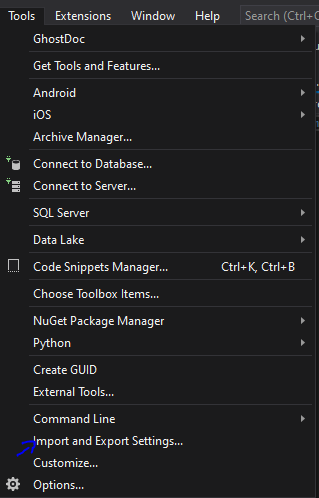
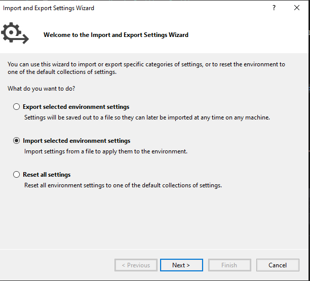
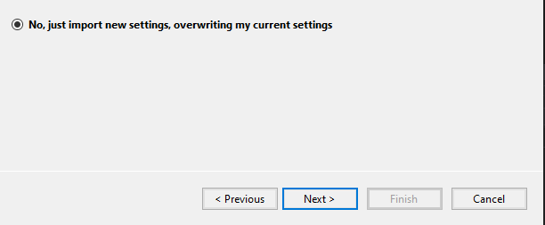
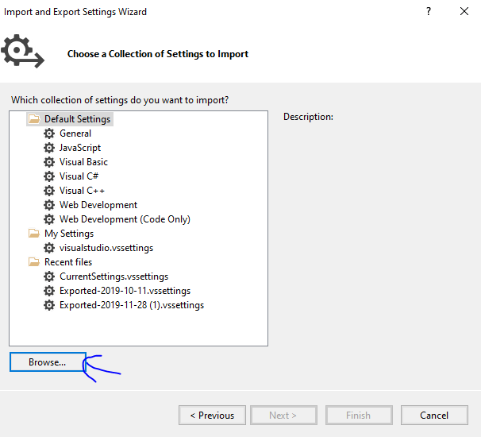
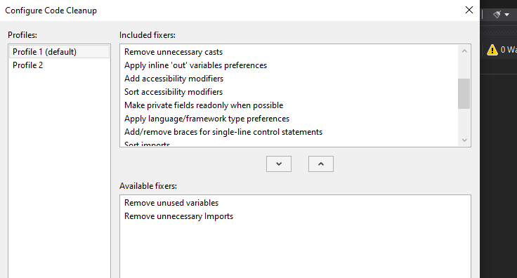

# &nbsp;**Welcome to the .NET Incubator** [](https://twitter.com/Entelect)

<br/><br/>

## **What you will be learning?**

- [ ] What is .NET?
- [ ] Where can I ask for help?
- [ ] Solving the most common problems found to solve
  - [ ] CRUD System
  - [ ] Handling Background Jobs
  - [ ] Creating an API
    - [ ] RESTful - Web API
  - [ ] Schedule Background Jobs
    - [ ] Hangfire
  - [ ] Building a Front-End to consume your API - **your choice*
    - [ ] MVC
    - [ ] ASP.NET
    - [ ] JS Libraries (Coming Soon!)

## **Resources**

- [Entelect Stream](https://web.microsoftstream.com/channel/fe5bc582-9acb-4952-9b71-b29aab0bc9e9)

## **Prerequirements**

- [ ] .NET Fundamentals - [Read more...](https://github.com/entelect-incubator/.Net/tree/master/Fundamentals)
- [ ] .NET Overview - [Read more...](https://docs.microsoft.com/en-us/aspnet/core/fundamentals/?view=aspnetcore-3.1&tabs=windows)
- [ ] Coding Standards - [9 Coding Standards](https://blog.submain.com/coding-standards-c-developers-need/)
- [ ] Coding Standards - [Coding Guidelines And Best Practices](https://www.c-sharpcorner.com/blogs/c-sharp-coding-guidelines-and-best-practices-v10)
- [ ] Only extra coding standard for this incubator is that we prefer Usings inside of the namespace for a variety of reasons.

For this Incubator we will be using [.NET 5](https://dotnet.microsoft.com/download) - Scan through the basic concepts.

    1. The Startup class
    2. Dependency injection (services)
    3. Middleware
    4. Servers
    5. Configuration
    6. Options
    7. Environments (dev, stage, prod)
    8. Logging
    9. Routing
    10. Handle errors
    11. Make HTTP requests
    12. Static files

- [ ] Principles, Frameworks and Architectures

In this Incubator, we will build a solution based on the Single Responsibility Principle. To help us achieve this we will be making use of the CQRS pattern alongside a Clean Code Architecture. If you have never heard about these terms, don't worry we will be discussing them in detail.

## **Setup**

- [ ] Setup your environment - [How to video](https://www.youtube.com/watch?v=G1-Zfr9-3zs&list=PLLWMQd6PeGY2GVsQZ-u3DPXqwwKW8MkiP)
  - [ ] [Visual Studio 2019 Community](https://visualstudio.microsoft.com/downloads/) Installed
  - [ ] [.NET 5](https://dotnet.microsoft.com/download) Installed
  - [ ] [SQL Server Developer](https://www.microsoft.com/en-us/sql-server/sql-server-downloads) Installed
  - [ ] [SQL Server Management Studio SSMS](https://docs.microsoft.com/en-us/sql/ssms/download-sql-server-management-studio-ssms?view=sql-server-ver15) Installed
- [ ] SQL Incubator - [SQL basics for Beginners](https://www.youtube.com/watch?v=9Pzj7Aj25lw)

Setup Visual Studio
- [ ] Update the default C# Class in Visual Studio, everytime you create a new class it will use this template.
- [ ]  Open the following file in a text editor

```
C:\Program Files (x86)\Microsoft Visual Studio\2019\Community\Common7\IDE\ItemTemplates\CSharp\Code\1033\Class\Class.cs
```

Change the template to the following, move using inside of the namespace and public before the class.

```cs
namespace $rootnamespace$
{
    using System;
    using System.Collections.Generic;
    $if$ ($targetframeworkversion$ >= 3.5)using System.Linq;
    $endif$using System.Text;
    $if$ ($targetframeworkversion$ >= 4.5)using System.Threading.Tasks;
    $endif$

    public class $safeitemrootname$
    {
    }
}
```

Do the same with the Interface Template

```
C:\Program Files (x86)\Microsoft Visual Studio\2019\Community\Common7\IDE\ItemTemplates\CSharp\Code\1033\Interface\Interface.cs
```

```cs
namespace $rootnamespace$
{
    using System;
    using System.Collections.Generic;
    $if$ ($targetframeworkversion$ >= 3.5)using System.Linq;
    $endif$using System.Text;
    $if$ ($targetframeworkversion$ >= 4.5)using System.Threading.Tasks;
    $endif$

    public interface $safeitemrootname$
    {
    }
}
```


- [ ] [Import new Settings](./Assets/visualstudio.vssettings)







Browse to **visualstudio.vssettings**



At the bottom of Visual Studio click on the broom and choose **Configure Code Cleanup**. Choose everything except the bottom 2.



No on any file you can press Ctr+K and then Ctrl+E to cleanup your code. This helps for consitency and clean code.

# **Pezza Digital Solutions**

In this section, we will start building projects to allow Pezza to manage their stock and a front-end website where customers can order their favourite pizza online.

## **Intro**

Restaurant staff should be able to manage the stock through a web application as well as manage their different restaurants. Customers should be able to order a pizza online, this order should be visible to the selected restaurant. The customer should also be notified that their pizza is on its way. We will start solving these business requirements by doing the following:

- Create a CRUD System in .Net MVC Project to manage stock and restaurants. Allow restaurants to place a request stock from head-office.

- Expose your Stock Management through an API using .Net Web API that will be used by the front-end application.
- Allow for customer notifications to be sent out.
- Create a Customer Facing Website in your choice of Front-End Library.
  


## **Learning Outcomes**

### **Phase 1 - Getting started** 

We will be starting off with how to make a basic project and refactoring it into a solution following the single responsibility principle and how to set up a basic clean code architecture. This setup format will be used throughout the incubator.

Overview
- [ ] [TDDD and Unit Testing](https://web.microsoftstream.com/video/ffd65354-c7b0-49c2-a9f7-2d90a7fbb565?channelId=fe5bc582-9acb-4952-9b71-b29aab0bc9e9)
- [ ] [Data Access](https://web.microsoftstream.com/video/198f0339-10e0-4b09-9bb0-b9c3f092c9c4?channelId=fe5bc582-9acb-4952-9b71-b29aab0bc9e9)

[Click here to get started](https://github.com/entelect-incubator/.NET/tree/master/Phase%201)

[](https://github.com/entelect-incubator/.NET/actions/workflows/dotnet-phase1-finalsolution.yml)
### **Phase 2 - Scaffolding** 

We will be extending the foundation from Phase 1 to all Entities CRUD operations, we will also be moving to use CQRS Pattern and Mediatr NuGet Package.

Overview
- [ ] [Working with Data in C#](https://web.microsoftstream.com/channel/fe5bc582-9acb-4952-9b71-b29aab0bc9e9)

[Click here to get started](https://github.com/entelect-incubator/.NET/tree/master/Phase%202)

[](https://github.com/entelect-incubator/.NET/actions/workflows/dotnet-phase2-finalsolution.yml)

### **Phase 3 - Data Validation and Data Pagination**

Now that we have deployed phase 2, we can make a few enhancements. Also, it will be easier for the customer and admin to search and filter through the data, so we will add that in as well.

Overview
- [ ] [Concurrency](https://web.microsoftstream.com/video/56e7e456-69e6-4f2b-8eec-ddb118c3aa5f?channelId=fe5bc582-9acb-4952-9b71-b29aab0bc9e9)

Improve how data is displayed and validated

- [ ] Fluent Validation
- [ ] Filtering
- [ ] Searching
- [ ] Pagination

[Click here to get started](https://github.com/entelect-incubator/.NET/tree/master/Phase%203)

[](https://github.com/entelect-incubator/.NET/actions/workflows/dotnet-phase3-step2.yml)

### **Phase 4 - Coding Standards and Error Handling**

 When we work as part of a team, we usually need to adhere to coding standards. Let's have a look at how we can enforce some of the most basic standards and adding error handling.
  
Overview
- [ ] [Error Handling](https://web.microsoftstream.com/video/5fcd4c8a-4e7b-41ac-9836-d1366da97c82?channelId=fe5bc582-9acb-4952-9b71-b29aab0bc9e9)

- [ ] Coding Standards

[Click here to get started](https://github.com/entelect-incubator/.NET/tree/master/Phase%204)

[](https://github.com/entelect-incubator/.NET/actions/workflows/dotnet-phase4-step2.yml)
  
### **Phase 5 - Performance Improvement**

For improved performance we relaised that certain data doesn't change often and can be cached. We can also add a few small changes to improve performance.

Overview
- [ ] [Performance and Memory Management](https://web.microsoftstream.com/video/64098be8-6979-4c10-85f4-efa91d0cb1f1?channelId=fe5bc582-9acb-4952-9b71-b29aab0bc9e9)

Increasing Performance

- [ ] Caching
- [ ] Compression

[Click here to get started](https://github.com/entelect-incubator/.NET/tree/master/Phase%205)

[](https://github.com/entelect-incubator/.NET/actions/workflows/dotnet-phase5-step2.yml)

### **Phase 6 - Events**

We would like to notify the customer as soon as his order has been completed and ready for collection.

Increasing Performance

- [ ] Domain Events
- [ ] Simple Email Notification
- [ ] Schedule Background Jobs
  - [ ] Hangfire

[Click here to get started](https://github.com/entelect-incubator/.NET/tree/master/Phase%206)

[](https://github.com/entelect-incubator/.NET/actions/workflows/dotnet-phase6-step3.yml)

### **Phase 7 - User Interface** 

Overview
- [ ] [MVC Part 1](https://web.microsoftstream.com/video/61e64cfa-c3ba-45c3-9811-e5bc25968a2a?channelId=fe5bc582-9acb-4952-9b71-b29aab0bc9e9)
- [ ] [MVC Part 2](https://web.microsoftstream.com/video/315b2034-0aa5-43ee-b030-562f4a597cfd?channelId=fe5bc582-9acb-4952-9b71-b29aab0bc9e9)

We will be building a basic Pizza website for Customers and a basic Admin Back-End. To help us do this we will use the [Pezza Branding Guide & Design System](https://github.com/entelect-incubator/DesignSystem).

[Documentation](https://web.microsoftstream.com/video/315b2034-0aa5-43ee-b030-562f4a597cfd?channelId=fe5bc582-9acb-4952-9b71-b29aab0bc9e9)

**Pezza Website**

- [Plain HTML](https://github.com/entelect-incubator/.NET/tree/master/Phase%207/03.%20Website/Html/src)
- AngularJS - Coming Soon
- ReactJS - Coming Soon

**Pezza Admin Back-End**

- MVC - [Click here to get started](https://web.microsoftstream.com/video/315b2034-0aa5-43ee-b030-562f4a597cfd?channelId=fe5bc582-9acb-4952-9b71-b29aab0bc9e9) 
<br/>[](https://github.com/entelect-incubator/.NET/actions/workflows/dotnet-phase7-dashboard-mvc.yml)
- AngularJS - Coming Soon
- ReactJS - Coming Soon
- 
 
[Click here to get started](https://github.com/entelect-incubator/.NET/tree/master/Phase%207)

### **Phase 8 - Security**

Now that we have increased the performance lets and an increase of customers we need to secure our website.

Overview
- [ ] [Security](https://web.microsoftstream.com/video/2a2b5226-34cb-49ac-b8fe-880cb9ac893c?channelId=fe5bc582-9acb-4952-9b71-b29aab0bc9e9)

Add Security
- [ ] API Oauth / JWT Token
- [ ] MVC Antiforgy Tokens

[Click here to get started](https://github.com/entelect-incubator/.NET/tree/master/Phase%208)

[](https://github.com/entelect-incubator/.NET/actions/workflows/dotnet-phase8-step2.yml)
  
### **Phase 9** - Coming soon

We want customers to have the ability to track their orders.
- [ ] SignalR
