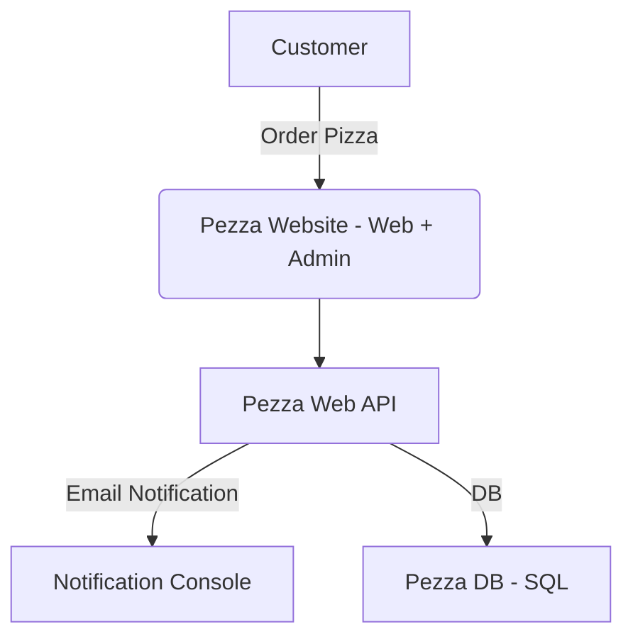

# &nbsp;**Welcome to the .NET Incubator**  

  

## What you will be learning?

- [ ] What is it?
- [ ] Why should I learn about it?
- [ ] Official documentation
- [ ] Prerequirements?
- [ ] Building the Pezza Digital Solutions
  - [ ] CRUD System
  - [ ] Handling Background Jobs
  - [ ] Creating an API
    - [ ] RESTful - Web API
  - [ ] Schedule Background Jobs
    - [ ] Hangfire
  - [ ] Building a Front-End to consume your API
    - [ ] MVC
- [ ] Security
- [ ] Microservices
- [ ] Recommended libraries

## What is it?

.NET is a powerful, versatile developer platform that enables the creation of a wide range of applications. It is a free, cross-platform, open-source framework that can be used to build web, mobile, desktop, gaming, and IoT applications. One of the best ways to get started with .NET is through the .NET Incubator, which is designed to provide hands-on experience and real-world application development skills to aspiring developers. This training course covers the essential concepts of .NET programming, including C# language syntax, debugging techniques, and the use of .NET Core libraries. With the .NET Incubator training course, you can become proficient in creating high-quality, scalable applications using the .NET platform.

- [ ] What is .NET? - [Read more...](https://github.com/entelect-incubator/.Net/tree/master/Fundamentals)

## Why should I learn about it?

### Cross-platform support

.NET is a cross-platform framework, which means that developers can build applications for Windows, Linux, and macOS using the same codebase. This allows developers to target a wider range of platforms and reach a larger audience with their applications.

### Large community and ecosystem

.NET has a large and active community of developers, which means that there are plenty of resources, tools, and libraries available for developers to use. This also means that developers can get help and support from the community when they run into problems or have questions.

### Performance and scalability

.NET is designed to be fast and efficient, which makes it ideal for building high-performance applications. It also provides scalability features such as load balancing, which can help applications handle large amounts of traffic.

### Easy to learn and use

.NET is a relatively easy framework to learn and use, especially for developers who are already familiar with object-oriented programming languages such as Java or C++. The syntax is straightforward, and there are plenty of tutorials and resources available to help developers get started.

### Versatility

.NET can be used to build a wide range of applications, including web applications, desktop applications, mobile applications, games, and IoT applications. This makes it a versatile framework that can be used for almost any type of project.

Overall, developers love .NET because it is a powerful, flexible, and easy-to-use framework that allows them to build high-quality applications for a wide range of platforms and use cases.

## Official documentation

Links to the official documentation:

- [Fundamentals overview](https://docs.microsoft.com/en-us/aspnet/core/fundamentals/?view=aspnetcore-6.0&tabs=windows)
- [Learn C#](https://dotnet.microsoft.com/en-us/learn/csharp)
- [.NET documentation](https://docs.microsoft.com/en-us/dotnet/) - Learn to use .NET to create applications on any platform using C#, F#, and Visual Basic. Browse API reference, sample code, tutorials, and more..
- [Microsoft learn for .NET](https://docs.microsoft.com/en-us/learn/dotnet/) - Learn how to build apps across multiple platforms with programming languages like C#, F#, and Visual Basic. Supported on Windows, Linux, and macOS, get started developing your next project with .NET today.
- [.NET foundation](https://dotnetfoundation.org/) - The .NET Foundation is an independent, non-profit organization established to support an innovative, commercially friendly, open-source ecosystem around the .NET platform.
- [.NET Youtube](https://www.youtube.com/dotnet)

## Prerequirements?

- [ ] .NET Prerequirements - [Read more...](https://github.com/entelect-incubator/.NET/blob/master/Prerequirements.md)
- [ ] Setup [Read more...](https://github.com/entelect-incubator/.NET/blob/master/Setup.md)

# Pezza Digital Solutions

In this section, we will start building projects to allow Pezza to manage their pizzas and allow customers to order their favourite pizza online.

## Intro

Restaurant staff should be able to manage their different pizzas through a web application. Customers should be able to order a pizza online, this order should be visible to their restaurant. The customer should also be notified that their pizza is on its way. We will start solving these business requirements by doing the following:

- [ ] Expose your Pizza Management through an API using .NET Web API that will be consumed by the front-end application. It will consist of a customer and a pizza entity.
- [ ] Create a simple ordering system in .NET MVC to allow customers to order pizzas.
- [ ] Allow for customer notifications to be sent out via email.

## Learning Outcomes

### Phase 1 - Getting started

We will be starting with how to make a basic project and refactoring it into a solution following the single responsibility principle and how to set up a basic clean code architecture / layered architecture. This setup format will be used throughout the incubator.

Overview

- [ ] [Data Transfer Objects (DTOs)](https://docs.microsoft.com/en-us/aspnet/web-api/overview/data/using-web-api-with-entity-framework/part-5)

[Click here to get started](https://github.com/entelect-incubator/.NET/tree/master/Phase%201)

### Phase 2 - Scaffolding

We will be extending the foundation from Phase 1 to all Entities CRUD operations, we will also be moving to use CQRS Pattern and Mediatr NuGet Package.

Overview

[Click here to get started](https://github.com/entelect-incubator/.NET/tree/master/Phase%202)

### Phase 3 - Data Validation and Data Pagination

Now that we have deployed phase 2, we can make a few enhancements. Also, it will be easier for the customer and admin to search and filter through the data, so we will add that in as well.

Overview
- [ ] [Getting Started with Entity Framework Core](https://www.youtube.com/watch?v=SryQxUeChMc&ab_channel=dotnet)

Improve how data is displayed and validated

- [ ] Fluent Validation
- [ ] Filtering
- [ ] Searching
- [ ] Pagination
- [ ] Entity Framework Core
  - [ ] Migrations
  - [ ] Change Tracker API
  - [ ] Lazy Loading, Eager Loading, Explicit Loading
  - [ ] TPH, TPC, TPT

[Click here to get started](https://github.com/entelect-incubator/.NET/tree/master/Phase%203)

### Phase 4 - Coding Standards and Error Handling

 When we work as part of a team, we usually need to adhere to coding standards. Let's have a look at how we can enforce some of the most basic standards and adding error handling.
  
Overview
- [ ] [Error Handling](https://web.microsoftstream.com/video/5fcd4c8a-4e7b-41ac-9836-d1366da97c82?channelId=fe5bc582-9acb-4952-9b71-b29aab0bc9e9)

- [ ] Coding Standards

[Click here to get started](https://github.com/entelect-incubator/.NET/tree/master/Phase%204)

  
### Phase 5 - Performance Improvement

To improve performance we introduce caching and compression. Caching is useful in scenarios where we retrieve data that does not change very often. Response compression usually increases the responsiveness of an app in cases where the client supports it.
Overview
- [ ] [Performance and Memory Management](https://web.microsoftstream.com/video/64098be8-6979-4c10-85f4-efa91d0cb1f1?channelId=fe5bc582-9acb-4952-9b71-b29aab0bc9e9)

Increasing Performance

- [ ] Caching
- [ ] Compression

[Click here to get started](https://github.com/entelect-incubator/.NET/tree/master/Phase%205)

### Phase 6 - Events

We would like to notify the customer as soon as his order has been completed and ready for collection.

Increasing Performance

- [ ] Domain Events
- [ ] Simple Email Notification
- [ ] Schedule Background Jobs
  - [ ] Hangfire

[Click here to get started](https://github.com/entelect-incubator/.NET/tree/master/Phase%206)

### Phase 7 - User Interface

Overview
- [ ] [MVC Part 1](https://web.microsoftstream.com/video/61e64cfa-c3ba-45c3-9811-e5bc25968a2a?channelId=fe5bc582-9acb-4952-9b71-b29aab0bc9e9)
- [ ] [MVC Part 2](https://web.microsoftstream.com/video/315b2034-0aa5-43ee-b030-562f4a597cfd?channelId=fe5bc582-9acb-4952-9b71-b29aab0bc9e9)

We will be building a basic Pizza website for Customers and a basic Admin Back-End. To help us do this we will use the [Pezza Branding Guide & Design System](https://github.com/entelect-incubator/DesignSystem).

[Documentation](https://web.microsoftstream.com/video/315b2034-0aa5-43ee-b030-562f4a597cfd?channelId=fe5bc582-9acb-4952-9b71-b29aab0bc9e9)

Pezza Website

- [MVC](https://github.com/entelect-incubator/.NET/tree/master/Phase%207/03.%20Website/Html/src)

Pezza Admin Back-End

- MVC - [Click here to get started](https://web.microsoftstream.com/video/315b2034-0aa5-43ee-b030-562f4a597cfd?channelId=fe5bc582-9acb-4952-9b71-b29aab0bc9e9) 
 

[Click here to get started](https://github.com/entelect-incubator/.NET/tree/master/Phase%207)

### Phase 8 - Security

Now that we have increased the performance lets and an increase of customers we need to secure our website.

Overview
- [ ] [Security](https://web.microsoftstream.com/video/2a2b5226-34cb-49ac-b8fe-880cb9ac893c?channelId=fe5bc582-9acb-4952-9b71-b29aab0bc9e9)

Add Security
- [ ] API Oauth / JWT Token
- [ ] MVC Antiforgy Tokens

[Click here to get started](https://github.com/entelect-incubator/.NET/tree/master/Phase%208)

  
### Phase 9 - Microservices

- [ ] [Overview](https://learn.microsoft.com/en-us/aspnet/core/tutorials/getting-started-with-nswag?view=aspnetcore-7.0&tabs=visual-studio)

An API client is a set of tools and protocols that operate from an application on a computer. They help you to bypass some operations when developing a web application rather than reinventing the wheel every time. Using a client API is a great way to speed up the development process.

- [ ] Intro
- [ ] API Client

### Phase 10 - Recommended libraries

- [ ] Nuget libraries

