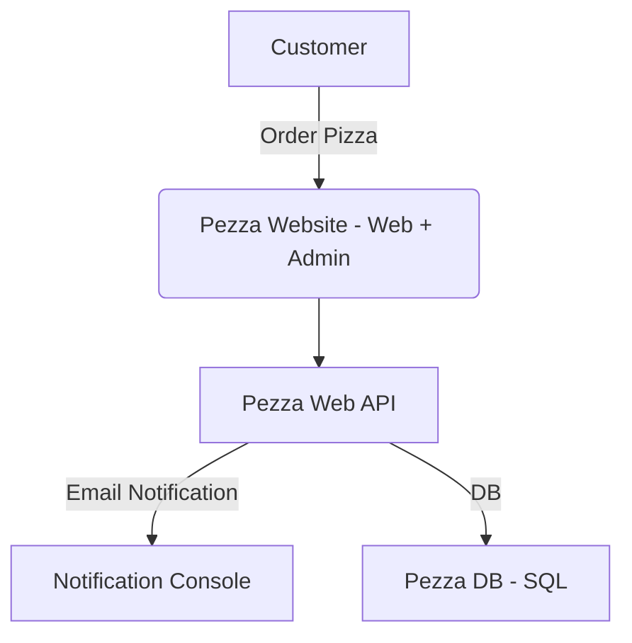

# &nbsp;**Welcome to the .NET Incubator**  

  

## What you will be learning?

- [ ] What is .NET?
- [ ] Why should I learn about it?
- [ ] Official documentation
- [ ] Prerequisites
- [ ] Develop with AI
- [ ] Building the Pezza Digital Solutions
  - [ ] Phase 1-4: Foundation & Best Practices
  - [ ] Phase 5-6: Performance & Events
  - [ ] Phase 7-9: Microservices, Security & UI
  - [ ] Phase 10-11: Database Migrations & Cloud-Native Orchestration
  - [ ] Phase 12: LiteBus CQRS Migration
  - [ ] Phase 13: AI Integration with MCP Server
  - [ ] Phase 14: External API Integration
  - [ ] Phase 15: Container Registry Publishing
- [ ] Complete architecture overview
- [ ] Docs website overview
- [ ] Recommended libraries

## What is it?

.NET is a powerful, versatile developer platform that enables the creation of a wide range of applications. It is a free, cross-platform, open-source framework that can be used to build web, mobile, desktop, gaming, and IoT applications. One of the best ways to get started with .NET is through the .NET Incubator, which is designed to provide hands-on experience and real-world application development skills to aspiring developers. This training course covers the essential concepts of .NET programming, including C# language syntax, debugging techniques, and the use of .NET Core libraries. With the .NET Incubator training course, you can become proficient in creating high-quality, scalable applications using the .NET platform.

- [ ] What is .NET? - [Read more...](https://github.com/entelect-incubator/.Net/tree/master/Fundamentals)

## Why should I learn about it?

### Cross-platform support

.NET is a cross-platform framework, which means that developers can build applications for Windows, Linux, and macOS using the same codebase. This allows developers to target a wider range of platforms and reach a larger audience with their applications.

### Large community and ecosystem

.NET has a large and active community of developers, which means that there are plenty of resources, tools, and libraries available for developers to use. This also means that developers can get help and support from the community when they run into problems or have questions.

### Performance and scalability

.NET is designed to be fast and efficient, which makes it ideal for building high-performance applications. It also provides scalability features such as load balancing, which can help applications handle large amounts of traffic.

### Easy to learn and use

.NET is a relatively easy framework to learn and use, especially for developers who are already familiar with object-oriented programming languages such as Java or C++. The syntax is straightforward, and there are plenty of tutorials and resources available to help developers get started.

### Versatility

.NET can be used to build a wide range of applications, including web applications, desktop applications, mobile applications, games, and IoT applications. This makes it a versatile framework that can be used for almost any type of project.

Overall, developers love .NET because it is a powerful, flexible, and easy-to-use framework that allows them to build high-quality applications for a wide range of platforms and use cases.

## Official documentation

Links to the official documentation:

- [Fundamentals overview](https://docs.microsoft.com/en-us/aspnet/core/fundamentals/?view=aspnetcore-6.0&tabs=windows)
- [Learn C#](https://dotnet.microsoft.com/en-us/learn/csharp)
- [.NET documentation](https://docs.microsoft.com/en-us/dotnet/) - Learn to use .NET to create applications on any platform using C#, F#, and Visual Basic. Browse API reference, sample code, tutorials, and more..
- [Microsoft learn for .NET](https://docs.microsoft.com/en-us/learn/dotnet/) - Learn how to build apps across multiple platforms with programming languages like C#, F#, and Visual Basic. Supported on Windows, Linux, and macOS, get started developing your next project with .NET today.
- [.NET foundation](https://dotnetfoundation.org/) - The .NET Foundation is an independent, non-profit organization established to support an innovative, commercially friendly, open-source ecosystem around the .NET platform.
- [.NET Youtube](https://www.youtube.com/dotnet)

## Develop with AI

New to AI-assisted development? Learn how to work effectively with GitHub Copilot, ChatGPT, and other AI tools while maintaining clean architecture and coding standards.

- 📚 **[Develop with AI — Full Guide](./DEVELOP_WITH_AI.md)** - Comprehensive guide covering architecture, design patterns, naming conventions, async patterns, and DRY principles
- ⚡ **[Quick Reference](./AI_QUICK_REFERENCE.md)** - One-page cheat sheet with essential patterns, naming rules, and anti-patterns
- 💡 **[Prompting Examples](./AI_PROMPTING_EXAMPLES.md)** - 10+ real-world scenarios with copy-paste-ready AI prompts for common tasks

**Key Topics:**
- Clean architecture and CQRS patterns
- Primary constructors and property naming (no underscores)
- Result<T> pattern for consistent error handling
- DRY principles and extension methods
- Custom Dispatcher pattern for command/query separation
- Async/await best practices
- Code review checklist

Start with the Quick Reference, then dive into the Full Guide for complete context and patterns.

## AI + Copilot Integration (Awesome-style)

We integrate AI-assisted development following an "Awesome GitHub Copilot" approach so learners can use prompts, agents, and skills safely and effectively.

- **Awesome Agents**: specialized assistants and MCP integrations that can run local tasks and help inspect code. See `./AGENTS.md` for examples and how to run a local MCP server.
- **Awesome Prompts**: curated, task-specific prompts for refactors, tests, and documentation. See `./AI_PROMPTING_EXAMPLES.md` for ready-to-use prompts.
- **Awesome Instructions**: coding standards, patterns, and guardrails for AI output. Read `./DEVELOP_WITH_AI.md` for rules and examples.
- **Awesome Skills**: self-contained folders with instructions and resources (e.g., codegen, test scaffolding) that augment Copilot capabilities.
- **Awesome Collections**: curated sets of prompts and instructions for common workflows (CI, DB migrations, CQRS refactors).

Quick usage

1. Read `Develop with AI — Full Guide` and `AI_QUICK_REFERENCE.md`.
2. Run local tools (linters/tests) before accepting AI changes.
3. Use the example prompts from `AI_PROMPTING_EXAMPLES.md` and adapt them for your phase.

Links & examples:

- [Awesome GitHub Copilot reference](https://github.com/github/awesome-copilot)
- See `./AGENTS.md`, `./AI_PROMPTING_EXAMPLES.md`, and `./DEVELOP_WITH_AI.md` for practical workflows.

## Design Patterns

Learn essential design patterns and architectural principles used throughout this incubator:

- 🎯 **[Design Patterns Hub](../Design-Patterns/README.md)** - Comprehensive guide to SOLID principles, Result pattern, CQRS, Dispatcher/Mediator, Repository pattern, and more
- 📖 **[Pattern Cheat Sheets](../Design-Patterns/Cheat-Sheets/)** - Quick reference guides
- 🏗️ **[Project Templates](../Design-Patterns/Project-Templates/)** - Ready-to-use starter templates

**Core Patterns Covered:**
- SOLID Principles
- Result Pattern for error handling
- CQRS (Command Query Responsibility Segregation)
- Dispatcher/Mediator for decoupling
- Repository Pattern for data access
- Dependency Injection
- Feature-based architecture
- Clean Code principles
- Testing patterns

## Prerequisites

- [ ] .NET Prerequisites - [Read more...](https://github.com/entelect-incubator/.NET/blob/master/Prerequisites.md)
- [ ] Setup [Read more...](https://github.com/entelect-incubator/.NET/blob/master/Setup.md)

# Pezza Digital Solutions

In this section, we will start building projects to allow Pezza to manage their pizzas and allow customers to order their favourite pizza online.

## Intro

Restaurant staff should be able to manage their different pizzas through a web application. Customers should be able to order a pizza online, this order should be visible to their restaurant. The customer should also be notified that their pizza is on its way. We will start solving these business requirements by doing the following:

- [ ] Expose your Pizza Management through an API using .NET Web API that will be consumed by the front-end application. It will consist of a customer and a pizza entity.
- [ ] Create a simple ordering system in .NET MVC to allow customers to order pizzas.
- [ ] Allow for customer notifications to be sent out via email.

```mermaid
flowchart TD;
    A[Customer] -->|Order Pizza| B(Pezza Website - Web + Admin);
    B --> C[Pezza Web API];
    C -->|Email Notification| D[Notification Console];
    C -->|DB| E[Pezza DB - SQL];
```

## Learning Outcomes

### Phase 1 - Getting Started

Learn the fundamentals of .NET project structure and clean architecture. Refactor a basic project into a layered solution following single responsibility principles.

**Topics:**
- [ ] [Data Transfer Objects (DTOs)](https://docs.microsoft.com/en-us/aspnet/web-api/overview/data/using-web-api-with-entity-framework/part-5)
- [ ] Clean architecture / layered architecture
- [ ] Project structure and organization

[Click here to get started](https://github.com/entelect-incubator/.NET/tree/master/Phase%201)

### Phase 2 - Scaffolding

Extend the foundation to all entities with full CRUD operations. Introduction to CQRS pattern and MediatR.

**Topics:**
- [ ] CQRS Pattern
- [ ] MediatR NuGet Package
- [ ] Complete CRUD operations

[Click here to get started](https://github.com/entelect-incubator/.NET/tree/master/Phase%202)

### Phase 3 - Data Validation and Pagination

Enhance data handling with validation, filtering, searching, and pagination. Deep dive into Entity Framework Core.

**Topics:**
- [ ] [Getting Started with Entity Framework Core](https://www.youtube.com/watch?v=SryQxUeChMc&ab_channel=dotnet)
- [ ] Fluent Validation
- [ ] Filtering and Searching
- [ ] Pagination
- [ ] EF Core: Migrations, Change Tracker, Loading Strategies
- [ ] TPH, TPC, TPT inheritance patterns

[Click here to get started](https://github.com/entelect-incubator/.NET/tree/master/Phase%203)

### Phase 4 - Coding Standards and Error Handling

Implement team coding standards and comprehensive error handling strategies.

**Topics:**
- [ ] [Error Handling](https://web.microsoftstream.com/video/5fcd4c8a-4e7b-41ac-9836-d1366da97c82?channelId=fe5bc582-9acb-4952-9b71-b29aab0bc9e9)
- [ ] Coding standards enforcement
- [ ] Exception handling patterns

[Click here to get started](https://github.com/entelect-incubator/.NET/tree/master/Phase%204)

### Phase 5 - Performance Improvement

Optimize application performance with caching and compression strategies.

**Topics:**
- [ ] [Performance and Memory Management](https://web.microsoftstream.com/video/64098be8-6979-4c10-85f4-efa91d0cb1f1?channelId=fe5bc582-9acb-4952-9b71-b29aab0bc9e9)
- [ ] Response caching
- [ ] Compression middleware

[Click here to get started](https://github.com/entelect-incubator/.NET/tree/master/Phase%205)

### Phase 6 - Events and Background Jobs

Implement domain events, email notifications, and background job processing.

**Topics:**
- [ ] Domain Events pattern
- [ ] Email notification system
- [ ] Background job scheduling with Hangfire

[Click here to get started](https://github.com/entelect-incubator/.NET/tree/master/Phase%206)

### Phase 7 - Microservices

Build API clients and understand microservices architecture patterns.

**Topics:**
- [ ] [NSwag Overview](https://learn.microsoft.com/en-us/aspnet/core/tutorials/getting-started-with-nswag?view=aspnetcore-7.0&tabs=visual-studio)
- [ ] API client generation
- [ ] Service-to-service communication

[Click here to get started](https://github.com/entelect-incubator/.NET/tree/master/Phase%207)

### Phase 8 - Security

Secure your application with authentication, authorization, and security best practices.

**Topics:**
- [ ] JWT Authentication
- [ ] OAuth2 integration
- [ ] Antiforgery tokens
- [ ] HTTPS & HSTS
- [ ] Secrets management

[Click here to get started](https://github.com/entelect-incubator/.NET/tree/master/Phase%208)

### Phase 9 - User Interface

Build front-end clients with MVC, Razor, or Blazor for admin dashboard and customer website.

**Topics:**
- [ ] Admin Dashboard (Portal)
- [ ] Customer Website
- [ ] Server-side rendering

[Click here to get started](https://github.com/entelect-incubator/.NET/tree/master/Phase%209)

### Phase 10 - Database Migrations

Implement automated database migrations using DbUp for version-controlled schema management.

**Topics:**
- [ ] DbUp migration framework
- [ ] Version tracking
- [ ] Idempotent migrations
- [ ] CI/CD integration

[Click here to get started](https://github.com/entelect-incubator/.NET/tree/master/Phase%2010)

### Phase 11 - Cloud-Native Orchestration

Combine .NET Aspire orchestration with DbUp migrations for production-ready microservices.

**Topics:**
- [ ] .NET Aspire 8.0 service orchestration
- [ ] Service discovery and health checks
- [ ] OpenTelemetry observability
- [ ] Docker containerization

[Click here to get started](https://github.com/entelect-incubator/.NET/tree/master/Phase%2011)

### Phase 12 - Custom Dispatcher Pattern

Implement a custom CQRS dispatcher from scratch for complete control over command/query separation and pipeline behaviors.

**Topics:**
- [ ] Custom Dispatcher implementation (based on [stianleroux/Dispatch](https://github.com/stianleroux/Dispatch))
- [ ] ICommand<TResult> and IQuery<TResult> interfaces
- [ ] Pipeline behaviors for cross-cutting concerns
- [ ] Scrutor for automatic handler registration
- [ ] Exception handling and actions
- [ ] Notification pattern for domain events
- [ ] Clean separation of commands and queries

[Click here to get started](https://github.com/entelect-incubator/.NET/tree/master/Phase%2012)

### Phase 13 - MCP Server & AI Integration

Build a Model Context Protocol (MCP) server enabling AI assistants to interact with your application through natural language.

**Topics:**
- [ ] Model Context Protocol (MCP)
- [ ] STDIO-based communication
- [ ] JSON-RPC message handling
- [ ] AI tool integration (Claude, ChatGPT)
- [ ] 18 domain-specific tools for pizza management

[Click here to get started](https://github.com/entelect-incubator/.NET/tree/master/Phase%2013)

### Phase 14 - External API Integration

Learn to integrate with external APIs using the Pezza Mock Delivery Service, implementing webhooks, retry logic, and resilient patterns.

**Topics:**
- [ ] HttpClient patterns with typed clients
- [ ] Webhook receivers
- [ ] Retry policies with Polly
- [ ] Event-driven integration
- [ ] Multi-service docker-compose

[Click here to get started](https://github.com/entelect-incubator/.NET/tree/master/Phase%2014)

### Phase 15 - GitHub Container Registry Publishing

Containerize and publish the Pezza API to GitHub Container Registry using GitHub Actions CI/CD.

**Topics:**
- [ ] Docker multi-stage builds
- [ ] GitHub Actions workflows
- [ ] GitHub Container Registry (GHCR)
- [ ] Image versioning strategies
- [ ] Frontend consumption patterns

[Click here to get started](https://github.com/entelect-incubator/.NET/tree/master/Phase%2015)

## Complete Architecture Guide

For a comprehensive overview of all phases and architecture evolution:
- 📖 **[Architecture Complete](./ARCHITECTURE-COMPLETE.md)** - Full phase overview, technology stack evolution, and running instructions

## Docs Website

- 🌐 **[Open the docs website](./docs/index.html)** - Explore phases, learning objectives, outcomes, and build labels in one place

## Recommended Libraries

- [ ] NuGet libraries and tools used across all phases