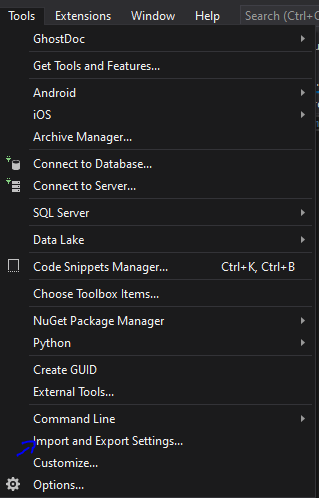
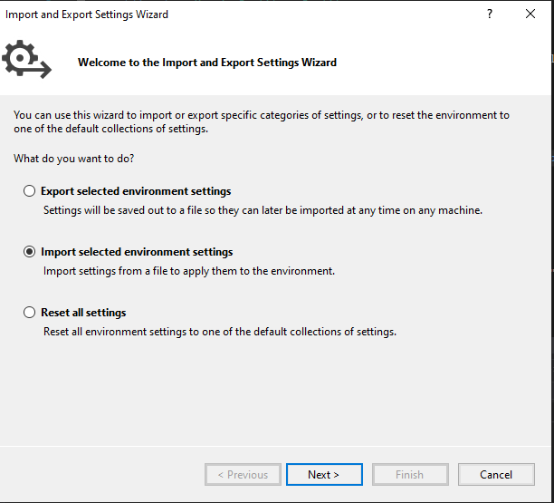
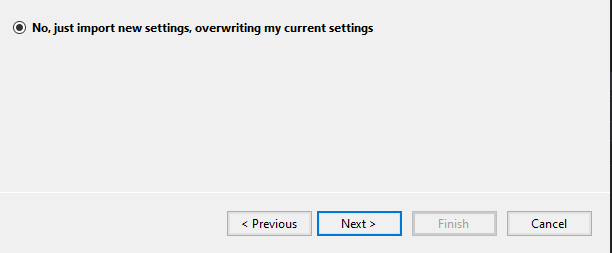
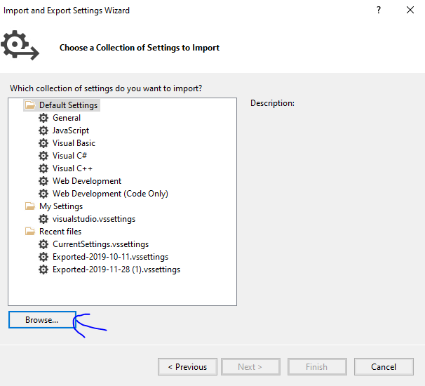
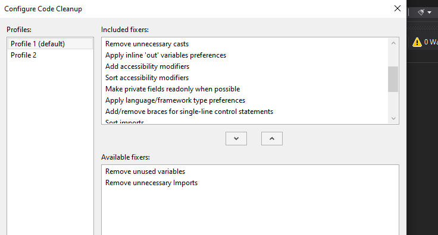

# &nbsp;**.NET Incubator Setup**

<br/><br/><br/>

- [ ] Setup your environment - [How to video](https://www.youtube.com/watch?v=G1-Zfr9-3zs&list=PLLWMQd6PeGY2GVsQZ-u3DPXqwwKW8MkiP)
  - [ ] [Visual Studio Community](https://visualstudio.microsoft.com/downloads/) — install the latest stable version
  - [ ] [.NET SDK (10.x)](https://dotnet.microsoft.com/download) — install .NET 10 SDK (or later)

## Setup Visual Studio

- [ ] Update the default C# class template in Visual Studio — every time you create a new class it will use this template.
- [ ]  Open the following file in a text editor

```cmd
C:\Program Files (x86)\Microsoft Visual Studio\2022\Community\Common7\IDE\ItemTemplates\CSharp\Code\1033\Class\Class.cs
```

Change the template to the following: move using directives inside the namespace and declare `public` before the class.

```cs
namespace $rootnamespace$;

using System.Collections.Generic;
$if$ ($targetframeworkversion$ >= 3.5)using System.Linq;
$endif$using System.Text;
$if$ ($targetframeworkversion$ >= 4.5)using System.Threading.Tasks;
$endif$

public class $safeitemrootname$
{
}
```

Do the same with the Interface Template

```cmd
C:\Program Files (x86)\Microsoft Visual Studio\2022\Community\Common7\IDE\ItemTemplates\CSharp\Code\1033\Interface\Interface.cs
```

```cs
namespace $rootnamespace$;

using System.Collections.Generic;
$if$ ($targetframeworkversion$ >= 3.5)using System.Linq;
$endif$using System.Text;
$if$ ($targetframeworkversion$ >= 4.5)using System.Threading.Tasks;
$endif$

public interface $safeitemrootname$
{
}
```

- [ ] [Import new Settings](./Assets/visualstudio.vssettings)







Browse to **visualstudio.vssettings**



At the bottom of Visual Studio click on the broom and choose **Configure Code Cleanup**. Choose everything except the bottom 2.



Note: in Visual Studio you can press Ctrl+K then Ctrl+E to run Code Cleanup. This helps with consistency and clean code.

# Intro

- [ ] [Intro](https://github.com/entelect-incubator/.NET#intro)
